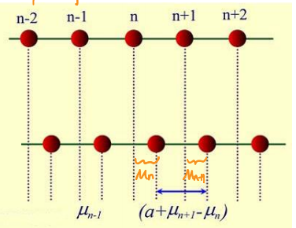
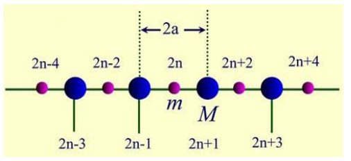

# 第三章

## 一维单原子链

只考虑近邻原子之间得相互作用，第n个原子所受到的总作用力：
$$
\beta\left(\mu_{n+1}-\mu_{n}\right)-\beta\left(\mu_{n}-\mu_{n-1}\right)=\beta\left(\mu_{n+1}+\mu_{n-1}-2 \mu_{n}\right)
$$
第n个原子的运动方程为：
$$
m \frac{d^{2} \mu_{n}}{d t^{2}}=\beta\left(\mu_{n+1}+\mu_{n-1}-2 \mu_{n}\right),(n=1,2, \ldots, N)
$$
根据周期性边界条件： $\mu_{n+1} = \mu_1$

得：
$$
m \frac{d^{2} \mu_{n}}{d t^{2}}=\beta\left(\mu_{n+1}+\mu_{n-1}-2 \mu_{n}\right),(n=1,2, \ldots, N)
$$
通解为
$$
\mu_{n}=A \exp [i(q n a-\omega t)]
\\
n=1,2,3,4……
$$
将$\mu_{n-},\mu_{n},\mu_{n+1}$代入运动方程，化简得
$$
-m \omega^{2}=\beta\left(e^{i q a}+e^{-i q a}-2\right)=2 \beta[\cos (q a)-1]
$$
解得
$$
\omega=2 \sqrt{\frac{\beta}{m}}\left|\sin \left(\frac{q a}{2}\right)\right|
$$
称为格波频率与波矢得关系式称为色散关系

一个格波解表示所有原子同时做频率为$\omega$的振动

- 波长：$\lambda=2 \pi / q$

- 波数：$q=2 \pi / \lambda$

- 相速度：$v_{p}=\frac{\omega}{q}=a \sqrt{\frac{\beta}{m}} \frac{\sin (q a / 2)}{q a / 2}$

- 群速度：$v_{g}=\frac{d \omega}{d q}=a \sqrt{\frac{\beta}{m}} \cos \left(\frac{q a}{2}\right)$

- 长波极限下：$v_{p}=v_{g}=a \sqrt{\beta / m}$

- 波矢$q$的取值

  - ❓相邻原子相位差为$2\pi$——振动状态相同

  - 为保证格波波函数的单值性：$-\frac{\pi}{a}<q \leq \frac{\pi}{a}$，即第一布里渊区

  - 根据周期边界条件，原胞标数增加N后，振动情况复原
    $$
    \mu_{N+n}=\mu_{n} \quad A e^{i[\omega t-(N+n) a q]}=A e^{i[\omega t-n a q]}
    $$
    则要求
    $$
    e^{-i N a q}=1 \quad N a q=2 \pi h
    $$
    
    得，
    $$
    q=\frac{2 \pi}{N a} \times h
    $$
    $h$为任意整数

- 波矢$q$的密度

$$
\rho(q)=\frac{N a}{2 \pi}=\frac{L}{2 \pi}
$$

  	$L$为晶体链的长度，对于三维$\rho=\frac{V}{(2\pi)^3}$，对于二维$\rho=\frac{V}{(2\pi)^2}$

  - 在第一布里渊区波数取值：$-\frac{\pi}{a}<q \leq \frac{\pi}{a}$内，$h=-\frac{N}{2}+1,-\frac{N}{2}+2,-\frac{N}{2}+3, \cdots 0, \cdots \frac{N}{2}-2, \frac{N}{2}-1, \frac{N}{2}$，共N个取值

    第一布里渊区中q的取值总数等于晶体链的的总自由度数❓

  - 每个q在第一布里渊区占的线度：$q=\frac{2 \pi}{N a}$

  - 第一布里渊区的线度：$\frac{2 \pi}{a}$

  - 第一布里渊区状态数：$\frac{2 \pi / a}{2 \pi / N a}=N$

- 态密度❓

  单位频率间隔内的状态数

  
  $$
  g(\omega)d\omega = 2 \times \rho(q) \cdot dq
  = 2\times \frac{L}{\pi} \cdot \frac{dq}{d\omega}
  = \frac{L}{\omega} \cdot \left(\frac{d\omega}{dq}\right)
  $$

  - 一维单原子链态密度：$g(\omega)=\frac{2 N}{\pi} \cos ^{-1}\left(\frac{q a}{2}\right)$❓

## 一维双原子链

设共2n个基元，n个原胞

第2n个基元和第2n+1个基元得牛顿方程
$$
\left\{\begin{array}{l}m \frac{d^{2} \mu_{2 n}}{d t^{2}}=\beta\left(\mu_{2 n+1}+\mu_{2 n-1}-2 \mu_{2 n}\right) \\ M \frac{d^{2} \mu_{2 n+1}}{d t^{2}}=\beta\left(\mu_{2 n+2}+\mu_{2 n}-2 \mu_{2 n+1}\right)\end{array}\right.
$$
若晶体有N个原胞，则有2N个方程，方程数=晶体自由度数

通解为
$$
\left\{\begin{array}{l}
\mu_{2 n}=A e^{i[q(2 n) a-\omega t]} \\
\mu_{2 n+1}=B e^{i[q(2 n+1) a-\omega t]}
\end{array}\right.
$$
代入运动方程
$$
\left.\begin{array}{l}-m \omega^{2} A=\beta\left(e^{i q a}+e^{-i q a}\right) B-2 \beta A \\ -M \omega^{2} B=\beta\left(e^{i q a}+e^{-i q a}\right) A-2 \beta B\end{array}\right\}
\\
\Downarrow
\\
\left.\begin{array}{l}\left(2 \beta-m \omega^{2}\right) A-(2 \beta \cos q a) \beta=0 \\ -(2 \beta \cos q a) A+\left(2 \beta-M \omega^{2} \right) B=0\end{array}\right\}
$$
解久期方程
$$
\left|\begin{array}{cc}2 \beta-m \omega^{2} & -2 \beta \cos q a \\ -2 \beta \cos q a & 2 \beta-M \omega^{2}\end{array}\right|=M m \omega^{4}-2 \beta(M+m) \omega^{2}+(2 \beta \sin q a)^{2}=0
$$
得
$$
\omega_{\pm}^{2}=\beta \frac{(m+M)}{m M}\left\{1 \pm\left[1-\frac{4 m M}{(m+M)^{2}} \sin ^{2} q a\right]^{1 / 2}\right\}
$$

- 极值分布

$$
\begin{aligned} \omega_{+\max } &=\sqrt{\frac{2 \beta}{\mu}}, q=0 \\ \omega_{-\max } &=\sqrt{\frac{2 \beta}{M}}, q=\pm \frac{2 \pi}{a} \\ \omega_{+\min } &=\sqrt{\frac{2 \beta}{m}}, q=\pm \frac{2 \pi}{a} \\ \omega_{-\min } &=0, q=0 \end{aligned}
$$

- 格波数目=晶体链自由度数

- 其中，"+"为光学支（Optical branch），“-”为声学支（Acoustical branch）

- 光学波的突出特点： $q \rightarrow 0$时，$\omega_+ \neq 0$，所以不是弹性波

- q取值

  相邻原胞相位差：$-\pi<2aq<\pi$

  得第一布里渊区：$-\frac{\pi}{2 a}<q \leq \frac{\pi}{2 a}$

  根据周期性边界条件
  $$
  \mu_{2 n}=\mu_{2 N+2 n} \qquad
  \\
  \Downarrow
  \\
  A e^{i[q(2 n) a-\omega t]} = A e^{i[q(2 n+2N) a-\omega t]}
  \\
  \Downarrow
  \\
  e^{i[q(2N) a]} = 1
  \\
  \Downarrow
  \\
  q(2N) a = 2\pi \cdot h
  \\
  \Downarrow
  \\
  \frac{2 \pi}{2 N a} h
  $$

  - 分布密度
    $$
    \rho(q)=\frac{L}{2\pi}=\frac{2 N a}{2 \pi}
    $$

  - $\rho(q)\left(\frac{\pi}{a}\right)=\frac{N a}{\pi} \frac{\pi}{a}=N$原胞数目，$\frac{\pi}{a}$为第一布里渊区宽度

## 三维复式晶格

3支声学波，描述不同原胞间得相对运动

3n-3支光学波，描述一个原胞内各原子间的相对运动（正负粒子的相对振动形成电偶极子）

晶格振动得波矢数=晶体原胞数

晶格振动频率数=晶体自由度数

晶体格波支数=原胞自由度数

- 若一m维度复式晶格原胞数为N，每个原胞包含p个不等小的原子

  晶格振动的波矢数=N

  晶体中格波的支数=mp，其中m个声学支+(mp-3)个光学支

  晶格振动频率（振动模式，即$\omega$）数=Npm

## 长波近似

❓讲了个🔨

## 晶格振动热容理论

物理学中的比热容一般是指定容比热容
$$
C_{V}(T)=\left(\frac{\partial \bar{E}(T)}{\partial T}\right)_{V}=C_{V c}(T)+C_{V e}(T)
$$
$\bar{E}(T)$，为固体再温度T时的热力学平均能量

$C_{V c}(T)$，是晶格热运动的结果，成为晶格比热容

$C_{V e}(T)$，是电子热运动的结果，成为电子比热容，电子比热容仅在低温下作用，此处不做讨论

### 经典理论

根据能量均分定理，受简谐力作用的原子，每个自由度的平均能量为$k_B T$，$1mol$固体中有$N_A$个原子，所以每摩尔晶体晶格的振动动能为
$$
\bar{E}=3 N_{A} k_{B} T \Rightarrow C_{V}=\frac{\partial \bar{E}}{\partial T}=3 N_{A} k_{B}=3 R
$$
在室温和更高温度下，几乎全部单原子固体的热熔接近3R

### 量子理论

- 晶格平均能量——谐振子能量

$$
E=U+\sum_{j=1}^{N}\left(n_{j}+\frac{1}{2}\right) \hbar \omega_{j}
$$

​	其中U表示原子静止在平衡位置时的晶体能量

​	最后一项是晶格振动能量，其中$n_j$是一个振动模式的平均声子数

- 晶格热熔

$$
C_{V}=\frac{\partial}{\partial T} \sum_{j=1}^{3 N} \frac{\hbar \omega_{j}}{e^{\hbar \omega_{j} / k_{B} T}-1}=k_{B} \sum_{j=1}^{3 N}\left(\frac{\hbar \omega_{j}}{k_{B} T}\right)^{2} \frac{e^{\hbar \omega_{j} / k_{B} T}}{\left(e^{\hbar \omega_{j} / k_{B} T}-1\right)^{2}}
$$

- 爱因斯坦模型

  - 模型要点
    1. 认为晶体中所有原子都以相同的频率振动，设为$\omega_0$，即忽略色散关系的存在
    2. 晶格振动能量是量子化的

  - 定义爱因斯坦温度：$\hbar \omega_{0}=\Theta_{E} k_{B}$

  - 热容
    $$
    \begin{array}{l} 
    
    C_{V}
    &=k_{B} \sum_{j=1}^{3 N}\left(\frac{\hbar \omega_{0}}{k_{B} T}\right)^{2} \frac{e^{h \omega_{0} / k_{B} T}}{\left(e^{h \omega_{0} / k_{B} T}-1\right)^{2}}
    \\
    &=3 N k_{B}\left(\frac{\hbar \omega_{0}}{k_{B} T}\right)^{2} \frac{e^{h \omega_{0} / k_{B} T}}{\left(e^{\hbar \omega_{0} / k_{B} T}-1\right)^{2}}
    \\
    &=3 N k_{B}\left(\frac{\Theta_{E}}{T}\right)^{2} \frac{e^{\Theta_{E} / T}}{\left(e^{\Theta_{E} / T}-1\right)^{2}}
    \end{array}
    $$
    选取合适的$\varTheta_E$值，使得再较大温度变化范围内，理论计算结果与实验结果相当好的而符合，对于大多数固体$\varTheta_E = 100 \sim 300 \mathrm{K}$

  - 高温情况

    $\Theta_{E}<<T$，利用$e^{\theta_{E} / 2 T} \approx 1+\frac{\theta_{E}}{2 T}$得
    $$
    \frac{e^{\theta_{E} / T}}{\left(e^{\theta_{E} / T}-1\right)^{2}}=\frac{1}{\left(e^{\theta_{E} / 2 T}-e^{-\theta_{E} / 2 T}\right)^{2}} \approx \frac{1}{\left(\frac{\theta_{E}}{2 T}+\frac{\theta_{E}}{2 T}\right)^{2}}=\left(\frac{T}{\theta_{E}}\right)^{2}
    $$
    与杜隆—帕替定律已知

  - 低温情况

    $\Theta_{E} >>T$，利用$e^{\theta_{E} / 2 T} \gg 1$，得
    $$
    C_{V} \approx 3 N k_{B}\left(\frac{\Theta_{E}}{T}\right)^{2} e^{-\Theta_{E} / T}
    $$
    热容按指数衰减为0，与实验结果不符，原因：忽略了各格波对热容贡献差异

- Debye模型

  - 模型要点
    
1. 用连续介质中的弹性波替代格波，即以弹性波的色散关系$\omega(q)=\nu q$替代晶格格波的色散关系$\omega(q)$
   
- 模式密度❓怎么区分横波、纵波
  
  - 定义：把单位频率间隔内的振动模式数或状态数成为振动的频率分布函数或振动模的态密度函数，又称为模密度或状态密度，记为$g(\omega)$
  
  - 若用$dn$表示$\omega+d\omega$范围内的模式数，则有：$g(\omega)=\frac{d n}{d \omega}$
  
  - 对于纵波：$\omega=\nu_{l} q$，其等值面为一球面，q空间的q的分布密度为$\frac{V}{(2\pi)^3}$，
  
    设q到q+dq范围内的模式总数为$dn_l$，$d n_{l}=\frac{V}{(2 \pi)^{3}} 4 \pi q^{2} d q=\frac{V}{(2 \pi)^{3}} 4 \pi q^{2} \frac{d \omega}{v_{l}}$
  
      则，纵波的模式密度为
    $$
      g_{l}(\omega)=\frac{d n_{l}}{d \omega}=\frac{V \omega^{2}}{2 \pi^{2} v_{l}^{3}}
    $$
  
  - 
  
    - 对于横波：$\omega=\nu_{t} q$，其等值面仍为一球面，设q到q+dq范围内的模式总数为$dn_t$，
      $$
      d n_{t}=\frac{V}{(2 \pi)^{3}} 4 \pi q^{2} d q=\frac{V}{(2 \pi)^{3}} 4 \pi q^{2} \frac{d \omega}{v_{t}}
      $$
      其模式密度
      $$
      g_{t}(\omega)=\frac{d n_{t}}{d \omega}=\frac{V \omega^{2}}{2 \pi^{2} v_{t}^{3}}
      $$
    
    - 总模式密度
    
    $$
    g_{D}(\omega)=g_{l}(\omega)+2 g_{t}(\omega)=\frac{V \omega^{2}}{2 \pi^{2}}\left(\frac{1}{v_{l}^{3}}+\frac{2}{v_{t}^{3}}\right)
    $$
    
    令$\frac{3}{v_{p}^{3}}=\frac{1}{v_{l}^{3}}+\frac{2}{v_{t}^{3}}$，得
    $$
      g_{D}(\omega)=\frac{V \omega^{2}}{2 \pi^{2}} \cdot \frac{3}{v_{p}^{3}}
    $$
  
- 晶格平均能量
  
    ⭐借助模式密度将关于$\omega_j$求和变换为对频率的积分
    $$
    \bar{E}=\sum_{j=1}^{3 N} \bar{E}_{j}(T)
    =\int_{0}^{\infty} \frac{1}{2}\left(\hbar \omega_{j}+\frac{\hbar \omega_{j}}{e^{\hbar \omega_{j} / k_{B} T}-1}\right) g_{D}(\omega) d \omega
    $$
  to do
  
- 晶格比热容$C_\nu$
  
    设$x=\frac{\hbar \omega}{k_{B} T} \quad \Theta_{D}=\frac{\hbar \omega_{D}}{k_{B}}$：
    $$
    C_{V}=\frac{3 V k_{B}^{4} T^{3}}{2 \pi^{2} \hbar^{3} v_{p}^{3}} \int_{0}^{\Theta_{D} / T} \frac{x^{4} e^{x}}{\left(e^{x}-1\right)^{2}} d x
    $$
    高温下，$T>>\Theta_{D}$
    $$
    C_{V}=\frac{3 V k_{B}^{4} T^{3}}{2 \pi^{2} \hbar^{3} v_{p}^{3}} \int_{0}^{\Theta_{D} / T} \frac{x^{4}}{\left(e^{x / 2}-e^{-x / 2}\right)^{2}} d x \approx 9 N k_{B}\left(\frac{T}{\Theta_{D}}\right)^{3} \int_{0}^{\Theta_{D} / T} x^{2} d x=3 N k_{B}
    $$
    低温下,$T<<\Theta_{D}$,
    $$
    =\frac{12 \pi^{4} N k_{B}}{5}\left(\frac{T}{\Theta_{D}}\right)^{3}
    $$
  Debye定律，温度越低，Debye近似越好，说明温度很低时，只有长波格波的激发是主要的
  
  - 几点说明
    1. 按照Debye理论，一种晶体的$C_V$特征完全由它的Debye温度确定，故可以由$C_V$（实验）得到$\varTheta_D$，使$C_V$（理论）与实验值符合更好
    2. Debye理论得到不同温度下的$\varTheta_D$是不同的（实际上$\varTheta_D$应该是恒定值），$C_{V}\left(\frac{T}{\Theta_{D}}\right)=C_{V}(\text { Experiment })$
    3. Debye在低温的极限是严格正确的：即Debye的$T^3$定律

### 晶格振动模式密度

一般表达式
$$
g(\omega)=\frac{V}{(2 \pi)^{3}} \int \frac{d S}{\left|\nabla_{q} \omega(q)\right|}
$$

- 一维单原子链的模式密度

  q空间密度约化为$\frac{L}{2\pi}$，单原子链长度$L=Na$
  $$
  g(\omega)=\frac{L}{\pi}\left(\frac{d \omega}{d q}\right)^{-1}
  $$
  色散关系，$\omega(q)=\sqrt{\frac{4 \beta}{m}}\left|\sin \frac{1}{2} a q\right|=\omega_{m}\left|\sin \frac{1}{2} a q\right|$

  则
  $$
  g(\omega)=\frac{2 N}{\pi}\left(\omega_{m}^{2}-\omega^{2}\right)^{-\frac{1}{2}}
  $$

- $\omega = cq^2$的模式密度

  - 三维情况

    q空间等频率面为球面，半径为$q=\sqrt{\frac{\omega}{c}}$

    则积分，$\int d s=4 \pi q^{2}$

    所以

  $$
  \begin{aligned} g(\omega) &=\frac{V}{(2 \pi)^{3}} \int \frac{d s}{\left|\nabla_{q} \omega\right|}=\frac{V}{(2 \pi)^{3}} \frac{1}{\left|\nabla_{q} \omega\right|} \int d s \\ &=\frac{V}{(2 \pi)^{3}} \frac{1}{2 c q} 4 \pi q^{2}=\frac{V}{(2 \pi)^{2}} \frac{1}{c^{3 / 2}} \omega^{1 / 2} \end{aligned}
  $$
  - 二维情况

    q空间等频率面为球面，$q=\sqrt{\omega / c}$
    $$
    \begin{array}{l}\left|\nabla_{q} \omega(q)\right|=\left|\frac{d \omega}{d q}\right|=2 C q=2 C \sqrt{\frac{\omega}{C}} \\ \int d L=2 \pi q\end{array}
    $$
    则，
    $$
    g(\omega)=\frac{d n}{d \omega}=\frac{A}{(2 \pi)^{2}} \int \frac{d L}{\left|\nabla_{q} \omega(q)\right|}=\frac{A}{(2 \pi)^{2}} \frac{2 \pi q}{2 C q}=\frac{A}{4 \pi C}
    $$

### 弹性波

我赌你不考！🙏