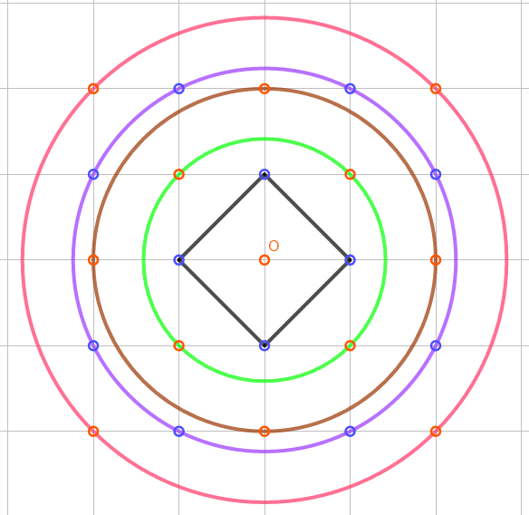
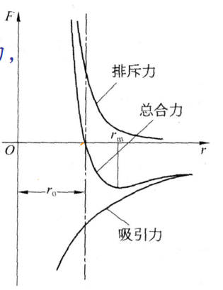
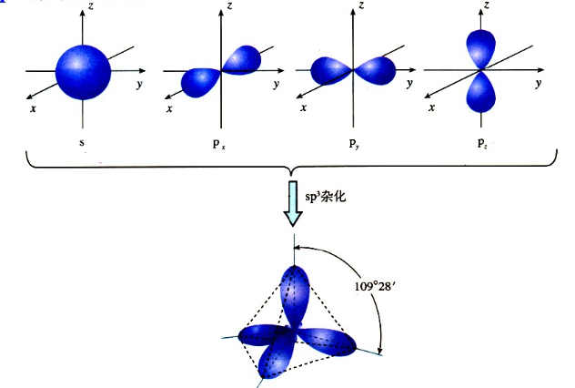
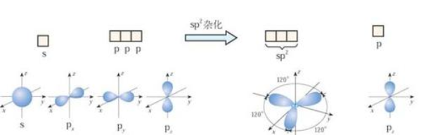
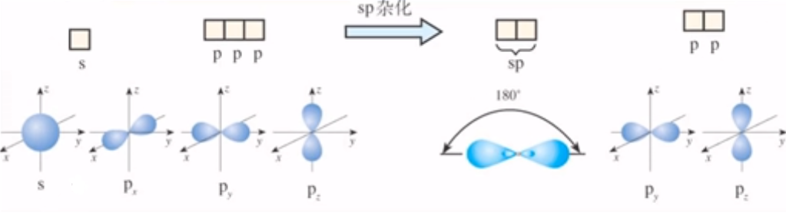
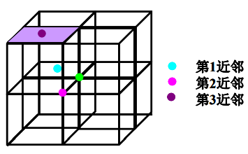

# 第二章

## 离子晶体

- **内能**
  $$
  U=-\frac{N}{2}\left[\frac{\mu q^{2}}{4 \pi \varepsilon_{0} R}-\frac{B}{R^{n}}\right]
  $$
或写作
  $$
  U(e)=N\left[-\frac{A q^{2}}{r}+\frac{B}{r^{n}}\right] 
  \\
  A=\frac{\mu}{4 \pi \varepsilon_{0}} \qquad B=6 b
  $$
  
- **马德隆常数$\alpha \quad or \quad \mu$**
  $$
  \mu=\sum_{j}\left(\pm \frac{1}{a_{j}}\right)
  $$

  - “+”表示相异离子的贡献，“-”表示相同离子的贡献
  
  - 仅与晶体结构有关
    
  - 负一价离子组成的二维晶格
    
  - 考虑边长为$4r_0$的晶胞，以为O为中心原子
  
    
  
    |                    | 最近邻 | 次近邻    | 第三近邻      | 第四近邻      | 第五近邻      |
    | ------------------ | ------ | --------- | ------------- | ------------- | ------------- |
    | $a_j$              | 1      | $\sqrt 2$ | 2             | $\sqrt 5$     | $2 \sqrt 2$   |
    | 离子数             | 4      | 4         | 4             | 8             | 4             |
    | 电性               | 反     | 同        | 同            | 反            | 同            |
    | 贡献因子（配位数） | 1      | 1         | $\frac{1}{2}$ | $\frac{1}{2}$ | $\frac{1}{4}$ |
  
      对于贡献银子，只有最外边那层才可能同时属于多个晶胞
    $$
      \mu=4-\frac{4}{\sqrt{2}}-1+\frac{8}{2 \sqrt{5}}-\frac{4}{4 \times 2 \sqrt{2}} \approx 1.6069
    $$
  
- **晶格常数$\alpha \quad \beta$**

  - 对于$\alpha$

    - 对内能U求极值：$\left.\frac{d U}{d r}\right|_{r=r_{0}}=0 \quad \rightarrow \quad -\frac{A}{r_{0}^{2}}+\frac{n B}{r_{0}^{n+1}}=0$

      得：$r_{0}=\left(\frac{n B}{A}\right)^{\frac{1}{n-1}} = \alpha$

  - 对于$\beta$，此处$r_0$为最近邻间距，$a$为惯用晶胞边长

    - 晶体体积：$= N\beta r_0^3$
    - 原胞体积：根据具体结构确定
      - 如面心立方原胞体积$\frac{1}{4}a^3=\frac{\sqrt 2}{2} r_0^3$，
      - $原胞体积=\frac{惯用晶胞体积}{有效原子数}$
    - $N\beta r_0^3 = N\cdot原胞体积$，解得$\beta$

- **❓体变模量K**

$$
\boldsymbol{K}=\left(V \frac{\boldsymbol{d}^{2} \boldsymbol{U}}{d V^{2}}\right)
\\
\begin{array}{l}U=N\left[-\frac{A}{r}+\frac{B}{r^{n}}\right] \\ V=\beta N r_{0}^{3}\end{array}
$$

1
$$
K=\frac{1}{9 N \beta r_{0}}\left(\frac{\partial^{2} U}{\partial r^{2}}\right)_{r_{0}}
$$

- **结合能**

$$
W=-U\left(r_{0}\right)=\frac{N \mu q^{2}}{4 \pi \varepsilon_{0} r_{0}}\left(1-\frac{1}{n}\right)
$$

​	排斥能只占库伦势能的$\frac{1}{n}$

- **抗张强度**

$$
f_{m}=-\left(\frac{\partial U}{\partial r}\right)_{r_{m}}
$$

​	$r_m$为$\frac{\partial U}{\partial r}$的极值，也就是$\frac{\partial^2 U}{\partial r^2}=0$处$r$的取值
$$
r_{m}=n-m \sqrt{\frac{n(n+1) B}{m(m+1) A}}=r_{0} n-m \sqrt{\frac{n+1}{m+1}}
$$

❓mn是啥

## 共价晶体

**轨道杂化**

- 只有最外层电子中不同能级的电子可以进行轨道杂化

- 电子态表示
  - 右上角为该能级的电子数目，左边为主量子数$n$，字母表示轨道角动量量子数$l$
  - 每个确定的轨道角量子数$l$上，可容纳电子数目：$2(2l+1)$，所以s容纳两个电子，p容纳6个电子，d容纳10个电子，f容纳14个电子
  - 基态电子排布规则❓看看原子物理
    - 能量最低原理
    - 洪特规则
    - 泡利不相同

- $sp^3$杂化

  金刚石共6个电子，电子态：$1s^2 2s^2 2p^2$

  金刚石受激发后，电子态变为：$1s^2 2s^1 2p^3$

  此时共有最外层共有1个s轨道，3个p轨道，发生$sp^3$杂化，

  能量相近的s与p轨道发生叠加，形成四个能量相等的$sp^3$杂化轨道

  四个$sp3$轨道上的电子分别与其他原子的$sp^3$轨道电子形成共价键（成$\sigma$键），成四面体，两键夹角$109^\circ 28'$

  - 当角量子数$l=1$时，磁量子数$m=-1,0,1$，当$l=p$时，共有三个轨道$p_x,p_y,p_z$
  - s、p轨道分别如图所示，合并后，空间取向平均，为正四面体

- $sp^2$杂化

  

  s轨道和$p_x,p_y$轨道杂化，空间均匀取向，形成三个$sp^2$轨道，$p_z$轨道不变，形成$\sigma$键

  两原子之间平行的$p_z$轨道，形成$\pi$键

- $sp$杂化

​		s轨道和$p_x$轨道杂化，空间均匀取向，形成两个$sp$轨道，$p_y,p_z$轨道不变

## 分子力结合（范德瓦尔斯力）

- 内能
  $$
  U(R)=2 N \varepsilon\left[A_{12}\left(\frac{\sigma}{R}\right)^{12}-A_{6}\left(\frac{\sigma}{R}\right)^{6}\right]
  $$
  其中，$\sigma$为表示势能为0的位置，$A_{12}=\sum_{j \neq i}^{N} \frac{1}{a_{j}^{12}}, A_{6}=\sum_{j \neq i}^{N} \frac{1}{a_{j}^{6}}$只取决于晶格结构

- 计算$A_{12},A_6$

  与马德隆常数相似，但不需要考虑贡献因子

  对于面心立方晶格，常选8个立方体为一大晶胞，只计算1，2，3近邻情况

  

  |               | 第一近邻 | 第二近邻  | 第三近邻  |
  | ------------- | -------- | --------- | --------- |
  | 基元数        | 12       | 6         | 24        |
  | 相对距离$a_j$ | 1        | $\sqrt 2$ | $\sqrt 3$ |

- 体积弹性模量

  定义：$K=\frac{1}{9 N \beta r_{0}}\left(\frac{\partial^{2} U}{\partial R^{2}}\right)_{r_{0}}$

  代入
  $$
  \begin{array}{l}U(R)=2 N \varepsilon\left[A_{12}\left(\frac{\sigma}{R}\right)^{12}-A_{6}\left(\frac{\sigma}{R}\right)^{6}\right] \\ r_{0}=\sqrt[6]{\frac{2 A_{12}}{A_{6}}} \sigma\end{array}
  $$
  得
  $$
  \begin{aligned} K &=\frac{1}{9 N \beta r_{0}} 2 N \varepsilon\left[(12 \times 13) A_{12} \frac{\sigma^{12}}{r_{0}^{14}}-(6 \times 7) A_{6} \frac{\sigma^{6}}{r_{0}^{8}}\right] \\ &=\frac{4 \varepsilon}{\sigma^{3}} A_{12}\left(\frac{A_{6}}{A_{12}}\right)^{5 / 2} \end{aligned}
  $$
  