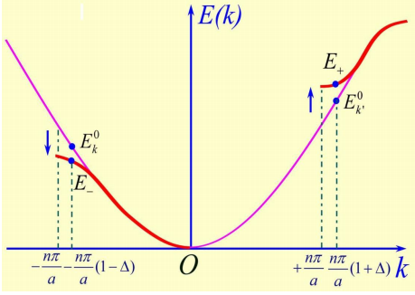
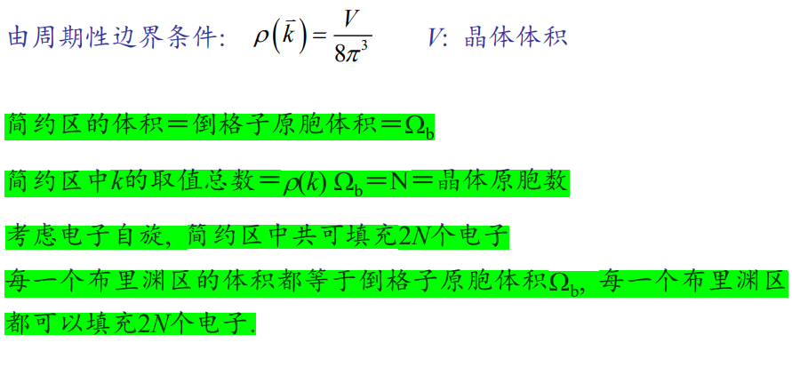
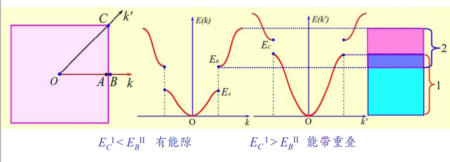
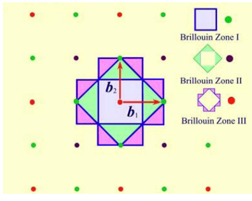

# 第四章笔记

## 引言

- Born-oppenheimer绝热近似

  考虑到电子质量远小于离子质量，电子运动速度远高于离子运动速度，故考察电子运动时，可以不考虑离子运动的影响，最简单的处理就是取系统中的离子实部分的哈密顿量为0

- Hatree-Fock平均场近似

  应用平均场近似，让其余电子对一个电子的相互作用等价为一个不随时间变化的平均场

- 周期场近似

  无论电子之间相互作用的形式如何，都可以假定电子所感受到的势场具有平移对称性，$U(\vec{r})=U(\vec{r}+\vec{R})$，平移对称性是晶体单电子势最本质的特点。

通过上述近似，多体问题变为周期势场下的单电子问题

## Bloch波函数

- 布洛赫定理

  电子波函数：
  $$
  \psi_{\bar{k}}(\vec{r})=e^{i \bar{k} \cdot \vec{r}} u_{\vec{k}}(\vec{r})
  $$
  或表示为
  $$
  \psi_{\bar{k}}\left(\vec{r}+\vec{R}_{l}\right)=e^{i \bar{k} \cdot \vec{R}_{l}} \psi_{\bar{k}}(\vec{r})
  $$
  其中$u_{\vec{k}}(\vec{r})=u_{\vec{k}}\left(\vec{r}+\vec{R}_{l}\right)$，是以格矢$R_l$为周期的周期函数

  第二式表明，当平移晶格矢量$R_l$，波函数只增加了相位因子

- 布洛赫定理的证明

- 波矢取值
  $$
  \vec{k}=\frac{h_{1}}{N_{1}} \vec{b}_{1}+\frac{h_{2}}{N_{2}} \vec{b}_{2}+\frac{h_{3}}{N_{3}} \vec{b}_{3}
  $$
  简约波矢：$\vec k$，限制在简约区中取值，$-\frac{N_{i}}{2}<h_{i} \leq \frac{N_{i}}{2}$

  广延波矢：$\vec k$在整个波矢空间中取值
  
  每一个量子态在波矢空间中所占的体积：$\frac{1}{N_{1}} \vec{b}_{1} \cdot \frac{1}{N_{2}} \vec{b}_{2} \times \frac{1}{N_{3}} \vec{b}_{3}=\frac{\Omega_{b}}{N}$
  
  在波矢空间中，$\vec k$的分布密度：$\rho(\vec{k})=\frac{N}{\Omega_{b}}=N\left(\frac{v_{a}}{8 \pi^{3}}\right)=\frac{V}{8 \pi^{3}}$，其中$\begin{array}{c}v_{a} \Omega_{b}=8 \pi^{3} \\ V=N v_{a}\end{array}$
  
  在简约区中，波矢$\vec k$的取值总数：$\rho(\vec{k}) \cdot \Omega_{b}=N=晶体的原胞数目$

## 一维晶格中的近自由电子

- 近自由电子模型

  在周期场中，若电子的势能随位置的变化比较小，而电子的平均动能比其势能的绝对值大得多，这样，电子的运动几乎是自由的，我们可以把自由电子看成是它的零级近似，而将周期场的影响看成小的微扰

- 零级近似
  - 能量本征值：$E_{k}^{(0)}=\frac{\hbar^{2} k^{2}}{2 m}+U_{0}=\frac{\hbar^{2} k^{2}}{2 m}$，令$U_0=0$
  - 归一化波函数：$\psi_{k}^{(0)}=\frac{1}{\sqrt{L}} e^{i k x}$

- 一级微扰
  
- $E_{k}^{(1)}=0$
  
- 二级微扰

  - $H_{k k}^{\prime}=\left\{\begin{array}{ll}U_{n} & k^{\prime}=k+2 \pi n / a \\ 0 & k^{\prime} \neq k+2 \pi n / a\end{array}\right.$

  - $$
    E_{k}^{(2)}=\sum_{k^{\prime} \neq k} \frac{\left|H_{k^{\prime} k}^{\prime}\right|^{2}}{E_{k}^{(0)}-E_{k^{\prime}}^{(0)}} = =\sum_{n \neq 0} \frac{2 m\left|U_{n}\right|^{2}}{\hbar^{2} k^{2}-\hbar^{2}\left(k+\frac{2 \pi n}{a}\right)^{2}}
    $$

- 综上

  - 电子能量修正
    $$
    \begin{array}{l} 
    E_{k}&=E_{k}^{(0)}+E_{k}^{(2)}
    \\
    &=\frac{\hbar^{2} k^{2}}{2 m}+\sum_{k^{\prime} \neq k} \frac{\left|H_{k k}^{\prime}\right|^{2}}{E_{k}^{(0)}-E_{k^{\prime}}^{(0)}}
    \\
    &=\frac{\hbar^{2} k^{2}}{2 m}+\sum_{n \neq 0} \frac{2 m\left|U_{n}\right|^{2}}{\hbar^{2} k^{2}-\hbar^{2}\left(k+\frac{2 \pi n}{a}\right)^{2}}
    \end{array}
    $$

  - 电子波函数修正
    $$
    \begin{array}{l} 
    \psi_{k}&=\psi_{k}^{(0)}+\psi_{k}^{(1)}
    \\
    &=\psi_{k}^{(0)}+\sum_{k^{\prime} \neq k} \frac{H_{k^{\prime} k}^{\prime}}{E_{k}^{(0)}-E_{k^{\prime}}^{(0)}} \psi_{k^{\prime}}^{(0)}
    \\
    &=\frac{1}{\sqrt{L}} e^{i k x}\left[1+\sum_{n \neq 0} \frac{2 m U_{n} \exp (i 2 \pi n x / a)}{\hbar^{2} k^{2}-\hbar^{2}(k+2 \pi n / a)^{2}}\right]
    \\
    &=\frac{1}{\sqrt{L}} e^{i k x} \cdot u_{k}(x)
    \end{array}
    $$
    其中，$u_{k}(x)=\frac{1}{\sqrt{L}}\left[1+\sum_{n \neq 0} \frac{2 m U_{n} \exp (i 2 \pi n x / a)}{\hbar^{2} k^{2}-\hbar^{2}(k+2 \pi n / a)^{2}}\right]$

- 简并情况

  在布里渊区边界处
  $$
  \left\{\begin{array}{l}E_{+}=T_{n}+\left|U_{n}\right|+\Delta^{2} T_{n}\left(\frac{2 T_{n}}{\left|U_{n}\right|}+1\right) \\ E_{-}=T_{n}-\left|U_{n}\right|-\Delta^{2} T_{n}\left(\frac{2 T_{n}}{\left|U_{n}\right|}-1\right)\end{array}\right.
  $$
  其中，$T_{n}=\frac{\hbar^{2}}{2 m}\left(\frac{n \pi}{a}\right)^{2}$

  ❓$U_n$如何确定

  几点说明

  - $E(k)$函数在布里渊区边界$k=\pm n\pi/a$处出现不连续，能量的突变为$E_{g}=E_{+}-E_{-}=2\left|U_{n}\right|$，即禁带宽度$E_{g}=2\left|U_{1}\right|, 2\left|U_{2}\right|, \ldots, 2\left|U_{n}\right|$，取决于势场的形式

  - 禁带出现在倒格矢的中点处，$k=\pm \frac{1}{2} \frac{2 \pi}{a}, \pm \frac{1}{2} \frac{4 \pi}{a}, \pm \frac{1}{2} \frac{6 \pi}{a}, \ldots$
  
- 在$k$和$k'$态距离布里渊区边界较远的情况，$\left|E_{k^{\prime}}^{(0)}-E_{k}^{(0)}\right|>>\left|U_{n}\right|$
  
    原本能量高的，修正后能量更高
    $$
    \begin{array}{l}E_{+} \approx E_{k^{\prime}}^{(0)}+\frac{\left|U_{n}\right|^{2}}{E_{k^{\prime}}^{(0)}-E_{k}^{(0)}} \\ E_{-} \approx E_{k}^{(0)}-\frac{\left|U_{n}\right|^{2}}{E_{k^{\prime}}^{(0)}-E_{k}^{(0)}}\end{array}
    $$
  
  

## 平面波方法

- ❓在三维情况下，在布里渊区边界面上的一般位置，电子的能量是二重简并的，即有两个态的相互作用强，其零级近似的波函数就是由这两个态的线性组合组成

- 在布里渊区的棱边或定点上，则可能出现能量多重简并的情况

- 对于简单立方晶格的简约区中的M点（简约区棱边的中点），$\vec{k}=\frac{\pi}{a}(1,1,0)$

  电子能量为四重简并，可以找到四个倒格矢$G_n$，使得$k'=k-G_n$态与$k$态能量相等，

- 

- 能带重叠条件

  一维情况下，布里渊区边界能量突变（能带宽度）为$2|U_n|$，

  三维情况下，在布里渊区边界上沿不同的$\vec k$方向上，电子能量的不连续可能出现在不同的能量范围

  

## 布里渊区

倒易空间最近邻与原点连线的垂直平分线，构成布里渊区

❓第三布里渊区怎么回事

## 紧束缚方法

- 当晶体中原子的间距较大，原子实对电子有相当强的束缚作用，当电子距某个原子实较近时，电子的运动主要受该原子势场的影响，这是电子的行为与孤立原子中电子的行为近似，这时可将孤立原子看成零级近似，将其他原子势场的影响看成效地微扰，这种方法称为紧束缚近似

- 紧束缚近似方法的一个突出优点是：它可以把晶体中电子的能带结构与构成这种晶体的原子在孤立状态下的电子能级联系起来

- 能量本征值
  $$
  E(\vec{k})=\varepsilon_{j}-J_{0}-\sum_{\vec{R}_{s}=\text { 近邻 }} J\left(\bar{R}_{s}\right) \exp \left(-i \vec{k} \cdot \vec{R}_{s}\right)
  $$

- 

- 简单立方晶体中由原子的S态度所形成的能带

  对于S态的原子波函数是球对称的，有$J(\vec R_s)=J_1$

  对于简单立方晶格最近邻六个原子的坐标为
  $$
  \vec{R}_{s}=(\pm a, 0,0),(0, \pm a, 0),(0,0, \pm a)
  $$
  代入紧束缚近似能带表达式得
  $$
  \begin{aligned} E(\vec{k}) &=\varepsilon_{s}-J_{0}-J_{1}\left(e^{i k_{x} a}+e^{-i k_{x} a}+e^{i k_{y} a}+e^{-i k_{y} a}+e^{i k_{z} a}+e^{-i k_{z} a}\right) \\ &=\varepsilon_{s}-J_{0}-2 J_{1}\left(\cos k_{x} a+\cos k_{y} a+\cos k_{z} a\right) \end{aligned}
  $$
  在简单立方晶格的简约区中

  $\Gamma$点(体心)：$\vec k = (0,0,0)$，$E(\Gamma)=\varepsilon_s -J_0 -2J_1$

  X点(面心)：$\vec k = (\pi/a, 0, 0)$，$E(X) = \varepsilon_s - J_0 - 2J_1$

  R点：$\vec k = (\pi/a, \pi/a. \pi/a)$，$E(R)=\varepsilon_s-J_0+6J_1$

  由于S态波函数是偶宇称，$\varphi_s(r) = \varphi_s(-r)$，所以，在近邻重叠积分中，波函数的贡献为正，即$J_1>0$

- 简单立方晶体由原子P态所形成的能带

  原子P态为三重简并，其原子轨道可表示为，$\left\{\begin{array}{l}\varphi_{p_{x}}=x f(r) \\ \varphi_{p_{y}}=y f(r) \\ \varphi_{p_{z}}=z f(r)\end{array}\right.$

  在简单立方晶体中，三个P轨道各自形成一个能带，其波函数是各自原子轨道的线性组合
  $$
  \begin{aligned} \psi_{\bar{k}}^{p_{x}} &=C \sum_{\ell} e^{i \bar{k} \cdot \bar{R}_{\ell}} \varphi_{p_{x}}\left(\vec{r}-\vec{R}_{\ell}\right) \\ \psi_{\vec{k}}^{p_{y}} &=C \sum_{\ell} e^{i \bar{k} \cdot \vec{R}_{\ell}} \varphi_{p_{y}}\left(\vec{r}-\vec{R}_{\ell}\right) \\ \psi_{\vec{k}}^{p_{z}} &=C \sum_{\ell} e^{i \vec{k} \cdot \vec{R}} \varphi_{p_{z}}\left(\vec{r}-\vec{R}_{\ell}\right) \end{aligned}
  $$
  由于P轨道不是球对称的，因此沿不同方向的近邻重叠积分$J(R_s)$不完全相同，如$\varphi_{P_x}$：电子主要集中在x轴方向，在六个近邻重叠积分中，沿x轴方向的重叠积分较大，用$J_1$表示；沿y方向和z方向的重叠积分用$J_2$表示
  $$
  \begin{array}{l}E^{p_{x}}(\vec{k})=\varepsilon_{p}-J_{0}-2 J_{1} \cos k_{x} a-2 J_{2}\left(\cos k_{y} a+\cos k_{z} a\right) \\ E^{p_{y}}(\vec{k})=\varepsilon_{p}-J_{0}-2 J_{1} \cos k_{y} a-2 J_{2}\left(\cos k_{z} a+\cos k_{x} a\right) \\ E^{p_{z}}(\vec{k})=\varepsilon_{p}-J_{0}-2 J_{1} \cos k_{z} a-2 J_{2}\left(\cos k_{x} a+\cos k_{y} a\right)\end{array}
  $$
  因为原子P态是奇宇称，$\varphi_{p_{x}}(-x)=-\varphi_{p_{x}}(x)$，

## 能态密度

- 定义：单位能量间距内的所包含的能态数目，设能量在$E \sim E+\Delta E$能量间距内能态数目：$\Delta Z$

- 公式
  $$
  N(E)=\frac{V_{c}}{4 \pi^{3}} \oiint_{E=c o n s .} \frac{d S}{\left|\nabla_{k} E\right|}
  $$

- 自由电子能态密度

  能量：$E=\frac{\hbar^{2} k^{2}}{2 m}$

  在k空间等能面是球形，半径为$k=\sqrt{\frac{2 m E}{\hbar^{2}}}$

  能量梯度的模：$\left|\nabla_{k} E\right|=\frac{\hbar^{2} k}{m}$

  能态密度
  $$
  N(E)=\frac{V_{c}}{4 \pi^{3}} \frac{m}{\hbar^{2} k} \oiint_{E=c o n s t .} d S=\frac{V_{c}}{4 \pi^{3}} \frac{m}{\hbar^{2} k} 4 \pi k^{2}
  $$
  将$k=\sqrt{2 m E / \hbar^{2}}$代入上式得
  $$
  N(E)=\frac{V_{c}}{4 \pi^{3}} \frac{m}{\hbar^{2} k_{E=c o n s t .}} d S=\frac{V_{c}}{2 \pi^{2}}\left(\frac{2 m}{\hbar^{2}}\right)^{3 / 2} E^{1 / 2}
  $$

- 近自由电子能态密度

  在能带底部附近，等能面基本保持为球面

  能量：$E(k)=E_{b}+\frac{\hbar^{2}\left(\vec{k}-\vec{k}_{b}\right)^{2}}{2 m_{b}^{*}}$

  能态密度：
  $$
  N(E)=\frac{V_{c}}{2 \pi^{2}}\left(\frac{2 m_{b}^{*}}{\hbar^{2}}\right)^{3 / 2}\left(E-E_{b}\right)^{1 / 2}
  $$
  在能带顶部附近，等能面也为球面

  能态：$E(k)=E_{t}-\frac{\hbar^{2}\left(\vec{k}_{t}-\vec{k}\right)^{2}}{2\left|m_{t}^{*}\right|}$

  其中，$E_t$为带顶能量，$K_t$为带顶波矢，$m_t^*$为电子在带顶的有效质量

  能态密度：
  $$
  N(E)=\frac{V_{c}}{2 \pi^{2}}\left(\frac{2\left|m_{t}^{*}\right|}{\hbar^{2}}\right)^{3 / 2}\left(E_{t}-E\right)^{1 / 2}
  $$

- 紧束缚近似电子的能态密度

  以简单立方晶格S带为离子，给出进舒服近似的能态密度特征
  $$
  E^{s}(k)=\varepsilon_{s}-J_{0}-2 J_{1}\left(\cos k_{x} a+\cos k_{y} a+\cos k_{z} a\right)
  $$
  