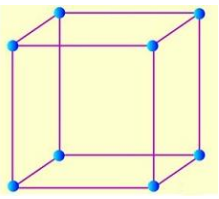
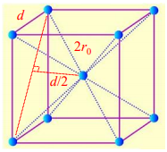
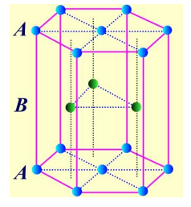
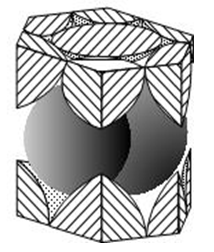
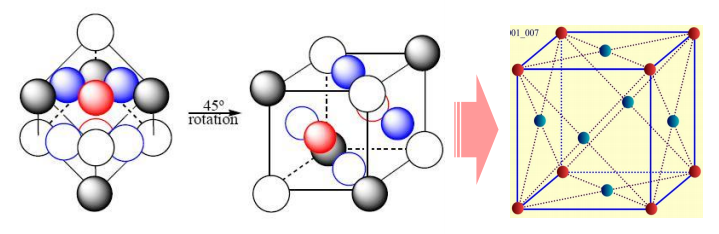

# 绪论+第一章

## 晶体的共同特征

1. 长程有序
2. 自限性
3. 各向异性
4. 镜面角守恒定律

5. 解理性
6. 对称性
7. 最低内能与固定熔点

## 晶格实例

### 简单立方 Simple cubic，SC

- 配位数：6——一个原子周围最近邻的原子数
- 原子贡献度：$\frac{1}{8}$——看晶胞里边每种原子有几个
- 有效原子数：$\frac{1}{8} \times 8 =1$
- 致密度：$ \frac{\frac{4}{3} \pi r^3}{(2r)^3}$
- 原胞基矢：$\left\{\begin{array}{l}\vec{a}_{1}=a \vec{i} \\ \vec{a}_{2}=a \vec{j} \\ \vec{a}_{3}=a \vec{k}\end{array}\right.$
- 原胞体积：$V=\vec{a}_{1} \cdot\left(\vec{a}_{2} \times \vec{a}_{3}\right)=a^{3}$

- 晶胞基矢：$\left\{\begin{array}{l}\vec{a}=a \vec{i} \\ \vec{b}=a \vec{j} \\ \vec{c}=a \vec{k}\end{array}\right.$
- 晶胞体积：$V=\vec{a} \cdot(\vec{b} \times \vec{c})=a^{3}$

### 体心立方 Body-centered cubic，BCC

- 配位数：8
- 原子贡献度：$\frac{1}{8}，1$
- 有效原子数：$\frac{1}{8} \times 8 + 1=2$
- 致密度：$\frac{2 \cdot \left( \frac{4}{3} \pi r^3 \right)}{a^3} $
- 原胞基矢：$\left\{\begin{array}{l}\vec{a}_{1}=\frac{a}{2}(-\vec{i}+\vec{j}+\vec{k}) \\ \vec{a}_{2}=\frac{a}{2}(\vec{i}-\vec{j}+\vec{k}) \\ \vec{a}_{3}=\frac{a}{2}(\vec{i}+\vec{j}-\vec{k})\end{array}\right.$
- 原胞体积：$V=\vec{a}_{1} \cdot\left(\vec{a}_{2} \times \vec{a}_{3}\right)=\frac{1}{2} a^{3}$
- 晶胞基矢：$\left\{\begin{array}{l}\vec{a}=a \vec{i} \\ \vec{b}=a \vec{j} \\ \vec{c}=a \vec{k}\end{array}\right.$
- 晶胞体积：$V=\vec{a} \cdot(\vec{b} \times \vec{c})=a^{3}$

### 六角密排 Hexagonal close-packed，HCP

| 1                                                            | 2                                                            |
| ------------------------------------------------------------ | ------------------------------------------------------------ |
|  |  |
- 配位数：$3+6+3=12$——上B层3+中A层6+下B层3
- 原子贡献度：$\frac{1}{6}，\frac{1}{2}，1$
- 有效原子数：$12 \times \frac{1}{6}+2 \times \frac{1}{2}+3=6$

- 致密度：

### 面心立方 Face-centered cubic，FCC

- 配位数：12
- 原子贡献度：$\frac{1}{8}，\frac{1}{2}$
- 有效原子数：$\frac{1}{8} \times 8 + \frac{1}{2} \times 6 =4$
- 致密度：

- 原胞基矢：$\left\{\begin{array}{l}\vec{a}_{1}=\frac{a}{2}(\vec{j}+\vec{k}) \\ \vec{a}_{2}=\frac{a}{2}(\vec{k}+\vec{i}) \\ \vec{a}_{3}=\frac{a}{2}(\vec{i}+\vec{j})\end{array}\right.$

- 原胞体积：$V=\vec{a}_{1} \cdot\left(\vec{a}_{2} \times \vec{a}_{3}\right)=\frac{1}{4} a^{3}$
- 晶胞基矢：$\left\{\begin{array}{l}\vec{a}=a \vec{i} \\ \vec{b}=a \vec{j} \\ \vec{c}=a \vec{k}\end{array}\right.$
- 晶胞体积：$V=\vec{a} \cdot(\vec{b} \times \vec{c})=a^{3}$

### 金刚石结构

…… to do

## 晶向、晶面

- 晶向（对于简单立方SC）
  - 沿面对角线的晶向共12个，统称<110>
  - 沿体对角线的晶向共8个，统称<111>
  - 垂直面方向的晶向共6个，统称<100>
  - 涉及负值的指数在指数上加一横表示

- 晶面

  选一个点为原点O，并作出沿$\vec a_1, \vec a_2, \vec a_3$的轴线，注意到，一簇镜面必包含了所有个点而无一楼，因此在三个基矢末端的格点必分别落在该簇的不同晶面上

  设$\vec a_1, \vec a_2, \vec a_3$分别在第$h_1,h_2,h_3$的晶面上，那么镜面截距可以写成
  $$
  \frac{\vec{a}_{1}}{h_{1}}, \frac{\vec{a}_{2}}{h_{2}}, \frac{\vec{a}_{3}}{h_{3}}
  $$
  其中，$h_1,h_2,h_3$为整数

  通常 用$(h_1,h_2,h_3)$来标记这个晶面系，称为密勒指数

  若晶面系与轴平行，则指数为0

  - 六方晶系采用四指数表示

## 倒格子

- 三维倒格子
  - 倒格子基矢：$\begin{array}{l}\overrightarrow{b_{1}}=\frac{2 \pi\left(\vec{a}_{2} \times \vec{a}_{3}\right)}{\Omega} \\ \vec{b}_{2}=\frac{2 \pi\left(\vec{a}_{3} \times \vec{a}_{1}\right)}{\Omega} \\ \vec{b}_{3}=\frac{2 \pi\left(\vec{a}_{1} \times \vec{a}_{2}\right)}{\Omega}\end{array}$

    - $\Omega=\vec{a}_{1} \cdot\left(\vec{a}_{2} \times \vec{a}_{3}\right)$为原胞体积

  - 倒格子每个格点位置：$\vec{G}_{h}=h_{1} \vec{b}_{1}+h_{2} \vec{b}_{2}+h_{3} \vec{b}_{3}$

    - $h_1,h_2,h_3$为整数，$\vec G_h$为倒格矢

  - 倒格矢与正格矢满足
    $$
    \overrightarrow{a_{i}} \cdot \vec{b}_{j}=2 \pi \delta_{i j}\left\{\begin{array}{l}2 \pi(i=j) \\ 0 \quad(i \neq j)\end{array}, \quad i, j=1,2,3\right.
    $$

    - 证明

      - $$
        \begin{array}{l} 
        设倒格子原胞体积为\Omega^*
        \\
        \Omega^{*}=\left|\vec{b}_{1} \cdot\left(\vec{b}_{2} \times \vec{b}_{3}\right)\right|=\frac{(2 \pi)^{3}}{\Omega^{3}} \mid\left(\vec{a}_{2} \times \vec{a}_{3}\right) \cdot\left[\left(\vec{a}_{3} \times \vec{a}_{1}\right) \times\left(\vec{a}_{1} \times \vec{a}_{2}\right)\right]
        \\
        利用:\vec{A} \times(\vec{B} \times \vec{C})=(\vec{A} \cdot \vec{C}) \vec{B}-(\vec{A} \cdot \vec{B}) \vec{C}
        \\
        得：\left(\vec{a}_{3} \times \vec{a}_{1}\right) \times\left(\vec{a}_{1} \times \vec{a}_{2}\right)=\Omega \vec{a}_{1}
        \\
        所以：\Omega^{*}=\frac{(2 \pi)^{3}}{\Omega^{3}}\left|\left(\vec{a}_{2} \times \vec{a}_{3}\right) \cdot \Omega \vec{a}_{1}\right|=\frac{(2 \pi)^{3}}{\Omega}
        \end{array}
        $$

- 二维倒格子

  - 定义垂直于表面的单位矢量$\vec a_3 = \vec k$
  - 二维倒格子的基矢定义为：$\left\{\begin{array}{l}\vec{b}_{1}=2 \pi \frac{\vec{a}_{2} \times \vec{a}_{3}}{\vec{a}_{1} \cdot \vec{a}_{2} \times \vec{a}_{3}} \\ \vec{b}_{2}=2 \pi \frac{\vec{a}_{3} \times \vec{a}_{1}}{\vec{a}_{1} \cdot \vec{a}_{2} \times \vec{a}_{3}}\end{array}\right.$
  - 倒格子于布拉菲各自满足：$\vec{a}_{i} \cdot \vec{b}_{j}=2 \pi \delta_{i j}$
  - 二维倒格矢：$\vec{G}_{h}=h_{1} \vec{b}_{1}+h_{2} \vec{b}_{2}$

- 性质

  1. 正格子和倒格子互为对方的倒格子
  2. 倒格矢$\vec{G}_{h}=h_{1} \vec{b}_{1}+h_{2} \vec{b}_{2}+h_{3} \vec{b}_{3}$与正格子晶面族$h_1.h_2.h_3$正交
  3. 倒格矢$\vec{G}_{h}=h_{1} \vec{b}_{1}+h_{2} \vec{b}_{2}+h_{3} \vec{b}_{3}$与正格子晶面族$(h_1 h_2 h_3)$的面间距成反比
  4. 面心立方、体心立方互为倒格子

## 晶体对称性

- 四种对称要素

  旋转、中心反演、镜像、旋转反演

- 旋转

  - 正交变化矩阵

    |                      绕z轴转$\theta$角                       | 绕x轴转$\theta$角 | 绕y轴转$\theta$角 |
    | :----------------------------------------------------------: | :---------------: | :---------------: |
    | $\left[\begin{array}{ccc}\cos \theta & -\sin \theta & 0 \\ \sin \theta & \cos \theta & 0 \\ 0 & 0 & 1\end{array}\right]$ |                   |                   |

  - 晶体每转动$\frac{2\pi}{n}$与自身重合，则称此轴为n重旋转对称轴，熊夫利符号用$C_n$表示

    - 只能存在一、二、三、四、六重旋转轴，不存在五重旋转轴

      证明：
      $$
      \begin{array}{l} 
      \overline{B^{\prime} A^{\prime}}=\overline{A B}(1-2 \cos \theta)=m \overline{A B}
      \\
      \qquad\Downarrow
      \\
      m=1-2 \cos \theta
      \\
      所以，m只能取：-1，0，1，2，3
      \\
      对应角度：\theta = 0(2\pi),2\pi/6,2\pi/4,2\pi/3,2\pi/2
      \\得证
      \end{array}
      $$
      同时，长方形、正三角形、正方形和正六边行可以在平面内周期性重复排列，而其他正n边形不能

- 立方体的对称操作

- 正四面体的对称操作

## X射线衍射

- 布拉格反射公式
  $$
  2 d \sin \theta=n \lambda, n=1,2,3 \ldots \ldots
  $$

  - 当入射波长一定，入射角只有符合$sin\theta = \frac{n\lambda}{2d}$时，才能发生衍射；

    由于$|sin\theta|\leq 1$，则当n=1时，必有$\lambda \leq 2d$，因此实现晶体衍射不能用可见光而需用X射线

  - 对于同一晶格点阵，X射线入射方向一定、波长一定，不同的晶面族因为面间距不同，满足衍射极大的$\theta$也不同

  - 对于给定的晶面族，其面间距d一定，入射的X射线也确定，则不同的衍射级次n，对应的衍射角不同

