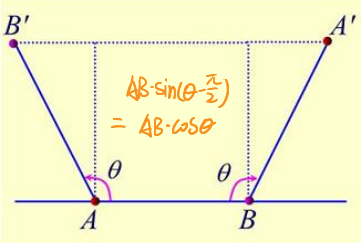

# 考试重点猜测

## 第一章

- 几种晶体结构

  | 结构       | 简单立方SC                                                   | 体心立方BCC                                                  | 面心立方FCC                                                  | 六角密排                                         |
  | ---------- | ------------------------------------------------------------ | ------------------------------------------------------------ | ------------------------------------------------------------ | ------------------------------------------------ |
  | 配位数     | 6                                                            | 8                                                            | 12                                                           | $3+6+3=12$上B层3+中A层6+下B层3                   |
  | 原子贡献度 | $\frac{1}{8}$                                                | $\frac{1}{8}$，1                                             | $\frac{1}{8}，\frac{1}{2}$                                   | $\frac{1}{6}，\frac{1}{2}，1$                    |
  | 有效原子数 | $\frac{1}{8}\times8=1$                                       | $\frac{1}{8} \times 8 + 1=2$                                 | $\frac{1}{8} \times 8 + \frac{1}{2} \times 6 =4$             | $12 \times \frac{1}{6}+2 \times \frac{1}{2}+3=6$ |
  | 原胞基矢   | $\left\{\begin{array}{l}\vec{a}_{1}=a \vec{i} \\ \vec{a}_{2}=a \vec{j} \\ \vec{a}_{3}=a \vec{k}\end{array}\right.$ | $\left\{\begin{array}{l}\vec{a}_{1}=\frac{a}{2}(-\vec{i}+\vec{j}+\vec{k}) \\ \vec{a}_{2}=\frac{a}{2}(\vec{i}-\vec{j}+\vec{k}) \\ \vec{a}_{3}=\frac{a}{2}(\vec{i}+\vec{j}-\vec{k})\end{array}\right.$ | $\left\{\begin{array}{l}\vec{a}_{1}=\frac{a}{2}(\vec{j}+\vec{k}) \\ \vec{a}_{2}=\frac{a}{2}(\vec{k}+\vec{i}) \\ \vec{a}_{3}=\frac{a}{2}(\vec{i}+\vec{j})\end{array}\right.$ |                                                  |
  | 原胞体积   | $a^{3}$                                                      | $\frac{1}{2} a^{3}$                                          | $\frac{1}{4} a^{3}$                                          |                                                  |

  $原胞体积V = \frac{晶胞体积}{有效原子数}=\vec{a}_{1} \cdot\left(\vec{a}_{2} \times \vec{a}_{3}\right)$

  致密度❓

- 晶面

  设$\vec{a}_{1}, \vec{a}_{2}, \vec{a}_{3}$的末端上的个点分别在第$h_{1}, h_{2}, h_{3}$的晶面上，那么晶面系的第一个面的截距必然是$\vec{a}_{1}, \vec{a}_{2}, \vec{a}_{3}$的分数

  $\frac{\vec{a}_{1}}{h_{1}}, \frac{\vec{a}_{2}}{h_{2}}, \frac{\vec{a}_{3}}{h_{3}}$

  - 算晶面指向、晶向指数

    直线方程，截距式：$S_{111}:x*a+y*a+z*a=1$

    联立两个截距方程，得出各变量

  - 晶面间距

    $d = \frac{2\pi}{|\vec G_h|}$

- 倒格子

  - 倒格子基矢：

  $$
  \begin{array}{l}\overrightarrow{b_{1}}=\frac{2 \pi\left(\vec{a}_{2} \times \vec{a}_{3}\right)}{\Omega} \\ \overrightarrow{b_{2}}=\frac{2 \pi\left(\vec{a}_{3} \times \vec{a}_{1}\right)}{\Omega} \\ \overrightarrow{b_{3}}=\frac{2 \pi(\overrightarrow{a_{1}} \times \overrightarrow{a_{2}})}{\Omega}\end{array}
  $$

  - 性质

    1. $$
       \vec{a}_{i} \cdot \vec{b}_{j}=2 \pi \delta_{i j}\left\{\begin{array}{l}2 \pi(i=j) \\ 0 \quad(i \neq j)\end{array}, \quad i, j=1,2,3\right.
       $$

    2. $$
       \Omega^{*}=\frac{(2 \pi)^{3}}{\Omega^{3}}\left|\left(\vec{a}_{2} \times \vec{a}_{3}\right) \cdot \Omega \vec{a}_{1}\right|=\frac{(2 \pi)^{3}}{\Omega}
       $$

    3. $$
       \overrightarrow{b_{1}}^{*}=\frac{2 \pi(\overrightarrow{b_{2}} \times \overrightarrow{b_{3}})}{\Omega^{*}}=\frac{2 \pi}{\Omega^{*}} \frac{(2 \pi)^{2}}{\Omega^{2}} \Omega \vec{a}_{1}=\vec{a}_{1}
       $$

    4. 倒格矢$\vec{G}_{h}=h_{1} \vec{b}_{1}+h_{2} \vec{b}_{2}+h_{3} \vec{b}_{3}$与正格子晶面族$(h_1 h_2 h_3)$正交

       - 点晶面上两条线成为0

    5. 倒格矢$\vec{G}_{h}=h_{1} \vec{b}_{1}+h_{2} \vec{b}_{2}+h_{3} \vec{b}_{3}$与正格子晶面族$(h_1 h_2 h_3)$的面间距成反比

    ❓可能证明

  - 几点说明

    - 面心立方体、体心立方互为倒格子T10
    - $\because \left(\vec{a}_{3} \times \vec{a}_{1}\right) \times\left(\vec{a}_{1} \times \vec{a}_{2}\right)=\Omega \vec{a}_{1}$

- 正交变换矩阵

  | 绕Z                                                          | 绕X                                                          | 绕Y                                                          |
  | ------------------------------------------------------------ | ------------------------------------------------------------ | ------------------------------------------------------------ |
  | $\left[\begin{array}{ccc}\cos \theta & -\sin \theta & 0 \\ \sin \theta & \cos \theta & 0 \\ 0 & 0 & 1\end{array}\right]$ | $\left(\begin{array}{ccc}1 & 0 & 0 \\ 0 & \cos (\alpha) & -\sin (\alpha) \\ 0 & \sin (\alpha) & \cos (\alpha)\end{array}\right)$ | $\left(\begin{array}{ccc}\cos (\beta) & 0 & \sin (\beta) \\ 0 & 1 & 0 \\ -\sin (\beta) & 0 & \cos (\beta)\end{array}\right)$ |

- 旋转轴的轴次只能是1，2，3，4，6，不存在五重旋转轴

  设有一对对称轴垂直于平面，如图所示，绕转轴的任意对称操作，转过角度为$\theta$

  绕A点的轴，将B点转到B'点，则该点必存在一个格点；

  AB点等价，可以通过B点的轴顺时针转过$\theta$角度将A点转到$A'$点，则A‘点也必有一个格点
  $$
  \overline{B^{\prime} A^{\prime}}=\overline{A B}(1-2 \cos \theta)=m \overline{A B}
  \\
  \Downarrow
  \\
  m=1-2 \cos \theta
  $$
  由于m只能取值：-1，0，1，2，3

  相应角度：$\theta = 0(2\pi)，2 \pi / 6，2 \pi / 4，2 \pi / 3，2 \pi / 2$

  

- 点群

  五种旋转操作，不动操作

  根据群的封闭性，任意两个操作乘积依然为群内元素

  ❓第十题不考虑中心反演？

  三维有七大晶系、14种布喇菲格子

  二维有四个晶系、5种布拉菲格子

- 布拉格

  X射线衍射：劳厄衍射、旋转单晶法、粉末法

  $2 d \sin \theta=n \lambda, n=1,2,3 \ldots \ldots$

## 第二章

- 马德隆常数
  $$
  \mu=\sum_{j}'\left(\pm \frac{1}{a_{j}}\right)
  $$
  1/距离 * 贡献因子（配位数倒数，只考虑最外边那圈）*数目

  $\because ln(1+x)=x-\frac{x^2}{2}+\frac{x^3}{3}+...$

- 离子晶体

  - 内能**
    $$
    U=-\frac{N}{2}\left[\frac{\mu q^{2}}{4 \pi \varepsilon_{0} R}-\frac{B}{R^{n}}\right]
    $$
    或写作
    $$
    U(e)=N\left[-\frac{A q^{2}}{r}+\frac{B}{r^{n}}\right] 
    \\
    A=\frac{\mu}{4 \pi \varepsilon_{0}} \qquad B=6 b
    $$

  - 晶格常数

    - $\alpha$，内能极值对应$r_0$，平衡距离
    - $\beta$，$N \beta r_0^3 = N\cdot原胞体积$
      - 如面心立方体积，$\therefore \frac{\sqrt{2}}{2}r_0^3N=N\beta r_0^3$

  - 结合能，内能极值的倒数，排斥能只占库伦势能的$\frac{1}{n}$
    $$
    W=-U\left(r_{0}\right)=\frac{N \mu q^{2}}{4 \pi \varepsilon_{0} r_{0}}\left(1-\frac{1}{n}\right)
    $$

  - 体弹性模量

    - 定义
      $$
      K=\frac{1}{9 N \beta r_{0}}\left(\frac{\partial^{2} U}{\partial r^{2}}\right)_{r_{0}}
      $$

    - 对于$\left(\frac{\partial^{2} U}{\partial V^{2}}\right)_{V_{0}}$求解时，应用平衡条件$\left.\frac{\partial U}{\partial V}\right|_{V_{0}}=0$

- 共价晶体
  - 特点：
    1. 饱和性，当一个原子的价电子壳层不到半满时，所有价电子均不配对，则共价键与价电子数目相等；当一个原子的价电子壳层未满单超过半满，遵守8-N定则，其中N事价电子数目，共价键的数目与未被填充的量子态数目相等
    2. 方向性，通常再价电子电荷密度最大的方向上形成共价键
  - 轨道杂化
    - 确定的轨道角量子数$l$上，可容纳电子数：$2(2l+1)$，所以s=0容纳2个，p容纳6=1个
    - 角量子数$l=1$时，磁量子数$m$=-1，0，1，当$l=p=1$时，有三个轨道$p_x,p_y,p_z$
    - $sp^3$杂化，$1s^2 2s^2 2p^2 \rightarrow 1s^2 2s^1 2p^3$，形成四个能量相等的杂化轨道，夹角$109^\circ28'$，形成4个$\sigma$键
    - $sp^2$杂化，3个$sp^2$杂化轨道夹角$120^\circ$，$p_z$轨道不变，
    - $sp$杂化，两个杂化轨道夹角$180^\circ$，$p_y,p_z$不变

- 分子晶体，范德瓦尔斯结合

  - 内能，即伦纳德琼斯势
    $$
    U(R)=2 N \varepsilon\left[A_{12}\left(\frac{\sigma}{R}\right)^{12}-A_{6}\left(\frac{\sigma}{R}\right)^{6}\right]
    $$

  - $A_{12}=\sum_{j \neq i}^{N} \frac{1}{a_{j}^{12}}, A_{6}=\sum_{j \neq i}^{N} \frac{1}{a_{j}^{6}}$，同马德隆常数，单不考虑贡献因子

  - 其他同离子晶体

- 金属结合
  - 金属晶体中，原子外层的价电子脱离原子而成为共有化电子，原子实“浸”在共有化电子形成的电子云中，由于原子实和电子云之间的经典库伦力是一种吸引作用，使系统能量降低，这就使金属原子倾向于相互接近形成晶体，这种共有化电子与离子实之间的库伦作用称为金属键

- 几点说明
  - 金属半径定义为两核距离的一半
  - 共价晶体核间距的一般为原子的共价半径
  - 范德瓦尔斯半径的定义为分子晶体中相邻分子间两个 近邻的非成键原子之间核间距的一半
  - 离子晶体：$R=\frac{C}{Z-\sigma}$

## 第三章

- 一维原子链

  运动方程只考虑两个最近邻

  - 格波解：$\mu_{n}=A e^{i(n a q - \omega t)}$

  - 色散关系：$\omega=2 \sqrt{\frac{\beta}{m}}\left|\sin \left(\frac{q a}{2}\right)\right|$

  - $\lambda=2 \pi / q$

  - 相速度：$v_{p}=\frac{\omega}{q}=a \sqrt{\frac{\beta}{m}} \frac{\sin (q a / 2)}{q a / 2}$

  - 群速度：$v_{g}=\frac{d \omega}{d q}=a \sqrt{\frac{\beta}{m}} \cos \left(\frac{q a}{2}\right)$

  - 长波极限下：$v_{p}=v_{g}=a \sqrt{\beta / m}$

  - 波矢q取值，第一布里渊区内的状态数N
    $$
    q=\frac{2 \pi}{N a} \times h
    \\
    -\frac{\pi}{a}<q \leq \frac{\pi}{a}
    $$

  - 波矢q的密度F
    $$
    g(\omega)d\omega 
    = \frac{L}{\omega} \cdot \left(\frac{d\omega}{dq}\right)
    = \frac{2 N}{\pi} \cos ^{-1}\left(\frac{q a}{2}\right)
    $$

- 一维双原子链

  2n个基元，n个原胞

  列出第2n个基元和第2n+1个基元的牛顿方程，只考虑两个最近邻基元的作用（不同的两个基元）

  - 格波解
    $$
    \left\{\begin{array}{l}\mu_{2 n}=A e^{i[q(2 n) a-\omega t]} \\ \mu_{2 n+1}=B e^{i[q(2 n+1) a-\omega t]}\end{array}\right.
    $$

  - 色散关系
    $$
    \omega_{\pm}^{2}=\beta \frac{(m+M)}{m M}\left\{1 \pm\left[1-\frac{4 m M}{(m+M)^{2}} \sin ^{2} q a\right]^{1 / 2}\right\}
    $$
    +为光学支，-为声学支，光学支：光学波的突出特点： $q \rightarrow 0$时，$\omega_+ \neq 0$，所以不是弹性波

    - 极值
      $$
      \begin{aligned} \omega_{+\max } &=\sqrt{\frac{2 \beta}{\mu}}, q=0 \\ \omega_{-\max } &=\sqrt{\frac{2 \beta}{M}, q}=\pm \frac{2 \pi}{a} \\ \omega_{+\min } &=\sqrt{\frac{2 \beta}{m}, q}=\pm \frac{2 \pi}{a} \\ \omega_{-\min } &=0, q=0 \end{aligned}
      $$

  - q取值
    $$
    q = \frac{2 \pi}{2 N a} h
    \\
    -\frac{\pi}{2 a}<q \leq \frac{\pi}{2 a}
    $$

  - 分布密度
    $$
    \rho(q)=\frac{L}{2\pi}=\frac{2 N a}{2 \pi}
    $$

- 三维复式晶格

  3支声学波，描述不同原胞间得相对运动

  3n-3支光学波，描述一个原胞内各原子间的相对运动（正负粒子的相对振动形成电偶极子）

  晶格振动得波矢数=晶体原胞数

  晶格振动频率数=晶体自由度数

  晶体格波支数=原胞自由度数

  

  - 若一m维度复式晶格原胞数为N，每个原胞包含p个不等效的原子

    晶格振动的波矢数=N

    晶体中格波的支数=mp，其中m个声学支+(mp-3)个光学支

    晶格振动频率（振动模式，即$\omega$）数=Npm

- 晶格振动热容理论

  - 定义
    $$
    C_{V}=\frac{\partial}{\partial T} \sum_{j=1}^{3 N} \frac{\hbar \omega_{j}}{e^{\hbar \omega_{j} / k_{B} T}-1}=k_{B} \sum_{j=1}^{3 N}\left(\frac{\hbar \omega_{j}}{k_{B} T}\right)^{2} \frac{e^{\hbar \omega_{j} / k_{B} T}}{\left(e^{\hbar \omega_{j} / k_{B} T}-1\right)^{2}}
    $$

  - 经典理论

    - 下式称为杜隆-珀替定律
    - 1mol固体中有$N_A$个原子，$\bar{E}=3 N_{A} k_{B} T \Rightarrow C_{V}=\frac{\partial \bar{E}}{\partial T}=3 N_{A} k_{B}=3 R=24.9 \mathrm{J} / \mathrm{Kmol}$
    - 能量均分定理，受简谐力作用的原子，每个自由度平均能量为$k_B T$

  - 爱因斯坦模型

    认为晶体中所有原子都以相同的频率振动，设为$\omega_0$

    设爱因斯坦温度$\hbar \omega_{0}=\Theta_{E} k_{B}$
    $$
    \begin{array}{l} 
    
    C_{V}
    &=k_{B} \sum_{j=1}^{3 N}\left(\frac{\hbar \omega_{0}}{k_{B} T}\right)^{2} \frac{e^{h \omega_{0} / k_{B} T}}{\left(e^{h \omega_{0} / k_{B} T}-1\right)^{2}}
    \\
    &=3 N k_{B}\left(\frac{\hbar \omega_{0}}{k_{B} T}\right)^{2} \frac{e^{h \omega_{0} / k_{B} T}}{\left(e^{\hbar \omega_{0} / k_{B} T}-1\right)^{2}}
    \\
    &=3 N k_{B}\left(\frac{\Theta_{E}}{T}\right)^{2} \frac{e^{\Theta_{E} / T}}{\left(e^{\Theta_{E} / T}-1\right)^{2}}
    \end{array}
    $$

    - 高温情况（$\Theta_{E}<T$）,$e^{\theta_{E} / 2 T} \approx 1+\frac{\theta_{E}}{2 T} \Rightarrow C_{V} \approx 3 N k_{B}$,与经典情况相同
    - 低温情况（$\Theta_{E}>r$）,$e^{\theta_{E} / 2 T} \gg 1 \Rightarrow C_{V} \approx 3 N k_{B}\left(\frac{\Theta_{E}}{T}\right)^{2} e^{-\Theta_{E} / T}$，按指数形式衰减为0，与实验结果不符，原因在于忽略了各格波对热容贡献差异

  - 徳拜模型
    - 用连续介质中的弹性波替代格波，$\omega(q)=\nu q$
    - 认为晶体存在三支弹性波，两支横波和一支纵波
    - $C_{V}=\left(\frac{\partial \bar{E}(T)}{\partial T}\right)_{V}=\frac{d}{d T}\left(9 N k_{B} \frac{T^{4}}{\theta_{D}^{3}} \int_{0}^{\frac{\theta_{0}}{T}} \frac{x^{3}}{e^{x}-1} d x\right)$
    - 低温时，$C_{V}\left(T / \Theta_{D}\right)=\frac{12 \pi^{4}}{5} N k_{B}\left(\frac{T}{\Theta_{D}}\right)^{3}$
    - 高温，与经典情况相同

  - 模式密度

    - 一般表达式
      $$
      g(\omega)=\frac{V}{(2 \pi)^{3}} \int \frac{d S}{\left|\nabla_{q} \omega(q)\right|}
      $$

    - 球表面积：$S=4 \pi R^{2}$

    - 二维为圆

    - 一维为2

- 长波近似❓

## 第四章

- 三个近似

  - Born-oppenheimer绝热近似

    考虑到电子质量远小于离子质量，电子运动速度远高于离子运动速度，故考察电子运动时，可以不考虑离子运动的影响，最简单的处理就是取系统中的离子实部分的哈密顿量为0

  - Hatree-Fock平均场近似

    应用平均场近似，让其余电子对一个电子的相互作用等价为一个不随时间变化的平均场

  - 周期场近似

    无论电子之间相互作用的形式如何，都可以假定电子所感受到的势场具有平移对称性，$U(\vec{r})=U(\vec{r}+\vec{R})$，平移对称性是晶体单电子势最本质的特点。

  通过上述近似，多体问题变为周期势场下的单电子问题

- Bloch定理
  -  to do

- 近自由电子

  - 电子能量修正
    $$
    \begin{array}{l} 
    E_{k}&=E_{k}^{(0)}+E_{k}^{(2)}
    \\
    &=\frac{\hbar^{2} k^{2}}{2 m}+\sum_{k^{\prime} \neq k} \frac{\left|H_{k k}^{\prime}\right|^{2}}{E_{k}^{(0)}-E_{k^{\prime}}^{(0)}}
    \\
    &=\frac{\hbar^{2} k^{2}}{2 m}+\sum_{n \neq 0} \frac{2 m\left|U_{n}\right|^{2}}{\hbar^{2} k^{2}-\hbar^{2}\left(k+\frac{2 \pi n}{a}\right)^{2}}
    \end{array}
    $$

- 布里渊区
  - 倒易空间最近邻与原点连线的垂直平分线，构成布里渊区

- 紧束缚方法
  $$
  E(\vec{k})=\varepsilon_{j}-J_{0}-\sum_{\vec{R}_{s}=\text { 近邻 }} J\left(\bar{R}_{s}\right) \exp \left(-i \vec{k} \cdot \vec{R}_{s}\right)
  $$
  根据角量子数，确定轨道形状，决定$J$

  根据晶格，决定最近邻坐标$\vec R_s$

- 能态密度

  一般形式
  $$
  N(E)=\frac{V_{c}}{4 \pi^{3}} \oiint_{E=c o n s .} \frac{d S}{\left|\nabla_{k} E\right|}
  $$
  自由电子等能面为球形

  近自由电子，能带底部为球面，顶部也为球面

## 第五章

- 准经典运动

  - 波矢速度：$\bar{v}=\frac{\mathbf{1}}{\hbar} \nabla_{k} E(\boldsymbol{k})$
  - 有效质量：$m^{*}=m(\cos k a-1 / 2 \cos 2 k a)^{-1}$
    - 带顶时，$k=\frac{\pi}{a}$
    - 带底时，$k=0$

  - r空间和k空间
    $$
    \begin{array}{c}\hbar \frac{d k}{d t}=q V \times B=q \frac{d r}{d t} \times B 
    \\
    \Downarrow
    \\
    d k=(q d r \times B) / \hbar=(q B / \hbar) d r\end{array}
    \\
    \Downarrow
    \\
    \Delta k=(q B / \hbar) \Delta r
    \\
    \Downarrow
    \\
    A_{n}=\left(\frac{\bar{h}}{q B}\right)^{2} S_{n}
    $$
    

弹性模量，推导证明

课本4.8

半导体、导体，绝缘体能带解释