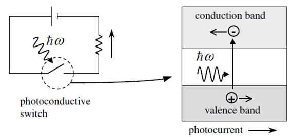
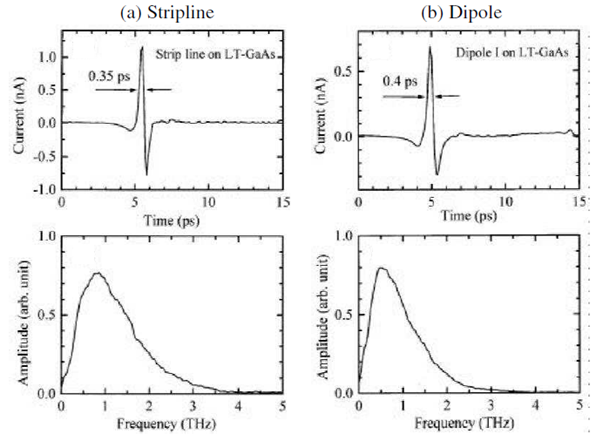
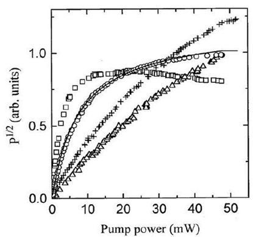
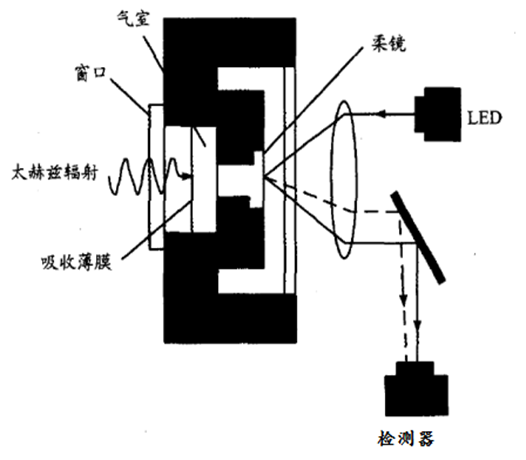

# 1

**红外线是波长为$0.75\sim 30\mu m$的电磁波，可分为三部分，**

近红外线，波长为$0.75\sim 1.50\mu m$之间；

中红外线，波长为$1.50\sim 6.0\mu m$之间；

远红外线，波长为$6.0\sim 30\mu m$之间

# 2 

可见光是电磁波谱中人眼可以感知的部分，可见光谱没有精确的范围；一般人的眼睛可以感知的电磁波的波长在$400\sim 700nm$之间

# 3

**紫外线是电磁波谱中波长为$100\sim 400nm$辐射的总成，它分为：**

近似外线UVA（$320\sim 400nm$，晒黑）；

远紫外线UVB（$280\sim 320nm$，晒伤）；

超短紫外线UVC（$200\sim 320nm$）

# 4

| 太赫兹特点        |          |                                                        |
| ----------------- | -------- | ------------------------------------------------------ |
| Frequency         | 频率     | $\nu = 1THz = 1000GHz$                                 |
| Angular frequency | 角频率   | $\omega = 2\pi\nu = 6.28THz$                           |
| Period            | 周期     | $\tau = \frac{1}{\nu} = 1ps$                           |
| Wavelength        | 波长     | $\lambda = \frac{c}{v} = 0.3mm = 300\mu m$             |
| Wavenumber        | 波数     | $k = \frac{k}{2\pi} = \frac{1}{\lambda} = 33.3cm^{-1}$ |
| Photon energy     | 光子能量 | $h\nu = \hbar\omega = 4.14meV$                         |
| Temperature       | 温度     | $T = \frac{h\nu}{kB}=48K$                              |

# 5

**运用光子学方法产生光学太赫兹辐射元的方法主要有**

1. 高功率$CO_2$激光器泵浦气体产生THz波
2. 超短脉冲的光整流产生THz
3. 超短脉冲的光学差频（DFG）产生THz
4. 光参量产生/振荡（TPG/TPO）产生THz

# 6

**利用高功率$CO_2$激光器泵浦气体产生THz波，常用的激光介质主要有哪些？**

- 甲烷$CH_4$
- 甲醇$CH_3 OH$
- 二氟甲烷 $CH_2F_2$
- 氨气$NH_3$
- 氰化氢$HCN$

# 7

**光导天线（Photoconductive Antennas）工作的基本原理是什么？**

> A photoconductive (PC) antenna is an electrical switch exploiting the increase in electrical conductivity of semiconductors and insulators when they are exposed to light. The photoconductivity results from an increase in the number of free carriers—electrons and holes—generated by photons

光导（PC）天线是一种利用半导体和绝缘体暴露在光下时导电性增加的电开关。光导性是由于光子产生的自由载流子--电子和空穴的数量增加而产生的。

**决定光导天线辐射功率的主要因素是？**

> The power and bandwidth of THz emission from a PC switch vary widely depending on its metal electrode structure. Typical values of the dipole gap and the stripline separation are 5-10 μm and 30-100 μm, respectively.

PC开关的THz发射功率和带宽因其金属电极结构不同而变化很大。

> The output power of a PC emitter depends on the bias voltage and the optical pump power. The amplitude of the radiation field increases linearly with both parameters when the optical pump power is low and the bias field is weak. The maximum radiation power is limited by the breakdown voltage of its substrate material. The breakdown field of LT-GaAs is reported as ∼300 kV/cm

PC发射器的输出功率取决于<strong style="color:red;">偏置电压</strong>和<strong style="color:red;">光泵功率</strong>。

# 7❓

**太赫兹混频器的基本工作原理是什么？**

混频器： 同时接收观测信号和与观测信号频率接近的本振信号，输出中频信号

# 8

**量子级联激光器工作的基本原理是什么？**

电子从高能级跃迁到低能级释放出THz辐射

与传统半导体激光器不同，量子级联激光器是一种单极型激光器，只依赖一种载流子。在有外加电场的情况下，利用电子量子隧穿通过由一组耦合量子阱构成的注入区，到达由另一组耦合量子阱构成的有源区，导带激发态子能级电子共振跃迁到基态释放能量，发射光子并隧穿到下一级，成为下一级相似结构的注入电子。

# 9 

**自由电子激光器如何分类？**

按是否存在入射激光束分：

- 自由电子激光放大器：将入射激光功率放大
- 自由电子激光振荡器：无入射激光，依靠光学谐振腔形成电子束振荡

按工作波段分：

- 康普顿型：工作在短波波段，电子束速度很高，电子密度较低，电子之间的相互作用可以忽略不计。
- 拉曼型：工作在长波波段，电子束速度较低，电子密度高，电子之间的相互作用不能忽略。 

**自由电子激光器主要由哪几部分构成？**

自由电子激光器主要由三部分构成：电子束、磁摆动器、光学谐振腔。

对于自由电子激光放大器来说，还需要入射激光源。

# 10

通过太赫兹时域光谱（time-domain spectroscopy）系统获得的主要信息有哪些？

> In THz time-domain spectroscopy (THz-TDS), THz pulses are measured with and without a sample. Since THz-TDS determines both the amplitude and the phase of the THz radiation, not only the absorption but also the dispersion of the sample can be obtained by analyzing the Fourier transforms of the waveforms.

通过分析波形的傅里叶变换，不仅可以得到<strong style="color:red;">样品的吸收</strong>，还可以得到<strong style="color:red;">样品的色散</strong>。

# 11

**太赫兹时域光谱系统中全发射模块（Attenuated Total Reflection—ATR）可用来测量什么材料的太赫兹波谱？**

> Polymorph identification and quantification; unique material structure and crystallinity on solids, liquids, suspensions, slurries, pastes and films.

固体、液体、悬浊液、浆液、糊状物和薄膜的独特物质结构和结晶度。

# 12

**相干检测非相干检测主要区别是什么？**

相干检测：同时检测出电磁波的幅值和相位

非相干检测：只能检测出电磁波的幅值

# 13

**检测器主要参数由哪些？**

响应带宽：探测器能够响应的频率范围；
响应率：一般为每瓦特入射功率产生的电压或电流值；
噪声特性：噪声等效功率(NEP),噪声频谱；
动态范围：由于饱和产生非线性状态的范围；
响应速度：探测器对一个信号强度变化做出反应的速度；
敏感面积：一般为探测器的物理面积；

# 14

**高莱盒(Golay Cell)探测器的工作原理？**

热检测器吸收电磁波辐射后温度升高，可以使检测材料产生温差电动势、电阻率变化、自发极化强度变化、或者气体体积与压强变化等，测量这些物理性能的变化就可以测定被吸收的电磁波辐射能量或功率。分别利用上述不同性能可制成多种热检测器。高莱泡就是利用了材料的热胀冷缩效应而构建的一种热检测器。

**结构？**

气室、窗口、吸收薄膜、柔镜

# 15❓

**热释电探测器的基本原理？**

> A pyroelectric crystal cut perpendicular to its polar axis is sandwiched between two electrodes. The top one is usually blackened to be a radiation absorber. If the electrode is transparent in the desired spectral region, the crystal surface itself is treated to absorb incident radiation. The heat generated by incident radiation raises the temperature of the pyroelectric crystal. The increase in temperature induces a reduction of the spontaneous polarization and, simultaneously, the surface charge. The electrodes attached to the two opposite crystal surfaces form a capacitor. If the circuit is closed, a current flows through it to compensate the change in the surface charge.

一个垂直于其极轴切割的热释电晶体夹在两个电极之间。顶部的电极通常被涂黑，成为辐射吸收器。如果电极在所需的光谱区域是透明的，则晶体表面本身经过处理以吸收入射辐射。入射辐射产生的热量使热释电晶体的温度升高。温度的升高会引起自发极化的降低，同时也会引起表面电荷的降低。连接在两个相反晶体表面的电极形成了一个电容器。如果电路闭合，则有电流流过，以补偿表面电荷的变化。

热释电效应：晶体随温度的变化而在晶体表面产生电荷聚集的物理现象。

**结构**

菲涅尔透镜系统、热释电红外传感器、红外信号处理电路，输出控制装置

# 16

**Bolometers探测器的基本工作原理？**

> The device consists of a radiation absorber deposited on a substrate and a thermometer whose electrical resistance varies according to the substrate temperature. The substrate is connected to a heat sink by heat conducting wires. The heat sink includes a L-He dewar to keep the detector at cryogenic temperature. Radiation energy absorbed by the absorber is converted into heat, which raises the temperature of the absorber and thermometer assembly. The temperature increase induces a change in the thermometer resistance, which is detected by measuring the change of the electrical signal across it.

该装置由沉积在基板上的辐射吸收器和温度计组成，温度计的电阻随基板的温度变化而变化。基片通过导热线连接到一个散热器上。散热器包括一个L-He杜瓦，以使探测器保持在低温状态。吸收器吸收的辐射能量转化为热量，从而提高吸收器和温度计组件的温度。温度升高引起温度计电阻的变化，通过测量其上的电信号变化来检测。

**结构？**

沉积在基板上的辐射吸收器和温度计、

基片通过导热线连接到一个散热器上。散热器包括一个L-He杜瓦瓶

# 17

太赫兹波段常用的窗口材料有哪些？

> An ideal window – such as glass in the visible – needs to have a large number of desirable features. It should be cheap and strong, insoluble in water, and stable over a wide range of temperatures; it should also be reasonably inert, have a low reflection loss, and high transmission. Similar requirements apply for lenses. No material fulfills all these requirements at THz frequencies but there are several which perform quite adequately. At temperatures around 300K TPX, HDPE, Tsurupica, and PP are often used.

聚4-甲基戊烯Poly-4-methylpentene-1 (PMT, TPX)

高密度聚乙烯HDPE

Tsurupica

聚丙烯Polypropylene (PP)

# 18

太赫兹波段常用的滤波方法有哪些？

> Black Polyethylene (PE) Absorption Filters：The simplest of these consists of a suspension of carbon particles in PE. Carbon in one form or other has been used to filter out short wavelengths since the beginning of THz spectroscopy
> Alkali Halide Filters (Yoshinaga Filters)： Yoshinaga and his colleagues developed a very useful range of filters in which reststrahlen crystals, originally thallium bromide, were suspended in black PE sheets. By careful control of particle size and by suitable mixing of materials, filters with cut-on wavelengths from 20 to 200μm were produced
> Scattering Filters： If a powder is suspended in another medium, the radiation passing through will be scattered, except when the refractive index of the powder and the medium are the same. Filters based on this principle are called Christiansen filters
> Resonant Mesh Filters Meshes are two-dimensional arrays of holes in a thin sheet of metal, or an array of metal islands on a thin dielectric substrate. Generally, one can distinguish two types: the inductive mesh and the capacitive mesh. The inductive mesh consists of a grid of wires or metallic stripes with diameter or breadth 2r and thickness d, which are separated by a distance g. The ideal inductive mesh can be modeled by an inductance, which shunts a transmission line.

黑聚乙烯（PE）滤波器

碱性卤化物滤波器（吉永滤波器）

散射滤波器

谐振网格滤波器

# 19

**什么是太赫兹超材料（Metamaterial）？**

> Electromagnetic interaction depends on artificial resonators 

电磁相互作用取决于人工谐振器

其特性取决于其基本单元结构。通过人为地设计谐振单元，控制它对外场的响应来实现范围更广的ε和μ值，实现自然界不存在的特殊媒质。

**太赫兹超材料可实现哪些调制功能？列举3-5个**

电控太赫兹调制器示意图

光控太赫兹调制器

温控、磁控等太赫兹调制器

空间光调制、偏振调制