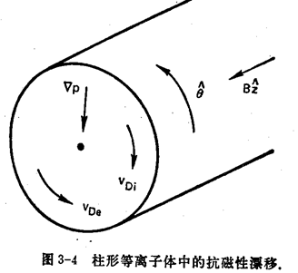

# 等离子体物理

## 定义

等离子体是带电粒子和中性粒子组成的、表现出集体行为的一种准中性气体

#### 集体行为

**对于空气分子**

分子电中性，无电磁力；分子质量小，忽略引力作用。

因此分子运动受到分子间碰撞支配，通过动量交换进行，无接触无相互作用，

运动具有局域性

**对于等离子体**

考虑等离子体中两区域AB，可以发现

AB间库仑力随$r^2$增加而减小；但对A产生库仑作用的体积B随$r^3$增加而增加

因此对于相距很远的等离子体元也存在库伦作用，即**长程电磁力支配等离子体运动**

“集体行为”即指等离子运动不仅取决于局部，也受远距离等离子体影响；也使等离子体不顺从于外界影响

“无碰撞等离子体”，指长程电磁力远大于普通局部碰撞引起的力

#### 准中性

等离子体具有屏蔽掉作用域它上面的电势的能力，称为德拜屏蔽

考虑一上述模型，在等离子内插入两电机，以引入电场

假设

1. 介电层阻止了等离子体在电极表面上的复合
2. 或者尽管存在着复合，但电池容量足够大，能够保持这个电势
3. 设为低温等离子体，$T_{e} \gg T_{i}=T_{g a s}$，电子存在热运动，但离子运动相比之下可以忽略

> 当等离子体处于低温，热运动可以忽略时，电极周围吸引的电荷构成一均匀带电的无限薄电荷球壳
>
> 当等离子体热运动不能忽略时，电极周围吸引的电荷由于热运动形成以带电球体。
>
> 电子离子质量差异太大，其加速度远小于电子，近似认为离子不动
>
> 等离子体存在多种温度，$T_e$电子温度，$T_i$离子温度，下面考虑的是电子温度

以负极为例，根据球的对称性，将电极附近的电势简化为一维问题，

记电极在$x = 0$处，求电势随$x$的变化$\varphi(x)$

满足静电场中的一维泊松方程，采用自然单位制
$$
\nabla^{2} \varphi=-4 \pi\left(\rho_{e}\right)
$$
有
$$
\nabla^{2} \varphi = -4 \pi e\left(n_{i}-Z n_{e}\right) \quad(Z=1) \tag{1}
$$
其中，$n_i$为离子数密度，$n_e$为电子数密度，$Z$为电离度，此处取电离一个电子

> 泊松方程描述了

记无穷远处电子数密度为$n_\infty$，同样有各处的离子数密度$n_i = n_\infty$，

电子分布函数满足玻尔兹曼分布，对于电势$\varphi$有分布函数
$$
f(u)=A \exp \left[-\left(\frac{1}{2} m u^{2} - e\varphi\right) / K T_{e}\right]
\\\Downarrow\\
f(u) = A \exp\left[\left( e\varphi\right) / K T_{e}\right] \cdot \exp\left[\left(-\frac{1}{2} m u^{2} \right) / K T_{e}\right]
\\\downarrow \quad \int_{-\infty}^{\infty} du\\
n_e = A\exp\left[\left( e\varphi\right) / K T_{e}\right] \cdot \frac{\sqrt{2 \pi }}{\sqrt{\frac{m}{K T_e}}}
$$

> 玻尔兹曼分布解释⭐TODO

考虑无穷远处$x\rightarrow\infty,\quad\varphi = 0, \quad n_e = n_{\infty}$代入上式有
$$
n_\infty = A\cdot \frac{\sqrt{2 \pi }}{\sqrt{\frac{m}{K T_e}}}
$$
代回，因此有

> 对玻尔兹曼分布u积分从$-\infty,\infty$，有

$$
n_e = n_\infty \exp(\frac{e\varphi}{KT_e})
$$
把$n_i,n_e$代入方程(1)有

> $ n_i = n_\infty$

$$
\nabla^2\varphi = 4\pi en_\infty \left[n_\infty \exp(\frac{e\varphi}{KT_e})-1\right]
,\qquad
u\rightarrow \infty

\tag{2}
$$
该方程为非线性二阶微分方程，无解析解

为简化该方程，考虑

在电极位置$\left|\frac{e\varphi}{KT_e}\right|$一般为大值，但在电极附近区域该比值迅速下降，

当进入$\left|\frac{e\varphi}{KT_e}\right|\lt 1$区域，可以对方程（2）进行泰勒展开，有
$$
\nabla^2 = 4\pi en_\infty \left[\frac{e \varphi}{K T_{e}}+\frac{1}{2}\left(\frac{e \varphi}{K T_{e}}\right)^{2}+\cdots \right]
$$
保留线性项，得到
$$
\nabla^2 \varphi= \frac{4\pi n_\infty e^2}{KT_e}\varphi
$$
定义，德拜长度
$$
\lambda_{D}=\left(\frac{K T_{e}}{4 \pi n e^{2}}\right)^{\frac{1}{2}}
$$
它衡量了等离子体的屏蔽距离或说电子球层的厚度

解得，
$$
\varphi = \varphi_0 e^{-|x|/\lambda_D}
$$
根据德拜长度，可以发现

- 热运动越弱，$KT_e$越小，电子球越小
- 对于德拜长度之外的等离子体，不会受到电极电场的作用，产生屏蔽作用

**准中性**即：如果系统的尺度$L$远大于$\lambda_D$，那么，每当出现电荷的局部集中或者在系统中引入外电势时，它们就在比$L$短的距离内被屏蔽，使等离子体的大部分免受大电势或电场的影响．可以认为等离子体$n_e = n_i = n$，但电磁力还没有消失

也由于利用了玻尔兹曼分布进行计算，因此在德拜球内应该有大量粒子，否则不能满足统计上的要求，

## 等离子体判据

#### $\lambda_D \ll L$

德拜长度远小于等离子体长度？否则不足以实现屏蔽，达到“近中性”条件

#### $N_D \gg 1$

德拜球内的粒子数很多，满足统计规律

#### $\omega\tau \gg 1$

等离子体振荡周期远大于带电粒子与中性原子碰撞的平均时间

> 等离子体振荡由带电粒子的电场引起，为带电粒子的无接触振荡

## 等离子体温度

处于热平衡的气体，其粒子速度最可几分布满足麦克斯韦速率分布，一维情况下
$$
f(u)=A \exp \left(-\frac{1}{2} m u^{2} / K T\right)
$$
$f$表示速度处在$[u,u+du]$之间、每立方厘米的粒子数

其中，$K = 1.38 \times 10^{-16} erg/K$为玻尔兹曼常数，$A=n\left(\frac{m}{2 \pi K T}\right)^{1 / 2}$为一常数，$n$为粒子密度（每立方厘米内的粒子数）：$n=\int_{-\infty}^{\infty} f(u) d u$

定义，$v_{t h}=(2 K T / m)^{1 / 2} ,\quad y=u / v_{t h}$有
$$
f(u)=A \exp \left(-u^{2} / v_{t h}^{2}\right) = A\exp(-y^2)
$$
可以计算该分布下的粒子平均动能
$$
E_{\alpha v}=\frac{总动能}{总粒子数} = \frac{\int_{-\infty}^{\infty} \frac{1}{2} m u^{2} f(u) d u}{\int_{-\infty}^{\infty} f(u) d u}
=\frac{\frac{1}{2} m A v_{t h}^{3} \int_{-\infty}^{\infty}\left[\exp \left(-y^{2}\right) y^{2}] d y\right.}{A v_{t h} \int_{-\infty}^{\infty} \exp \left(-y^{2}\right) d y}
$$
对分子分布积分，有
$$
\begin{array}{l}\int_{-\infty}^{\infty}\left[\exp \left(-y^{2}\right) y^{2} d y=\left[-\frac{1}{2} \exp \left(-y^{2}\right) y\right]_{-\infty}^{\infty}-\int_{-\infty}^{\infty}-\frac{1}{2} \exp \left(-y^{2}\right) d y\right. \\ =\frac{1}{2} \int_{-\infty}^{\infty} \exp \left(-y^{2}\right) d y\end{array}
$$
约分，有
$$
E_{a v}=\frac{\frac{1}{2} m A v_{t h}^{3} \frac{1}{2}}{A v_{t h}}=\frac{1}{4} m v_{t h}^{2}=\frac{1}{2} K T
$$
可以得到平均动能$\frac{KT}{2}$

推广到三维麦克斯韦分布，
$$
f(u, v, w)=A_{3} \exp \left[-\frac{1}{2} m\left(u^{2}+v^{2}+w^{2}\right) / K T\right]
,\qquad A_{3}=n\left(\frac{m}{2 \pi K T}\right)^{3 / 2}
$$
有
$$
E_{a v}=\frac{\iiint_{-\infty}^{\infty} A_{3} \frac{1}{2} m\left(u^{2}+v^{2}+w^{2}\right) \exp \left[-\frac{1}{2} m\left(u^{2}+v^{2}+w^{2}\right) / K T\right] d u d v d w}{\iiint_{-\infty}^{\infty} A_{3} \exp \left[-\frac{1}{2} m\left(u^{2}+v^{2}+w^{2}\right) / K T\right] d u d v d w}
$$
由于麦克斯韦分布各项同性，因此分子只计算一个方向乘3即可，
$$
E_{a v}=\frac{3 A_{3} \int \frac{1}{2} m u^{2} \exp \left(-\frac{1}{2} m u^{2} / K T\right) d u \iint \exp \left[-\frac{1}{2} m\left(v^{2}+w^{2}\right) / K T\right] d v d w}{A_{3} \int \exp \left(-\frac{1}{2} m u^{2} / K T\right) d u \iint \exp \left[-\frac{1}{2} m\left(v^{2}+w^{2}\right) / K T\right] d v d w}
$$
约分，有
$$
\mathrm{E}_{\mathrm{av}}=\frac{3}{2} \mathrm{KT}
$$
即能量均分定理，可见等离子体与理想气体十分相似

### 温度单位

在等离子体物理中，采用能量作为温度单位
$$
1 \mathrm{eV} = 11600\mathrm{K}
$$

### 多种温度

**离子温度和电子温度**

由于，离子之间或电子之间的碰撞率大于离子和电子之间的碰撞率，这样，每一种粒子能处于自身的热平衡中，因此等离子体中的离子和电子具有不同温度的独立麦克斯韦分布

**$T_{\perp}$和$T_\parallel$**

当存在磁场$\vec B$时，由于洛伦兹力，垂直和平行磁场作用到离子上的力是不同的，因此垂直磁场和平行磁场方向有不同的温度和麦克斯韦分布

## 等离子体的描述方法

1. 粒子模拟（PIC）：追踪每个粒子，粒子在其它粒子产生的场和外场中运动，并改变场；改变的场使得粒子沿着新的轨道运动，循环。
2. 动力学描述方法：求解波尔兹曼方程或V1asov方程
3. 流体力学描述：求解磁流体力学方程

# 单粒子运动

流体密度极低时，碰撞概率低，可只考虑单粒子运动

流体密度极高时，碰撞概率高，可只考虑普通流体力学

但等离子体密度适中，具有流体和粒子集合的双重个性，

首先了解单个粒子再电磁场中的运动

## $E = 0,\quad \vec B = B_z \vec k$

运动方程满足
$$
m \frac{d v}{d t}=q v \times B
\\\Downarrow\\
m \frac{d}{d t}\left(v_{x} \vec{i}+v_{y} \vec{j}+v_{z} \vec{k}\right)=q\left(\begin{array}{ccc}\vec{i} & \bar{j} & \bar{k} \\ v_{x} & v_{y} & v_{z} \\ 0 & 0 & B\end{array}\right)
$$
矢量方程标量化有
$$
\left\{\begin{array}{l}m \dot{v}_{x}=q B v_{y} \\ m \dot{v}_{y}=-q B v_{x} \\ m \dot{v}_{z}=0\end{array}\right.
$$
**对于$z$方向**

沿$z$方向做匀速直线运动

可以看出$v_z$不受磁场影响，可以是任意的

**对于$x-y$平面（速度横向分量）**

质量移项并对时间求导
$$
\left\{\begin{array}{l}\dot{v}_{x}=\frac{q B}{m} v_{y} \\ \dot{v}_{y}=-\frac{q B}{m} v_{x}\end{array}\right.

\longrightarrow

\left\{\begin{array}{l}\ddot{v}_{x}=\frac{q B}{m} \dot{v}_{y} \\ \ddot{v}_{y}=-\frac{q B}{m} \dot{v}_{x}\end{array}\right.
$$
一阶导代入二阶导有
$$
\left\{\begin{array}{l}\ddot{v}_{x}=\frac{q B}{m} \dot{v}_{y}=\frac{q B}{m}\left(-\frac{q B}{m} v_{x}\right)=-\left(\frac{q B}{m}\right)^{2} v_{x} \\ \ddot{v}_{y}=-\frac{q B}{m} \dot{v}_{x}=-\frac{q B}{m}\left(\frac{q B}{m} v_{y}\right)=-\left(\frac{q B}{m}\right)^{2} v_{y}\end{array}\right.
\longrightarrow 
\left\{\begin{array}{l}\ddot{v}_{x}=-\left(\frac{q B}{m}\right)^{2} v_{x} \\ \ddot{v}_{y}=-\left(\frac{q B}{m}\right)^{2} v_{y}\end{array}\right.
$$
该方程类似简谐振动方程，于是定义回转频率，$\omega_{c} \equiv \frac{|q| B}{m}$（绝对值是为了统一正负电荷的运动）

有运动方程
$$
\left\{\begin{array}{l}\ddot{v}_{x}+\omega_{c}^{2} v_{x}=0 \\ \ddot{v}_{y}+\omega_{c}^{2} v_{y}=0\end{array}\right.
$$
方程通解为
$$
v_{x}=C_{1} e^{i \omega_{c} t}+C_{2} e^{-i \omega_{c} t}
$$

$$
\left\{\begin{array}{l} 
在垂直磁场方向，速度大小不变，记为v_{\perp}，
\\
设初始时刻，v_x = v_{\perp}
\end{array}\right.
\stackrel{即初始条件}{\longrightarrow}
\left\{\begin{array}{l} 
C_1^2 + C_2^2 = v_{\perp}^2
\\
C_1 + C_2 = v_{\perp}

\end{array}\right.
\longrightarrow
\left\{\begin{array}{l} 
C_1 = v_{\perp}
\\
C_2 = 0
\end{array}\right.
$$

有解
$$
v_{x}=v_{\perp} e^{i \omega_{c} t}=\dot{x}
\\
v_{y}=\frac{m}{q B} \dot{v}_{x}
$$
对$v_x$积分有差分
$$
\begin{aligned} x = \int_{0}^{t} \dot{x} d t &=\int_{0}^{t} v_{x} d t=\int_{0}^{t} v_{\perp} e^{i \omega_{c} t} d t=\frac{v_{\perp}}{i \omega_{c}}\left[e^{i \omega_{c} t}\right]_{0}^{t} \\ &=\frac{v_{\perp}}{i \omega_{c}}\left[e^{i \omega_{c} t}-1\right]=-i \frac{v_{\perp}}{\omega_{c}}\left[e^{i \omega_{c} t}-1\right] 
\\\downarrow\\
x &= -i \frac{v_{\perp}}{\omega_{c}}\left[e^{i \omega_{c} t}-1\right] 
\end{aligned}
$$
定义拉莫尔半径$r_{L} \equiv \frac{v_{\perp}}{\omega_{c}}=\frac{m v_{\perp}}{|q| B}$，有轨迹方程
$$
\begin{array}{l}x(t)-x(0)=-i r_{L}\left[e^{i \omega_{c} t}-1\right] \\ y(t)-y(0)=\pm r_{L}\left[e^{i \omega_{c} t}-1\right]\end{array}
$$
只可虑实部，取$x_0 = x(0),\quad y_0 = y(0)\mp r_L$，可以得到轨迹参数方程
$$
\begin{array}{l}x-x_{0}=r_{L} \sin \omega_{c} t \\ y-y_{0}=\pm r_{L} \cos \omega_{c} t\end{array}
$$
即圆心为$(x_0,y_0)$

回转生成的磁场与外加磁场方向相反，使磁场减小，因此等离子体是抗磁性的

再结合$v_z$是任意的，可以得出粒子在空间中做螺旋线运动的结论

## $\vec B = B_z\vec k,\quad \vec E = E_x\vec i+E_z\vec k$

有运动方程
$$
m \frac{d v}{d t}=q(\vec{E}+v \times \vec{B}) 
=q\left[\left(E_{x} i+E_{z} k\right)+\left(\begin{array}{ccc}\vec{i} & \vec{j} & \vec{k} \\ v_{x} & v_{y} & v_{z} \\ 0 & 0 & B\end{array}\right)\right]
$$
矢量方程分解为标量方程
$$
\begin{array}{l}\frac{d v_{x}}{d t}=\frac{q}{m}\left(E_{x}+v_{y} B\right) \\ \frac{d v_{y}}{d t}=-\frac{q B}{m} v_{x}
\\
\frac{d v_{z}}{d t}=\frac{q E_{z}}{m}
\end{array}
$$
**对于$z$方向，直接积分得**
$$
v_{z}=\frac{q E_{z}}{m} t+v_{z 0}
$$
即，沿着$z$方向做匀加速运动

**对于$x-y$平面（速度横向分量）**

有运动方程
$$
\begin{array}{l}\frac{d v_{x}}{d t}=\frac{q}{m} E_{x} \pm \omega_{c} v_{y} \\ \frac{d v_{y}}{d t}=0 \mp \omega_{c} v_{x}\end{array}
$$
对时间求导，此处$E,B$不含时，有
$$
\begin{aligned} \ddot{v}_{x} &=\frac{d}{d t}\left(\frac{q}{m} E_{x} \pm \omega_{c} v_{y}\right)=\pm \omega_{c} \dot{v}_{y}=\pm \omega_{c}\left(\mp \omega_{c} v_{x}\right)=-\omega_{c}^{2} v_{x} \\ \ddot{v}_{y} &=\mp \omega_{c}\left(\frac{q}{m} E_{x} \pm \omega_{c} v_{y}\right)=\mp \omega_{c}\left(\pm \omega_{c}\right)\left[\frac{1}{\pm \omega_{c}} \frac{q}{m} E_{x}+v_{y}\right] \\ &=-\omega_{c}^{2}\left(\frac{E_{x}}{B}+v_{y}\right) \end{aligned}
$$
令，$v_{y}^{\prime}=v_{y}+\frac{E_{x}}{B}$

则方程有跟无电场情况下相同得解
$$
\begin{array}{l}v_{x}=v_{\perp} e^{i \omega_{c} t} \\ v_{y}=\pm i v_{\perp} e^{i \omega_{c} t}-\frac{E_{x}}{B}\end{array}
$$
可见，在$x$方向，仍做简谐振动，但在$y$方向除简谐振动外还发生一固定速度的漂移，记该漂移速度为$\vec v_{gc}$

记在$x-y$平面内的速度$\vec{v}=\vec{v}_{\omega}+\vec{v}_{g c}$，

则有运动方程
$$
m \frac{d}{d t}\left(\vec{v}_{\omega}+\vec{v}_{g c}\right)=q\left[\bar{E}+\left(\vec{v}_{\omega}+\vec{v}_{g c}\right) \times \bar{B}\right]
\\\Downarrow\\
\left\{\begin{array}{l}m \frac{d \vec{v}_{\omega}}{d t}=q \vec{v}_{\omega} \times \bar{B} \\ m \frac{d}{d t} \vec{v}_{g c}=q\left[\vec{E}+\vec{v}_{g c} \times \vec{B}\right]\end{array}\right.
$$
第一个方程描述圆周运动，同无电场情形得讨论，

第二个方程，因为$\vec v_{gc}$为定值，不随时间变化，有
$$
\vec{E}+\vec{v}_{g c} \times \vec{B}=0
$$
$B$叉乘上式有
$$
\begin{align}
B\times\left(\vec{E}+\vec{v}_{g c} \times \vec{B}=0\right) &= 0
\\
\vec{B} \times\left(\vec{v}_{g c} \times \vec{B}\right) &=\vec{E} \times \vec{B}
\\
\vec{v}_{g c} B^{2}-\vec{B}\left(\vec{v}_{g c} \bullet \vec{B}\right) &= \bar{E} \times \bar{B}
\end{align}
$$
由于$\vec v_{gc}$在$x-y$平面内，与$\vec B$垂直，所以
$$
\vec{v}_{g c} B^{2} = \vec{E} \times \vec{B}
\\
\vec{v}_{g c}=\vec{E} \times \vec{B} / B^{2} \equiv \vec{v}_{E}
$$
把漂移速度对应的横向分量记为$\vec v_E$,

可以看到，$\vec v_{E}$与$q,m$都无关。也就是说，无论什么离子，其导向中心的漂移速度都是一样的。

漂移速度完全取决于$\vec E\times \vec B$，完全取决于电磁场，引起该运动的力仅在动态过程出现，是维持动平衡的力

# 磁流体力学描述

在激光等离子体中，电磁场$\vec E,\vec B$不同于单粒子运动可以事先规定，而是由带电粒子本身的位置和动能决定。因此需要找到一组场和粒子轨道，粒子沿着轨道产生场，场又约束粒子在轨道上运动

等离子体的流体力学描述考虑为包含电荷的流体，能描述80%的等离子现象，有下列方法：

1. 磁流体力学方法
2. 流体动力学方法
3. 解析的相似方法

本节讨论磁流体力学方法

## 等离子体作为磁性材料

### 等离子体与麦克斯韦方程组

采用静电单位制，

| 真空中麦克斯韦方程组                                         | 介质中麦克斯韦方程组及物质方程                               |
| ------------------------------------------------------------ | ------------------------------------------------------------ |
| $\begin{array}{l}\nabla \cdot \vec{E}=4 \pi \sigma \\ \nabla \times \vec{E}=-\dot{B} \\ \nabla \cdot \vec{B}=0 \\ c^{2} \nabla \times \vec{B}=4 \pi \vec{j}+\dot{E}\end{array}$ | $\begin{array}{l}\nabla \cdot \vec{D}=4 \pi \sigma \\ \nabla \times \vec{E}=-\dot{B} \\ \nabla \cdot \vec{B}=0 \\ c^{2} \nabla \times \vec{H}=4 \pi \vec{j}+\dot{D} \\ \vec{D}=\varepsilon \vec{E} \\ \vec{B}=\mu \vec{H}\end{array}$ |

在等离子体中，由于电荷的复杂运动，不能将$\varepsilon,\mu$归结为常数，

因此采用真空中麦克斯韦方程组的形式，将组成等离子体的粒子和电子等价于束缚电荷$\sigma$和极化电流$\vec j$，方程中的$\sigma$和$\vec j$包含外部和内部的所有电荷和电流

> 此处只是采用真空形式，并不代表取$\varepsilon = \mu = 1$时的等价$\vec D,\vec H$
>
> 此时电磁力，$qv\times B, qE$仍由$E,B$支配，因此可以不考虑$\vec D,\vec H$

### 磁性材料的经典处理

> 处理思路：修正真空磁场旋度方程，对比介质磁场旋度方程，得磁导率

每个回转粒子有一磁矩$\mu_i = Ia$，单位体积的体磁化率为$\vec{M}=\frac{1}{V} \sum_{i} \mu_{i}$，引发磁矩的电流为束缚电流，有束缚电流密度$\vec{j}_{b}=c^{2} \nabla \times \vec{M}$，

因此在$\vec j$中要包含束缚电流和“自由”电流，即
$$
\begin{align} 
c^{2} \nabla \times B&=4 \pi\left(\vec{j}_{f}+\vec{j}_{b}\right)+\dot{E}
\\
c^{2} \nabla \times(\bar{B}-4 \pi \vec{M})&=4 \pi \vec{j}_{f}+\dot{E}
\end{align}
$$
记$\vec{H}=\vec{B}-4 \pi \vec{M}$，则有
$$
c^{2} \nabla \times H=4 \pi \vec{j}_{f}+\dot{E}
$$
**假设**$\vec M$正比于$\vec B$或$\vec H$，即$\vec{M}=\chi_{m} \vec{H}$

其中常数$\chi_m$为磁化率，有
$$
\vec{B}=\left(1+4 \pi \chi_{m}\right) \vec{H} \equiv \mu \vec{H}
$$

### 等离子体作为磁性材料的处理

等离子体中，每个粒子的磁矩为$\mu_\alpha$，磁化率为$\vec M$，由单粒子运动结论，有
$$
\begin{array}{l}\mu_{\alpha}=\frac{m v_{\perp \alpha}^{2}}{2 B} \propto \frac{1}{B} \\ \vec{M} \propto \frac{1}{B}\end{array}
$$
因此等离子内，$\vec M$与$\vec B$或$\vec H$不是线性关系，即，$\vec B \ne \mu_m \vec H$，因此不能将等离子体视为磁介质

### 电介质的经典处理

> 处理思路：修正真空电场散度方程，对比介质电场散度方程，得介电常数

电介质内各电偶极矩为$p_i$，有极化强度$\vec P = \sum p_i$，它引发了束缚电荷，有束缚电荷密度$\sigma_{b}=-\nabla \cdot \vec{P}$

因此，$\sigma$必须包含束缚电荷和自由电荷，即
$$
\nabla \cdot \vec{E}=4 \pi\left(\sigma_{f}+\sigma_{b}\right)
\\
\nabla \cdot(\vec{E}+4 \pi \vec{P})=4 \pi \sigma_{f}
$$
令，$\vec{D}=\vec{E}+4 \pi \vec{P}$，有
$$
\nabla \cdot \vec{D}=4 \pi \sigma_{f}
$$
**假设**$\vec P$线性正比于$\vec E$，即$\vec P = \chi_e \vec E$，有
$$
\vec{D}=\vec{E}+4 \pi \vec{P}=\vec{E}+4 \pi \chi_{e} \vec{E}=\left(1+4 \pi \chi_{e}\right) \vec{E}
$$
定义，$\varepsilon \equiv 1+4 \pi \chi_{e}$，有
$$
D=\varepsilon \vec{E}
$$

### 等离子体作为电介质的处理

在等离子体中，电荷的极化同样与电场成正比，因此在等离子体中，仍存在$\vec P = \chi_e \vec E$

> 从单粒子运动得到电荷极化与电场正比的关系

一涨落的$\vec E$引起极化电流，（❓ 怎么来的）
$$
j_{p}=\operatorname{ne}\left(v_{i p}-v_{e p}\right)=\frac{n e}{e B^{2}}(M+m) \frac{d E}{d t}=\frac{\rho}{B^{2}} \frac{d E}{d t}
$$
由于没有$\sigma_p$的关系，因此

利用麦克斯韦方程组第四式$c^{2} \nabla \times \vec{B}=4 \pi\left(\vec{j}_{f}+\vec{j}_{p}\right)+\dot{E}$有，
$$
c^{2} \nabla \times \vec{B}=4 \pi \vec{j}_{f}+4 \pi \frac{\rho}{B^{2}} \dot{E}+\dot{E}
\\
c^{2} \nabla \times \vec{B}=4 \pi \vec{j}_{f}+\left(1+4 \pi \frac{\rho}{B^{2}}\right) \dot{E}
$$
与介质中麦克斯韦方程，$c^{2} \nabla \times \vec{H}=4 \pi \vec{j}+\dot{D}$，比较，有
$$
c^{2} \nabla \times \vec{B}=4 \pi \vec{j}_{f}+\left(1+4 \pi \frac{\rho}{B^{2}}\right) \dot{E}=4 \pi \vec{j}_{f}+\dot{D}
$$
与介质中麦克斯韦方程，$\vec{D}=\varepsilon \vec{E}$，比较，令$\varepsilon=1+\frac{4 \pi \rho}{B^{2}}$，有
$$
c^{2} \nabla \times \vec{B}=4 \pi \vec{j}_{f}+\varepsilon \dot{E}
$$
此$\varepsilon$即横向运动的低频等离子体介电常数，仅在$\omega^2\ll \omega_c^2$且$\vec E\perp \vec B$时才成立，而一般的$\varepsilon$相当复杂

可以发现，当$\rho\rightarrow 0$时$\varepsilon\rightarrow 1$；$B\rightarrow \infty$时$\varepsilon\rightarrow 1$：即极化漂移$v_p$在那时变为0，粒子不受横向电场支配而运动

在一般的实验室等离子体中，介电常数的第二项远小于第一项，说明了具有大$\varepsilon$的等离子对交变电场的屏蔽

> 远大于$\lambda_D$的等离子体屏蔽的是直流电场

## 等离子体的流体运动方程

流体近似中，我们认为等离子体是由两个或更多相互贯穿的流体组成的（每种带电粒子算一种流体）。最简单的情形即一种离子时，需要一个离子流体方程，一个电子流体方程

在部分电离气体中，还需要考虑一中性流体方程，它只参与碰撞作用

### 运流微商

从单粒子运动方出发
$$
m \frac{d \vec{v}}{d t}=q(\vec{E}+\vec{v} \times \vec{B})
$$
假设，

不存在热运动和碰撞；

流体元中所有粒子同步运动，粒子的平均速度$u=$个别粒子运动速度$v$。

则有流体元的流体运动方程
$$
m n \frac{d \vec{u}}{d t}=q n(\vec{E}+\vec{u} \times \vec{B})
$$
其中，$n$为粒子密度

但，此时粒子性质$u$仅是$t$的函数，我们希望考虑流体中特定位置随时间的变化

因此⭐继续补充理解

记流体的任何性质，都是空间位置和时间的函数，一维情况下，$G(x,t)$，有
$$
\frac{d \vec{G}(x, t)}{d t}=\frac{\partial \vec{G}}{\partial t}+\frac{\partial \vec{G}}{\partial x} \frac{d x}{d t}=\frac{\partial \vec{G}}{\partial t}+u_{x} \frac{\partial \vec{G}}{\partial x}
$$
右侧第一项代表在固定空间内$G$的变化，第二项表示流体进入不通空间区域时$G$的变化

推广到三维情况有，
$$
\frac{d \vec{G}}{d t}=\frac{\partial \vec{G}}{\partial t}+(\vec{u} \cdot \nabla) \vec{G}
$$
该微分称为运流微商，其中，$\vec u \cdot \nabla$是标量微分算符

对于等离子体来说，取$G$代表流体速度$u$，有方程
$$
m n\left[\frac{\partial \vec{u}}{\partial t}+(\vec{u} \cdot \nabla) \vec{u}\right]=q n[\vec{E}+\vec{u} \times \vec{B}]
$$
其中，$\frac{\partial \vec u}{\partial t}$是固定位置处的时间导数，考虑$\rho = mn$，有
$$
\rho\left[\frac{\partial \vec{u}}{\partial t}+(\vec{u} \cdot \nabla) \vec{u}\right]=\frac{q}{m} \rho[\vec{E}+\vec{u} \times \vec{B}]
$$

### 压力支配的流体方程

当考虑热运动后，上式运动方程右侧需要添加一由热运动引起的压力项，

记，流体元$\Delta x\Delta y\Delta z$中心位于$(x_0,\Delta y/2,\Delta z/2)$，如下图所示

仅考虑通过$AB$面的$x$方向的运动，

每秒以速度$v_x$通过面$A$的例子为$v_x\Delta n_v\Delta y\Delta z$

$\Delta n_x$为每立方厘米中具有速度$v_x$的粒子数，
$$
\Delta n_{v}=\Delta v_{x} \iint f\left(v_{x}, v_{y}, v_{z}\right) d v_{y} d v_{z}
$$
每个粒子携带动量$m v_x$，

在$x_0$点通过$A$面进入流体元的粒子使体积元增加的动量
$$
P_{A+}=\sum \Delta n_{v} m v_{x}^{2} \Delta y \Delta z=\Delta y \Delta z\left[m \overline{v_{x}^{2}} \frac{1}{2} n\right]_{x_{0}-\Delta x}
$$
其中，$\frac{1}{2}$是由于A面只有一半粒子朝体积元内运动

> 这是速度方均速度，不是动能！

通过B面带走的动量为
$$
P_{B+}=\Delta y \Delta z\left[m v_{x}^{2} \frac{1}{2} n\right]_{x_{0}}
$$
因此，向右运动的粒子引起的$x$方向动量的净增加为
$$
\begin{aligned} p_{A+}-p_{B+} &=\Delta y \Delta z \frac{1}{2} m\left(\left[n v_{x}^{-2}\right]_{x_{0}-\Delta x}-\left[n \bar{v}_{x}^{-2}\right]_{x_{0}}\right) \\ &=\Delta y \Delta z \frac{1}{2} m(-\Delta x) \frac{\partial}{\partial x}\left(n v_{x}^{-}\right) \end{aligned}
$$
向左运动的粒子引起的$x$方向动量的净增加为
$$
\begin{aligned} p_{B-}-p_{A-} &=-\Delta y \Delta z \frac{1}{2} m\left(\left[n \overline{v_{x}^{2}}\right]_{x_{0}+\Delta x}-\left[n \overline{v_{x}^{2}}\right]_{x_{0}}\right) \\ &=-\Delta y \Delta z \frac{1}{2} m(\Delta x) \frac{\partial}{\partial x}\left(n \bar{v}_{x}^{-}\right) \end{aligned}
$$
因此，在$x_0$点流体元的动量总变化
$$
\frac{\partial}{\partial t}\left(n m u_{x}\right) \Delta x \Delta y \Delta z=-m \frac{\partial}{\partial x}\left(n v_{x}^{2}\right) \Delta x \Delta y \Delta z
$$

> 左侧：
>
> $\Delta x\Delta y\Delta z$表示体积元；$nmu_x$表示总动量，微分表示总动量变化量，总体是个运流微商
>
> 右侧：
>
> 向左和向右运动的动量求和

将粒子速度分为流体速度$u_x$和随机热运动速度$v_{xr}$两部分，
$$
v_x = u_x + v_{xr}
\qquad
u_x = \overline{v_x}
$$
且根据能量均分定理，一唯情况有$\frac{1}{2} m\overline{ v^2_{x r}} =\frac{1}{2} K T$

> 此处应用麦克斯韦速率分布率得到能量均分定理，见等离子体温度部分，
>
> 麦克斯韦分布只对速度方均$\overline{v^2}$有要求，
>
> 即， 非热动平衡情况下，该理论是不适用的
>
> ❓下面那句话啥意思

有，
$$
\begin{aligned} \frac{\partial}{\partial t}\left(n m u_{x}\right) &=-m \frac{\partial}{\partial x}\left[n\left(\overline{u_{x}^{2}}+2 \overline{u_{x}} v_{x r}+\overline{v_{x r}^{2}}\right)\right] \\ &=-m \frac{\partial}{\partial x}\left[n\left(\overline{u_{x}^{2}}+\frac{K T}{m}\right)\right] \end{aligned}
$$
左侧考虑运流微商，
$$
\begin{aligned} \frac{\partial}{\partial t}\left(n m u_{x}\right)=& m n \frac{\partial u_{x}}{\partial t}+m u_{x} \frac{\partial n}{\partial t} \\=&-m u_{x} \frac{\partial\left(n u_{x}\right)}{\partial x}-m n u_{x} \frac{\partial u_{x}}{\partial x}-\frac{\partial}{\partial x}(n K T) \end{aligned}
$$
再带入质量守恒方程，
$$
\frac{\partial n}{\partial t}+\frac{\partial}{\partial x}\left(n u_{x}\right)=0
$$

> ❓质量守恒即运流微商为0？

得到通常的一维情况下压力作为梯度力的流体方程
$$
m n\left(\frac{\partial u_{x}}{\partial t}+u_{x} \frac{\partial u_{x}}{\partial x}\right)=-\frac{\partial p}{\partial x}
$$
其中，定义压力$p \equiv n K T$

扩展到三维情况，并考虑电磁场中的运流微商，有
$$
m n\left[\frac{\partial \vec{u}}{\partial t}+(\vec{u} \cdot \nabla) \vec{u}\right]=q n(\vec{E}+\vec{u} \times \vec{B})-\nabla \vec{p}
$$
此即，$x$方向运动仅传递$x$方向动量情形下的流体运动方程

#### 压力张量

一般情况下，$x$方向的运动也可以能传递$y$方向的动量，因此一般采用$\vec{\vec{p}}$代替$p$，称为压力张量

当分布函数是各项同性的麦克斯韦分布时，$\vec{\vec{p}}$为
$$
\vec{P}=\left(\begin{array}{lll}p & 0 & 0 \\ 0 & p & 0 \\ 0 & 0 & p\end{array}\right)
$$

> 在普通流体中，压力张量的非对角元来源于对剪切流动所产生的阻力——粘性，平均自由程越场，粒子携带更远处的动量，粘性就越大
>
> 即，本来剪切流动只传递剪切方向的动量，结果由于剪切阻力，导致也传递了其他方向的动量

磁场存在时，等离子体存在两个温度$T_{\perp},T_\parallel$，对应压力
$$
p_{\perp}=n k T_{\perp}
\qquad
p_{\parallel}=n k T_{\parallel}
$$
有压力张量
$$
\vec{P}=\left(\begin{array}{ccc}p_{\perp} & 0 & 0 \\ 0 & p_{\perp} & 0 \\ 0 & 0 & p_{\parallel}\end{array}\right)
$$

> 设磁场沿着$z$轴
>
> 对于处在磁场中的等离子体，拉莫尔回旋使得局部流体速度趋于相同，这种效应在粘滞碰撞之外

### 中性粒子的碰撞

等离子体中的中性流体与带电流体碰撞，记相对速度为$u-u_0$

则每次碰撞损失的动量为$nm(u-u_0)$

记碰撞之间的平均自由时间为常数$\tau$

则有平均碰撞力
$$
F = \frac{p}{t} =\frac{mu(u-u_0)}{\tau}
$$

### 综上

各向异性压力和包括同中性离子碰撞的等离子体流体方程为
$$
m n\left[\frac{\partial u}{\partial t}+(u \cdot \nabla) u\right]
=q n(E+u \times B)-\nabla \cdot P-\frac{m n\left(u-u_{0}\right)}{\tau}
\tag{3}
$$
相比与普通流体力学遵守的N-S方程，
$$
\rho\left[\frac{\partial u}{\partial t}+(u \cdot \nabla) u\right]=-\nabla p+\rho v \nabla^{2} u
$$
两方程相似，仅缺少了电磁力和多类粒子间的碰撞

❓P32不理解

### 连续性方程

根据质量守恒：只有存在穿过包围着体积$V$的表面$S$的粒子通量时，体积$V$内的粒子总数$N$才会改变，粒子通量密度为$n\vec u$，有连续性方程
$$
\frac{\partial n}{\partial t}+\nabla \cdot(n \vec{u})=0
\tag{4}
$$

### 状态方程

联立方程（3）（4），可以发现有$\vec u , n,p$三个变量，但只有两个方程，

为求解方程，再考虑描述$n,p$关系的热力学状态方程
$$
p = C\rho^\gamma
$$
其中，$C$为一常数，$\gamma = \frac{C_p}{C_v}$为比热容比，$\rho = mn$为质量密度，

对于等温过程，有$\nabla p = \nabla(nKT) = KT\nabla n\rightarrow \gamma = 1$；

对于绝热过程，$\gamma = \frac{2+N}{N}$，$N$为自由度

状态方程的正确性要求忽略热流，也就是说，要有低的热传导率

### 完整的流体方程组

假定等离子体内只有一种离子和电子，有束缚电荷和电流密度
$$
\begin{array}{l}\sigma=n_{i} q_{i}+n_{e} q_{e} \\ \vec{j}=n_{i} q_{i} \vec{v}_{i}+n_{e} q_{e} \vec{v}_{e}\end{array}
$$
并有麦克斯韦方程组
$$
\begin{array}{l}\nabla \cdot \vec{E}=4 \pi\left(n_{i} q_{i}+n_{e} q_{e}\right) \\ \nabla \times \vec{E}=-\dot{B} \\ \nabla \cdot \vec{B}=0 \\ c^{2} \nabla \times \vec{B}=4 \pi\left(n_{i} q_{i} \vec{v}_{i}+n_{e} q_{e} \vec{v}_{e}\right)+\dot{E}\end{array}
\label{eq80}
$$
有两组流体方程、连续性方程、状态方程
$$
\begin{aligned}   &m_{j} n_{j}\left[\frac{\partial \vec{v}_{j}}{\partial t}+\left(\vec{v}_{j} \cdot \nabla\right) \vec{v}_{j}\right] 
=q_{j} n_{j}\left(\vec{E}+\vec{v}_{j} \times \vec{B}\right)-\nabla \vec{p}_{j} 
\\
&\frac{\partial n_{j}}{\partial t}+\nabla \cdot\left(n_{j} \vec{v}_{j}\right)=0 
\\
&p_{j}=C\left(m_{j} n_{j}\right)^{\gamma_{j}}
\end{aligned}
\qquad \qquad j = i,e
\label{eq81}
$$
上述方程构成的方程组，

有16个未知标量：$n_i.n_e,p_e,p_i$及$v_i,v_e,E,B$的共12个分量

麦克斯韦方程的第一，第三，可由第二，第四式重新得到，因此共有16个方程

即这十六个标量、十六个方程，解得流体近似的一组自洽场和运动

## 垂直于$\vec B$的流体漂移

对于每种带点粒子有一运动方程
$$
m n\left[\frac{\partial u}{\partial t}+(u \cdot \nabla) u\right]
=q n(E+u \times B)-\nabla \cdot P
$$
考虑左侧括号内第一项和右侧第一项的比，有
$$
\frac{mn\frac{\partial u}{\partial t}}{q n(E+u \times B)}
\sim \left|\frac{mni\omega v_\perp}{qnv_\perp B}\right|
\sim
\frac{\omega}{\omega_c}
$$
其中，$\omega$为等离子震荡频率，$\omega_c$为拉莫尔回转频率

> ⭐
>
> $v = ...e^{i\omega t}$，应该系数有一个i吧
>
> 等离子体震荡频率第四章有，提前用的

因此，由于等离子振荡频率远小于离子回转频率，因此可以忽略左侧括号内第一项，

> ❓结合第四章，重新看看

$B$叉乘上述运动方程，有
$$
\begin{aligned} 0 &=q n\left[\vec{E} \times \vec{B}+\left(\vec{v}_{\perp} \times \vec{B}\right) \times \vec{B}\right]-\nabla p \times \vec{B} \\ &=q n\left[\vec{E} \times \vec{B}+\vec{B}\left(\vec{v}_{1} \cdot \widehat{B}\right)-\vec{v}_{\perp} B^{2}\right]-\nabla p \times \vec{B} \end{aligned}
$$

> ❓为什么左侧括号内第二项也忽略

且，$v_\perp \cdot B = 0$，有
$$
\vec{v}_{\perp}=\frac{\vec{E} \times \vec{B}}{B^{2}}-\frac{\nabla p \times \vec{B}}{q n B^{2}} \equiv v_{E}+v_{D}
$$
其中，

$v_{E}=\frac{\vec{E} \times \vec{B}}{B^{2}}$称为漂移速度，由$\vec E\times \vec B$引起

$v_{D}=-\frac{\nabla p \times \vec{B}}{q n B^{2}}$成为抗磁性漂移运动

对于新出现的$v_D$，可以发现其与梯度方向垂直，即$v_D\cdot\nabla p = 0$

，因此$v_D,p$❓不理解为啥忽略第二项

可以得到抗磁性漂移
$$
\vec{v}_{D}=\pm \frac{\gamma k T}{e B} \frac{\hat{z} \times \nabla n}{n}
$$
其中，$\hat z$为磁场方向

对于下图所示的等离子体

可以得到
$$
\begin{array}{l}\vec{v}_{D i}=\frac{K T_{i}}{e B} \frac{n^{\prime}}{n} \hat{\theta} \\ \vec{v}_{D e}=-\frac{K T_{e}}{e B} \frac{n^{\prime}}{n} \hat{\theta}\end{array}
$$
抗磁性漂移运动产生的磁场和外加磁场相反

TODO，两个情况的讨论

## 平行于$\vec B$的流体漂移

流体方程的$z$分量
$$
m n\left[\frac{\partial v_{z}}{\partial t}+(\vec{v} \cdot \nabla) v_{z}\right]=q n E_{z}-\frac{\partial p}{\partial z}
$$
由于对流项远小于第一项，因此忽略对流项❓

考虑$\frac{\nabla p}{p}=\gamma \frac{\nabla n}{n}$，且$v_z$空间均匀，有
$$
\frac{\partial v_{z}}{\partial t}=\frac{q}{m} E_{z}-\frac{\gamma K T}{m n} \frac{\partial n}{\partial z}
$$
右侧有静电力和压力梯度力，两者共同作用导致流体沿$\vec B$加速

将该方程作用到无质量电子$(m\rightarrow 0,\quad q = -e,\quad E = -\nabla \varphi)$，得到
$$
m\frac{\partial v_{z}}{\partial t}=qE_{z}-\frac{\gamma K T}{ n} \frac{\partial n}{\partial z}
\\\downarrow m \rightarrow0\\
q E_{z}=e \frac{\partial \varphi}{\partial z}=\frac{\gamma K T_{e}}{n} \frac{\partial n}{\partial z}
$$
由于电子质量趋于0，以至于传导率无穷大，因此可假定电子气体等温，有$\gamma = 1$，对上式积分有
$$
e \varphi=k T_{e} \ln n+C 
\\\downarrow\\ 
n=n_{0} \exp \left(e \varphi / k T_{e}\right)
$$
即玻尔兹曼分布

可以得到玻尔兹曼分布的物理意义：由于电子很轻，如果有一个净力作用在电子上，则它们会很快地被加速到高能量。由于电子不能够一起离开一个区域而不留下一大群的离子电荷，因此作用在电子上的静电力和压力梯度力必须接近于平衡。这个条件导致玻耳兹曼关系。 

## 等离子体近似

在等离子体中，经常能同时假定
$$
n_i = n_e
\\\nabla E\ne 0
$$
我们将把这个假定称为等离子体近似（plasma approximation）。它是等离子体的一个基本特性。它是等离子体的一个基本特性，对初学者来说，理解这个特性是困难的。

除了不得已的情况外，不要用泊松方程来求$E$。这样，在流体方程组$\eqref{eq80},\eqref{eq81}$中，可以去掉泊松方程，并用来消去一个未知数。

当我们探讨离子波理论时，将回到等离子体近似正确性的问题上来。在那时，我们将清楚地了解，为什么在推导德拜屏蔽时必须用泊松方程

