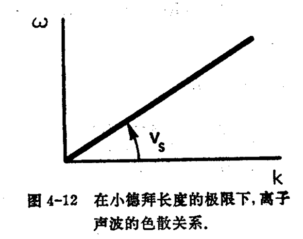

# 等离子体中的波

## 波的表示

利用傅里叶分析可以将任一流体的周期性运动表述成不同频率$\omega$，波长$\lambda$的正弦波的叠加，任何振荡量都能表述成波

在小振幅振荡时，波形一般是正弦，且只有一种频率，考虑这种情况

以密度$n$为例，表述为
$$
n = \bar n e^{i(\vec k\cdot\vec r - \omega t)}
$$
其中，$\vec k$也成为传播常数，波振幅$\bar n$为常数

在笛卡尔坐标系中，
$$
\vec{k} \cdot \vec{r}=k_{x} x+k_{y} y+k_{z} z
$$

对于有衰减的情况，
$$
n = \bar n e^{i(\vec k\vec r-\omega t)+pt}
$$
指数上的非虚数部分表示阻尼（衰减）

可以将波重新写作
$$
n = \bar n e^{i(\vec k\vec r-\omega t)+pt} 
= \bar ne^{pt} e^{i(\vec k\vec r-\omega t)}
=\bar n_c e^{i(\vec k\vec r-\omega t)}
$$
$\bar n_c$为复振幅，可以消除下标$c$以表示一般形式

再考虑电场$\vec E$，$\delta$表示与密度相位不同
$$
\vec E = \bar E e^{i(kx - \omega t +\delta)}
$$
同样，假定任何振幅都是复振幅，
$$
g_{1}=g_{1} \exp [i(\vec{k} \cdot \vec{r}-\omega t)]
$$
其中，$g_1$既指复振幅，又指整个表达式

### 相速度

在波上，恒定相位的点是运动的，

可以理解为，波函数上，有一个点沿着波函数向前运动，对于这个点的相位有，$\frac{d}{dt}(kx -\omega t) = 0$，因此可以定义这个点在的速度为相速度
$$
\frac{d x}{d t}=\frac{\omega}{k} \equiv v_{\phi}
$$
若，$\omega/k>0$，则波向右运动，为保证相位不变，$x$随$t$增加而增加

若，$\omega/k<0$，则波向左运动，

- 相速度可以超光速，无限大的相速度对应于无限长的正弦波，不传递任何信息

### 群速度

考虑两束波
$$
\begin{array}{l}E_{1}=E_{0} \cos \left(k_{1} x-\omega_{1} t\right)=E_{0} \cos [(k+\Delta k) x-(\omega+\Delta \omega) t] \\ E_{2}=E_{0} \cos \left(k_{2} x-\omega_{2} t\right)=E_{0} \cos [(k-\Delta k) x-(\omega-\Delta \omega) t]\end{array}
$$
其中，$k_{1}=k+\Delta k, \quad k_{2}=k-\Delta k, \quad \omega_{1}=\omega+\Delta \omega, \quad \omega_{2}=\omega+\Delta \omega$

每束波都有其相速度
$$
v_{\varphi 1} = \frac{\omega+\Delta\omega}{k+\Delta k}
\qquad
v_{\varphi 2} = \frac{\omega-\Delta\omega}{k-\Delta k}
$$
利用和差化积公式，有
$$
\begin{aligned} E=& E_{1}+E_{2} \\=& E_{0}\{\cos (k x-\omega t) \cos [(\Delta k) x-(\Delta \omega) t]\\ &-\sin (k x-\omega t) \sin [(\Delta k) x-(\Delta \omega) t] \\ &+\cos (k x-\omega t) \cos [(\Delta k) x-(\Delta \omega) t] \\ &+\sin (k x-\omega t) \sin [(\Delta k) x-(\Delta \omega) t]\} \\=& 2 E_{0} \cos{ [(\Delta k) x-(\Delta \omega) t]} \cos (k x-\omega t) \end{aligned}
$$
为一正弦调制波，

携带波信息的是波的包络线：$2E_0 \cos{(\Delta kx-\Delta\omega t)}$

其传播速度：$\frac{dx}{dt} = \frac{\Delta \omega}{\Delta k}$

取$\Delta\omega \rightarrow 0$，有群速度
$$
v_g = \frac{d\omega}{dk}
$$
该速度不能超越光速$c$

## 等离子体振荡

等离子体中的电子围绕离子本底高频振荡，这个振荡称为等离子体频率

作以下假定

1. 不存在磁场
2. 不存在热运动，$kT = 0$
3. 离子以均匀分布固定在空间中
4. 等离子体的大小为无限大
5. 电子仅在$x$方向运动

有
$$
\begin{array}{l}\nabla=\hat{x} \partial / \partial x \\ \vec{E}=E \hat{x} \\ \nabla \times \vec{E}=0 \\ \vec{E}=-\nabla \phi\end{array}
$$
仅发生静电振荡

有电子运动方程、连续性方程和泊松方程
$$
\left\{\begin{align}
&m n_{e}\left[\frac{\partial v_{e}}{\partial t}+\left(v_{e} \cdot \nabla\right) v_{e}\right]=-e n_{e} \vec{E} \tag{4.1}\label{eq1}
\\
&\frac{\partial n_{e}}{\partial t}+\nabla \cdot\left(n_{e} v_{e}\right)=0  \tag{4.2} \label{eq2}
\\
&\nabla \cdot \vec{E}=\partial \vec{E} / \partial x=4 \pi e\left(n_{i}-n_{e}\right)  \tag{4.3}\label{eq3}
\end{align}\right.
$$

> 对于静电场，仅考虑麦克斯韦方程组中的泊松方程即可
>
> 由于不存在热运动，导致不考虑压力项❓

### 采用线性化方法求解方程组

> 线性化就是指振荡的振幅是小量，而且由于高阶项更小能够忽略包含高阶振幅因子的项。

将因变量表示为微扰形式
$$
n_e = n_0+n_1
\\
v_e = v_0 + v_1
\\
\vec E = \vec E_0 + \vec E_1
$$
其中，平衡位置处参数为0阶近似，振荡参数为一阶微扰

由于离子本底固定，平衡位置处参数是常数，即
$$
\begin{array}{l}\nabla n_{0}=v_{0}=\vec{E}_{0}=0 \\ \frac{\partial n_{0}}{\partial t}=\frac{\partial v_{0}}{\partial t}=\frac{\partial E_{0}}{\partial t}=0\end{array}
\label{eq14}
$$
> 平衡位置处，
>
> 显然，$v_0 = 0, \quad E_0 = 0$
>
> 又因为不存在热运动，因此本底数密度是均匀的，故$\nabla n_0 = 0$，$n_1$的振动是由电场引起的，因此热运动存在与否不影响$n_1$的存在
>
> 平衡位置处参数不随时间变化

将上述表示带入$\eqref{eq1}$有
$$
m\left[\frac{\partial v_{1}}{\partial t}+\left(v_{1}\nabla  \right)^{0} v_{1}\right]=-e E_{1}
$$
其中，$(v_1\nabla)v_1$的振幅是$v_1$振幅的二次项，因此可以忽略该项

> 这一忽略要求$|v_1|$足够小，即为一微扰

有
$$
m\left[\frac{\partial v_{1}}{\partial t} \right]=-e E_{1} \tag{4.4}\label{eq4}
$$
带入$\eqref{eq2}$有
$$
\begin{align}
&\frac{\partial n_{1}}{\partial t}+\nabla \cdot\left(n_{0} v_{1}+n_{1} v_{1}^{0}\right)=0 
\\
&\frac{\partial n_{1}}{\partial t}+n_{0} \nabla \cdot v_{1}+v_{1} \cdot {\nabla \cdot \bar{n}_0}^{0}=0
\\
&\frac{\partial n_{1}}{\partial t}+n_{0} \nabla \cdot v_{1}=0
\tag{4.5}\label{eq5}
\end{align}
$$
对于方程$\eqref{eq3}$，有$n_{i1} = 0$，因此
$$
\begin{align} 
&\nabla (E_0 + E_1) = 4 \pi e(n_{i0}+n_{i1}-n_{e0}-n_{e1})
\\&\qquad\qquad\downarrow\\
&\nabla \cdot E_{1}=-4 \pi e n_{1}\tag{4.6}\label{eq6}
\end{align}
$$

> 因为离子没有微扰，1的下标默认都是电子参数的

假定振荡微扰为正弦振荡（小振幅情况）
$$
\begin{array}{l}\vec{v}_{1}=v_{1} e^{i(k x-\omega t)} \hat{x} \\ n_{1}=n_{1} e^{i(k x-\omega t)} \\ \vec{E}=E e^{i(k x-\omega t)} \hat{x}\end{array}
$$
对$\eqref{eq4}-\eqref{eq6}$进行傅里叶变换有，

> $-i\omega\rightarrow\frac{\partial }{\partial t}$
>
> $ik\rightarrow \nabla$

$$
\begin{array}{l}-i m \omega v_{1}=-e E_{1} \\ -i \omega n_{1}=-n_{0} i k v_{1} \\ i k E_{1}=-4 \pi e n_{1}\end{array}
\label{eq21}
$$

后两式合并到第一式有
$$
-i m \omega v_{1}=-e \frac{-4 \pi e}{i k} \frac{-n_{0} i k v_{1}}{-i \omega}=-i \frac{4 \pi n_{0} e^{2}}{\omega} v_{1}
$$
若$v_2\ne 0$， 则要求
$$
\omega^{2}=4 \pi n_{0} e^{2} / m
$$
即**等离子体频率**
$$
\omega_{p}=\left(\frac{4 \pi n_{0} e^{2}}{m}\right)^{\frac{1}{2}}
\label{eq24}
$$

- 该频率仅取决于等离子体密度，由于粒子质量小，等离子体频率通常很高，若$n = 10^{12}cm^{-3}\rightarrow \omega_p = 10^{10}\mathrm{hz}$

- 该频率与$k$无关，因此群速度$\frac{d\omega}{dk} = 0$
- 利用该式还可以反求密度，获得等离子体的临界密度

## 电子等离子体波

考虑热运动后，电子将通过热运动流入等离子体邻近层的电子，导致动量传递，这种等离子体振荡称为等离子体波

此时，运动方程需要考虑压力项
$$
\left\{\begin{align}
&m n_{e}\left[\frac{\partial v_{e}}{\partial t}+\left(v_{e} \cdot \nabla\right) v_{e}\right]=-e n_{e} \vec{E} +\nabla p_e \tag{4.7}
\label{eq4.7}
\\
&\frac{\partial n_{e}}{\partial t}+\nabla \cdot\left(n_{e} v_{e}\right)=0  \tag{4.8}
\label{eq4.8}
\\
&\nabla \cdot \vec{E}=\partial \vec{E} / \partial x=4 \pi e\left(n_{i}-n_{e}\right)  \tag{4.9}
\label{eq4.9}
\end{align}\right.
$$
且有一维绝热状态方程
$$
\nabla p_{e}=3 K T_{e} \nabla n_{e}=3 K T_{e} \nabla\left(n_{0}+n_{1}\right)=3 k T_{e} \frac{\partial n_{1}}{\partial x} \hat{x}
$$
运动方程线性化为
$$
m n_{0} \frac{\partial v_{1}}{\partial t}=-e n_{0} E_{1}-3 k T_{e} \frac{\partial n_{1}}{\partial x}
$$
由小振幅假设，假定振荡微扰为正弦振荡（小振幅情况）
$$
\begin{array}{l}\vec{v}_{1}=v_{1} e^{i(k x-\omega t)} \hat{x} \\ n_{1}=n_{1} e^{i(k x-\omega t)} \\ \vec{E}=E e^{i(k x-\omega t)} \hat{x}\end{array}
$$
并傅里叶变换得到运动方程
$$
-i m \omega n_{0} v_{1}=-e n_{0} E_{1}-3 k T_{e} i k n_{1}
$$
有
$$
\begin{array}{l}
im\omega_{0} v_{1}=\left[e n_{0}\left(\frac{-4 \pi e}{i k}\right)+3 k T_{e} i k\right] \frac{n_{0} i k}{i \omega} v_{1} \\ \omega^{2} v_{1}=\left(\frac{4 \pi n_{0} e^{2}}{m}+\frac{3 k T_{e}}{m} k^{2}\right) v_{1} \\ \omega^{2}=\omega_{p}^{2}+\frac{3}{2} k^{2} v_{t h}^{2}\end{array}
\label{eq29}
$$
其中，热运动速度$v_{th}^2 = \frac{2kT_e}{m}$

- 该情况下，等离子体振荡频率正比于$k$，因为$k = 1/\lambda$，等离子体波长存在最在下限德拜波长$\lambda_D$，因此群速度不能超光速❓
- $v_{g}=\frac{d \omega}{d k}=\frac{3}{2} \frac{k}{\omega} v_{t h}^{2}=\frac{3}{2} \frac{v_{t h}^{2}}{v_{\phi}}$
- 群速度为该曲线的斜率，相速度为曲线上一点和原点连线的斜率，可见群速度总小于$\frac{3}{2}^{1/2}v_{th}$，非相对论情况中，远小于$c$
- 在大的*k*值（小的$\lambda$值）时，信息实质上以热速度传播。在小的k值（大的*$\lambda$*值）时，即使$v_\varphi$大于$v_{th}$ ，信息也以远慢于$v_{th}$ 的速度传播。这是因为在*$\lambda$*大时密度梯度小，热运动几乎不携带什么净动量进入到邻近层中。

## 空气中的声波

普通空气中的声波理论，

忽略粘滞性，这种波可由NS方程描述
$$
\rho\left[\frac{\partial \vec{v}}{\partial t}+(\vec{v} \cdot \nabla) \vec{v}\right]=-\nabla p=-\frac{\gamma p}{\rho} \nabla \rho
\label{eq30}
$$
有连续性方程
$$
\frac{\partial \rho}{\partial t}+\nabla \cdot(\rho \vec{v})=0
\label{eq31}
$$

> 普适NS方程
> $$
> \underbrace{\frac{\partial \vec{v}}{\partial t}}_{①}
> +
> \underbrace{(\vec{v} \cdot \nabla) \vec{v}}_{②}
> =
> \underbrace{\vec{f}}_{③}
> \underbrace{-\frac{1}{\rho} \nabla p}_{④}
> +
> \underbrace{\gamma \nabla^{2} \vec{v}}_{⑤}
> $$
> ①非定常项
> ② 对流项
> ③单位质量流体的体积力
> ④ 单位质量流体的压力差
> ⑤扩散项或粘性力项

对具有均匀$p_0$和$\rho_0$介质的情况，考虑各参数为如下形式的波
$$
\exp [i(\vec{k} \cdot \vec{r}-\omega t)]
$$
即
$$
\rho_1 =  \exp [i(\vec{k} \cdot \vec{r}-\omega t)]
\\
p_1 = \exp [i(\vec{k} \cdot \vec{r}-\omega t)]
\\
\vec v_1 = exp [i(\vec{k} \cdot \vec{r}-\omega t)]
$$
线性化，考虑在稳态平衡点处，本底为$p_0,\quad \rho_0$处，即
$$
p = p_0 + p_1
\\
\rho = \rho_0 + \rho_1
\\
v = v_0 + v_1
$$
其中，$v_0 = 0,\quad $

> 线性化方法，利用$\eqref{eq14}$

代入$\eqref{eq30},\eqref{eq31}$，有

$$
\begin{array}{rl} 
(\rho_0+\rho_1) \left[\frac{\partial v_1}{\partial t} + v_1\nabla v_1\right] &= -\frac{\gamma (p_0+ p_1)}{\rho_0 + \rho_1}\nabla \rho_1
\\
(\rho_0+\rho_1)^2 \frac{\partial v_1}{\partial t} &= -\gamma (p_0+ p_1)\nabla \rho_1
\\
\rho_0^2 \frac{\partial v_1}{\partial t} + \rho_1^2 \frac{\partial v_1}{\partial t} 
+ 2\rho_0\rho_1 \frac{\partial v_1}{\partial t}
&= -\gamma(p_0\nabla\rho_1 + p_1\nabla\rho_1)
\\
\rho_0 \frac{\partial v_1}{\partial t} &= -\gamma p_0\nabla\rho_1
\end{array}
\qquad
\begin{array}{rl} 
\frac{\partial \rho_1}{\partial t} + \nabla\cdot(\rho_0 v_1 + \rho_1 v_1) = 0
\\
\frac{\partial \rho_1}{\partial t} + \nabla\cdot \rho_0 v_1 = 0
\end{array}
$$

> 二阶小项、三阶小项忽略

即，

$$
\begin{array}{l}-i \omega \rho_{0} \vec{v}_{1}=-\frac{\gamma p_{0}}{\rho_{0}} i k \rho_{1} \\ -i \omega \rho_{1}+\rho_{0} i k \cdot \vec{v}_{1}=0\end{array}
$$

两者消去$\rho_1$，可以得到一相速度
$$
\frac{\omega}{k}=\left(\frac{\gamma p_{0}}{\rho_{0}}\right)^{1 / 2}=\left(\frac{\gamma K T}{M}\right)^{1 / 2} \equiv c
\label{eq38}
$$
即，气体中声波速度$c_s$的表达式，

这一波是通过空气间分子碰撞从一层传播到下一层的压力波

在没有中性气体且没有碰撞的等离子体中发生的类似现象，称为离子声波或离子波

## 离子波

无碰撞时，离子间通过电场互相传播振动，使得声波通过电场而传播，

由于离子质量重，因此这是一种低频振荡波

考虑等离子体近似，
$$
n_i = n_e = n
\\\nabla E\ne 0
$$
并且不使用泊松方程

无磁场时，离子的流体方程是
$$
M n\left[\frac{\partial \vec{v}_{i}}{\partial t}+\left(\vec{v}_{i} \cdot \nabla\right) \vec{v}_{i}\right]=e n E-\nabla p=-e n \nabla \phi-\gamma_{i} k T_{i} \nabla n
$$
线性化并假定离子波是平面波
$$
-i \omega M n_{0} v_{i 1}=-e n_{0} i k \phi_{1}-\gamma k T_{i} i k n_{1}
\label{eq41}
$$
对于电子，考虑**平行于$\vec B$的流体漂移**情形，电子质量$m\rightarrow 0$

有结论
$$
n=n_{0} \exp \left(e \varphi / k T_{e}\right)
$$
线性化有
$$
n_e = n = n_0 (1+\frac{e\varphi}{kT_e}+\cdots)
$$
记电子及离子密度扰动
$$
n_1 = n_0 \frac{e\varphi}{kT_e}
\label{eq44}
$$
因此，线性化的离子连续性方程可变化得到
$$
\begin{array}{c}
i \omega n_{1}=n_{0} i k v_{i 1} 
\\\downarrow\\
\end{array}
\label{eq45}
$$

$$
\frac{\omega}{k}=\left(\frac{k T_{e}+\gamma_{i} k T_{i}}{M}\right)^{1 / 2} \equiv v_{s}
\label{eq46}
$$

即，离子声波的色散关系，其中，$v_s$为等离子体中的声速

在电子等离子体振荡中，其他种粒子（即离子）实质上保持固定。在离子声波中，共他种粒子（即电子）就远不是固定的；事实上，电子随离子一起被拉动并趋向于屏蔽由离子的聚集而产生的电场。

正像在普通声波中一样，离子形成压缩区和稀疏区，压缩区由于以下两个原因趋向于向稀疏区扩展。

- 第一个原因，离子热运动使离子扩展；这个效应引起$\eqref{eq46}$式平方根中的第二项。
- 第二个原因，离子的聚集带正电荷，由于产生的电场而趋向于分散。这个电场受到电子很强的屏蔽，仅仅只有正比于$kT_e$的一部分电场作用在聚集的离子上，这个效应引起了$\eqref{eq46}$式平方根中的第一项。由于离子本身的惯性，使它的扩展运动超过平衡位置，压缩和稀疏被再生而形成波。

上面提到的第二个效应引起了异常的现象。当$kT_i = 0$时，离子波仍然存在。

这种现象在中性气体中并不发生$\eqref{eq38}$，此时，离子声速
$$
v_s = \left(\frac{kT_e}{M}\right)^{1/2}
$$
此时，声速取决电子温度（因为电场正比于电子温度）和离子质量（因为流体的惯性正比于离子质量）。这种现象常常能在实验室等离子体中观察到，在那里，通常出现$T_i \ll T_e$的条件。

### 等离子体近似的有效性

在离子波推导中，用到等离子体近似条件中的中性条件，$n_i = n_e$，但对$E$不做要求，

为研究这过程中产生的误差，令$n_i,n_e$不同，考虑线性化的泊松方程
$$
\nabla\cdot E = k^2\varphi = 4\pi e(n_{i1}-n_{e1})
$$
电子密度由线性化玻尔兹曼关系$\eqref{eq44}$给出
$$
n_{e1} = n_0 \frac{e\varphi}{K T_e}
$$
离子密度由线性化离子连续性方程$\eqref{eq45}$给出
$$
n_{i1} = \frac{k}{\omega}n_0 v_{i1}
$$
将电子、离子密度代入**线性化的平面波离子流体方程**$\eqref{eq41}$有
$$
\begin{align}{l}-i \omega M n_{0} v_{i 1}=-e n_{0} i k \phi_{1}-\gamma k T_{i} i k n_{\mathrm{il}} \\ \frac{\omega}{k}=\left(\frac{k T_{e}}{M} \frac{1}{1+k^{2} \lambda_{D}^{2}}+\frac{\gamma_{i} k T}{M}\right)^{1 / 2}\end{align}
$$
对比中性条件下推导的离子波色散关系$\eqref{eq46}$，可以发现，差别在于因子$1+k^2\lambda_D^2$

假定$n_i = n_e$导致了$k^2\lambda_D^2 = (2\pi\lambda_D.\lambda)^2$量级的误差，

大多数情况下，$\lambda_D$非常小，因此，除极短波长的波外，等离子体近似都是正确的

### 等离子波和电子波的比较

根据前述讨论，

有电子波色散关系$\eqref{eq29}$
$$
\begin{array}{l}
\omega^{2}=\omega_{p}^{2}+\frac{3}{2} k^{2} v_{t h}^{2}\end{array}
$$
有离子波色散关系$\eqref{eq46}$
$$
\omega^{2}=\frac{k^{2}}{\mathrm{M}}\left(\frac{4 \pi \mathrm{n}_{0} e^{2} \lambda_{D}^{2}}{1+k^{2} \lambda_{D}^{2}}+\gamma_{i} k T_{i}\right)
$$
考虑这两种波满足$k^2\lambda_D^2 \gg 1$，且取了$T_i\rightarrow 0$极限，，则$\eqref{eq46}$化为
$$
\omega^{2}=k^{2} \frac{4 \pi n_{0} e^{2}}{M k^{2}}=\frac{4 \pi n_{0} e^{2}}{M} \equiv \Omega_{p}^{2}
$$
此时，$\Omega_p$为离子等离子体频率

有色散关系如下

对于高频波（短波），离子声波转变为恒频波

对于低频波（长波），电子等离子体波是恒频的，

可以发现，电子等离子体波和离子生变之间存在一种互补性状，前者基本上是恒频的，但在大的k值时变成恒速的；而后者基本上是恒速的，但在大的k值时变成恒频的

## 垂直于$\vec B$的静电电子振荡

前述的等离子体振荡中假定了$\vec B = 0$

但当存在磁场时，波的形式更下复杂，我们考虑一种最简单情况

从垂直于磁场传播的高频、静电电子振荡着手

有几个定义

- 平行和垂直将被用来表示$\vec k$相对于未扰动磁$\vec B_0$场的方向。
- 纵向和横向是指$\vec k$相对于振荡电场$\vec E_1$的方向。
- 如果振荡磁场$\vec B_1$是零，波是静电波；否则，就是电磁波。

对于垂直于$\vec B_0$的电子振荡，假定

- 离子太重以至于不能以所包含的频率运动，形成一固定，均匀的正电荷本底，即，$n_{i0} = n_{e0},\quad n_{i1} = 0$
- 忽略热运动，令$kT_e = 0$，即不考虑压力项

有电子运动的线性化方程$\eqref{eq4.7},\eqref{eq4.8},\eqref{eq4.9}$简化为

> 并考虑磁场

$$
\begin{align}
&m \frac{\partial v_{e 1}}{\partial t}=-e\left(E_{1}+v_{e 1} \times B_{0}\right) 
\label{eq56}
\\
&\frac{\partial n_{e 1}}{\partial t}+n_{0} \nabla \cdot v_{e 1}=0
\label{eq57}
\\
&\nabla \cdot E_{1}=-4 \pi e n_{e 1}
\label{eq58}
\end{align}
$$

只考虑$k / / E_{1}$的纵波，选择$\vec k,\quad \vec E_1$平行于$x$轴，其他如下图所示

> 这样无损于普遍性

去掉下标$1,e$，$\eqref{eq56}$有分量形式
$$
\begin{align}
-i \omega m v_{x} &=-e E-e v_{y} B_{0} 
\\
-i \omega m v_{y} &=e v_{x} B_{0} 
\\
-i \omega m v_{z} &=0 \end{align}
$$
联立得到
$$
v_{x}=\frac{e E / i m \omega}{1-\omega_{c}^{2} / \omega^{2}}
\label{eq62}
$$
$\eqref{eq57}$线性化有
$$
-i\omega n_1 + n_0 ikv_{e1} = 0
\\\downarrow\\
n_{1}=\frac{k}{\omega} n_{0} v_{x}
\label{eq63}
$$
$\eqref{eq58}$线性化有
$$
ik E_1 = \frac{k}{\omega} n_0 v_x
\label{eq64}
$$
联立$\eqref{eq62},\eqref{eq63},\eqref{eq64}$，有
$$
E = \frac{4\pi e^2 n_0}{\omega^2 m}\cdot\frac{1}{1-\omega_c^2/\omega^2}\cdot E
$$
另由于$\eqref{eq24}$，有
$$
\left(1-\frac{\omega_{c}^{2}}{\omega^{2}}\right) E=\frac{\omega_{p}^{2}}{\omega^{2}} E
$$
有色散关系
$$
\omega^{2}=\omega_{p}^{2}+\omega_{c}^{2} \equiv \omega_{h}^{2}
\label{eq67}
$$
$\omega_h$称为上杂化频率（upper hybrid frequency），

穿过磁场$\vec B$传播的静电电子波具有这一频率，

而沿着$\vec B$传播的那些波是$\omega = \omega_p$的通常等离子体振荡

> 即沿着$z$方向，传播的
>
> TODO

### 物理图像

上杂化频率对应的振荡如上图所示，

同等离子体振荡，平面波中的电子形成压缩和稀疏区，

再由于$\vec B$垂直于运动，有洛伦兹力作用使轨道变为椭圆

作用再电子上的恢复力为静电力和洛伦兹力，

当磁场趋于0时，$\eqref{eq67}$中的$\omega_c\rightarrow 0$，变为等离子体振荡

当等离子体密度趋于0时，$\omega_p\rightarrow 0$，静电力趋于消失，称为一拉莫尔回转

## $\vec B_0=0$的电磁波

考虑$\vec B_1\ne 0$的波

横向电磁波，通过等离子体传播的光波或无线电波

**对于真空中的光波**

真空中$j =0\quad \varepsilon = \mu  = 1$，并有麦克斯韦方程
$$
\begin{align}\nabla \times E_{1}=-\dot{B}_{1} 
\label{eq68}
\\
c^{2} \nabla \times B_{1}=\dot{E}_{1}
\label{eq69}
\end{align}
$$
有色散关系
$$
\omega^{2}=k^{2} c^{2}
\label{eq70}
$$
**在$\vec B_0 = 0$的等离子体中**

$\eqref{eq68}$不变，

$\eqref{eq69}$要考虑一阶带电粒子运动引起的电流，有
$$
c^2(\nabla\times B_1) = 4\pi j_1 + \dot{E}_{1}
$$
该式对时间微商有

$$
c^{2}\left(\nabla \times \dot{B}_{1}\right)=4 \pi \frac{\partial j_{1}}{\partial t}+\ddot{E}_{1}
\label{eq72}
$$
而方程$\eqref{eq68}$的旋度为
$$
\begin{array}{l}\nabla \times\left(\nabla \times E_{1}\right)=\nabla\left(\nabla \cdot E_{1}\right)-\nabla^{2} E_{1}  =-\nabla \times \dot{B}_{1}\end{array}
\label{eq73}
$$
联立$\eqref{eq72},\eqref{eq73}$，消去$\nabla\times \dot{B}_1$，并假设波有$\exp[i(\vec k\vec r-\omega t)]$关系，有
$$
-k\left(k \cdot E_{1}\right)+k^{2} E_{1}=\frac{4 \pi i \omega}{c^{2}} j_{1}+\frac{\omega^{2}}{c^{2}} E_{1}
$$
由于横波$\vec k\cdot \vec E = 0$，所以上式变为
$$
\left(\omega^{2}-c^{2} k^{2}\right) E_{1}=-4 \pi i \omega j_{1}
\label{eq75}
$$
考虑光波或微波，其频率很高，可以认为离子固定，于是电流完全来自电子运动，即
$$
j_1 = -n_0 ev_{e1}
$$
根据线性化电子方程$\eqref{eq56},\eqref{eq57},\eqref{eq58}$，取$kT_e = 0$，有
$$
\begin{array}{l}m \frac{\partial v_{e 1}}{\partial t}=-e E \\ v_{e 1}=\frac{e E_{1}}{i m \omega}\end{array}
$$
代入方程$\eqref{eq75}$，有
$$
\left(\omega^{2}-c^{2} k^{2}\right) E_{1}=4 \pi i \omega n_{0} e \frac{e E_{1}}{i m \omega}=\frac{4 \pi n_{0} e^{2}}{m} E_{1}
$$
上式右侧项认为时$\omega_p$，有
$$
\omega^{2}=\omega_{p}^{2}+c^{2} k^{2}
\label{eq79}
$$
得到，在没有直流磁场的等离子体中传播的电磁波的色散关系

比较$\eqref{eq70}$和$\eqref{eq79}$，真空中色散关系被描述等离子体振荡的$\omega_p^2$项修改

等离子体中光波的相速度大于光速
$$
v_{\phi}^{2}=\frac{\omega^{2}}{k^{2}}=c^{2}+\frac{\omega_{p}^{2}}{k^{2}}>c^{2}
$$
但根据方程$\eqref{eq79}$，可以知道群速度不能超光速
$$
\frac{\dd\omega}{\dd k} = v_g = \frac{c^2}{v_\phi}
$$

${v_{\phi}}$ 总是大于 ${\mathrm{C}}$ ，所以 ${v_{g}}$ 小于 $c$。色散关系如上图所示。这个图与等离子体波的色散关系相似，

但是色散关系实际上是非常不同的，因为上图中的渐近速度c远远大于等离子体波的色散关系图的热速度 ${v_{t h }}$。

重要的是在波阻尼上存在差别。具有大的 ${k v_{t h}}$ 等离子 体波被高度阻尼，这点我们将从第七章的动力学理论中得到。另一方面，在大的 $k c$ 时，电磁波变成普 通的光波，而在这种极限下，它不因等离子体的存在而阻尼。

类似于方程$\eqref{eq79}$的色散关系显示出一种称做截止 (cutoff) 的现象。

如果我们通过等离 子体发送一个给定频率 ${\omega}$ 的微波束，在等离子体中的波长 ${2 \pi / k}$ 将取方程$\eqref{eq79}$所规定的值。 当增加等离子体密度，也就是 ${\omega_{p}^{2}}$ 升时， ${k^{2}}$ 必定会减少，波长变得越来越长。最后，将达到 使 ${k^{2}}$ 为零的密度。对大于这个值的密度，方程$\eqref{eq79}$对任何实数 ${k}$ 都不能满足，波不能传 播。这个截止条件发生在 ${\omega=\omega_{p}}$ 的临界密度 ${n_{c}}$ ，也就是从方程$\eqref{eq24}$得到
$$
n_{c}=m \omega^{2} / 4 \pi e^{2}
$$
如果 ${n}$ 太大或 ${\omega}$ 太小，一个电磁波不能通过等离子体。当这种情况发生时，方程$\eqref{eq79}$告诉我们 ${k}$ 是虚数:
$$
{
c k=\left(\omega^{2}-\omega_{p}^{2}\right)^{1 / 2}=i\left|\omega_{p}^{2}-\omega^{2}\right|^{1 / 2}
}
$$
由于波有空间的依赖性 ${\exp (i k x)}$ ，如果 ${k}$ 们是虚数，它将指数衰减。趋肤深度 ${\delta}$ 可按如下方法得到:
$$
{
e^{i k x}=e^{-|k| x}=e^{-x / \delta}, \delta=|k|^{-1}=\frac{c}{\left(\omega_{p}^{2}-\omega^{2}\right)^{1 / 2}}(4-90)
}
$$
对大多数实验室等离子体，截止频率处于微波区域。

