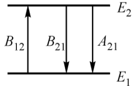
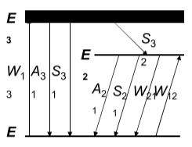

# 第一章总结

## 激光

- 特点：高亮度、方向性、单色性、相干性

## 描述光子态

- 光波模式
  - 光波矢量数：$\frac{1}{8} \times 4 \pi \mathrm{k}^{2} \mathrm{d} \mathrm{k} \times \mathrm{V} / \pi^{3}=\frac{4 \pi \mathrm{v}^{2} \mathrm{d} v}{\mathrm{c}^{3}} V$
  - 光波模式数：$2\times 光波矢量数 =\frac{8 \pi v^{2} d v}{c^{3}} V $
  - 模密度（单位体积、单位频率间隔的模式数）：$\frac{8\pi v^2}{c^3}$
- 光子态
  - 相格内不可分，为同一个态，	
  - $\Delta x \Delta y \Delta z \Delta P_{x} \Delta P_{y} \Delta P_{z} \approx h^{3}$为一相格

- 光波模式和光子态的等效性
  - 一个光波模式在相空间占有一个相格
  - 一个光波模式等效于一个光子态

## 光子的相干性

- 时间相干性——频率相干性
  - 描述的是光波场在某一空间，不同时刻光波场之间的相干性（来源于光子发光的间断性）
  - 本质上是由原子发射波列长度有限造成的
  - 允许的最大光程差其实就是波列的长度
  - $L_c = \tau _c X_{c}$,波列越长、相干时间$\tau _e$越长，频谱线宽$\Delta v\approx \frac{1}{\tau_e}$越小，光束的相干性就越好，单色性越好

- 空间相干性

  - 描述的是光波场中不同点，在同一时刻的相关性（此相干性来源于光波中不同原子发光的独立性）
  - 物理意义：如果要求传播方向限于张角$\Delta \theta$之内的光波是相干的，则光源的面积必须小于$\left( \frac{\lambda}{\Delta \theta} \right)^2$；或者说，只有从面积小于$\left( \frac{\lambda}{\Delta \theta} \right)^2$的光源面上发出的光波才能保证张角在$\Delta \theta$之内的双缝内具有相干性

  - 相干体积 = 相干面积 X 相干长度；$V_{c s}=\left(\frac{\lambda}{\Delta \theta}\right)^{2} \frac{c}{\Delta v}=\frac{c^{3}}{v^{2} \Delta v(\Delta \theta)^{2}}$

- 相干性的重要结论
  - 相格的空间体积以及一个光波模或光子态占有的空间体积都等于相干体积
  - 属于同一状态的光子或同一模式的光波是相干的。不同状态的光子或不6同模式的光波是不相干的
  - 处于同一光子态的光子数称为光子简并度
  - 光子简并度、同态光子数、同一模式内的光子数，处于相干体积内的光子数、处于同一相格内的光子数都是一回事

## 自发辐射、受激吸收和受激发射

- 自发辐射：处于激发态的原子在没有外场作用下，自发跃迁到低能级上，并以电磁波的形式释出能量的过程。即成为自发辐射或自发发射
  - 条件：是原子在不受外界辐射场控制的情况下自发过程
  - 特点：各粒子自发、独立地发射的光子各光子的方向、偏振、初相等状态时无规的，独立的，粒子体系为非相干光源（普通光源）
  - 概率：自发辐射爱因斯坦系数：$\left(\frac{\mathbf{d n}_{2}}{\mathbf{d t}}\right)_{s p}=-\mathbf{A}_{21} \mathbf{n}_{2}$
    - 物理意义：粒子从$E_2$能级向$E_1$能级自发辐射的几率
    - 自发辐射寿命：$\tau_{s}=1 / A_{21}$，$\tau_{s} \rightarrow \infty$称为稳态，$\tau_s$称为亚稳态，激光产生需要亚稳态，可实现粒子数反转

- 受激吸收：处于低能级$E_1$的粒子，受到$hv=E_2-E_1$光子的照射而吸收该光子的能量，跃迁到高能级$E_2$，这种过程称为受激吸收
  - 概率：受激吸收跃迁几率  $\mathrm{W}_{12}=\mathrm{B}_{12} \rho(\mathrm{v})=-\frac{1}{\mathrm{n}_{1}} \frac{\mathrm{dn}_{1}}{\mathrm{dt}}$
    - $W_{12}$不仅与特定的跃迁有关，而且与外场强度有关
    - $\rho (v)$为外电磁场能量密度
    - $B_{12}$为爱因斯坦受激吸收系数，是能级结构的特征量，与由不同原子不同跃迁而定

- 受激发射：处于高能级$E_2$的粒子，受到能量恰为$hv = E_2 - E_1$的光子的激励，发射出于入射光子相同的一个光子而跃迁到低能级$E_1$
  - 概率：$\left(\frac{d n_{2}}{d t}\right)_{s t}=-W_{21} n_{2} \quad W_{21}=B_{21} \rho(v)$
    - $W_{21}$物理意义：单位时间内，在外来单色能量密度为$\rho(v)$的光照射下，由于$E_1,E_2$间发生受激跃迁，$E_2$能级上减少的粒子数占$E_2$能级总粒子数$n_2$的百分比；也即$E_2$能级上每一个粒子单位时间内发生受激发射的几率
    - 当$B_{21}$一定，外来光的单色能量密度$\rho(v)$愈大，受激发射几率$W_{21}$就愈大
  - 特点：
    - 受激发射只能在频率满足$hv=E_2-E_1$的光的自激励下发生
    - 不同粒子发射的光子与入射光子的频率、位相、偏振等状态相同；这样，光场中相同光子数目增加，光强增大，即入射光被放大（同一量子态）——光放大过程
    - 受激发射的粒子系统是相干光源，相干光子数目不断增加而导致激光四个特点

- 爱因斯坦关系式：$A_{21} n_{2}+B_{21} \rho(v) n_{2}=B_{12} \rho(v) n_{1}$

  - 设$E_1$能级为$g_1$重简并，$E_2$为$g_2$重简并，改写为$\begin{array}{l}B_{21} g_{2}=B_{12} g_{1} \\ \frac{A_{21}}{B_{21}}=\frac{8 \pi h v^{3}}{c^{3}}\end{array}$

    - 当能级非简并即$g_1 = g_2 = 1$或者简并度相同即$g_1=g_2$时，有$B_{21} = B_{12}$

    - ❓对于同一个辐射场，$\rho(v)$有$W_{12}=B_{12}\rho(v), W_{21}=B_{21}\rho(v)$，则$W_{12}=W_{21}$

      因此，单位时间内受激辐射的原子数：$\mathbf{w}_{12}=-\frac{1}{n_{1}} \frac{\mathrm{dn}_{1}}{\mathrm{dt}} $，单位时间内受激吸收的原子数$\mathrm{w}_{21}=-\frac{1}{\mathrm{n}_{2}} \frac{\mathrm{dn}_{2}}{\mathrm{dt}}$，对于相同的$dt$，$W_{12}=W_{21}$而$n_1>>n_2$则$dn_2 << dn_1$

      因此，一般热平衡情况况下，物质的受激辐射总是被受激吸收所掩盖，未能观测到

- 总结

  - 三个系数只与粒子能级结构有关
  - 概率$A_{21}$与外场无关，$W_{12}、W_{21}$与外场$\rho(v)$有关

## 光的受激辐射放大

- 产生激光的两大条件（可以产生受激辐射）

  1. 泵浦或抽运
     - 只有抽运、泵浦，才能实现能级之间的粒子数发转、产生增益，形成激光；但抽运（泵浦）是产生粒子数反转、产生激光的必要条件，而不是充分条件❓

  2. 增益介质

- 增益介质能级结构

  - 二能级结构

    - 

    - 热平衡时（即稳定时），$E_1,E_2$能级粒子数保持不变，变化率为0
      $$
      \begin{array}{l}\frac{\mathrm{dn}_{2}}{\mathrm{dt}}=\mathrm{W}\left(\mathrm{n}_{1}-\mathrm{n}_{2}\right)-\mathrm{A}_{21} \mathrm{n}_{2}=0 \\ \frac{\mathrm{dn}_{1}}{\mathrm{dt}}=\mathrm{W}\left(\mathrm{n}_{2}-\mathrm{n}_{1}\right)+\mathrm{A}_{21} \mathrm{n}_{2}=0\end{array}
      
      \quad
      \Rightarrow
      \quad
      
      \frac{\mathbf{n}_{2}}{\mathbf{n}_{1}}=\frac{\mathbf{W}}{\mathbf{W}+\mathbf{A}_{21}}
      $$
      所以稳定时，$E_1$能级受激吸收原子数始终多于$E_2$能级受激吸收原子数，二能级始终不能实现粒子数反转

      原因：两个能级之间的W相同，上能级还存在一个自发辐射$A_{21}$

  - 三能级结构

    - 

    - 速率方程
      $$
      \begin{array}{l}\frac{\mathrm{dn}_{3}}{\mathrm{dt}}=\mathrm{W}_{13} \mathrm{n}_{1}-\mathrm{A}_{31} \mathrm{n}_{3}-\mathrm{S}_{32} \mathrm{n}_{3}-\mathrm{S}_{31} \mathrm{n}_{3} \\ \frac{\mathrm{dn}_{2}}{\mathrm{dt}}=W_{12} \mathrm{n}_{1}+\mathrm{S}_{32} \mathrm{n}_{3}-\mathrm{A}_{21} \mathrm{n}_{2}-\mathrm{S}_{21} \mathrm{n}_{2}-\mathrm{W}_{21} \mathrm{n}_{2}\end{array}
      $$
      稳态时，$\frac{\mathrm{dn}_{3}}{\mathrm{dt}}=\frac{\mathrm{dn}_{2}}{\mathrm{dt}}=0 \quad \mathrm{A}_{31} \approx 0 \quad \mathrm{S}_{31} \approx 0 \quad \mathrm{S}_{21} \approx 0 ❓$

      形成亚稳态，$\frac{\mathrm{n}_{2}}{\mathrm{n}_{1}}=\frac{\mathrm{W}_{13}+\mathrm{W}_{12}}{\mathrm{A}_{21}+\mathrm{W}_{21}}$，

      因此只要抽运的足够快，$W_{13}>A_{21}$就可以实现$E_2,E_1$的粒子数反转

- 开放的光学谐振腔
  1. 提供正反馈
  2. 选择光模式