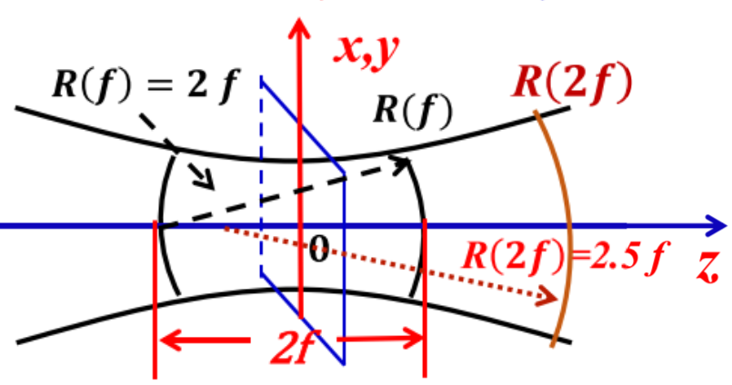
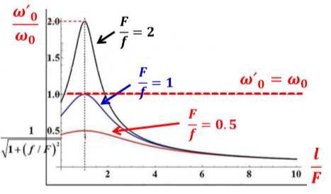

# 第二章总结

## 光腔的一般问题

- 腔的分类
  1. 开放式光学谐振腔（几何损耗高，稳定腔、非稳腔、介稳腔）
  2. 闭腔（也称介质波导腔，主要有半导体、光纤）
  3. 气体波导腔

- 腔的模式
  - 表示方法：$TEM_{mnq}$，mn表示横模指数，q表示纵模指数（频率）
    - $TEM_{00}$为基模，只要不是连在一起的都是高阶模

## 球面腔的稳定性条件

腔的稳定性的判断

告诉你一个腔型，判断是不是稳定稳定

- 参数选择

  - 对于球面镜的曲率半径：$R=2f$

  - 对于腔内面凹面镜R取正，对于凸面镜R取负

  ❓平面镜曲率半径正负，二次腔长

- ⭐共轴球面腔的稳定性条件

  - 何为稳定？傍轴光线经过腔内多次往返不会横向逸出腔外

  - 往返一次矩阵表示为
    $$
    \left[\begin{array}{c}r_{5} \\ \theta_{5}\end{array}\right]=\left[\begin{array}{cc}1 & 0 \\ -\frac{2}{R} & 1\end{array}\right]\left[\begin{array}{cc}1 & L \\ 0 & 1\end{array}\right]\left[\begin{array}{cc}1 & 0 \\ -\frac{2}{R} & 1\end{array}\right]\left[\begin{array}{cc}1 & L \\ 0 & 1\end{array}\right]\left[\begin{array}{c}r_{1} \\ \theta_{1}\end{array}\right]=T\left[\begin{array}{c}r_{1} \\ \theta_{1}\end{array}\right]
    
    \\
    
    T=\left[\begin{array}{cc}A & B \\ C & D\end{array}\right]=\left[\begin{array}{cc}1 & 0 \\ -\frac{2}{R} & 1\end{array}\right]\left[\begin{array}{cc}1 & L \\ 0 & 1\end{array}\right]\left[\begin{array}{ccc}1 & 0 \\ -\frac{2}{R} & 1\end{array}\right]\left[\begin{array}{cc}1 & L \\ 0 & 1\end{array}\right]
    
    \\
    
    \begin{array}{ll}\boldsymbol{A}=\mathbf{1}-\frac{\mathbf{2} \boldsymbol{L}}{\boldsymbol{R}_{\mathbf{2}}} & \boldsymbol{B}=\mathbf{2} \boldsymbol{L}\left(\mathbf{1}-\frac{\boldsymbol{L}}{\boldsymbol{R}_{\mathbf{2}}}\right) \\ \boldsymbol{C}=-\left[\frac{\mathbf{2}}{\boldsymbol{R}_{\mathbf{1}}}+\frac{\mathbf{2}}{\boldsymbol{R}_{2}}\left(\mathbf{1}-\frac{\mathbf{2} \boldsymbol{L}}{\boldsymbol{R}_{\mathbf{1}}}\right)\right] & \boldsymbol{D}=-\left[\frac{\mathbf{2} \boldsymbol{L}}{\boldsymbol{R}_{\mathbf{1}}}-\left(\mathbf{1}-\frac{\mathbf{2} \boldsymbol{L}}{\boldsymbol{R}_{\mathbf{1}}}\right)\left(\mathbf{1}-\frac{\mathbf{2} \boldsymbol{L}}{\boldsymbol{R}_{\mathbf{2}}}\right)\right]\end{array}
    $$

  - 往返n次矩阵表示
    $$
    T_{n}=\left[\begin{array}{cc}A & B \\ C & D\end{array}\right]^{n}=\frac{1}{\sin \Phi}\left[\begin{array}{cc}A \sin n \Phi-\sin (n-1) \Phi & B \sin n \Phi \\ \operatorname{csin} n \Phi & D \sin n \Phi-\sin (n-1) \Phi\end{array}\right]=\left[\begin{array}{cc}A_{n} & B_{n} \\ C_{n} & D_{n}\end{array}\right]
    
    \\
    
    \Phi=\arccos \frac{1}{2}(A+D)
    $$
    近轴光纤不逸出腔外（稳定）要求传输矩阵对任意次的往返均保持有限(角度$\Phi$)应为实数，且不能等于$\pi$的整数倍。

  - 普适稳定性条件
    $$
    \begin{aligned} 
    -1<\frac{1}{2}(A&+D)<1
    \\
    A=1-\frac{2 L}{R_{2}}
    &\boldsymbol{\Downarrow}
    D=-\left[\frac{2 L}{R_{1}}-\left(1-\frac{2 L}{R_{1}}\right)\left(1-\frac{2 L}{R_{2}}\right)\right]
    \\
    \mathbf{0}<\left(\mathbf{1}-\frac{\boldsymbol{L}}{\boldsymbol{R}_{1}}\right)&\left(\mathbf{1}-\frac{\boldsymbol{L}}{\boldsymbol{R}_{2}}\right)<\mathbf{1}
    \end{aligned}
    $$
    为两镜共轴球面腔稳定性条件

    令$g_{1}=\left(1-\frac{L}{R_{1}}\right) \quad g_{2}=\left(1-\frac{L}{R_{2}}\right)$得
    $$
    0<g_{1} g_{2}<1
    $$

  - 说明

    - 往返光路的起点选择不一样，将导致往返矩阵的不同，但A+D是一个不变的数值，对于共轴球面腔，下式永远成立

    $$
    \frac{1}{2}(A+D)=1-\frac{2 L}{R_{1}}-\frac{2 L}{R_{2}}-\frac{2 L^{2}}{R_{1} R_{2}}
    $$

- 非稳腔
  $$
  \begin{aligned} 
  \frac{1}{2}(A+D)>1  \quad &or \quad \frac{1}{2}(A+D)<-1
  \\
  g_1g_2>1 \quad  &or \quad g_1g_2<0
  \end{aligned}
  $$

- 临界（介稳）腔-平平腔、共新、对称共焦？？
  $$
  \begin{aligned} 
  \frac{1}{2}(A+D)=1 \quad &or \quad \frac{1}{2}(A+D)=-1
  \\
  g_1g_2>1 \quad &or\quad g_1g_2=0
  \end{aligned}
  $$

## 开腔模式衍射理论分析方法及高斯光束特性

模式怎么形成❓谐振腔里来回走啥的

由反射镜的有限大小导致的衍射损耗将主要决定开腔中激光振荡能量的空间分布

什么是高斯分布❓特点是啥

自再现❓考不考

- 方形镜共焦腔

  光场在镜面上怎么分布，在行波场上怎么分布❓

  光斑大小，等相位面的曲率半径，计算题⭐
  $$
  \begin{array}{l}\omega(z)=\omega_{0} \sqrt{1+\left(\frac{z}{f}\right)^{2}} 
  \\ 
  R\left(z_{0}\right)=\left|z_{0}+\frac{f^{2}}{z_{0}}\right|
  \\
  f=\frac{\pi \omega_{0}^{2}}{\lambda}\end{array}
  $$

  - 振幅分布：不仅在镜面上，在任何一z位置，腔内光波场振幅都是高斯分布
  - z方向上的尺寸
    - z=0时，$\boldsymbol{\omega}(z)=\boldsymbol{\omega}(\boldsymbol{0})=\boldsymbol{\omega}_{0}$最小值，$\omega_0$称之为腔的**束腰半径**
    - z=f时，$\omega(z)=\omega(f)=\omega_{0 \mathrm{s}}=\sqrt{2} \omega_{0}$，$\omega_{0s}$称为镜面上的**光斑半径大小**
  - 瑞利长度
    - 光束从束腰z=0位置传播$z=\pm f$位置时，光斑半径$\omega(z) = \omega(f) =\omega_{0s}=\sqrt{2}\omega_0$，即光斑面积变为束腰处的两倍，这个范围称为**瑞利范围**。从束腰到该处的长度叫做**瑞利长度**，通常用f或$z_0$表示
    - 一般认为高斯光束的瑞丽长度范围内是近似平行的，因此也把瑞利长度称为光准直距离
    - 由$\boldsymbol{f}=\frac{\boldsymbol{\pi} \boldsymbol{\omega}_{0}^{2}}{\lambda}$，得高斯光束得束腰半径$\omega_0$越大，光束的瑞利长度越长，准直距离越长，准直性越好

  - 基模等相位面的分布
    - 
    - $z\rightarrow0$时，$R(z)\rightarrow \infty$，等相位面退化为平面
    - $z \rightarrow \infty$时，$R(z) \rightarrow \infty$，等相位面退化为平面
    - $z=f$时，$R(z)=2f$，说明镜面为等相位面，曲率半径最小
  - 基模的振荡频率
  - 高斯光束基模的远场发散角，计算题⭐
    - 发散角如何表示、清楚

 ## 一般稳定球面腔的模式特征

证明不考，清楚即可

- 两点结论
  1. 任意一个共焦球面腔于无穷多个稳定腔等价
  2. 任一稳定球面腔唯一地等价于某一个共焦腔

不设计算题

## 高斯光束的q参数变换规律

25：40

- q参数

  - ⭐定义q参数满足如下公式：
    $$
    \frac{1}{q(z)}=\frac{1}{R(z)}-i \frac{\lambda}{\pi \omega^{2}(z)}
    $$
    其中
    $$
    \begin{array}{c}\frac{1}{R(z)}=R e\left\{\frac{1}{q(z)}\right\} \\ \frac{1}{\omega^{2}(z)}=-\frac{\pi}{\lambda} I m\left\{\frac{1}{q(z)}\right\}\end{array}
    $$
    以$q_0$表示$q(z=0)$，则$\boldsymbol{R}(\boldsymbol{\theta})=\infty, \boldsymbol{\omega}(\boldsymbol{\theta})=\boldsymbol{\omega}_{0}$
    $$
    \begin{array}{l}\text { I } \\ q_{0}=i \frac{\pi \omega_{0}^{2}}{\lambda}=i f_{1}^{1}\end{array}
    $$

  - q参数变化规律

    - 普通球面腔传播规律
      - 普通球面腔传播规律可统一表示为：$R_{2}=\frac{A R_{1}+B}{C R_{1}+D}$
    - 高斯光束传播规律
      - $q_{2}=\frac{A q_{1}+B}{C q_{1}+D}$
      - q参数也叫做高斯光束的复曲率半径

计算题，q参数得光束特征——光场特性❓❓找找题目 to do

## 高斯光束的聚焦和准直

如何选择器件❓

- 高斯光束的聚焦⭐

  1. $F$一定，$\omega'_0$随$l$变化

     - $F>l$，$\omega_{0}^{\prime 2}$随$l$的减小而减小，当$l=0$时，$\omega'$达到最大值

     - 当$l=0$时，$\omega'$总比$\omega_0$小，无论F多大，都有聚焦效果，且像点位于F以内。若F<<f，可得出F越小，聚焦效果越理想，像点会向焦点移动

     - $F<l$，$\omega_0^{\prime 2}$随$l$的增大而减小，当$l \rightarrow \infty $时，$\omega'_0$达到最小值，$\omega_{0}^{\prime} \rightarrow 0, l^{\prime} \rightarrow F$

     - 当$F<<l$时，可知$l$越大，F越小，聚焦效果越好

     - $F=l$时，$\omega'_0$达到最大值，且$l'=F$

       - 只有当$F<<l$时，才有聚焦效果，$F$足够小，或者$l$足够大 ，半径最大值出现在$F=l$时

         

  2. $l$一定时，$\omega'_0$随F变化

     - $l$一定时，只有当$F<\frac{1}{2}R(l)$时，才有聚焦效果；F越小，聚焦效果越好

- 高斯光束的准直——压缩发散角

  - 单透镜对高斯光束的准直
    - 通过单一透镜，无法将高斯光束变为平面波
    - 在后焦面上$(l=F)$，$\theta'_0$达到极小值，且$F$越大，$\theta'_0$越小，准直效果越好
  - 望远镜系统对高斯光束的准直
    - 因此，可以先对光斑进行预聚焦，然后再放大，F透镜进行准直
    - M越大，$\frac{\omega(l)}{\omega_0}$越大，越有利于准直

## 光束衍射倍率因子-$M^2$因子

- 定义
  $$
  M^2 = \frac{实际传播光束的腰斑半径于远场发散角的乘积}{基模光束的腰斑半径于远场发散角的乘积}
  $$
  为光束质量因子，定义基模的$M^2=1$

  - 在光束传播过程中，$\omega_{0} \theta_{0}=\frac{2 \lambda}{\pi}$不变

- 定义光束传输因子：$K=\frac{1}{M^2}$

