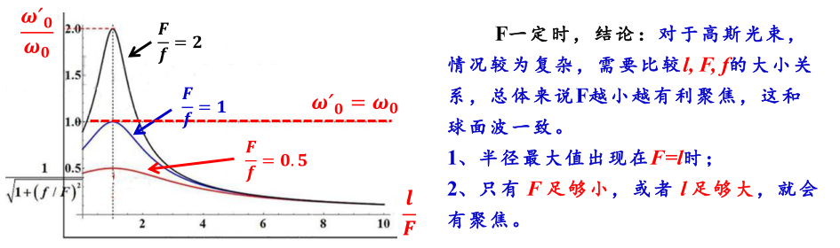

# 第二章总结——修改1

## 光腔与模式

腔的模式

- 表示方法：$TEM_{mnq}$，mn表示横模指数，q表示纵模指数（频率）
  - $TEM_{00}$为基模，只要不是连在一起的都是高阶模

❓ to do

## 共轴球面腔稳定性条件

$$
0<g_{1} g_{2}<1
\\
g_{1}=\left(1-\frac{L}{R_{1}}\right) \quad g_{2}=\left(1-\frac{L}{R_{2}}\right)
$$

- L为两球面镜$M_1,M_2$ 的距离，

- $R_1,R_2$ 分别为$M_1,M_2$ 的曲率半径，

- 当凹面镜向着腔内时，R取正，凸面镜取负

$g_1 g_2>1 \quad or \quad g_1g_2<0$为非稳腔

$g_1 g_2=1 \quad or \quad g_1g_2=0$为介稳腔

## 方形镜光场分布

光场在镜面上怎么分布，在行波场上怎么分布❓

光斑大小，等相位面的曲率半径，计算题⭐
$$
\begin{array}{l}\omega(z)=\omega_{0} \sqrt{1+\left(\frac{z}{f}\right)^{2}} 
\\ 
R\left(z_{0}\right)=\left|z_{0}+\frac{f^{2}}{z_{0}}\right|
\\
f=\frac{\pi \omega_{0}^{2}}{\lambda}
\quad \rightarrow \quad
\omega_0 = \sqrt{\frac{\lambda f}{\pi}}
\end{array}
$$

- 振幅分布：不仅在镜面上，在任何一z位置，腔内光波场振幅都是高斯分布
- z方向上的尺寸
  - z=0时，$\boldsymbol{\omega}(z)=\boldsymbol{\omega}(\boldsymbol{0})=\boldsymbol{\omega}_{0}$最小值，$\omega_0$称之为腔的**束腰半径**
  - z=f时，$\omega(z)=\omega(f)=\omega_{0 \mathrm{s}}=\sqrt{2} \omega_{0}$，$\omega_{0s}$称为镜面上的**光斑半径大小**
- 瑞利长度
  - 光束从束腰z=0位置传播$z=\pm f$位置时，光斑半径$\omega(z) = \omega(f) =\omega_{0s}=\sqrt{2}\omega_0$，即光斑面积变为束腰处的两倍，这个范围称为**瑞利范围**。从束腰到该处的长度叫做**瑞利长度**，通常用f或$z_0$表示
  - 一般认为高斯光束的瑞丽长度范围内是近似平行的，因此也把瑞利长度称为光准直距离
  - 由$\boldsymbol{f}=\frac{\boldsymbol{\pi} \boldsymbol{\omega}_{0}^{2}}{\lambda}$，得高斯光束得束腰半径$\omega_0$越大，光束的瑞利长度越长，准直距离越长，准直性越好
- 基模等相位面的分布
  - 
  - $z\rightarrow0$时，$R(z)\rightarrow \infty$，等相位面退化为平面
  - $z \rightarrow \infty$时，$R(z) \rightarrow \infty$，等相位面退化为平面
  - $z=f$时，$R(z)=2f$，说明镜面为等相位面，曲率半径最小

- 基模体积

  定义基模体积：$V_{00}=\frac{1}{2} L \pi\left[\frac{\omega\left(z_{1}\right)+\omega\left(z_{2}\right)}{2}\right]^{2}$

  $z_1,z_2$为两镜面位置

  高阶模体积：$\frac{\boldsymbol{V}_{\boldsymbol{m} \boldsymbol{n}}}{\boldsymbol{V}_{\boldsymbol{0} 0}}=\sqrt{(\boldsymbol{2} \boldsymbol{m}+\mathbf{1})(\boldsymbol{2} \boldsymbol{n}+\mathbf{1})}$

## 高斯光束基模的远场发散角，计算题⭐

从高斯光束的光斑及等相位面分布规律来看，在瑞利范围之外，高斯光束迅速发散

- 定义：$z\rightarrow \infty$时，原始光斑直径的$\frac{1}{e}$处与原点$z=0$连线与z轴的夹角叫做远场发散角（半角）
- $\boldsymbol{\theta}_{0}=\boldsymbol{\theta}_{\frac{1}{\boldsymbol{e}}}=\frac{\boldsymbol{2} \boldsymbol{\omega}_{0}}{\boldsymbol{f}}=2 \sqrt{\frac{\lambda}{\boldsymbol{\pi} \boldsymbol{f}}}$

- $\theta_{\frac{1}{e}}$内的功率占到总功率的86.5%
- 对于高阶模，阶数越高，相比基模发散越快
  - $\begin{array}{l}\boldsymbol{\theta}_{\boldsymbol{m}}=\sqrt{\mathbf{2 m}+\mathbf{1} \boldsymbol{\theta}_{\mathbf{0}}} \\ \boldsymbol{\theta}_{\boldsymbol{n}}=\sqrt{\mathbf{2} \boldsymbol{n}+\mathbf{1} \boldsymbol{\theta}_{\mathbf{0}}}\end{array}$

 ## 一般稳定球面腔的模式特征

证明不考，清楚即可

- 两点结论
  1. 任意一个共焦球面腔与无穷多个稳定腔等价
  2. 任一稳定球面腔唯一地等价于某一个共焦腔

不设计算题

## 高斯光束的q参数

- q参数

  - ⭐定义q参数满足如下公式：
    $$
    \frac{1}{q(z)}=\frac{1}{R(z)}-i \frac{\lambda}{\pi \omega^{2}(z)}
    $$
    其中
    $$
    \begin{array}{c}\frac{1}{R(z)}=R e\left\{\frac{1}{q(z)}\right\} \\ \frac{1}{\omega^{2}(z)}=-\frac{\pi}{\lambda} I m\left\{\frac{1}{q(z)}\right\}\end{array}
    $$
    以$q_0$表示$q(z=0)$，则$\boldsymbol{R}(\boldsymbol{\theta})=\infty, \boldsymbol{\omega}(\boldsymbol{\theta})=\boldsymbol{\omega}_{0}$
    $$
    \begin{array}{l} q_{0}=i \frac{\pi \omega_{0}^{2}}{\lambda}=i f\end{array}
    $$

- q参数变化规律
  - ❓空间变换：$q_z = q_1 +(z_2 - z_1) = q_1 + L$
  - 透镜变换：$\begin{aligned} \frac{1}{q_{2}} &=\frac{1}{R_{2}}-i \frac{\lambda}{\pi \omega_{2}^{2}}  =\frac{1}{R_{1}}-\frac{1}{F}-i \frac{\lambda}{\pi \omega_{1}^{2}}  =\frac{1}{q_{1}}-\frac{1}{F} \end{aligned}$

## 高斯光束的聚焦和准直

如何选择器件❓

- 高斯光束的聚焦⭐

  1. $F$一定，$\omega'_0$随$l$变化

     - $F>l$，$\omega_{0}^{\prime 2}$随$l$的减小而减小，当$l=0$时，$\omega'$达到最大值

     - 当$l=0$时，$\omega'$总比$\omega_0$小，无论F多大，都有聚焦效果，且像点位于F以内。若F<<f，可得出F越小，聚焦效果越理想，像点会向焦点移动

     - $F<l$，$\omega_0^{\prime 2}$随$l$的增大而减小，当$l \rightarrow \infty $时，$\omega'_0$达到最小值，$\omega_{0}^{\prime} \rightarrow 0, l^{\prime} \rightarrow F$

     - 当$F<<l$时，**可知$l$越大，F越小，聚焦效果越好**

     - $F=l$时，$\omega'_0$达到最大值，且$l'=F$

       - 只有当$F<<l$时，才有聚焦效果，$F$足够小，或者$l$足够大 ，半径最大值出现在$F=l$时

         

  2. $l$一定时，$\omega'_0$随F变化

     - $l$一定时，只有当$F<\frac{1}{2}R(l)$时，才有聚焦效果；**F越小，聚焦效果越好**

- 高斯光束的准直——压缩发散角

  - 单透镜对高斯光束的准直
    - 通过单一透镜，无法将高斯光束变为平面波
  - 望远镜系统对高斯光束的准直
    - 因此，可以先对光斑进行预聚焦，然后再用大F透镜进行准直
    - **大$F$，小$\omega_0$，可提高准直效果**
    - **M越大，$\frac{\omega(l)}{\omega_0}$越大，越有利于准直**

## 光束衍射倍率因子-$M^2$因子

- 定义
  $$
  M^2 = \frac{实际传播光束的腰斑半径与远场发散角的乘积}{基模光束的腰斑半径与远场发散角的乘积}
  $$
  为光束质量因子，定义基模的$M^2=1$

  - 在光束传播过程中，$\omega_{0} \theta_{0}=\frac{2 \lambda}{\pi}$不变

- 定义光束传输因子：$K=\frac{1}{M^2}$

 