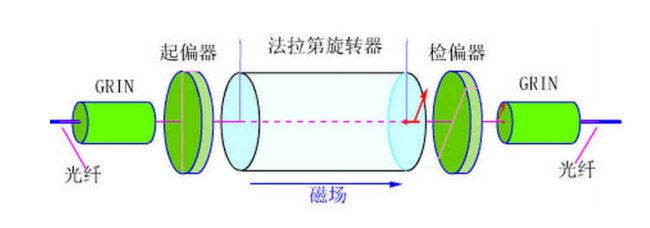

# 第五章总结

## 模式选择

- 为什么进行基模选择？
  
  - 激光的特性主要是指基模，高阶模的出现会使单色性、亮度、相干性、方向性等恶化
  
- 基模选择的光学基础？
  
  - 利用选择性损耗，使得，基模：增益>损耗、其他高阶模：增益<损耗
  
- 横模选择方法

  1. 小孔光阑
  2. 聚焦光阑法
  3. 谐振腔参数g、N法
  4. 反射镜失调法

  - 影响横模选择的两点主要考虑因素
    - $TEM_{10}$模与$TEM_{00}$模之衍射损耗比$\frac{\delta_{10}}{\delta_{00}}$。$TEM_{10}$模为高阶模中衍射损耗最低的模，只要能去掉$TEM_{10}$，就可以去掉其余更高阶的横模
    - 衍射损耗与总损耗之比$\frac{\delta_d}{\delta}$。必须让腔内的总损耗$\delta$主要由$\delta_d$决定，起主导作用

- 纵模选择方法

  1. 短腔法
  2. 行波腔法
  3. F-P标准具法
  4. 复合腔法

- 某个频率的光最终成为激光的纵模输出，需要
  1. 满足腔的谐振条件，成为腔的频率梳状模之一
  2. 频率落入工作物质的谱线线型范围$\Delta v$内
  3. 小信号增益系数大于阈值增益系数

## 隔离器

- 构造

  

## 调Q手段

- 转镜调Q
  - 开关速度太慢，太复杂
- 电光调Q
  - 电光开关加1/4波电压，单次通过引入的相位差为$\frac{\pi}{2}$，腔内荧光来回两次通过电光开关，总计相位差为$\pi$，偏振态旋转$90^\circ$，无法再次通过偏振片，因而腔内损耗巨大，激光无法起振，开关关闭。当撤掉电压，损耗迅速变小，Q值提高，激光迅速起振，实现输出，开关开启。撤掉电压后出光，我们称之为退压式电光开关
  - 好的电光开关特点
    1. 关的紧，开的快，消光比高
    2. 电光晶体的透过率要高，晶体物化性能良好，激光损伤阈值要高
    3. 半波电压要低
- 声光调Q
  - 声光品质因数使选择声光介质的主要指标之一
  - 声光开关衍射效率$\eta_{\mathrm{S}}=\sin ^{2}\left[\frac{\pi}{\sqrt{2} \lambda} \sqrt{\left(\frac{\mathrm{L}}{\mathrm{H}}\right) \mathrm{M}_{2} \mathrm{P}_{\mathrm{S}}}\right]$，选择合适的参数，当$\frac{\pi}{\sqrt{2} \lambda} \sqrt{\left(\frac{\mathrm{L}}{\mathrm{H}}\right) \mathrm{M}_{2} \mathrm{P}_{\mathrm{S}}} = \frac{\pi}{2}$时，效率达到100%
- 被动饱和吸收体调Q