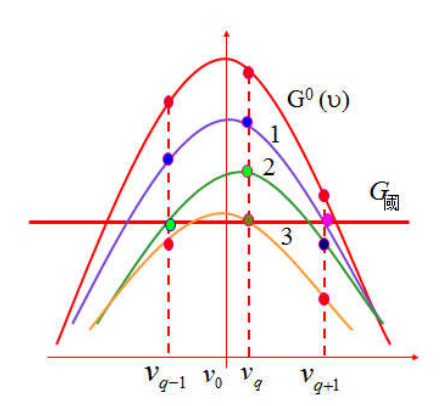

# 第四章总结

## 阈值

- 什么是？
  
  - 处于粒子数反转状态的介质（增益介质）会对处在其谱线宽度内的自发辐射光信号进行放大，但光在增益介质及谐振腔传播的过程中也会有损耗产生，会导致光信号的减弱。因此，要实现有效的光放大，是增益和损耗相互博弈的过程。只有$d N_{l} / d t \geq 0$，才真正实现了光净增益，得到振荡的阈值条件
- 相比于三能级系统，四能级系统具有较低的泵浦阈值
  
- 主要原因：四能级系统的激光下能及为激发态，而三能级为基态，因此四能级系统更容易实现粒子数反转
  
- 相关物理量
  $$
  \Delta n_{t}=\frac{\delta}{\sigma_{21}\left(v_{l}, v_{0}\right) l} \frac{c L}{v L^{\prime}}=\frac{\delta}{\sigma_{21}\left(v_{l}, v_{0}\right) l}
  $$
  不同频率模式具有不同的发射截面，因而具有不同的阈值反转粒子数$\Delta n_t$。频率$v_0$处发射截面最大，因而同等损耗下$\Delta n_t$最小，最容易起振，频率离$v_0$越远，越难起振

  中心频率$v_0$处阈值反转粒子数最低：$\Delta \boldsymbol{n}_{\boldsymbol{t}}=\frac{\boldsymbol{\delta}}{\boldsymbol{\sigma}_{21} \boldsymbol{l}}$

## 激光器振荡模式问题

- 均匀加宽的模式竞争问题/为什么会实现单纵模的输出

  

  - 光强的提高以消耗上能级粒子数为代价，必然造成增益曲线强度均匀下降，
  - q+1频率下的增益系数低于阈值，$I_{q+1}$停止上升，而$I_{q-1}$和$I_{q}$继续上升，增益曲线继续下降，使$I_{q+1}$迅速减小并熄灭
  - $I_q$停止上升，由于没有其他的纵模使增益曲线下降，则激光器就稳定在$I_q$上，从而实现单增模输出

- 空间烧孔效应

  - 当频率为$v_q$的纵模在腔内形成稳定振荡后，腔内形成一个驻波场，波腹处光强最大，波节处光强最小。因此，实际上腔内某一频率$v_q$的反转粒子数不是均匀分布，在波腹处反转离子数$\Delta n$最大，波节处$\Delta n$最小，这种反转粒子数密度沿轴向周期变换的现象，称为反转粒子束空间烧孔效应
  - 影响：
    - 激发越强，光场的空间分布引起不同位置光强的对比度就越大，空间烧孔效应就越显著，振荡模式就越多，一般来说光束质量下降就越快

- 非均匀加宽激光器的多纵模振荡，原因是什么
  
  - 假设有多个模式小信号下满足振荡条件，但由于光强的增加并不会使整个谱线均匀下降，而会形成增益谱线的烧孔效应。在纵模间隔较大时，各纵模基本上互不关联，故非均匀加宽激光器一般为多纵模振荡

## 单模激光器的线宽极限

- 无源腔的线宽极限

  - 原因：无源腔没有增益，净损耗>0，腔内 光子数不断减少，所以有一定的线宽极限

  - 线宽：$\Delta v_{c}=\frac{1}{2 \pi \tau_{R}}=\frac{\delta c}{2 \pi L^{\prime}}$，无源时，$L'=n \cdot L，n=1$

- 有源腔的线宽极限

  - 原因：稳定振荡时，虽然光子数密度不变，由于自发辐射，其中有少量的自发辐射光子，单程增益略小于单程损耗，因此有源腔的净损耗不为0。受激辐射的光子数随时间缓慢减小。所输出的光波列振幅是随时间指数缓慢降低。因此，也具有一定的谱线宽度。

  - 线宽：$\Delta v_{s}=\frac{1}{2 \pi \tau_{R}^{\prime}}=\frac{\delta_{s} c}{2 \pi L^{\prime}}$

    单程净损耗：$\delta_{s}=\delta-G\left(v, I_{v}\right) l$

    当激光器稳定工作时：$\boldsymbol{\delta}=\boldsymbol{G}\left(\boldsymbol{v}, \boldsymbol{I}_{\boldsymbol{v}}\right) \boldsymbol{l}, \boldsymbol{\delta}_{\boldsymbol{s}}=\boldsymbol{0}, \boldsymbol{\Delta} \boldsymbol{v}_{\boldsymbol{s}}=\mathbf{0}$

## 激光器的频率牵引

- 由于增益介质在$\omega_0$附近的正常色散，使得有源腔的纵模频率比无源腔纵模频率更靠近中心频率，这种现象叫做频率牵引

- 原因：色散导致

  

