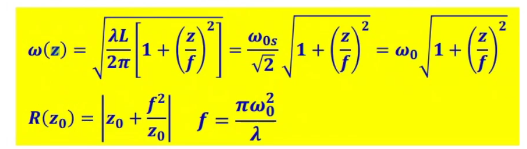

# 第一章

✔重点是激光器的构造，激光器跟传统光源有什么不一样的地方

✔为什么自然界中不存在激光，❌产生激光的条件

激光器的发展不考

✔相干性光子的描述：描述相干性的几种说法表示方法搞清楚，同一个 模式，同一个态都表示相同的光子

✔光子的相干性：时间相干性、空间相干性含义

✔受激辐射和受激吸收发生的概率、条件、原因，也就是解释了为什么激光是人造光

   77/96页说明了为啥正常情况下没有激光输出的原因

✔产生激光的条件：泵浦、增益介质、谐振腔……这些条件为什么

✔能级结构对粒子数反转的影响，三四可以，四更容易，因为下能级是激发态

自激振荡不考（后面考）

# 第二章

二三章是重点

腔的分类，模式

基模、高阶模定义

✔第二小节重点

球面腔的稳定性条件

判断腔是稳腔、非稳腔还是介稳腔

矩阵什么的考试不考

重点是告诉你一个腔型（曲率、腔长），判断是不是稳定——传输矩阵、稳定性条件

凹面镜曲率半径正负、凸面镜曲率半径正负、平面镜曲率半径正负，二次腔长？

稳定性条件一定要考

这些参数，正负如何去取，大于0小于1是什么，在这个区间是什么

❓模式如何形成

稳定场如何形成

光场什么特点，镜面解，束腰位置

光场分布数学表达式不必背，

比如说，在光场横截面或者镜面上，激光场的分布是什么分布

高斯分布，什么是高斯分布，高斯分布特点：中间强外边弱……

参数关系，如

✔计算题，告诉束腰位置光斑大小求某一z处光斑大小

行波场：振幅的分布，光斑尺寸、瑞丽长度、共交参数，相位面分布——概念必须清楚，如激光光场咋分布的、在镜面咋分布、在行波场咋分布

22/66 24 ——计算题，曲率半径等

一般稳定球面可以等价成共交腔

清楚概念，不考证明过程，计算也不考

考就直接给共价腔

✔q参数定义

q_0如何表示的，q参数变化规律，计算题q参数得光束特征——广场特性

✔高斯光束聚焦、准直

给定条件，如不同焦距，选什么光学器件聚焦等，参数器件选择

56结论记清楚，

准直一个高斯光束怎么准直，透镜焦距选择、光是半径大小、发散角

高斯光束得自再现变换与稳定球面腔，不考

✔m^2因子，描述什么（光束质量）

怎么定义，为啥这么定义

# 第三章

33min56s

激光的增益介质

✔清楚光与物质相互作用的过程，比如光场进去后改变了物质的什么，物质又反作用了什么，表述清楚就行，不需要记公式

14页的过程

❓还有一个比较重要的内容，p17折射率，介电常数，极化率，清楚是一个复数

实部、虚部跟什么特性相关

✔光谱线增宽，必考

线型函数

均匀价款、非均匀：特点，烧孔效应、频率选择？

公式不考

速率方程——必考

考虑加宽之后，获得速率方程，修正爱因斯坦系数——看看，

对于三能级、四能级速率方程、能级示意图

速率方程组：粒子数方程+光子数方程

✔工作物质的增益系数，

什么是饱和效应，公式不考

饱和光强怎么表示，跟什么量有关系

❓p72均匀加宽下，不同频率增益饱和的连带效应：强光再弱光，弱光再强光等等

# 第四章——激光的振荡特性

43：10

题目不是特别多，实验中

✔

阈值的问题，振荡的阈值

三能级、四能级谁阈值高

阈值跟什么物理量有关

阈值是什么，怎么来的

✔

振荡的模式问题

均匀加宽的模式竞争问题

为什么会实现单增模的输出，充分理解均匀加宽的特性

空间烧孔效应，带来的影响

非均匀加宽激光器的多纵模振荡，它的原因是什么

输出功率和输出能量，不考

✔

单模激光器的线宽极限

为什么会存在？线宽极限是多少

✔

激光器的频率牵引

为什么出现，是什么

# 第五章——激光技术

激光放大——不考

锁模——不考

✔

模式选择

选横模的方法，选纵模的方法

为什么用这种方法，用了什么样的光学基础

p16的条件，

✔

隔离器构造，隔离光，让光单向通过，如何使用

法拉第旋光器

磁致旋光——跟自然界中旋光晶体有什么特点

F-P标准具法，

✔

调Q技术

调Q手段

对于一个电光开关是如何进行设计的，比如一个声光开关时如何工作的
