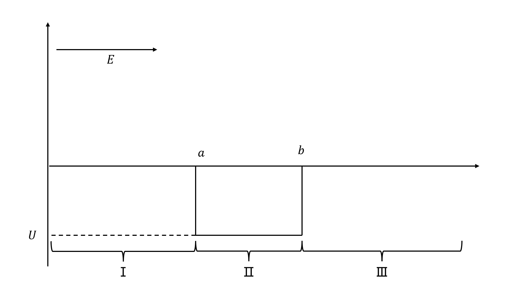

#  势阱问题

有定态薛定谔方程
$$
(-\frac{\hbar^2}{2m}\nabla^2+V)\psi = E\psi
\\
\nabla^2 \psi +\frac{2m}{\hbar^2}(E-V)\psi = 0
$$

## 散射态，无转向点情况

其中，$E>|U|$，

散射态的计算只需要把 “方势垒” 中$E>V_0$的情况下取$V_0<0$即可, 

> 行波的归一化

对各区有解
$$
\begin{align} 
&\psi_{Ⅰ}(x)=c_{11} \exp (\mathrm{i} k_1 x)+c_{12} \exp (-\mathrm{i} k_1 x)  \quad x\in Ⅰ
\\
&\psi_{Ⅱ}(x)=c_{21} \exp (\mathrm{i} k_2 x)+c_{22} \exp (-\mathrm{i} k_2 x)  \quad x\in Ⅱ
\\
&\psi_{Ⅲ}(x)=c_{31} \exp (-\mathrm{i} k_3 x))  \quad x\in Ⅲ
\end{align}
$$
其中，
$$
\begin{align} 
&k_1 = \int_{x}^{a} \sqrt{\frac{2m}{\hbar^2}}\cdot (E-0)\cdot d\tau = \sqrt{\frac{2m}{\hbar^2}}\cdot E(a-x)
\sim -\sqrt{\frac{2m}{\hbar^2}}\cdot Ex
\\
&k_2 = \int_{x}^{a} \sqrt{\frac{2m}{\hbar^2}}\cdot (E-U)\cdot d\tau = \sqrt{\frac{2m}{\hbar^2}}\cdot (E-U)(a-x)
\sim \sqrt{\frac{2m}{\hbar^2}}\cdot (E-U)x
\\
&k_3 = \int_{b}^{x} \sqrt{\frac{2m}{\hbar^2}}\cdot (E-0)\cdot d\tau = \sqrt{\frac{2m}{\hbar^2}}\cdot E(x-b)
\sim \sqrt{\frac{2m}{\hbar^2}}\cdot Ex
\end{align}
$$
根据行波归一化，有
$$
c_{11} = \frac{1}{\sqrt{2\pi}}
$$

$$
k=\sqrt{2 m E} \quad b=\sqrt{2 m\left(E-V_{0}\right)}
$$

对应连接点处函数和导数相等，有
$$
\left\{\begin{array}{l}
c_{11}=1 / \sqrt{2 \pi} \\ c_{12}=\mathcal{N} \cdot\left(k^{2}-b^{2}\right) \sin (2 b l) \exp (-\mathrm{i} k l) \\ c_{21}=\mathcal{N} \cdot \mathrm{i} k(k+b) \exp (-\mathrm{i} b l) \\ c_{22}=\mathcal{N} \cdot \mathrm{i} k(b-k) \exp (\mathrm{i} b l) \\ c_{31}=\mathcal{N} \cdot 2 \mathrm{i} k b \exp (-\mathrm{i} k l)\end{array}\right.
\\
\\
\mathcal{N}=\frac{1}{\sqrt{2 \pi}} \frac{\left(k^{2}+b^{2}\right) \sin (2 b l)-2 \mathrm{i} k b \cos (2 b l)}{\left(k^{2}-b^{2}\right)^{2} \sin ^{2}(2 b l)+4 k^{2} b^{2}} \exp (-\mathrm{i} k l)
$$

## 有转向点情况

其中，$E<|U|$，有转向点在$a,b$点，中间大于0，两边小于0

>曾谨言，

对于Ⅲ区，有薛定谔方程
$$
\nabla^2 \psi +\frac{2m}{\hbar^2}(E-V)\psi = 0
$$
记，$q_1(x) = \frac{2m}{\hbar^2}(E-V)<0$

有WKB解
$$
\psi_Ⅲ \sim 
\frac{a \exp \left[-\lambda \int \sqrt{-q_{1}(\tau)} d \tau\right]+b \exp \left[\lambda \int \sqrt{-q_{1}(\tau)} d \tau\right]}{\left[-q_{1}(x)\right]^{\frac{1}{4}}} 
\qquad q_1(x)<0 , \quad \lambda \rightarrow \infty
$$
其中，$\lambda = \frac{2m}{\hbar^2}$

另，Ⅲ区内，有薛定谔方程
$$
\frac{\mathrm{d}^{2} \psi}{\mathrm{d} x^{2}}=\beta^{2} \psi
\\
\beta=\sqrt{-2 m E} / \hbar
$$
其解为
$$
\psi \propto \mathrm{e}^{\pm \beta x}
$$
考虑到$|x|\rightarrow \infty$，时，有届，则
$$
\psi_Ⅲ = A\cdot e^{-\beta x}
\\
\Psi_Ⅰ = B\cdot e^{\beta x}
$$

因此，有系数
$$
\psi_Ⅲ \sim 
\frac{a \exp \left[-\lambda \int \sqrt{-q_{1}(\tau)} d \tau\right]}{\left[-q_{1}(x)\right]^{\frac{1}{4}}} 
\qquad q_1(x)<0 , \quad \lambda \rightarrow \infty
$$
连接公式有Ⅱ区

> 振荡解要移相$\pi/4$
>
> 负指数幂项的系数使正弦项系数之半，
>
> 正指数幂项的系数于余弦项的系数相等，即0

$$
y\sim 
\frac{2a \sin (\left[\lambda \int \sqrt{q_{1}(\tau)}\right] d \tau +\frac{\pi}{4})}{\left[q_{1}(x)\right]^{\frac{1}{4}}} 
\qquad q_{1}(x)>0, \quad \lambda \rightarrow \infty
$$

变形有
$$
\frac{1}{2} i e^{-i x-\frac{1}{4} (i \pi )}-\frac{1}{2} i e^{i x+\frac{i \pi }{4}}
$$
变换积分限有
$$
\frac{1}{2} i e^{-i (\int_a^b x -\int_a^x x)-\frac{1}{4} (i \pi )}-\frac{1}{2} i e^{i (\int_a^b x -\int_a^x x)+\frac{i \pi }{4}}
\\
=e^{-i\int_a^b x}\cdot \left(\frac{1}{2} i e^{-i ( -\int_a^x x)-\frac{1}{4} (i \pi )}-\frac{1}{2} i e^{i ( -\int_a^x x)+\frac{i \pi }{4}}\right)
\\
=e^{-i\int_a^b x}\cdot \left(\frac{1}{2} i e^{i ( \int_a^x x)-\frac{1}{4} (i \pi )}-\frac{1}{2} i e^{i ( -\int_a^x x)+\frac{i \pi }{4}}\right)
\\
=e^{-i\int_a^b x}\cdot \sin(\frac{\pi}{4}+\int_x^ax)
$$

再匹配Ⅰ区，有
$$
\psi_Ⅲ \sim 
\frac{a \exp \left[-\lambda \int \sqrt{-q_{1}(\tau)} d \tau\right]}{\left[-q_{1}(x)\right]^{\frac{1}{4}}} 
\qquad q_1(x)<0 , \quad \lambda \rightarrow \infty
$$
但是，Ⅲ区积分限时$\int_b^x$，Ⅰ区积分限时$\int_x^a$，将积分限变到$-\int_a^x$变为正幂项

