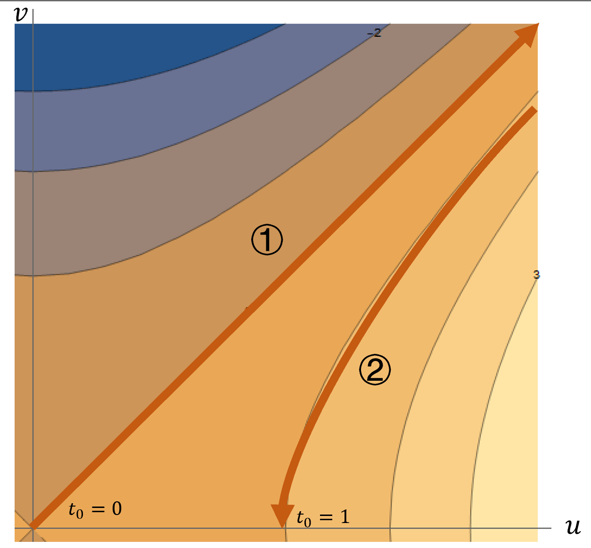

**求下述积分与渐进展开**
$$
I =\int_0^1 e^{ixt^2} dt
$$
**（a）用驻相法求其首项**

根据驻相法积分定理，
$$
I=\int_{a}^{b} f(t) e^{i x h(t)} d t, \quad x \rightarrow \infty
$$
记，$a=0,b=1,f(t)\rightarrow 1,h(t)\rightarrow t^2$，有
$$
I= 
\sqrt{\frac{\pi}{4 x}} e^{i\frac{\pi}{4}}
+O\left(\frac{1}{x}\right)
$$

**（b）在复平面$t$上证明，$u=v,u^2-v^2=1$是最陡下降路线**
$$
t = u+iv 
\\\downarrow\\ it^2 = -2uv + i(u^2-v^2) = \varphi(t) + i\psi(t)
$$
当$u = v$时，$\psi = v^2-u^2 = 0,\quad \varphi(0,0)>\varphi(1,1)$，所以是最速下降

当$u=v,u^2-v^2=1$时，$\psi = u^2-v^2 = 1,\quad \varphi(1,0)>\varphi(\sqrt{2},1)$，所以是最速下降

**(c)在上述两条线上积分，得到完全渐进展开式**

可以得到积分路径如下图所示

有积分
$$
I =\int_0^1 e^{ixt^2} dt = \int_{C_1}+\int_{C_2} e^{ixt^2} dt
$$
①在$u=v$上，鞍点为$t_0 = 0$有积分,
$$
I_1 =\int_{C_1} e^{ixt^2} dt
$$
记$h(t) = it^2,h''(t) = 2i$，且鞍点在边界上

$$
\begin{array}{l} 
I_1 
&= e^{xh(t_0)} \sqrt{\frac{\pi}{2|h''(t_0)|x}}\cdot e^{\frac{\pi}{4}i}
\\
&= \sqrt{\frac{\pi}{4x}}\cdot e^{\frac{\pi}{4}i}
\end{array}
$$
②在$u^2-v^2=1$上，鞍点为$t_0 = 1$有积分
$$
I_2 =\int_{C_2} e^{ixt^2} dt
$$
记$h(t) = it^2,h''(t) = 2i$，鞍点为端点，且从最陡下降进入鞍点，
$$
\begin{array}{l} 
I_2 
&= -e^{xh(t_0)} \sqrt{\frac{2\pi}{|h''(t_0)|x}}\cdot e^{\frac{\pi}{4}i}
\\
&= -\sqrt{\frac{\pi}{4x}}\cdot e^{i\left(x+\frac{\pi}{4}\right)}
\end{array}
$$
总积分
$$
I = I_1 +I_2 =
 \sqrt{\frac{\pi}{4x}}\cdot e^{\frac{\pi}{4}i}
 -
 \sqrt{\frac{\pi}{4x}}\cdot e^{i\left(x+\frac{\pi}{4}\right)}
$$

