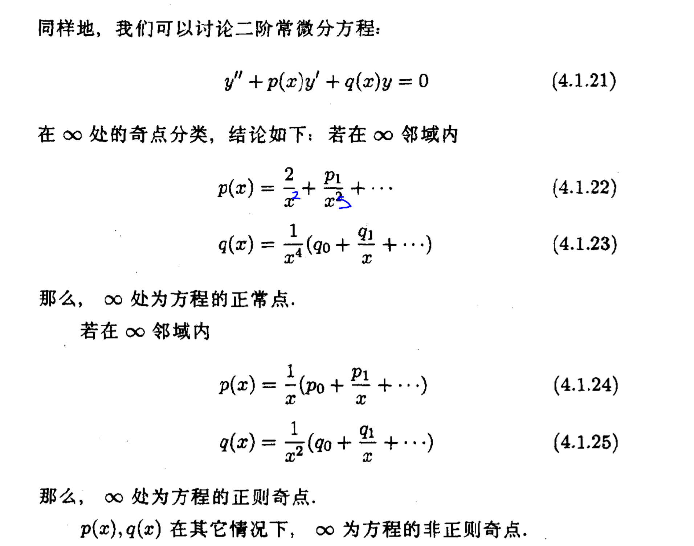

# 微分方程的奇点

## 函数的奇点

| $\omega = f(z)$ | 极限                                                         | 级数                                                         | eg.                                    |
| --------------- | ------------------------------------------------------------ | ------------------------------------------------------------ | -------------------------------------- |
| 可去奇点        | $\lim\limits_{x\rightarrow x_0} f(x) = A$ 存在且有限      | $\sum\limits_{n=0}^\infty f_n(x-x_0)^n$ 无负幂项          | $\frac{\sin x}{x}$                     |
| 极点            | $\lim\limits_{x\rightarrow x_0}f(x) = \infty$                | $\sum\limits_{n=m}^\infty f_n(x-x_0)^m$ 有限负幂项        | $\frac{1}{(x-x_0)^2}$                  |
| $m$阶极点       | $\lim\limits_{x\rightarrow x_0}f(x)(x-x_0)^m = A \\ \lim\limits_{x\rightarrow x_0}f(x)(x-x_0)^{m-1} = \infty$ | $(x-x_0)^{-m}\sum\limits_{k=0}^\infty f_k (x-x_0)^k$ 最小次幂为$-m$ 其中$\sum\limits_{k=0}^\infty f_k (x-x_0)^k$解析 |                                        |
| 本性奇点        | $x\rightarrow x_0$时，极限不存在 不同路径趋于$x_0$有不同的极限 | $\sum\limits_{n=-\infty}^{\infty} f_n(x-x_0)^n$ 有无穷个负项 | $e^{\frac{1}{z}}$                      |
| 支点            | 一般地说，对于多值函数w=f（z），若在绕某点一周，函数值w不复原，而在该点各单值分支函数值相同，则该为多值函数的支点。若当z绕支点n周，函数值w复原，便称该点为多值函数的n-1阶支点。 |                                                              | $\omega = \sqrt{z-a}$ $a$为一阶支点 |

> 根据函数在$x_0$处的展开式形式，判断类型

## 一阶微分方程的奇点

讨论一阶常微分方程
$$
y'(x) = F(x)y(x)
$$
有通解$y = Ce^{\int F(\tau)d\tau}$

若$F(x)$在$x_0$的邻域$|x-x_0|<R$内解析，则有泰勒展开
$$
F(x) = \sum\limits_{n=0}^\infty F_n(x-x_0)^n
$$
则积分，有解
$$
y = C\exp \left(\sum_{n=0}^\infty \frac{F_n(x-x_0)^{n+1}}{n+1}\right)
$$
该解同样是邻域$|x-x_0|<R$内的解析函数，$x_0$称为该方程的正常点

### 一阶极点

若$x_0$为$F(x)$的一阶极点，则$F(z)$有
$$
F(x) = \frac{1}{x-x_0} \sum_{n=0}^{\infty} F_n (x-x_0)^n
$$
有解，
$$
\begin{array}{l} 
y 
&= C \cdot \exp({\int \frac{1}{x-x_0} \sum\limits_{n=0}^{\infty} F_n (x-x_0)^n dx})
\\
&=C\cdot \exp({\int \frac{1}{x-x_0}\cdot F_0 dx})\cdot \exp({\int \sum\limits_{n=1}^{\infty} F_n (x-x_0)^{n-1} dx})
\\
&= c\cdot(x-x_0)^{F_0} \cdot \exp({\sum\limits_{n=1}^\infty \frac{F_n}{n}(x-x_0)^{n}})
\end{array}
$$

当$F_0$为正整数时，则$(x-x_0)^{F_0}$部分也是解析的，整个解都是解析的

当$F_0$不为负整数时，$x_0$是解的极点；当$F_0$为分数时，$x_0$是解的支点，并称$x_0$为微分方程的正则奇点，这使得在正则奇点邻域内方程依然有解析解

> 由解的级数展开形式得出上述结论

### $N$阶极点

有$F(x)$，
$$
\begin{array}{l} F(x)=\frac{1}{\left(x-x_{0}\right)^{N}} \sum\limits_{n=0}^{\infty} F_{n}\left(x-x_{0}\right)^{n}, \quad N \geq 2\end{array}
$$
有方程解
$$
\begin{array}{l} 
y 
&= C \cdot \exp({\int \frac{1}{(x-x_0)^N} \sum\limits_{n=0}^{\infty} F_n (x-x_0)^n dx})
\\
&=C\cdot \exp({\int \frac{1}{(x-x_0)}\cdot F_{N-1} dx})\cdot \exp({\int \sum\limits_{n=0,\ne N-1}^{\infty} F_n (x-x_0)^{n-N} dx})
\\
&= c\cdot(x-x_0)^{F_{N-1}} \cdot \exp({\sum\limits_{n=0,\ne N-1}^\infty \frac{F_n}{n-N+1}(x-x_0)^{n-N+1}})
\end{array}
$$
也可以将正负幂分来写作
$$
F=c\left(x-x_{0}\right)^{F_{N-1}} \exp \left[\frac{-F_{0}}{(N-1)\left(x-x_{0}\right)^{N-1}}-\frac{F_{1}}{(N-2)\left(x-x_{0}\right)^{N-2}}
-\cdots-\frac{F_{N-2}}{\left(x-x_{0}\right)}\right] \cdot \exp \left[F_{N}\left(x-x_{0}\right)+\frac{F_{N+1}}{2}\left(x-x_{0}\right)^{2}+\cdots\right]
\label{eq8}
$$
$x_0$是该方程的本性奇点，

> ❓为什么是，只有$N-2$个负幂项

$x_0$称为非正则奇点

|           | 函数（解）奇点 | 方程奇点   | 解的性质           |
| --------- | -------------- | ---------- | ------------------ |
| 解析      | 解析           | 正常点     | 解析               |
| 一阶极点  | 极点、支点     | 正则奇点   | 解析或有极点、支点 |
| $N$阶极点 | 本性奇点       | 非正则奇点 | 有本性奇点         |

## 二阶微分方程的奇点

考虑二阶微分方程
$$
y'' + p(x)y' + q(x)y = 0
$$
若，方程系数$p,q$在$|x-x_0|<R$内解析，则称$x_0$为方程的正常点

> 具体解的形式，
>
> 将$y'',y',p,q$全部泰勒展开，
>
> 对应幂次系数求和为0，得到各系数的解

### 正则奇点

若，方程系数$p(x)(x-x_0),\quad q(x)(x-x_0)^2$在$|x-x_0|<R$内解析，则称$x_0$为正则奇点

> $p(x)(x-x_0)$解析，则$x_0$是$p(x)$的一阶极点或解析
>
> $q(x)(x-x_0)^2$，则$x_0$是$q(x)$的二阶极点或一阶极点或解析

此时，在该邻域上有方程有两个线性无关的解，
$$
\begin{array}{l}y_{1}(x)=\left(x-x_{0}\right)^{\rho_{1}} \sum_{n=0}^{\infty} c_{n}\left(x-x_{0}\right)^{n} \\ y_{2}(x)=\left(x-x_{0}\right)^{\rho_{2}} \sum_{n=0}^{\infty} d_{n}\left(x-x_{0}\right)^{n}\end{array}
$$

> 根据$(x-x_0)$的指数$\rho$，以判断$(x-x_0)^\rho$是否解析
>
> 当$\rho$为正整数时，解在$x_0$处解析
>
> 当$\rho$为负整数时，$x_0$是$\rho$的极点
>
> 当$\rho$为分数时，$x_0$是$\rho$的支点

或写作Frobenius型级数解
$$
y_{2}(x)=g y_{1}(x) \ln \left(x-x_{0}\right)+\left(x-x_{0}\right)^{\rho_{2}} \sum_{n=0}^{\infty} d_{n}\left(x-x_{0}\right)^{n}
$$

> Tylar级数与幂级数相乘，为Frobenius级数形式，即
> $$
> \left(x-x_{0}\right)^{\rho_{2}} \sum_{n=0}^{\infty} d_{n}\left(x-x_{0}\right)^{n}
> $$
> Frobenius型级数解是否解析同样受$\rho_2$控制，第一项
>
> ❓为什么求ln，第一项是否解析如何判断

这两种解，称为正则解

### 非正则奇点

若，方程系数$p(x)(x-x_0),\quad q(x)(x-x_0)^2$有一个不满足在$|x-x_0|<R$内解析，则称$x_0$为非正则奇点

至少有一个解在$x_0$处有本性奇点❓

## $N$阶微分方程的奇点

将奇点分类法推广到$n$阶常微分方程，
$$
y^{(n)}+p_{n-1}(x) y^{(n-1)}+p_{n-2} y^{(n-2)}+\cdots+p_{0}(x) y=0
$$
**一**

若方程系数$p_0,p_1,\cdots,p_{n-1}$在$x_0$的邻域$|x-x_0|<R$内解析，则称$x_0$为该方程的正常点

**二**

若方程系数$p_0,p_1,\cdots,p_{n-1}$在$x_0$的邻域$|x-x_0|<R$内，满足$p_0(x)(x-x_0)^n, p_1(x)(x-x_0)^{n-1},\cdots,p_{n-1}(x)(x-x_0)$解析，

> $p_0(x)(x-x_0)^n, p_1(x)(x-x_0)^{n-1},\cdots,p_{n-1}(x)(x-x_0)$解析，说明各系数的发散程度不超过其对应的级数❓

则称$x_0$为该方程的正则奇点，该方程在$|x-x_0|<R$内有$n$个线性无关的正则解
$$
y(x)=\left(x-x_{0}\right)^{\gamma} \sum_{i=0}^{n-1}\left[\ln \left(x-x_{0}\right)\right]^{i} A i(x)
$$
其中，$Ai$是一解析函数

> 相当于多个Frobenius级数的叠加，其系数为$\ln$
>
> $\gamma$为正整数，则解析
>
> $\gamma$为负整数，则极点
>
> $\gamma$为分数，则支点

**三**

若方程系数$p_0,p_1,\cdots,p_{n-1}$在$x_0$的邻域$|x-x_0|<R$内，至少有一个不满足$p_0(x)(x-x_0)^n, p_1(x)(x-x_0)^{n-1},\cdots,p_{n-1}(x)(x-x_0)$解析，则称$x_0$为该方程的正则奇点，该方程在$|x-x_0|<R$内有$n$个线性无关的正则解

它至少有一个解在点$x_0$有本性奇点❓

## Fuchs定理

若$n$阶微分方程的所有线性独立解都在邻域$|x-x_0|<R$内是正则解，则$x_0$至多是该方程的正则奇点

## 无穷远处的奇点

而对于奇点在，做变换，$x = \frac{1}{t}$，将无穷远点变换到原点，微分方程也换元有
$$
\frac{d y}{d t}+F\left(\frac{1}{t}\right) \frac{1}{t^{2}} y=0
\\
\tilde{F}(t)=F\left(\frac{1}{t}\right) \frac{1}{t^{2}}=t^{n-2} \sum_{i=0}^{\infty} a_{i} t^{i}
\\
F(x)=\frac{1}{x^{n}} \sum_{i=0}^{\infty} \frac{a_{i}}{x^{i}}=t^{n} \sum_{i=0}^{\infty} a_{i} t^{i}
$$
有

| $F(x)$                                                       | $\infty$   |
| ------------------------------------------------------------ | ---------- |
| $F(x)=\frac{1}{x^{2}}\left(a_{0}+\frac{a_{1}}{x}+\cdots\right)$ | 为正常点   |
| $F(x)=\frac{1}{x}\left(a_{0}+\frac{a_{1}}{x}+\cdots\right)$  | 正则奇点   |
| $F(x)$为其他情形，$x$的指数$n-2< 0$或写作$n<2,n\in N$        | 非正则奇点 |

对于二阶微分方程
$$
y^{\prime \prime}+p(x) y^{\prime}+q(x) y=0
\\
p(x)=\frac{1}{x^{n}} \sum_{i=0}^{\infty} \frac{p_{i}}{x^{i}}=t^{n} \sum_{i=0}^{\infty} p_{i} t^{i}
\\
q(x)=\frac{1}{x^{n}} \sum_{i=0}^{\infty} \frac{q_{i}}{x^{i}}=t^{n} \sum_{i=0}^{\infty} q_{i} t^{i}
$$
换元有
$$
\frac{{\dd}^2 y}{\dd t^{-1}\cdot\dd t^{-1}}  +p(t^{-1})\frac{\dd y}{\dd t^{-1}} + q(t^{-1})y = 0
\\
\frac{{\dd}^2 y}{t^{-4}\dd t^2} + p(t^{-1})\frac{\dd y}{-t^{-2}\dd t} + q(t^{-1})y = 0
\\
\frac{{\dd}^2 y}{\dd t^2} + p(t^{-1})t^{-2}\frac{\dd y}{\dd t} + q(t^{-1})t^{-4}y = 0
$$
第三步吸收了负号到$q$，有系数
$$
p' = p(t^{-1})t^{-2} = t^{n-2} \sum_{i=0}^{\infty} p_{i} t^{i}
\\
q' = q(t^{-1})t^{-4} =t^{n-4} \sum_{i=0}^{\infty} q_{i} t^{i}
$$

> 解析即没负幂项

对于正常点，$p',q'$解析，即，对于$p’$有$n-2=0$，对于$q'$有$n-4=0$，对于$p,q$有$x$指数$-2,-4$

对于正则奇点，$p't^{-1},q't^{-2}$解析，即对于$p’$有$n-2+1=0$，对于$q'$有$n-4+2=0$，对于$p,q$有$x$指数$-1,-2$

对于非正则奇点，$p't^{-1},q't^{-2}$至少一个不解析，即，对于$p’$有$n-2+1<0$，对于$q'$有$n-4+2<0$，对于$p,q$有$x$指数$>-1,>-2$

有

| $p(x)$                                                      | $q(x)$                                                       | $\infty$   |
| ----------------------------------------------------------- | ------------------------------------------------------------ | ---------- |
| $p(x)=\frac{2}{x^2}+\frac{p_{1}}{x^{3}}+\cdots$             | $q(x)=\frac{1}{x^{4}}\left(q_{0}+\frac{q_{1}}{x}+\cdots\right)$ | 正常点     |
| $p(x)=\frac{1}{x}\left(p_{0}+\frac{p_{1}}{x}+\cdots\right)$ | $q(x)=\frac{1}{x^{2}}\left(q_{0}+\frac{q_{1}}{x}+\cdots\right)$ | 正则点     |
| 其他                                                        | 其他                                                         | 非正则奇点 |

------

❌上面是错的，不能那么求导，下图没有蓝色的部分

# 正常点与正则奇点附近的级数解

## 正常点附近的级数解

对于一阶微分方程在正常点附近的级数解，有
$$
y=\sum_{n=0}^{\infty} a_{n}\left(x-x_{0}\right)^{n}
\tag{2.1}
$$
将上式带入微分方程，对应各幂级数系数为0，即可确定系数$a_n$

### 例 4.2.1

**求方程**
$$
y' = 2xy
$$
**在$x = 0$附近的级数解**

（2.1）带入上式，在$x=0$处展开，有
$$
\begin{align} 
\sum_{n=1}^{\infty} na_{n}\left(x\right)^{n-1}
&= 2x\cdot \sum_{n=0}^{\infty} a_{n}\left(x\right)^{n}
\\
\sum_{n=1}^{\infty} na_{n}\left(x\right)^{n-1}
&= 2 \cdot \sum_{n=0}^{\infty} a_{n}\left(x\right)^{n+1}
\end{align}
$$

> $x$在$x_0$处展开
> $$
> x = x_0 + 1\cdot (x-x_0)
> $$

对应同次幂$x$有
$$
\begin{array}{l} 
a_1\cdot x^0 &
\\
2a_2\cdot x^1 & 2a_0\cdot x^1
\\
3a_3\cdot x^2 & 2a_1\cdot x^2
\\
\vdots & \vdots
\\
na_{n}\cdot x^{n-1} & 2a_{n-2} \cdot x^{n-1}
\\
(n+1)a_{n+1}\cdot x^{n}& 2a_{n-1}\cdot x^{n}
\\
(n+2)a_{n+2}\cdot x^{n+1} \qquad& 2a_{n}\cdot x^{n+1}
\\
\vdots&\vdots
\end{array}
$$
即
$$
a_1 = 2a_1
\qquad
na_n = 2a_{n-2}
\\\downarrow\\
a_{1}=0,\qquad a_{n}=\frac{2}{n} a_{n-2} (n \geq 2)
$$
可见，

对于奇数项，有，$a_{2n-1} = 0$

对于偶数项，有，$a_{2 m}=\frac{1}{m !} a_{0}$

因此，有解
$$
y=a_{0} \sum_{m=0}^{\infty} \frac{1}{m !} x^{2 m}=a_{0} e^{x^{2}}
$$

### 例4.2.2

**求Airay方程**
$$
y''-xy = 0
$$
**的级数解**

> Airay方程，全空间内正常点

式（2.1）带入方程，在$x = 0$处展开，有
$$
\begin{align} 
\sum_{n=2}^{\infty} n\cdot(n-1)a_{n}x^{n-2}
&=
x
\sum_{n=0}^{\infty} a_{n}x^{n}
\\
\sum_{n=2}^{\infty} n\cdot(n-1)a_{n}x^{n-2}
&=
\sum_{n=0}^{\infty} a_{n}x^{n+1}
\end{align}
$$
对应$x$同次幂有
$$
\begin{array}{l} 
2a_2\cdot x^0 & 
\\
6a_3 \cdot x^1 & a_0\cdot x^1
\\
\vdots&\vdots
\\
n(n-1)a_n\cdots x^{n-2} & a_{n-3}\cdot x^{n-2}
\end{array}
$$
即
$$
a_2 = 0
\qquad
a_n = \frac{a_{n-3}}{n(n-1)}
$$
所以
$$
\begin{array}{l}
a_{3 m}=\frac{a_{0}}{3 m(3 m-1) \cdots 6 \cdot 5 \cdot 3 \cdot 2}=\frac{\Gamma\left(\frac{2}{3}\right)}{9^{m} m ! \Gamma\left(m+\frac{2}{3}\right)} a_{0} \\
a_{3 m+1}=\frac{a_{1}}{(3 m+1) 3 m \cdot 7 \cdot 6 \cdot 4 \cdot 3}=\frac{\Gamma\left(\frac{4}{3}\right)}{9^{m} m ! \Gamma\left(m+\frac{4}{3}\right)} a_{1}
\end{array}
$$
代回系数，有Airay函数的级数解
$$
y(x)=c_{1} \sum_{m=0}^{\infty} \frac{x^{3 m}}{9^{m} m ! \Gamma\left(m+\frac{2}{3}\right)}+c_{2} \sum_{m=0}^{\infty} \frac{x^{3 m+1}}{9^{m} m ! \Gamma\left(m+\frac{4}{3}\right)}
$$

## 正则奇点处的方程

对于方程
$$
L y=y^{\prime \prime}+\frac{p(x)}{x-x_{0}} y^{\prime}+\frac{q(x)}{\left(x-x_{0}\right)^{2}} y=0
\label{eq31}
$$
> $L$可视为一线性算符

其中，
$$
\begin{array}{l}p(x)=p_{0}+p_{1}\left(x-x_{0}\right)+\cdots \\ q(x)=q_{0}+q_{1}\left(x-x_{0}\right)+\cdots\end{array}
$$
在$x_0$邻域上解析，

考虑方程有一个Frobenius级数解，
$$
y (x)=\left(x-x_{0}\right)^{\alpha} \sum_{n=0}^{\infty} a_{n}\left(x-x_{0}\right)^{n}
$$
设，$a_0 \ne 0$

将级数解带入方程，对齐$(x-x_0)$次幂有，
$$
\begin{aligned} L y=& a_{0}\left(x-x_{0}\right)^{\alpha-2} \left[\alpha(\alpha-1)+p_{0} \alpha+q_{0}\right] 
+\sum_{n=1}^{\infty}\left(x-x_{0}\right)^{\alpha-2+n}\left\{P(\alpha+n) a_{n} +\sum_{k=0}^{n-1}\left[(\alpha+k) p_{n-k}+q_{n-k}\right] a_{k}\right\}=0 
\\
=& a_{0}\left(x-x_{0}\right)^{\alpha-2} P(\alpha)
+\sum_{n=1}^{\infty}\left(x-x_{0}\right)^{\alpha-2+n}\left\{P(\alpha+n) a_{n} +\sum_{k=0}^{n-1}\left[(\alpha+k) p_{n-k}+q_{n-k}\right] a_{k}\right\}=0 
\end{aligned}
\label{eq34}
$$
记
$$
P(\alpha) = \alpha(\alpha-1) + p_0\alpha + q_0
$$
> 考虑$\eqref{eq34}$的第一项为0，此时就是Frobenius级数形式
>
> $P(\alpha)$和$p_n$不是一个东西
>
> $p(\alpha+n)$那❓这里暂时认为是一个东西

当解为Frobenius解时，有**特征方程**
$$
P(\alpha) = 0
$$
其中，$\alpha$称为特征指数，且有递推关系

> 根据$\eqref{eq34}$的第二项=0，有下列递推关系

$$
P(\alpha+n) a_{n}=-\sum_{k=0}^{n-1}\left[(\alpha+k) p_{n-k}+q_{n-k}\right] a_{k}\label{eq37}
$$
对于另一个解，以下三种情况

### 特征方程根不等，且$\alpha_1-\alpha_2\ne $整数

此时
$$
P(\alpha_i) = \alpha_i(\alpha_i-1) + p_0\alpha_i + q_0=0
\\
\quad(i=1,2 ; n=1,2, \cdots)
$$
有
$$
\begin{array}{l} 
P\left(\alpha_{i}+n\right) 
&= \alpha_i(\alpha_i+n-1) + p_0\alpha_i + q_0
\\
&=\alpha_i(\alpha_i-1)+p_0\alpha_i + q_0 + \alpha_i\cdot n
\\
&=\alpha_i\cdot n
\neq 0 
\\&\quad(i=1,2 ; n=1,2, \cdots)
\end{array}
$$
因此，根据递推关系$\eqref{eq37}$，有Frobenius解的系数
$$
a_n = \frac{-\sum\limits_{k=0}^{n-1}\left[(\alpha+k) p_{n-k}+q_{n-k}\right] a_{k}}{P(\alpha+n)}
$$
由于右侧有$\alpha$，所以对于$n$相同，而$\alpha$不同的情况，所以肯定有两组$a_n$

> 可以假设两组系数分别为$a_n,b_n$
>
> 若取$a_0 = b_0$，由于$\alpha$不同，后续的系数由于递推关系不同，后续系数肯定不同

可以确定Frobenius级数的两组不同系数，

因此该方程有两个Frobenius解

### 特征方程有重根

即，$\alpha_1 = \alpha_2 = \alpha$

此时，
$$
P(\alpha) = \alpha(\alpha-1) + p_0\alpha + q_0=0
$$
同样有
$$
\begin{array}{l} 
P\left(\alpha+n\right) 
&= \alpha(\alpha+n-1) + p_0\alpha + q_0
\\
&=\alpha(\alpha-1)+p_0\alpha + q_0 + \alpha\cdot n
\\
&=\alpha\cdot n
\neq 0 
\end{array}
$$
即只能得到一组frobenius解的系数$a_n$

因此，得到一个frobenius解，
$$
y_{1}=\left(x-x_{0}\right)^{\alpha} \sum_{n=0}^{\infty} a_{n}\left(x-x_{0}\right)^{n}
$$
设第二个解为线性独立解，即

> ❓ 方程为什么非得有两个解

$$
\tilde{y}_{1}=\left(x-x_{0}\right)^{\beta} \sum_{n=0}^{\infty} \widetilde{a_{n}}\left(x-x_{0}\right)^{n}
$$

为区别两个解，该线性独立解的特征指数为$\beta$，frobenius解系数记为$\widetilde{a_{n}}$

假设，$\widetilde{a_n(\beta)}$同样满足递推关系$\eqref{eq37}$，
$$
P(\beta+n) a_{n}=-\sum_{k=0}^{n-1}\left[(\beta+k) p_{n-k}+q_{n-k}\right] a_{k}
\label{eq51}
$$
则$\eqref{eq34}$中第二项为0，因此有$\eqref{eq34}$有如下形式
$$
L \tilde{y}_{1}=a_{0}\left(x-x_{0}\right)^{\beta-2} p(\beta)
\label{eq46}
$$
$\eqref{eq46}$两侧对$\beta$求导，并考虑重根情况在根处一阶导数为0，有
$$
L\left(\frac{\partial \tilde{y}_{1}}{\partial \beta}\right)
=
a_{0}\left[(\beta-2)\left(x-x_{0}\right)^{\beta-3} P(\beta)+\left(x-x_{0}\right)^{\beta-2} p'(\beta)\right]=0
$$
考虑到初始方程$\eqref{eq31}$的形式$Ly =0$，

得到该方程的另一个解
$$
{y}_{2}=\frac{\partial \tilde{y}_{1}}{\partial \beta}=y_{1} \ln \left(x-x_{0}\right)+\left(x-x_{0}\right)^{\beta} \sum_{n=0}^{\infty}\left(\frac{\partial a_{n}}{\partial \beta}\right)\left(x-x_{0}\right)^{n}
$$

考虑$\alpha = \beta$，即
$$
{y}_{2}=\frac{\partial \tilde{y}_{1}}{\partial \alpha}=y_{1} \ln \left(x-x_{0}\right)+\left(x-x_{0}\right)^{\alpha} \sum_{n=0}^{\infty}\left(\frac{\partial a_{n}}{\partial \alpha}\right)\left(x-x_{0}\right)^{n}
$$

### 两根之差为整数

即，$\alpha_1 = \alpha_2 +N ,\quad N>0$

对于$\alpha_1$，同前述情况，有
$$
P(\alpha_1+n)\ne 0
$$
可以得到一个Frobenius解
$$
y_{1}=\left(x-x_{0}\right)^{\alpha_{1}} \sum_{n=0}^{\infty} a_{1 n}\left(x-x_{0}\right)^{n}
$$
但对于$\alpha_2$
$$
P(\alpha_2 +N) = P(\alpha_1) = 0
$$
除非$\eqref{eq34}$中的$\sum\limits_{k=0}^{n-1}$项为0，有
$$
\begin{aligned} L y
=& a_{0}\left(x-x_{0}\right)^{\alpha-2} P(\alpha)
+\sum_{n=1}^{\infty}\left(x-x_{0}\right)^{\alpha-2+n} P(\alpha+n) a_{n} 
\\
=& \sum_{n=0}^{\infty}\left(x-x_{0}\right)^{\alpha-2+n} P(\alpha+n) a_{n} 
=0 
\end{aligned}
$$
此时，可以得到Frobenius解，其余情况都不能得到Frobenius解

同重根情况，考虑取另一特征指数$\beta$
$$
\tilde{y}_{1}=\left(x-x_{0}\right)^{\beta} \sum_{n=1}^{\infty} a_{n}\left(x-x_{0}\right)^{n}
$$
且同样满足递推关系$\eqref{eq37}$

代入$\eqref{eq31}$，有
$$
L \tilde{y}_{1}=a_{0}\left(x-x_{0}\right)^{\beta-2} P(\beta)
\label{eq54}
$$
$\eqref{eq54}$两边对$\beta$求导，并取$\beta = \alpha_1$，有
$$
L\left[\left.\frac{\partial \tilde{y}_{1}}{\partial \beta}\right|_{\alpha_{1}}\right]=a_{0}\left(x-x_{0}\right)^{\alpha_{2}+N-2} P{\prime}\left(\alpha_{2}+N\right) \neq 0
\label{eq55}
$$
由于不是重根，此处导数不为0，

将$\eqref{eq55}$重新考虑为一符合$\eqref{eq31}$形式的非齐次方程，即
$$
\begin{array}{l} 
L(y) &=y{\prime \prime}+\frac{p(x)}{x-x_{0}} y{\prime}+\frac{q(x)}{\left(x-x_{0}\right)^{2}} y \\
&=a_{0}\left(x-x_{0}\right)^{\alpha_{2}+N-2} P'\left(\alpha_{2}+N\right)
\end{array}
\label{eq59}
$$
对于该方程，有Frobenius型解
$$
\bar{y}=\left(x-x_{0}\right)^{\alpha_{2}} \sum_{n=0}^{\infty} c_{n}\left(x-x_{0}\right)^{n}
\label{eq57}
$$
对$\eqref{eq59}$并考虑$\eqref{eq34}$有

$$
\begin{aligned} 
a_{0}\left(x-x_{0}\right)^{\alpha_2-2} P(\alpha_2)
+\sum_{n=1}^{\infty}\left(x-x_{0}\right)^{\alpha_2-2+n}\left\{P(\alpha_2+n) a_{n} +\sum_{k=0}^{n-1}\left[(\alpha_2+k) p_{n-k}+q_{n-k}\right] a_{k}\right\}
=a_{0}\left(x-x_{0}\right)^{\alpha_{2}+N-2} P'\left(\alpha_{2}+N\right)
\\
a_{0}\left(x-x_{0}\right)^{\alpha_2-2} P(\alpha_2)
+\sum_{n=1}^{\infty}\left(x-x_{0}\right)^{\alpha_2-2+n}\left\{P(\alpha_2+n) a_{n} +\sum_{k=0}^{n-1}\left[(\alpha_2+k) p_{n-k}+q_{n-k}\right] a_{k}\right\}
-a_{0}\left(x-x_{0}\right)^{\alpha_{2}+N-2} P'\left(\alpha_{2}+N\right)
=0
\end{aligned}
$$

为保证Frobenius解成立，使除第一项外都为0，

对于$n\ne N$项，有递推关系
$$
p(\alpha_2+n) a_{n}=-\sum_{k=0}^{n-1}\left[(\alpha_2+k) p_{n-k}+q_{n-k}\right] a_{k}
$$
对于$n = N$项，有关系
$$
\left\{P(\alpha_2+N) a_{N} +\sum_{k=0}^{n-1}\left[(\alpha_2+k) p_{N-k}+q_{N-k}\right] a_{k}\right\}
-a_{0} P'\left(\alpha_{2}+N\right) =0
$$
即
$$
P(\alpha_2+n) a_{n}=-\sum_{k=0}^{n-1}\left[(\alpha_2+k) p_{n-k}+q_{n-k}\right] a_{k}+a_{0} p’\left(\alpha_{n}+N\right)
\label{eq64}
$$
此时，$P(\alpha_2 +N) = 0$，上式变形有
$$
a_{0}=\frac{\sum\limits_{k=0}^{N-1}\left[(\alpha+k) p_{N-k}+q_{N-k}\right] c_{k}}{P'\left(\alpha_{n}+N\right)}
\label{eq65}
$$
此时就保证了新构造的非齐次方程$\eqref{eq59}$有Frobenius解$\eqref{eq57}$

对于$\eqref{eq55}$，就有
$$
\begin{array}{l} 
L\left[\left.\frac{\partial \tilde{y}_{1}}{\partial \beta}\right|_{\alpha_{1}}
\right]
=
a_{0}\left(x-x_{0}\right)^{\alpha_{2}+N-2} P'\left(\alpha_{2}+N\right)
\\
L\left[\bar y
\right]
=
a_{0}\left(x-x_{0}\right)^{\alpha_{2}+N-2} P'\left(\alpha_{2}+N\right)

\\\Downarrow 由于L是一个线性算符，因此可以叠加\\
L\left[\left.\frac{\partial \tilde{y}_{1}}{\partial \beta}\right|_{\alpha_{1}}
-\bar y
\right]=0
\end{array}
$$
满足原始方程$\eqref{eq31}$形式，故有解，
$$
y_{2}=\left.\left(\frac{\partial \widetilde{y}_{1}}{\partial \alpha}\right)\right|_{\alpha=\alpha_{1}}-\bar{y}
$$
> 对于$\overline y$的求法
>
> 将$\bar y$代入$\eqref{eq59}$，最用到L，再和右侧同次幂比对，得到各阶$c_n$，
>
> 另，
>
> 前面给出的$y_1$并没有对$a_0$限定，
>
> 因此由式$\eqref{eq65}$限定$a_0$

为原方程$\eqref{eq31}$的另一线性独立解，一般形式为
$$
y_{2}=y_{1}(x) \ln \left(x-x_{0}\right)+\left(x-x_{0}\right)^{\alpha_{2}} \sum_{n=0}^{\infty} d_{n}\left(x-x_{0}\right)^{n}
$$

> 第一节，二阶方程好像推过这个形式，当时自己没推TODO 

### 高阶方程情况

对于$x_0$为正则奇点的高阶方程，其一般形式为
$$
\begin{array}{c}
y^{(n)}+\frac{q_{n-1}(x)}{x-x_{0}} y^{(n-1)}+\frac{q_{n-2}(x)}{\left(x-x_{0}\right)^{2}} y^{(n-2)}+\cdots 
+\frac{q_{0}(x)}{\left(x-x_{0}\right)^{n}} y=0
\end{array}
$$
其中，$q_{0}, q_{1}, \cdots, q_{n-1}$在$x_0$域内解析，它的特征指数方程为
$$
\begin{array}{r}
\alpha(\alpha-1) \cdots(\alpha-n+1)+q_{n-1}\left(x_{0}\right) \alpha(\alpha-1) \cdots(\alpha-n+2) \\
+q_{n-2}\left(x_{0}\right) \alpha(\alpha-1) \cdots(\alpha-n+3)+\cdots+q_{0}\left(x_{0}\right)=0
\end{array}
$$

## 例题

### 4.2.3

**求Euler方程的解**
$$
x^{2} y{\prime \prime}+p_{0} x y{\prime}+q_{0} y=0
$$
Euler方程变形，有
$$
y{\prime \prime}+\frac{p_{0}}{x} y{\prime}+\frac{q_{0}}{x^{2}} y=0
$$
可见，$x_0 = 0$为正则奇点，且$p_0,q_0$不含$x$，故其展开余项$p_n,q_n = 0,n\ge1$

特征方程
$$
\alpha(\alpha-1)+p_{0} \alpha+q_{0}=0
$$
无重根时，设$a_0,b_0\ne 0$，有两Frobenius解
$$
y_1 (x)= x^{\alpha_1} \sum_{n=0}^{\infty} a_{n}x^{n}
\\
y_2 (x)= x^{\alpha_2} \sum_{n=0}^{\infty} b_{n}x^{n}
$$
根据递推关系$\eqref{eq37}$，有
$$
a_1 = \frac{(\alpha_1 p_{1}+q_{1}) a_{0}}{P(\alpha_1+1)} = 0
\\
b_1 = \frac{(\alpha_2 p_{1}+q_{1}) b_{0}}{P(\alpha_2+1)} = 0
$$
故有解
$$
\begin{array}{l}
y_{1}=a_{0} x^{\alpha_{1}} \\
y_{2}=b_{0} x^{\alpha_{2}}
\end{array}
$$
有重根时，

有两解为
$$
\begin{array}{l} 
y_{1}=\left(x-x_{0}\right)^{\alpha} \sum\limits_{n=0}^{\infty} a_{n}\left(x-x_{0}\right)^{n}
\\
{y}_{2}=\frac{\partial \tilde{y}_{1}}{\partial \alpha}=y_{1} \ln \left(x-x_{0}\right)+\left(x-x_{0}\right)^{\alpha} \sum\limits_{n=0}^{\infty}\left(\frac{\partial a_{n}}{\partial \alpha}\right)\left(x-x_{0}\right)^{n}
\end{array}
$$
有
$$
\begin{array}{l}
y_{1}=a_{0} x^{\alpha} \\
y_{2}=a_{0}\alpha\cdot x^{\alpha} \ln x
\end{array}
$$

### 4.2.4

**用Frobenius方法，求修正的Bessel方程之解，**
$$
y{\prime \prime}+\frac{1}{x} y{\prime}-\left(1+\frac{\nu^{2}}{x^{2}}\right) y=0
$$
特征方程为
$$
\alpha^{2}-\nu^{2}=0
$$
⭐TODO

# 非正则奇点附近的渐进解

在本章第一节中，有结论，在非正则奇点附近，至少有一个解有本性奇点，

> $\eqref{eq8}$给出了有本性奇点的解的形式

对于二阶以上方程，另一个解可能是形式上的Frobenius型级数解，

可另一解的具体形式由下列两定理判断

## 定理一

对于$\infty$是非正则奇点的二阶微分方程
$$
L y =\frac{d^{2} y}{d x^{2}}+p(x) \frac{d y}{d x}+q(x) y=0
\label{eq79}
$$
其中，
$$
p(x) =x^{n_{1}}\left(p_{0}+\frac{p_{1}}{x}+\cdots\right)  \quad p_{0} \neq 0 \\
q(x) =x^{n_{2}}\left(q_{0}+\frac{q_{1}}{x}+\cdots\right)  \quad q_{0} \neq 0
$$
该方程具有形式Frobenius型级数解的必要条件为S
$$
n_1\ge n_2 +1
$$

### 证明

令解有Frobenius形式，
$$
y(x)=x^{\alpha} \sum_{k=0}^{\infty} c_{k} x^{-k}
\label{eq84}
$$
且，$c_0 \ne 0$，

由于方程$\eqref{eq79}$在的非正则奇点为$\infty$，根据第一节无穷远处的奇点的讨论，非正则奇点有要求
$$
n_1 > -1\qquad
n_2 >-2
$$
将$\eqref{eq84}$代入方程$\eqref{eq79}$有
$$
\begin{aligned} 
Ly =& 
\left(x^{\alpha} \sum_{k=0}^{\infty} c_{k} x^{-k}\right)''
+
\sum\limits_{r=0}^{\infty} p_{r} x^{n_{1}-r}\left(x^{\alpha}\sum_{k=0}^{\infty} c_{k} x^{-k}\right)'
+
x^{\alpha}\sum\limits_{s=0}^{\infty} q_{s} x^{n_{2}-s}\sum_{k=0}^{\infty} c_{k} x^{-k}
\\
&=x^{\alpha} \sum_{k=0}^{\infty} c_{k}(\alpha-k)(\alpha-k-1) x^{-k-2}
+
x^{\alpha}\sum\limits_{r=0}^{\infty} p_{r} x^{n_{1}-r} \sum\limits_{k=0}^{\infty} c_{k}(\alpha-k) x^{-k-1}
+
x^{\alpha}\sum\limits_{s=0}^{\infty} q_{s} x^{n_{2}-s} \sum\limits_{k=0}^{\infty} c_{k} x^{-k}
=0
\\&\Downarrow\\
& \sum_{k=0}^{\infty} c_{k}(\alpha-k)(\alpha-k-1) x^{-k-2}
+
 \sum\limits_{r=0}^{\infty} p_{r} x^{n_{1}-r} \sum\limits_{k=0}^{\infty} c_{k}(\alpha-k) x^{-k-1}
+
 \sum\limits_{s=0}^{\infty} q_{s} x^{n_{2}-s} \sum\limits_{k=0}^{\infty} c_{k} x^{-k}
=0
\end{aligned}
\label{eq86}
$$
为保证方程成立，考虑各次幂项正交，要求同次幂项系数和为0，

第一项，次幂区间为$[-2,\infty]$

第二项，次幂区间为$[n_1-1,-\infty)$

第三项，次幂区间为$[n_2,-\infty]$

可以发现，仅对于后两项有$x$的最高幂项，

因此，

⭕当$n_2\ge n_1$时，$n_2>n_1$，最高次幂$x^{n_2}$为第三项独有，其系数为$c_0$
$$
c_0 = 0
$$
与假设$c_0 \ne 0$矛盾，不成立❌

⭕当$n_2+1 = n_1$，最高次幂$x^{n_1-1} = x^{n_2}$为后两项共有，有系数
$$
q_0 + p_0 \alpha = 0
$$
有特征指数
$$
\alpha = -\frac{q_0}{p_0}
\label{eq89}
$$
⭕若$n_1>n_2+1$，最高次幂$x^{n_1}$为第二项独有，其系数有
$$
p_0 c_0\alpha = 0
$$
有特征指数
$$
\alpha = 0
$$

> 对于$p(x) \equiv 0$或$q(x) \equiv 0$情况（不能全等于令，非正则奇点的要求），
>
> 若，$p\equiv 0\longrightarrow c_0=0$，与假设矛盾❌
>
> 若，$q \equiv0\longrightarrow \alpha = 0$，仍存在递推

综上

在后两种情况下，可以根据等次幂系数和为0，得到递推公式

⭐TODO具体形式？

## 定理二

对于$x = 0$处有非正则奇点的二阶常微分方程
$$
\begin{array}{c}
L y=\frac{d^{2} y}{d x^{2}}+p(x) \frac{d y}{d x}+q(x) y=0 \\
p(x)=x^{n_{1}}\left(p_{0}+p_{1} x+p_{2} x^{2}+\cdots\right),  p_{0} \neq 0 \\
q(x)=x^{n_{2}}\left(q_{0}+q_{1} x+q_{2} x^{2}+\cdots\right),  q_{0} \neq 0
\end{array}
\label{eq92}
$$
在$x = 0$处有正则解的必要条件为
$$
n_1 \le n_2 +1
$$

### 证明

假定解为正则解
$$
y(x)=x^{\alpha} \sum_{k=0}^{\infty} c_{k} x^{k}
\label{eq94}
$$

> 正则解就是第一节讨论的那俩
>
> 两个、线性无关解，或认为是两个Frobenius型级数解❓

设，$c_0\ne 0$，对于$x = 0$为非正则奇点的情况，要求$n_1<-1,n_2<-2$

> 本性奇点要求
> $$
> p(x)x^{1} = x^{n_1+1}(\cdots)
> \\
> q(x)x^{2} = x^{n_2+2}(\cdots)
> $$
> 不解析，即
> $$
> n_1+1<0,\quad
> n_2+2<0
> \\\downarrow \\
> n_1<-1\quad n_2<-2
> $$
> 

将解$\eqref{eq94}$代入方程$\eqref{eq92}$有
$$
\begin{array}{l} 

L y=& x^{\alpha}\left( \sum\limits_{k=0}^{\infty} c_{k}(\alpha+k)(\alpha+k-1) x^{k-2}
\right.\\
&\left.+\sum\limits_{r=0}^{\infty} p_{r} x^{n_{1}+r} \sum\limits_{k=0}^{\infty} c_{k}(\alpha+k) x^{k-1}+\sum\limits_{s=0}^{\infty} q_{s} x^{n_{2}+s} \sum\limits_{k=0}^{\infty} c_{k} x^{k}\right)=0
\\&\downarrow\\

\sum_{k=0}^{\infty}& c_{k}(\alpha+k)(\alpha+k-1) x^{k-2} +\sum_{r=0}^{\infty} p_{r} x^{n_{1}+r} \sum_{k=0}^{\infty} c_{k}(\alpha+k) x^{k-1}+\sum_{s=0}^{\infty} q_{s} x^{n_{2}+s} \sum_{k=0}^{\infty} c_{k} x^{k}=0

\end{array}
$$
同定理一，$x$的最高次幂由后两项产生

⭕若，$n_2<n_1-1$，要求
$$
c_0 =0
$$
矛盾

⭕若，$n_2= n_1-1$要求，
$$
q_{0}+p_{0} \alpha=0
$$
有特征指数
$$
\alpha=-\frac{q_{0}}{p_{0}}
$$
⭕若，$n_{2}>n_{1}-1$，有
$$
\alpha = 0
$$

> 同定理一，
>
> 若$p \equiv 0$，则$c_0 = 0$，矛盾
>
> 若$q\equiv 0$，则$\alpha = 0$，

综上，

后两种情况，可以得到递推关系，有F解

## 其他情况

若在非正则奇点附近，系数$p(x),q(x)$不满足定理一，定理二要求，可以求
$$
y(x)=e^{s(x)} x^{\sigma} u(x)
\label{eq102}
$$
形式的解. 在 ${\infty}$ 处, ${s(x)}$ 为 ${x^{1 / n}}$ 的正次幂多项式. ${u(x)}$ 为 ${x^{\frac{1}{n}}}$ 的负暴次级数, 在原点处, ${s}$ 为 ${x^{\frac{1}{n}}}$ 的负次幂多项式, ${u(x)}$ 为 ${x^{\frac{1}{n}}}$ 的正幂次级数. 这是本性奇点有代表性的表达形式. 当 ${n=1}$ 时, 我们称这种解为常规解 (normal solution), ${n \neq 1}$ 时, 我们称这种解 为次常规解 (subnormal solution), 次常规解的例子可见 ${4.1}$ 节 [例 4.1.5].

## 例题

### 4.3.1

**求解Hermite方程**
$$
\psi^{\prime \prime}+\left(\lambda-\alpha^{2} x^{2}\right) \psi=0
\label{103}
$$
**在$\infty$处的渐进解，其中$\lambda,\alpha$为常数**

换元有
$$
t^{4}\psi''+2t^{3}\psi' +(\lambda -\alpha^2 t^{-2}) \psi = 0
\\
\psi''+2t^{-1}\psi' +(\lambda t^{-4} -\alpha^2 t^{-6}) \psi = 0
$$
显然对于$q(t)$需要$\times t^6$才能解析

可见$\infty$为非正则奇点

但，该方程系数不满足定理一要求，因此只能其他情况，设解为

> 这应该是把$y(x)=e^{s(x)} x^{\sigma} u(x)$中$x^{\sigma} u(x)$合并为$v(x)$

$$
\psi(x)=e^{Q(x)} v(x)
$$
在代回方程$\eqref{103}$，得关于$v$的方程为
$$
v''+\tilde{p}(x) v'+\tilde{q}(x) v=0
$$
其中，
$$
\begin{array}{l}
\tilde{p}(x)=2 Q' \\
\tilde{q}(x)=q+Q''+Q^{\prime 2}=\left(\lambda-\alpha^{2} x^{2}\right)+Q''+Q^{\prime 2}
\end{array}
$$
此时，方程系数可以满足定理一的要求，

根据定理一的要求，$\tilde{p}$的阶数应高于$\tilde{q}$的阶数，

记$Q$最高次幂为$n$次

则，$\tilde{p}$最高次幂为$n-1$

$\tilde{q}$的最高次幂根据后面四项可能为$0\quad or\quad2\quad or \quad n-2\quad or\quad 2n-2$

由此有下列四个$n$的约束条件
$$
\begin{array}{l} 
n-1\ge2+1
\\
n-1\ge 0+1
\\
n-1\ge n-2+1
\\
n-1>2n-2+1
\end{array}
\quad
\longrightarrow
\quad
\begin{array}{l} 
n\ge 4
\\
n\ge 2
\\
n任意
\\
n\le 0
\end{array}
$$
四个条件同时成立时，$n$不存在取值，

注意到第二、三个条件同时成立的情况下，$n$有取值

此时，第一、四条件来源，$-\alpha^2 x^2$和$Q^{'2}$两项约去，其次幂相同，有$2n-2 = 2\rightarrow n=2$

因此，

$Q$最高为$2$次项，$\tilde{p}$最高次项起码为$1$次项，$\tilde{q}$最高次项为0次项

且，为消去两项目，有
$$
Q(x) = \pm\frac{\alpha}{2}x^2
$$
因此，$v(x)$满足的方程为
$$
v'' \pm 2 \alpha x v'+(\lambda \pm \alpha) v=0
$$
该方程符合定理一条件，设有形式Frobenius型级数解
$$
v=x^{\rho} \sum_{k=0}^{\infty} c_{k} x^{-k}
$$
取$Q = -\frac{\alpha}{2}x^2$，有系数
$$
\begin{array}{l} 
\tilde{p} = 2\alpha x = 2\alpha x_0 +2\alpha(x-x_0) +O
\\
\tilde{q} = \lambda-\alpha = \lambda-\alpha +O
\end{array}
$$
根据结论$\eqref{eq89}$，有特征指数

> 在无穷处展开是负次幂，
>
> 对于$\tilde{p} = 2\alpha x$它泰勒展开的最大次幂是1，因此取$n_1 = 1$，就有负次幂展开形式
> $$
> \tilde{p} =  (x-x_0)^{1}\cdot\left(2\alpha + \frac{2\alpha}{x-x_0} \right)
> $$
> 

$$
\rho=\frac{\lambda-\alpha}{2 \alpha}
$$
解代回方程，有$\eqref{eq86}$形式
$$
\begin{aligned} 
\sum_{k=0}^{\infty} c_{k}(\rho-k)(\rho-k-1) x^{-k-2}
+
 2\alpha x \sum\limits_{k=0}^{\infty} c_{k}(\rho-k) x^{-k-1}
+
 (\lambda -\alpha) \sum\limits_{k=0}^{\infty} c_{k} x^{-k}
=0
\end{aligned}
$$
根据各次幂正交，有递推关系
$$
\begin{array}{l}c_{2 k+1}=0 \\ c_{2 k}=(-1)^{k} \frac{(\rho-2 k+2)(\rho-2 k+1) \cdots \rho(\rho-1)}{k !(4 \alpha)^{k}} c_{0}\end{array}
$$
原方程的解为
$$
\begin{array}{l}\psi=e^{-\frac{\alpha x^{2}}{2}} x^{\frac{\lambda-\alpha}{2 \alpha}} \\ \sum_{k=0}^{\infty}(-1)^{k} \frac{\rho(\rho-1) \cdots(\rho-2 k+2)(\rho-2 k+1)}{k !(4 \alpha)^{k}} x^{-2 k}\end{array}
$$
当特征指数为整数时，系数发生阶段，求和为有限项求和

## 主项平衡法

（116）

主项平衡法 (dominant balance) 可以帮助我们逐步求出式 $\eqref{eq102}$ 形式解为 ${s(x)}$ 的渐近形式. 

> $$
> y(x)=e^{\boldsymbol{s}(\boldsymbol{x})} x^{\sigma} u(x)
> $$
>
> 其中，$u(x)$时$x^{1}{n}$的正幂次项，
>
> 因此，$e^{s(x)}$占$y(x)$的主要部分

这是求非正则奇点附近渐近解 指数因子的有效方法. 首先, 我们可假定解的形式为
$$
y \sim e^{s(x)}
$$
其中，$b>0$
$$
s(x) \sim\left\{\begin{array}{ll}
x^{b} & \infty \text { 为非正则奇点 } \\
x^{-b} & \text { 原点为非正则奇点 }
\end{array} \quad b>0\right.
$$
代入方程
$$
y^{\prime \prime}+p(x) y^{\prime}+q(x) y=0
$$
得
$$
s^{\prime \prime}(x)+s^{\prime 2}(x)+p(x) s^{\prime}(x)+q(x)=0
\label{eq110}
$$
由于$b>0$，所以恒成立
$$
s''(x)\ll s'^{2}(x)
$$
所以，$\eqref{eq110}$有近似方程
$$
s^{\prime 2}(x)+p s'(x)+q=0
\label{eq111}
$$
求解上述一阶方程$\eqref{eq111}$，可以得到$s(x)$的主项，

**主项平衡法步骤为**

1. 假定主项的形式，略去可能的高阶项
2. 求解$s(x)$的方程
3. 校验是否满足 ${s{\prime \prime}(x) \ll s^{\prime 2}(x)}$, 略去的是否高阶项. 而且, 这 一步骤可逐步进行下去, 求出 ${s(x)}$ 的完全渐近展开式. 在这里我们 用例子来进行说明.

## 例题

### 4.3.2

**求零阶Bessel方程**
$$
y^{\prime \prime}+\frac{1}{x} y^{\prime}+y=0
\label{eq112}
$$
**在$\infty$处的渐进解**

同4.3.1，代换再展开系数，可以发现$\infty$为非正则奇点，可设
$$
y \sim e^{s(x)}
\label{eq113}
$$
其中，
$$
s(x)\sim x^\alpha
$$
满足近似方程(原方程系数和为0得)
$$
\begin{array}{lll}
s^{\prime 2} & +\frac{1}{x} s^{\prime} & +1=0 \\
O\left(x^{2 \alpha-2}\right) & O\left(x^{\alpha-2}\right) & O(1)
\end{array}
$$
各阶的量阶在第二行，其量阶大小有下列三种可能

1. 若一、二项平衡且为最高量阶，$\alpha = 0$，量阶小于1，矛盾
2. 若一、三项平衡且为最高量阶，$\alpha = 1$，成立
3. 若二、三项平衡且为最高量阶，$\alpha = 2$，三者量阶相等，矛盾

> ❓
>
> 为什么只考虑这三种情况，

取第二种情况，有方程
$$
s^{\prime 2}(x)=-1
$$
解得
$$
s(x)=\pm i x
$$
代回解$\eqref{eq113}$有
$$
y=e^{\pm i x} w(x)
$$
> 注意解的完全形式是
> $$
> y(x)=e^{s(x)} x^{\sigma} u(x) = e^{s(x)}\omega(x)
> $$
>

代回方程$\eqref{eq112}$有关于$\omega$的方程
$$
x w{\prime \prime}+(1 \pm 2 i x) w{\prime} \pm i w=0
$$
有系数
$$
\begin{array}{l} 
1+2ix = (1+2ix_0) + 2i(x-x_0) + O = (x-x_0)^1 \cdot\left(\frac{1+2ix_0}{x-x_0}+2i\right)
\\
i = i+O
\end{array}
$$
> $$
> n_1 = 1\qquad n_2 = 0\qquad p_0 = 2i\qquad q_0 = i
> $$
>
> 

根据定理一，有形式解
$$
w=x^{\sigma} \sum_{n=0}^{\infty} a_{n} x^{-n}
$$
可以得到特征指数
$$
\sigma = -\frac{q_0}{p_0} = -\frac{i}{2i} = -\frac{1}{2}
$$
可以得到下列两个解

> 根据定理一证明里用的等式，同幂次正交即可

$$
\begin{array}{l}
y_{1}(x)=e^{i x} x^{-\frac{1}{2}}\left[1-\frac{i}{8 x}-\frac{(3 ! !)^{2}}{(8 x)^{2} 2 !}+\frac{(5 ! !)^{2} i}{(8 x)^{3} 3 !}+\cdots\right] \\
y_{2}(x)=e^{-i x} x^{-\frac{1}{2}}\left[1+\frac{i}{8 x}-\frac{3 ! !}{(8 x)^{2} 2 !}+\frac{(5 ! !)^{2} i}{(8 x)^{3} 3 !}+\cdots\right]
\end{array}
$$
或写作
$$
\begin{align}
&y^{(1)}(x) \sim x^{-\frac{1}{2}}[u \cos x+v \sin x] \label{eq122}\\
&y^{(2)}(x) \sim x^{-\frac{1}{2}}[u \sin x-v \cos x] \label{eq123}\\
&u \sim 1-\frac{(3 ! !)^{2}}{(8 x)^{2} 2 !}+\frac{(7 ! !)^{2}}{(8 x)^{4} 4 !}+\cdots \label{eq124}\\
&v \sim \frac{1}{8 x}-\frac{(5 ! !)^{2}}{(8 x)^{3} 3 !}+\frac{(9 ! !)^{2}}{(8 x)^{5} 5 !}+\cdots\label{eq125}
\end{align}
$$
已知零阶Bessel函数渐进展开的首项为
$$
J_{0}(x) \sim \sqrt{\frac{2}{\pi x}} \cdot \cos \left(x-\frac{\pi}{4}\right)=x^{-\frac{1}{2}}\left(\sqrt{\frac{1}{\pi}} \cos x+\sqrt{\frac{1}{\pi}} \sin x\right)
$$
对比$y^{(2)},y^{(2)}$渐进展开的首项，有
$$
J_{0}(x)=\sqrt{\frac{1}{\pi}} y^{(1)}(\pi)+\sqrt{\frac{1}{\pi}} y^{(2)}(x)
$$
即，$J_0(x)$时$y^{(2)}(x),y^{(2)}(x)$的线性组合，

因此，由$\eqref{eq122}-\eqref{eq125}$，可以得到$J_0(x)$的完全的渐进展开式
$$
J_{0}(x) \sim \sqrt{\frac{2}{\pi x}}\left(u \cos \left(x-\frac{\pi}{4}\right)+v \sin \left(x-\frac{\pi}{4}\right)\right]
$$
对于Bessel函数，从物理上理解，显然Bessel函数时柱面波函数的解，可以看作由平面波
$$
u=e^{i(a x+b y)}
$$
叠加而成, 要求 ${a^{2}+b^{2}=k^{2}, k}$ 为波数. 

若 ${a=k \cos \theta, b=k \sin \theta, x=}$ ${r \cos \varphi, y=r \sin \varphi}$
$$
{
y=\frac{1}{\pi} \int_{0}^{\pi} e^{i k r \cos (\theta-\varphi)} d \theta
}
$$
当 ${\varphi=\frac{\pi}{2}}$ 时, 它恰好就是零阶 Bessel 函数的积分表示. 由于柱面波的能流守恒.
$$
{
y \sim \frac{1}{\sqrt{r}} z
}
$$
再作变换
$$
{
z=e^{\pm i r} w
}
$$
原方程变换为
$$
{
w{\prime \prime} \pm 2 i w{\prime}+\frac{1}{4 r^{2}} w=0
}
$$
再求形式解可以得到相同的结果.

### 4.3.3

**求下述方程**
$$
x^3y'' - y = 0
$$
**在原点附近的渐进解**

变形有
$$
y'' - \frac{1}{x^3}y = 0
\label{eq152}
$$
因此，原点是该方程的非正则奇点，

采用主项平衡法，设
$$
y\sim e^{s(x)}
$$
有近似方程
$$
s'^2 -\frac{1}{x^3} = 0
\label{2eq36}
$$
有
$$
s(x) \sim \pm \frac{2}{x^{\frac{1}{2}}}
$$
记$s(x)$的下一阶近似为
$$
s(x)\sim \pm \frac{2}{x^{\frac{1}{2}}}+c(x)
$$
其中，$c(x) = o(x^{-\frac{1}{2}})$，代入方程$\eqref{eq152}$，有方程

> 在原点处，$s(x)$是$x^{\frac{1}{n}}$的负次幂多项式，
>
> 因此，逐项降一个次幂
>
> 但是这只是往后取低阶近似，
>
> $\frac{2}{x^{\frac{1}{2}}}$是$O(x^{-\frac{1}{2}})$，$c(x)$就是$o(x^{-\frac{1}{2}})$，$c' = o(x^{-\frac{3}{2}}),\quad c''=o(x^{-\frac{5}{2}})$

$$
c^{\prime \prime}(x) \mp 2 x^{-\frac{3}{2}} c^{\prime}(x)+c^{\prime 2}(x) \pm \frac{3}{2} x^{-\frac{5}{2}}=0
$$

根据量阶，一、三项略去，有
$$
c^{\prime}(x) \sim \frac{3}{4} x^{-1}
$$
则
$$
c(x) \sim \frac{3}{4} \ln x
$$

> 因为$x$是在$\infty$处取得，所以积分的常数项可以忽略

重复上述步骤，

设
$$
c(x) \sim \frac{3}{4} \ln x+D(x)
$$
将$D(x) = o(\ln (x))$代入$c(x)$的方程，有
$$
D^{\prime \prime}(x)+D^{\prime 2}+\left(\frac{3}{2} x^{-1} \mp 2 x^{-\frac{3}{2}}\right) D^{\prime}-\frac{3 x^{-2}}{16}=0
$$
根据量阶，保留第三、第五项，有
$$
D^{\prime} \sim \mp \frac{3}{32} x^{-\frac{1}{2}}
$$
得
$$
D(x) \sim \mp \frac{3}{16} x^{\frac{1}{2}}
$$
因为
$$
y \sim e^{\pm \frac{2}{x^{\frac{1}{2}}}+\frac{3}{4} \ln x \mp \frac{3}{16} x^{\frac{1}{2}}+\cdots}
$$
其中第一项导致本性奇点，第二项导致支点，第三项已经解析，

可见其后在无穷处，阶数越来越小，所以次幂越来越大，第三项开始后面都是正幂项，所以后面都是解析得

因此对$s(x)$逐阶近似可求到这里为止，

将从第三项开始的其后各项归结为$\omega(x)$，$\omega(x)$是解析的

因此设解有如下形式
$$
y=x^{\frac{3}{4}} \exp \left(2 x^{-\frac{1}{2}}\right) w(x)
$$
代$y$的方程并，平衡系数，有$\omega$的方程
$$
w^{\prime \prime}+\left(\frac{3}{2 x}-\frac{2}{x^{3 / 2}}\right) w^{\prime}-\frac{3}{16 x^{2}} w=0
$$
令，$z=x^{\frac{1}{2}}$，得
$$
w^{\prime \prime}-\frac{1}{z^{2}}\left(4-3 z+z^{2}\right) w^{\prime}-\frac{3}{4 z^{2}} w=0
$$
> $$
> p(z) = -\frac{4}{z^2}+\frac{3}{z}-1+O\left(z^3\right) = z^2\left(-4+3z-1z2+...\right)
> \\
> q(x) = -\frac{3}{4 z^2} = z^2\cdot(-3/4)
> \\
> n_1 = 2
> \qquad
> n_2 = 2
> \quad\longrightarrow\quad 
> n_2>n_1-1,\alpha = 0
> $$

可以发现系数满足定理二要求，可设
$$
w=\sum_{n=0}^{\infty} a_{n} z^{n}
$$
得到
$$
y \sim x^{\frac{3}{4}} \exp \left(2 x^{-\frac{1}{2}}\right) \sum_{n=0}^{\infty} \frac{\Gamma\left(n-\frac{1}{2}\right) \Gamma\left(n+\frac{3}{2}\right)}{4^{n} n ! \pi} x^{\frac{n}{2}}
$$
该级数是处处发散的，因此称为渐进解

## 非正则奇点附近的渐进解

由本节的论述, 我们可将在非正则奇点附近的渐近解特点归纳 如下:

1. 含有 ${e^{s(x)}}$ 因子, 产生本性奇点;

2. 含有 ${x^{\sigma}}$ 因子, 而且㐞级数可以是分数幂的. 这是产生支点 的原因;

3. 形式的级数解可能是发散的.
在这些方面与正常点, 正则奇点附近级数解的性质在本质上是 不同的.

# 再论Airy函数

