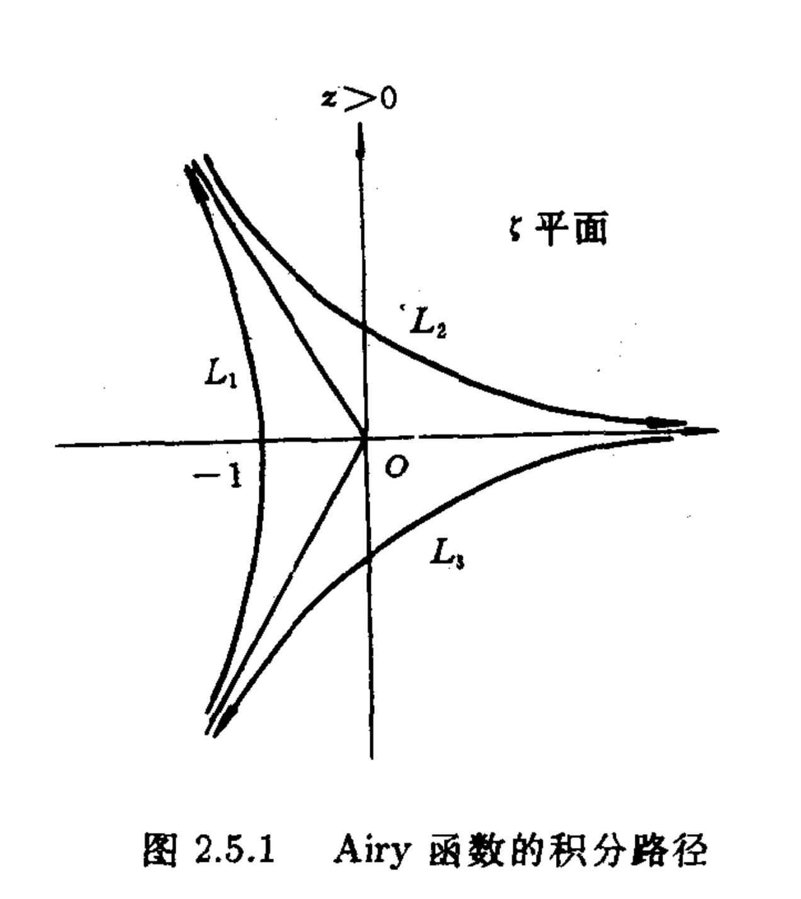
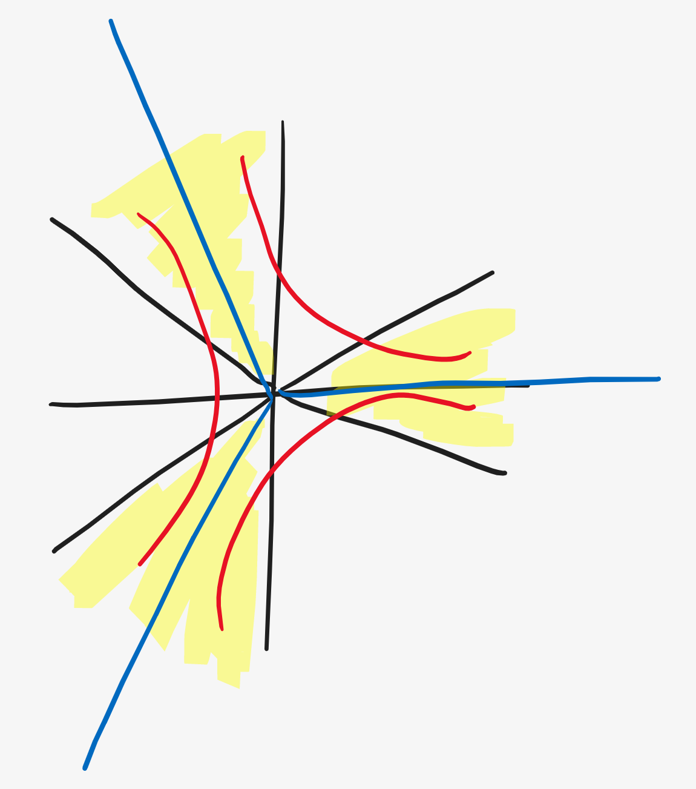
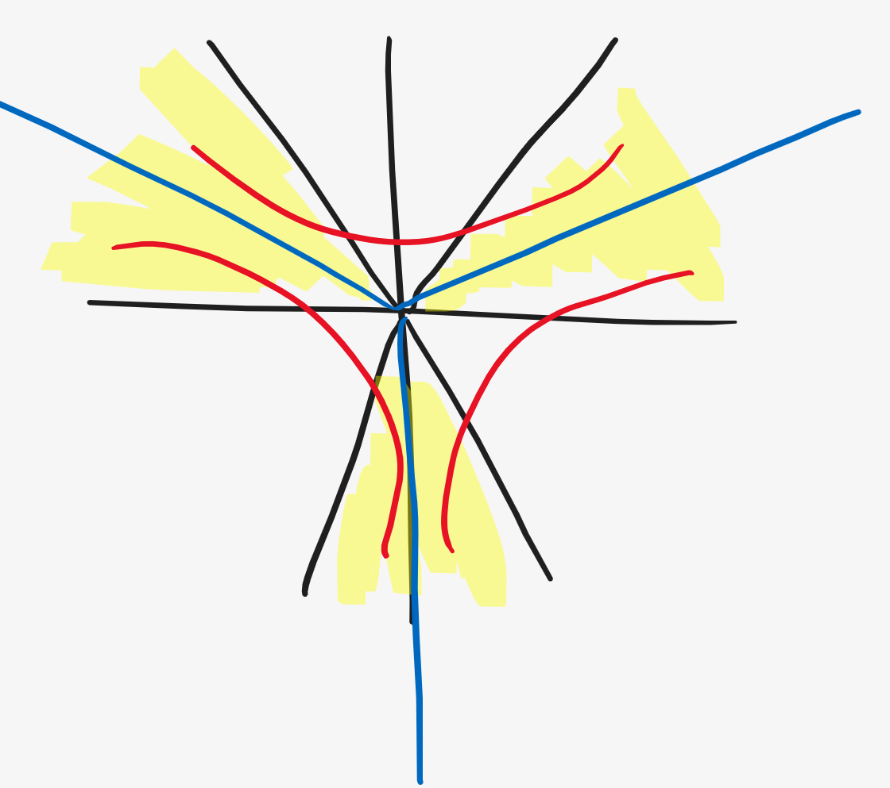

# 积分的渐进展开

## 逐项积分

对渐进级数一项一项积分

**例 2.1.1**

**当$\varepsilon \rightarrow 0$时，求积分$I(\varepsilon)=\int_{0}^{1} \sin \varepsilon x^{2} d x$的渐进展开**

对于小量$\varepsilon$,有渐进级数
$$
\sin \varepsilon x^{2}=\sum_{i=1}^{N} \frac{(-1)^{i+1}\left(\varepsilon x^{2}\right)^{2 i-1}}{(2 i-1) !}+O\left(\varepsilon^{2 N+1}\right)
$$
逐项积分有
$$
\begin{aligned} I(\varepsilon) &=\int_{0}^{1} \sum_{n=1}^{N} \frac{(-1)^{(i+1)}\left(\varepsilon x^{2}\right)^{2 i-1}}{(2 i-1) !} d x+O\left(\varepsilon^{2 N+1}\right) \\ &=\sum_{i=1}^{N} \frac{(-1)^{i+1} \varepsilon^{2 i-1}}{(2 i-1) !(4 i-1)}+O\left(\varepsilon^{2 N+1}\right) \end{aligned}
$$
所以有
$$
I(\varepsilon) \sim \sum_{i=1}^{\infty} \frac{(-1)^{i+1} \varepsilon^{2 i-1}}{(2 i-1) !(4 i-1)}
$$

**$\Gamma$函数**

$\Gamma(z)\Gamma(1-z) = \frac{\pi}{\sin\pi z}$

$\Gamma(\frac{1}{2}) = \sqrt{\pi}$

$\Gamma(z+1) = z\Gamma(z)$

$\int_0 ^1 x^{p-1}(1-x)^{q-1} dx = \frac{\Gamma(p)\Gamma(q)}{\Gamma(p+q)} = \int_0 ^\frac{\pi}{2} {\sin}^{2(p-1)}\theta\cos^{2(q-1)}\theta d\theta$
$$
\frac{\Gamma()}{\Gamma()}
$$

**例 2.1.2**

**求完全椭圆积分$I(m)=\int_{0}^{\frac{\pi}{2}} \frac{d \theta}{\sqrt{1-m \sin ^{2} \theta}}, \quad m \rightarrow 0$**

根据二项式定理（或泰勒展开），有

> $$
> (a+b)^{n}=\sum_{k=0}^{n} C_{n}^{k} a^{k} b^{n-k}
> $$

$$
\begin{array}{l}\left(1-m \sin ^{2} \theta\right)^{-\frac{1}{2}}=\sum_{i=0}^{\infty} \frac{(2 i-1) ! !}{2 i \cdot i !}\left(m \sin ^{2} \theta\right)^{i}\end{array}
$$

> $!!$表示双阶乘

逐项积分，有
$$
\begin{array}{l} 
I(m)
&=\sum\limits_{i=0}^{\infty} \frac{(2 i-1) ! !}{2^{i} i !} m^{i} \int_{0}^{\frac{\pi}{2}} \sin ^{2 i} \theta d \theta
\\
&\Downarrow \Gamma\left(\frac{1}{2}\right) = \sqrt{2}
\\
&=\sum\limits_{i=0}^{\infty} \frac{(2 i-1) ! !}{2^{i+1} i !}
\frac{\Gamma\left(i+\frac{1}{2}\right) \Gamma^{2}\left(\frac{1}{2}\right)}{\Gamma(i+1)}
\\
&=\sum\limits_{i=0}^{\infty} \frac{(2 i-1) ! !(2 i) ! \pi}{2^{3 i+1}(i !)^{3}} m^{i}
\\
&=\frac{\pi}{2}+\frac{\pi}{8} m+\frac{9 \pi}{128} m^{2}+\frac{25 \pi}{512} m^{3}+\frac{1225 \pi}{32768} m^{4}+\cdots
\end{array}
$$

>Wallis公式
>$$
>\begin{array}{l} 
>\int_{0}^{\frac{\pi}{2}} \sin ^{2n} x \mathrm{~d} x
>&=\int_{0}^{\frac{\pi}{2}} \cos ^{2n} x \mathrm{~d} s
>\\
>&=
>\frac{(2n-1)!!}{(2n)!!}\cdot \frac{\pi}{2} 
>\\
>&=\frac{\left(n-\frac{1}{2}\right)!}{n!}\frac{\pi}{2}
>\\
>&=\frac{\Gamma(n+\frac{1}{2})}{\Gamma(n+1)}\cdot\frac{\pi}{2}
>\end{array}
>$$
>另
>$$
>\mathrm{B}(x, y)
>=\frac{(x-1) !(y-1) !}{(x+y-1) !}
>=\frac{\Gamma(x) \Gamma(y)}{\Gamma(x+y)}
>$$
>
>$$
>\frac{(2 i-1) ! !}{(2 i) ! !}=\frac{(2 i-1) !}{2^{i} i !} \cdot \frac{(2 i) !!}{(2 i) ! !}=\frac{(2 i) !}{2^{2 i}(i!)^{2}}
>$$
>
>

**例 2.1.3**

**不完全$\Gamma$函数**
$$
\gamma(a, x)=\int_{0}^{x} e^{-t} t^{a-1} d t
$$
**的渐进展开**

将$e^{-t}$展开，有
$$
e^{-t}=\sum_{i=v}^{\infty} \frac{(-1)^{i}}{i} t^{i}
$$
逐项积分得渐进展开
$$
\gamma(a, x)=\sum_{i=0}^{\infty} \frac{(-1)^{i}}{i !} \int_{0}^{x} t^{i+a-1} d t=\sum_{i=0}^{\infty} \frac{(-1)^{i} x^{i+a}}{i !(i+a)}
$$

## 分部积分

$$
\int u(x) v^{\prime}(x) d x=u(x) v(x)-\int u^{\prime}(x) v(x) d x
$$

**2.1.4**

**不完全的$\Gamma$函数**
$$
\Gamma(a, x)=\Gamma(a)-\gamma(a, x)=\int_{x}^{\infty} e^{-t} t^{a-1} d t
$$
**求$x\rightarrow \infty$的渐进展开**

>不采用逐项积分，由于发散
>
>❓，第一项是有限值

由分部积分，
$$
\int_{x}^{\infty} e^{-t} t^{a-1} d t 
= e^{-t}t^{a-1} + \int e^{-t} t^{a} dt
$$
得递推公式
$$
\Gamma(a, x)=e^{-x} x^{a-1}+(a-1) \Gamma(a-1, x)
$$
可见$\Gamma$函数系数是一等差数列，利用
$$
\frac{\Gamma(a)}{\Gamma(a-N)} = (a-1)(a-2)(a-3)\cdots(a-N)
$$

> 任意等差数列连乘都可以用上式表示

得
$$
\Gamma(a, x)=e^{-x} \sum_{i=0}^{N-1} \frac{\Gamma(a)}{\Gamma(a-i)} x^{a-1-i}+\frac{\Gamma(a)}{\Gamma(a-N)} \int_{x}^{\infty} e^{-t} t^{a-N-1} d t
$$
接下来证明上式为渐进级数，只要第二项积分是第一项$x$部分的高阶小，就可以说明是渐进级数

把第二项记作余项$R_N$，使每个积分项都取最大值，对$R_N$在不改变阶数的情况下放大

>  不放大指数函数部分，即$e^{-x}$，则
>  $$
>  \int_x^\infin t^{a-N-1}dt = x^{a-n}
>  $$
>  升阶

放大幂函数部分，$t^{a-N-1}$放大到$x^{a-N-1}$（每个积分项取最大的$x$）,则
$$
R_{N}
=x^{a-N-1}\cdot \int_x^\infin e^{-t}dt 
$$
指数函数是幂函数的高阶无穷小，证明余项是第一项的高阶小

所以有渐进展开
$$
\Gamma(a, x) \sim e^{-x} \sum_{i=0}^{\infty} \frac{\Gamma(a)}{\Gamma(a-i)} x^{a-1-i}
$$

> $\int_0^\infin e^{-t^2}dt = \frac{\pi}{2}$
>
> 课本上又代入余误差函数，好像跟题干无关❓

**2.1.5**

**求大$x$时，下述积分**
$$
I(x)=\int_{0}^{\infty} \frac{e^{-t}}{(x+t)} d t
$$
**在$x\rightarrow\infty$时的渐近展开**

由分部积分得
$$
I(x)=\sum_{i=1}^{N} \frac{(-1)^{i-1}(i-1) !}{x^{i}}+(-1)^{N} N ! \int_{0}^{\infty} \frac{e^{-t} d t}{(x+t)^{N+1}}
$$
考虑余项$R_n$

> 放大指数部分总会导致变阶

$$
\left|R_{N}\right| \leq \frac{N !}{x^{N+1}} \int_{0}^{\infty} e^{-t} d t=O\left(\frac{1}{x^{N+1}}\right)
$$

所以有渐进级数
$$
I(x) \sim \sum_{i=0}^{\infty} \frac{(-1)^{i-1}(i-1) !}{x^{i}}
$$

## Laplace积分

由$\Gamma$函数推广到一般形式，
$$
\int_0^\infin f(t)e^{-t^m}dt
$$
**实Laplace积分**
$$
I(x)=\int_{a}^{b} f(t) e^{x h(t)} d t
$$

> 非$x\rightarrow\infin$处发散

$x\rightarrow \infin$可以渐进展开

> 小数也可以视为无穷远的邻域，可以使用该级数展开
>
> 正项幂级数展开，展开在（0，1）上，
>
> 负向幂级数展开，展开在（1，infin）上

为求上述积分的渐进展开，我们考虑指数项$e^{x h(t)} $在$x=\infty$附近的形式

$x\rightarrow\infty$时虽然$xh(t)\rightarrow\infty$，但$xh(t)$各处仍存在大小起伏，如下图所示

记$t_c$为$h(t)$的最大值横坐标，

再取$e$指数后，$t_c$附近的函数相比其他地方大的多，其他位置都是相对于$t_c$处的指数小项，因此Laplace积分的主要贡献来自于说明$t_c$处的函数值，其他部分可以忽略

如下图，纵轴取$\left[\frac{e^{xh(t)}}{e^{xh(t_c)}}\right] = e^{x[h(t)-h(t_c)]} = e^{x\cdot\Delta h}$，

因此可以只考虑$ab$内的积分，即可获得整体积分，

在峰值部分$ac$，由于一阶导为0，有平顶结构，但宽度趋于0，说明极值点邻域内，与邻域外不同

邻域内平缓，邻域外单调递减，

因此将积分分为单调递减部分$I_1$和平顶部分$I_2$，
$$
I(x) = I_1(x) + I_2(x)
$$
**单调递减部分**

> 引理，若在区间$[a,b]$中，$h'(t),h''(t)$存在连续、$h'(t)\ne 0$、$f'(t)$存在连续、$f(a)\cdot f(b)\ne 0$则有该区间的积分
> $$
> I(x)=\int_{a}^{b} f(t) e^{\dot{x h}(t)} d t=O\left(\frac{1}{x} e^{x \max (h(a), h(b))}\right)
> $$
> 

根据引理有$ab$单调段积分，后面说明是峰值的高阶无穷小
$$
I_1(x)=\int_{a+\delta}^{b} f(t) e^{\dot{x h}(t)} d t=O\left(\frac{1}{x} e^{x \max (h(a), h(b))}\right)
$$
由于$h'(t)\ne 0$，则分部积分，得
$$
\begin{array}{c}I_1(x)=\frac{f^{\prime}(b)}{h^{\prime}(b)} \frac{e^{x h(b)}}{x}-\frac{f^{\prime}(a)}{h^{\prime}(a)} \frac{e^{x h(a)}}{x}+r(x) \\ r(x)=-\frac{1}{x} \int_{a}^{b}\left[\frac{f(t)}{h^{\prime}(t)}\right]^{\prime} e^{x h(t)} d t\end{array}
\tag{1}
$$

> 根据单调增减，确定前两项那个是主要部分

再估计其余项$r(x)$大小，对$e$指数函数的系数放大
$$
|r(x)| \leq \frac{M}{x}\left|\int_{a}^{b} e^{x h(t)} h^{\prime}(t) d t\right|=\frac{M}{x^{2}}\left|e^{x h(b)}-e^{x h(a)}\right|
\\
M=\max \left|\left[\frac{f(t)}{h^{\prime}(t)}\right]^{\prime} \frac{1}{h^{\prime}(t)}\right|
$$
根据$h(a),h(b)$谁大谁小确定保留（1）式中的哪一项

**平顶部分**

记平顶宽度为$h$
$$
I_{1}(x)=\int_{a}^{a+\delta} f(t) e^{x h(t)} d t
$$

> 泰勒展开，中值定理$f(x) = f(a) + f(\eta)(x-a)$
>
> 用中值定理改变泰勒展开的系数

$a+\theta_2 h$说明是a，t中间某一点

积分系数第二项接近0，视为小项$\varepsilon$，是小项不是无穷小

------

在平顶处，考虑拉格朗日中值定理，
$$
\frac{f(t)-f(a)}{t-a} = f'(a+\theta_1 h)
\rightarrow 
f(t) = f(a) + f'(a+\theta_1 h)(t-a)
\\
\rightarrow 
h(t) = \frac{1}{2}h''(a+\theta_2 h)(t-a)^2 + h(a)
$$
其中，$\theta_1,\theta_2<0$

有
$$
I_{1}(x)=e^{x h(a)} \int_{a}^{a+\delta}\left[f(a)+f^{\prime}\left(a+\theta_{1} h\right)(t-a)\right] e^{\frac{1}{2} h^{\prime \prime}\left(a+\theta_{2} h\right)(t-a)^{2} x} d t
$$
其中，$h = t-a$

TODO

**Laplace积分定理**

综上，对于积分
$$
I(x)=\int_{a}^{b} f(t) e^{x h(t)} d t \quad x \rightarrow \infty
$$
有渐进级数
$$
I(x) \sim f(a) e^{x h(a)} \sqrt{\frac{-\pi}{2 x h^{\prime \prime}(a)}}
$$
相当于高度×宽度

## 驻相法

考虑一类高速振荡的积分❓想一下和实的区别
$$
I=\int_{a}^{b} f(t) e^{i x h(t)} d t, \quad x \rightarrow \infty
$$
对于$h(t)$

有$e^{ixh(t)},\quad x\rightarrow\infty$

根据$e^{ixh(t)} = \cos(xh(t)) - i\sin(xh(t))$

可以发现，在大部分区域内，$e^{ixh(t)}$高频振荡（可分离实部虚部考虑），但在$h(t)$极值点的邻域上无振荡；另，在边界上同样剩半边，不振荡，

因此，积分主要由极值点和边界处贡献

> 广义Riemann-Lebesgue引理
>
> 若函数$|f(t)|$可积，$h(t)$连续可微，$h(t)$在区间$[a,b]$的任一子区间上部位常数，则
> $$
> \lim _{x \rightarrow \infty} \int_{a}^{b} f(t) e^{i x h(t)} d t=0
> $$
> 引理：若在区间$[a,b]$中，$h'(t),h''(t)$存在，$h'(t)\ne 0, f'(t)$存在，$(\frac{f}{h'})'$绝对可积，$f(a)\cdot f(b)\ne 0$，则有积分（分部积分）
> $$
> \begin{aligned} I(x) &=\int_{a}^{b} f(t) e^{i x h(t)} d t \\ &=f(b) \frac{e^{i x h(b)}}{i x h^{\prime}(b)}-f(b) \frac{e^{i x h(a)}}{i x h^{\prime}(a)}+o\left(\frac{1}{x}\right) \end{aligned}
> $$
> 

**考虑严格单调部分**，由分部积分
$$
I(x)=f(b) \frac{e^{i x h(b)}}{i x h^{\prime}(b)}-f(a) \frac{e^{i x h(a)}}{i x h^{\prime}(a)}+r(x)
$$
余项满足
$$
r(x)=\frac{1}{x} \int_{a}^{b}\left[\frac{f(t)}{h^{\prime}(t)}\right]^{\prime} e^{i x h(t)} d t
$$
可以发现，前两项同阶，其量阶由$\frac{1}{x}$控制

估计余项量阶，证明其积分部分无穷小即可证明该项相对前面两项无穷小

由第一个引理，积分项趋于0，所以$r(x) = o(\frac{1}{x})$

可以看出积分的前两项描述了边界部分，其量阶相同为$\frac{1}{x}$

**考虑驻相点附近**，

根据引理有
$$
I(x)=\int_{a}^{a+\delta} f(t) e^{i x h(t)} d t+O\left(\frac{1}{x}\right)
$$
取极小值点$h''(t)>0$，做变换$h(t) = h(a)+u^2$

> $h(t) = h(a) + \frac{h''(a+\theta h)}{2}(t-a)^2$
>
> 记第二项为$u^2$

$$
I(x)=e^{i x h(a)} \int_{0}^{\varepsilon} f(t) \frac{d t}{d u} e^{i x u^{2}} d u+O\left(\frac{1}{x}\right)
$$

> $\varepsilon$也是个小量

由于$(t-a) = u \sqrt{\frac{2}{h''(a+\theta' u)}}$，

> 也可以理解为直接泰勒展开
>
> 先$t(u)$在$u=0$处展开，再逐项求导

$$
\frac{d t}{d u}=\sqrt{\frac{2}{h^{''}(a)}}\left(1+\sum_{i=1}^{\infty} C_{i} u^{i}\right)
=\sqrt{\frac{2}{h^{''}(a)}} +\sum_{i=1}^{\infty} C_{i} u^{i}
$$

> 也可以通过
>
> $h(t) = h(a) +u^2$，两侧对$u$求导
> $$
> h'(t)\frac{dt}{du} = 0+ 2u
> \\
> h''(t)(\frac{dt}{du})^2 + h'(t)\frac{d^2 t}{du^2} = 2
> \\\downarrow\\
> \frac{dt}{du} = \sqrt{\frac{2 - h'(t)\frac{d^2t}{du^2}}{h''(t)}} = \sqrt{\frac{2}{h''(a)}}(1+\sum ...)
> $$
> 解析函数无穷阶可导，可以泰勒展开或劳伦展开

同样泰勒展开，有
$$
f(t)=f(a)+\sum_{i=1}^{\infty} f_{i} u^{i}
$$
所以有
$$
I(x)=e^{i x h(a)} \int_{0}^{e}\left[f(a) \sqrt{\frac{2}{h^{\prime \prime}(a)}}+u \psi(u)\right] e^{i x u^{2}} d u++o\left(\frac{1}{x}\right)
$$

> $\psi(u)$是由两泰勒展开的高阶项相乘得出来的，用于简化形式

对$\psi$积分，
$$
\begin{aligned} \int_{0}^{\varepsilon} u \psi(u) e^{i x u^{2}} d u &=\frac{1}{2 i x}\left\{\left[e^{i x \varepsilon^{2}} \psi(\varepsilon)-\psi(o)\right]-\int_{0}^{\varepsilon} \psi^{\prime}(u) e^{i x u^{2}} d u\right\} \\ &=O\left(\frac{1}{x}\right) \end{aligned}
$$
得到
$$
I(x) \sim e^{i x h(a)} f(a) \sqrt{\frac{2}{h^{\prime \prime}(a)}} \int_{0}^{\varepsilon} e^{i x u^{2}} d u
$$

可以按照下图进行环路积分

> 选择幅角$\frac{\pi}{4}$的路径是因为只有这个能很方便的积分出来，可以保证$e$指数上是负实数，要是随便取带个虚单位又回到最初的问题上了

> 利用
> $$
> \int e^{-t}dt
> \\
> i = e^{i\frac{\pi}{2}}
> $$
> 积分路径变成
>
> 即在相位$\frac{\pi}{4}$的线上的积分可以算，然后进行环路积分（解析哈书环路积分为0） 

有环路积分
$$
\oint=\int_{0}^{\varepsilon}+\int_{C R}+\int_{\varepsilon e^{\frac{\pi}{4} i}}^{o} e^{i x u^{2}} d u
$$
其中，幅角0处，

估计弧线积分，有
$$
\left|\int_{C_{R}} e^{i x u^{2}} d u\right| \leq\left|\int_{0}^{\delta}+\int_{\delta}^{\frac{\pi}{4}} R e^{-x R^{2} \sin 2 \theta} d \theta\right|
$$

> 0处单独估计，0处跟别的有差别
>
> 小于等于，是把相位取了1，虚部变成1了

估计第二个积分
$$
\left|J_{2}\right| \leq \frac{\pi}{4} R e^{-x R^{2} \sin 2 \delta}=E S T, \quad \text { 当 } x \rightarrow \infty
$$
估计第一个积分
$$
\left|J_{1}\right| \approx\left|\int_{0}^{\delta} R e^{-2 x R^{2} \theta} d \theta\right|=\left|\frac{1-e^{-2 x R^{2} \delta}}{2 x R}\right|=O\left(\frac{1}{x}\right), \text { 当 } x \rightarrow \infty
$$
所以圆弧上的积分都忽略了

留数定理，（解析函数环路积分是0那个）有
$$
\int_{0}^{\varepsilon} e^{i x u^{2}} d u=\int_{0}^{\varepsilon e^{\frac{\pi}{4} i}} e^{i x u^{2}} d u
$$

所以有
$$
\begin{aligned} \int_{0}^{\varepsilon} e^{i x u^{2}} d u &=e^{i \frac{x}{4}} \int_{0}^{\varepsilon} e^{-x r^{2}} d r=e^{i \frac{\pi}{4}} \int_{0}^{\sqrt{x} \varepsilon} e^{-u^{2}} d u / \sqrt{x} \\ &=\frac{e^{i \frac{\pi}{4}}}{\sqrt{x}}\left(\int_{0}^{\infty} e^{-u^{2}} d u+O\left(e^{-x^{2}} / \sqrt{x}\right)\right) \\ &=\frac{1}{2} \sqrt{\frac{\pi}{x}} e^{i \frac{\pi}{4}}+E S T \end{aligned}
$$
这样，
$$
I=f(a) \sqrt{\frac{\pi}{2 x h^{\prime \prime}(a)}} e^{i\left(\frac{\pi}{4}+x h(a)\right)}+O\left(\frac{1}{x}\right)
$$
对于$h''(a)<O$时（极大值处），做变换$h(t)=h(a)-u^{2}$有
$$
I=f(a) \sqrt{\frac{\pi}{-2 \pi h^{\prime \prime}(a)}} e^{i\left(-\frac{\pi}{4}+x h(a)\right)}+O\left(\frac{1}{x}\right)
$$

考虑比较量阶，极值点处量阶为$O(\frac{1}{\sqrt{x}})$

$$
I(x) \sim f(a) \sqrt{\frac{\pi}{2 x\left|h^{\prime \prime}(a)\right|}} e^{i\left[x h(a)+\frac{\pi}{4} \mathrm{sg} n h^{\prime \prime}(a)\right]}
$$

其中，$\mathrm{sgnx}$为符号函数，$\mathrm{sgn}(x>0)=1,\mathrm{sgn}(x<0) = -1$，相当于分别取上下的环路积分

系数相当于宽度，相位项偏转$[-\frac{\pi}{4},\frac{\pi}{4}]$

  **驻相法积分定理**

对于积分，
$$
I=\int_{a}^{b} f(t) e^{i x h(t)} d t, \quad x \rightarrow \infty
$$
有
$$
I=f(a) \sqrt{\frac{\pi}{-2 \pi h^{\prime \prime}(a)}} e^{i\left(-\frac{\pi}{4}+x h(a)\right)}+O\left(\frac{1}{x}\right)
$$

其后面忽略的是同阶项，可见其精度小于忽略指数小项的Laplace积分

**求Bessel函数**
$$
J_{n}(x)=\frac{1}{\pi} \int_{0}^{\pi} \cos (x \sin t-n t) d t, \quad x \rightarrow \infty
$$
**的渐进表示**

表示成驻相形式
$$
J_{n}(x)=\operatorname{Re}\left[\frac{1}{\pi} \int_{0}^{\pi} e^{i(x \sin t-n t)} d t\right]
$$
其中，$Re$表示实部，$h(t) = \sin t,\quad f(t) = e^{-int}$

驻相点（极值点相位不变）在$t = \frac{\pi}{2}$处，由定理
$$
J_{n}(x) \sim \operatorname{Re}\left[\frac{2}{\pi} e^{-\frac{i n \pi}{2}} \sqrt{\frac{\pi}{2 x}} e^{i\left(x-\frac{\pi}{4}\right)}\right]=\sqrt{\frac{2}{\pi x}} \cos \left(x-\frac{n}{2} \pi-\frac{\pi}{4}\right)
$$
⭐由于是内点，左右两侧都有贡献，所以乘2

**高阶近似公式**

在前述定理里，是从二阶导数开始不为0的，

讨论高阶导数不为0

TODO

相位移动和h的第一个非零阶导数有关

## 最陡下降法

> ## 
>
> $f(z) = \mu(x,y)+i\nu(x,y)$
>
> 调和函数，$\nabla^2 \mu= 0\rightarrow \nabla\cdot \nabla \mu = 0$
>
> $\nabla^2\nu = 0$
>
> 
>
> $f(z) = z^2 =(x^2-y^2)+i(2xy)$
>
> 画图有
>
> 
>
> 则说明，$\mu$梯度的散度为0，说明，没有一点梯度纯粹朝外或朝里，任取一区间内不存在极值
>
> 中心点成为鞍点，其左右方向凹，上下方向也凹
>
> 
>
> 其极值只能处现在边界上

对于解析函数，$h(z)=\Phi(z)+i \psi(z)$，有积分
$$
I(x) = \int_c f(z)\cdot e^{xh(z)} \cdot dz
$$
可以发现，

当实部为常数时，该积分为驻相积分；

当虚部为常数时，该积分为Laplace积分；

由于Laplace积分优于驻相积分，并根据柯西积分定理考虑在复平面上取一条$\psi = const$的积分路径，

> 柯西积分定理说明，如果从一点到另一点有两个不同的路径，而函数在两个路径之间处处是全纯的，则函数的两个路径积分是相等的。另一个等价的说法是，单连通闭合区域上的全纯函数沿着任何可求长闭合曲线的积分是0.
>
> 因此，合理选择积分路径，可以简化问题

考虑积分
$$
I(x)=e^{i x \psi} \int_{C^{1}} f(z) e^{x \Phi(z)} d z
$$
对于解析函数，$\psi = const$的曲线与$\Phi = const$的曲线垂直，

即，沿着$\psi = const$的积分路径是沿着$\Phi$的法线方向的，因此该积分路径是**最速变化曲线**，

> 对于标量场，法线方向和梯度方向相同

再考虑实部$\Phi$在积分路径上的变化，有两种情形

1. 在$\psi = const$曲线上，$\Phi$没有极值点，则积分来自端点附近积分的贡献
2. 在$\psi = const$曲线上，$\Phi$有极值点，则积分来自极值点附近积分的贡献

对于情形2，

有$\frac{d\Phi}{dz} = \frac{\partial\Phi}{\partial x}+ \frac{\partial \Phi}{\partial y} = 0$

两侧对$y$求偏导有$\frac{\partial^2 \Phi}{\partial y \partial x} +\frac{\partial^2\Phi}{\partial y^2} = 0$

因为解析函数的实部虚部各自是调和函数，满足$\nabla^2 \Phi = \frac{\partial^2\Phi}{\partial x^2}+\frac{\partial^2\Phi}{\partial y^2} = 0$

所以，$\frac{\partial^2\Phi}{\partial x^2} = - \frac{\partial^2\Phi}{\partial y^2}$

所以，$\frac{\partial^2 \Phi}{\partial y \partial x} = -\frac{\partial^2\Phi}{\partial y^2}$

同理有，$\frac{\partial^2 \Phi}{\partial x \partial y} = -\frac{\partial^2\Phi}{\partial x^2}$

所以，记$\frac{\partial^2\Phi}{\partial y^2} = A$有黑塞行列式
$$
\left|\begin{array} 
{c}-A & A
\\
-A & A
\end{array}\right|
<0
$$
所以该极值点为**鞍点**，且积分主要由鞍点附近的积分所贡献，该方法称为鞍点法，此处是一个二阶驻点，

> 鞍点是非局域极值点的驻点，
>
> 一阶导为0且二阶不为0的称为一阶驻点，以此类推
>

考虑**二阶导数不为0**的情况的积分
$$
I(x) = \int_C f(z) e^{xh(z)}dz 
= e^{xh(z_0)} \int_{C'}f(z) e^{\frac{x}{2} h''(z_0)\cdot (z-z_0)^2}
$$
记，

$\omega = z- z_0 = s \cdot e^{i\theta}$，由于虚部为常数，$d\omega = dz,\quad ds = e^{i\theta}$

$h''(z_0) = |h''(z_0)| \cdot e^{i\alpha}$，复数转为指数式，

且由于鞍点处积分占主要贡献，有
$$
\begin{array}{l} 
I(x) &\sim e^{xh(z_0)}\int_{C'}f(z_0) \cdot e^{\frac{x}{2}\cdot |h''(z_0)|\cdot e^{i\alpha}\cdot \omega^2 } d\omega
\\
&= e^{xh(z_0)} f(z_0)

\int_{C'} e^{\frac{x}{2}\cdot |h''(z_0)|\cdot e^{i\alpha}\cdot s^2\cdot e^{i2\theta} } d\omega
\\
&= e^{xh(z_0)} f(z_0)

\int_{C'} e^{\frac{x}{2}\cdot |h''(z_0)|\cdot s^2\cdot e^{i(\alpha+2\theta)}}\cdot e^{i\theta} ds
\end{array}
$$
又考虑

$$
\begin{array}{l} 
h(z)&= h(z_0)+\frac{1}{2}\cdot |h''(z_0)|\cdot s^2\cdot e^{i(\alpha+2\theta)} 
\\
&= h(z_0)+\frac{1}{2}\cdot |h''(z_0)|\cdot s^2\cdot [\cos{(\alpha+2\theta)}-i\cdot \sin{(\alpha+2\theta)}]
\end{array}
$$
对于第二项，考虑为
$$
\begin{array}{l} 
g(z) &= A\cdot e^{i(\alpha+2\theta)} 
\\
&= \frac{1}{2}\cdot |h''(z_0)|\cdot s^2\cdot [\cos{(\alpha+2\theta)}-i\cdot \sin{(\alpha+2\theta)}]
\end{array}
$$
因为积分路径是最速变化曲线，虚部$\psi=const$ ，而系数$s$是随着$z$变化的，因此为使虚部为整数，

则$\sin(\alpha+2\theta) = 0$，即，$\alpha + 2\theta = n\pi$，

此时$\cos(\alpha+2\theta) = \pm1$，

> $\pm1$分别对应了最速上升和最速下降曲线

又为了为使$e^{\frac{x}{2}\cdot |h''(z_0)|\cdot s^2\cdot e^{i(\alpha+2\theta)}}$为负次幂，方便计算，即令$\cos(\alpha+2\theta) = -1$,

因此有$\theta = \frac{\pi}{2} - \frac{\alpha}{2}$，

因此，离开鞍点后积分路径沿着**最速下降曲线**

$$
\begin{array}{l} 
I&= e^{xh(z_0)} f(z_0) e^{\frac{\pi}{2}-\frac{\alpha}{2}}

\int_{-\infty}^{\infty} e^{-\frac{x}{2}\cdot |h''(z_0)|\cdot s^2} ds
\\
& =e^{x h\left(z_{0}\right)} f\left(z_{0}\right) \sqrt{\frac{2 \pi}{\left|h^{\prime \prime}\left(z_{0}\right)\right| x}} e^{\left(\frac{\pi}{2}-\frac{\alpha}{2}\right) i}
\end{array}
$$

取$\alpha = \pi$此时$h''(z_0)<0$为极大值点，得
$$
I = e^{x h\left(z_{0}\right)} f\left(z_{0}\right) \sqrt{\frac{-2 \pi}{h^{\prime \prime}\left(z_{0}\right) x}}
$$

> $\alpha = \frac{\pi}{2}$时，因为驻相有个$i$，同样保证是极大值点，同驻相法内点积分结果

### 高阶情况

考虑$h^{\prime}\left(z_{0}\right)=h^{\prime \prime}\left(z_{0}\right)=\cdots=h^{(m-1)}\left(z_{0}\right)=0, h^{(m)}\left(z_{0}\right) \neq 0$的情况，有
$$
h(z)=h\left(z_{0}\right)+\frac{1}{m !} h^{m}\left(z_{0}\right)\left(z-z_{0}\right)^{m}+\cdots \tag{4.1}
$$
因为
$$
\left(z-z_{0}\right)^{m}=r^{m}(\cos m \theta+i \sin m \theta)
$$
为方便，记$\mathrm{Arg}[h^{(m)}(z_0)] = 0$，

> 其他情形可由次情形旋转俯角得到

最陡下降条件，有
$$
\theta=\frac{k}{m} \pi
\qquad 
k=1, \quad 3, \quad 5, \cdots,(2 m-1)
$$
$k$表示最陡下降方向的幅角，共$m$个，

同理，$k=0, \quad 2, \quad 4, \cdots, 2 m$为最陡上升方向

| 二阶情形                                                     | 三阶情形                                                     |
| ------------------------------------------------------------ | ------------------------------------------------------------ |
|  |  |

对式(4.1)简化有形式
$$
h(z)=h\left(z_{0}\right)-\left(z-z_{0}\right)^{m} g(z)
$$
因为沿最速下降，虚部为常数，记$(z-z_0)^m g(z) = t^m$

> 其中，$g(z)$为实解析函数，满足
> $$
> g(z)=g_{0}+g_{1}\left(z-z_{0}\right)+\cdots
> $$
> 且，$g_0 \ne 0$

两边开$m$方有
$$
\left(z-z_{0}\right) R(z)=t
\\
R(z)=\sqrt[m]{g(z)}=R_{0}+R_{1}\left(z-z_{0}\right)+\cdots
$$
其中，$R_0 = g_0^{\frac{1}{m}}$

通过隐函数的渐进分析可以求得反函数$z(t)$
$$
z = z_0 + C_1 t + C_2 t^2 + ...
$$

> 可以得到公式，
> $$
> C_{n}=\left.\frac{1}{n !} \frac{d^{n-1}}{d z^{n-1}}\left[\frac{1}{R(z)}\right]^{n}\right|_{z\rightarrow z_0}
> $$

根据反函数有
$$
dz = \frac{dz}{dt}dz = dz\cdot\sum_{n}^\infty C_n t^{n}
$$

> 对应不同的$t\omega$可以对应不同的最速下降曲线，
>
> 跟$(z-z_0)^m = t^m$解得
>
> 其中，$\omega = e^{i\theta/m}$，（1的$m$次复根）

对于积分,
$$
I(x) = \int_c f(z)\cdot e^{xh(z)} \cdot dz
$$
有
$$
I(x) = \int_c f(z)\cdot e^{x[h(z_0)-t^m]} \cdot dz
\\
=  e^{x h(z_0)}\int_c f(z)\cdot e^{-xt^m} \cdot \frac{dz}{dt}dt
\\
= e^{x h(z_0)}\int_c \cdot e^{-xt^m}\sum_{n=0}^\infty A_n t^n dt
$$
其中，$\sum_{n=0}^\infty A_n t^n=f(z)\cdot \frac{dz}{dt}$

就得到了积分的完全渐进展开式

> 这个积分可以比较容易的积出来，就可以写出渐进展开

> 关于积分路径，一般会经过两条最速下降曲线

### 一个例子

对于解析函数$h(z) = z^2,\quad z = x+iy$，即
$$
h(z) = z^2 = (x^2 - y^2) + i(x\cdot y)
$$

| 实部                                                         | 虚部                                                         |
| ------------------------------------------------------------ | ------------------------------------------------------------ |
|  |  |

横轴x,纵轴y，颜色表示z

$(0,0)$点为鞍点，可以计算黑塞行列式，$\begin{pmatrix} 2&0\\ 0&-2 \end{pmatrix}<0$

可以发现，虚部与实部二者正交，在实部为常数方向上，虚部变化最快；在虚部为常数方向上，实部变化最快，为最速曲线

对函数$h(z)$考虑积分
$$
I(x) = \int_c f(z)\cdot e^{xh(z)} \cdot dz
$$
进一步有
$$
\int_c f(z)\cdot \exp\left\{x\cdot\left(\mathrm{Re}[h(x)+i\cdot\Im[h(x)]\right)\right\} \cdot dz
\\
= \int_c f(z)\cdot \exp\left[x\cdot\left(\varphi+i\psi \right)\right] \cdot dz
$$
当实部$\varphi=0$，时，有$\int_c f(z)\cdot \exp\left[x\cdot\left(i\psi \right)\right] \cdot dz$为驻相积分

当虚部$\psi = 0$时，有$\int_c f(z)\cdot \exp\left[x\cdot\left(\varphi \right)\right] \cdot dz$为Laplace积分

考虑虚部$\psi$为常数时，
$$
I(x) = e^{i\psi x}\int_{c_2} f(z)\cdot e^{x\varphi(z)} dz
$$
记积分起点为$a$，终点为$b$，考虑下图的积分路径

在路径①上，移动到$y= +\infty$处

$x:x_a\rightarrow 0,\quad y:y_a\rightarrow +\infty$，$\varphi:(x_a^2-y_a^2)\rightarrow -\infty$，

在路径②上，移动到$(0,+\infty)$处

$\varphi=\infty$不变

在路径③上，移动到$(0,-\infty)$处，该路径由一条最速上升曲线和一条最速下降曲线组成

$x=0$不变，$y:+\infty\rightarrow -\infty$，所以，$\varphi : -\infty\rightarrow 0 \rightarrow -\infty$

在路径④上，

$\psi=(x_b^2 - y_b^2)$不变

在路径⑤上，

$x:0\rightarrow x_b,\quad y:-\infty \rightarrow y_b$，$\varphi : -\infty\rightarrow (x_b^2 - y_b^2)$

综上，有$\varphi$在积分路径$c_z$上的变化

根据鞍点和$a,b$点处的$\varphi$值，有以下情况

1. $a>0,b$，此时根据Laplace定理，只考虑$a$点$\varphi$值，即有积分结果
2. $b>0,b$，同上，只考虑$b$

3. $0> a,b$，此时只考虑鞍点附近

## Airay函数和Stokes现象

### 定义

下述方程
$$
y^{\prime \prime}-x y=0
$$
称为Airay或Stokes方程

该方程有俩独立解的
$$
\mathrm{Ai}(x)=\frac{1}{\pi} \int_{0}^{\infty} \cos \left(\frac{t^{3}}{3}+x t\right) d t
\\
\mathrm{Bi}(x)=\frac{1}{\pi} \int_{0}^{\infty} e^{\left(-\frac{t^{3}}{3}+x t\right)}+\sin \left(\frac{t^{3}}{3}+x t\right) d t
$$
其中，$\mathrm{Ai}(x)$称为Airay函数，$\mathrm{Bi}(x)$称为第二Airay函数

扩展到复函数有
$$
\operatorname{Ai}(z)=\frac{1}{2 \pi i} \int_{C} \exp \left(\frac{t^{3}}{3}-z t\right) d t
$$
对
$$
u^{\prime \prime}(z)-z u=0
$$
Laplcae变换，有

> $\mathscr{L}$变换不同于$\mathscr{F}$的区别在于$\mathscr{L}$变换的是复数
>
> TODO

$$
u=\tilde{f}=\int_{C} e^{z \zeta} f(\zeta) d \zeta
$$

有性质，$\widetilde{f}$表示对$f$进行$\mathscr{L}$变换

1. $u'(z) = \widetilde{\zeta f} \rightarrow u''(z) = \widetilde{\zeta^2 f}$
2. $zu(z) = -\widetilde{f'(\zeta)}$

> 对于性质二，考虑在闭合路径上积分，
> $$
> \begin{array}{l} 
> z u(z)
> &\xlongequal{换积分微元}\int_{C} f(\zeta) d e^{z \zeta}
> \\
> &\xlongequal{分部积分}
> \left.f(\zeta) e^{z \zeta}\right|_{C}-\int_{C} f^{\prime}(\zeta) e^{z \zeta} d s
> \end{array}
> $$
> 有性质2成立条件，$C$为闭合路径，或$f(\zeta)e^{z\zeta}$在$C$两端的值相等或都趋于0

考虑上述两性质，Airy函数化为
$$
\int_{C}\left[\zeta^{2} f(\zeta)+f^{\prime}(\zeta)\right] e^{z \zeta} d s=0
$$
取$\left[\zeta^{2} f(\zeta)+f^{\prime}(\zeta)\right]=0$情况❓，有解
$$
f(\zeta) = e^{-\frac{\zeta^3}{3}}
\\
u(z)  =\int_C e^{z\zeta-\frac{\zeta^3}{3}}d\zeta
$$
为满足性质2条件：积分两端$e^{z\zeta - \frac{\zeta^3}{3}}=0$，要求$\mathrm{Re}(\zeta^3)>0$

> 只要实部大于0，在无穷处肯定收敛于0

有幅角
$$
\mathrm{Arg(\zeta)}
=
\left\{\begin{array}{l}-\frac{\pi}{6}<\theta<\frac{\pi}{6} \\ \frac{\pi}{2}<\theta<\frac{5}{6} \pi \\ \frac{7 \pi}{6}<\theta<\frac{3}{2} \pi\end{array}\right.
$$

### 渐进展开

记这$\zeta$平面上三个区域中的三个典型积分路径如下，

定义积分路径分别在$L_1,L_2,L_3$上的Airy函数为
$$
A i_{k}(z)=\frac{1}{2 \pi i} \int_{L_{k}} e^{z \zeta-\frac{1}{3} \zeta^{3}} d \zeta
\qquad
k = 1,2,3
\tag{5.1}
$$
有❓从哪来的，Airay方程的两个独立解有如下关系
$$
\begin{array}{l}\operatorname{Ai}(z)=A i_{1}(z) \\ B i(z)=A i_{2}(z)-A i_{3}(z)\end{array}
$$
对（5.1）指数部分$z \zeta-\frac{1}{3} \zeta^{3}$考虑，求驻点有
$$
h'(\zeta) = z-\zeta^2 = 0
\\
\zeta = \sqrt{z}
$$
为固定驻点，使与$z$无关，定义$s = \frac{\sqrt{z}}{\zeta}$，

则有驻点$s = \pm1$，可以计算黑塞行列式有
$$
\begin{vmatrix} +&-\\ +&- \end{vmatrix}<0
\qquad
\begin{vmatrix} -&+\\ -&+ \end{vmatrix}<0
$$
确定$s = \pm1$为二阶鞍点，则(5.1)化为
$$
2 \pi i A i(z)=z^{1 / 2} \int_{L_1} e^{z^{\frac{3}{2}}\left(s-\frac{s^{3}}{3}\right)} d s
$$
当$z\rightarrow \infty$时，该积分有两种情况，这两类幅角决定了是趋于正无穷还是负无穷

**①$\mathrm{Re}(z)>0$时，**

此时有$\mathrm{Arg}(z) = 0$，$s = \frac{\zeta}{\sqrt{z}} $，$\mathrm{Arg}(s) = \mathrm{Arg}(\zeta)$，

有s平面上的积分路径

可以发现，存在过鞍点$s =-1$的积分路径$L_1$，因此，鞍点取$s = -1$

积分路径拆解为
$$
2 \pi i A i(z)=z^{1 / 2} e^{-\frac{2}{3} z^{3 / 2}} \int_{L_{1}} e^{z^{3 / 2}(s+1)^{2}} d s
$$
根据最陡下降法二阶结果
$$
I=\int_{C} f(z) e^{x h(z)} d z 
=e^{x h\left(z_{0}\right)} f\left(z_{0}\right) \sqrt{\frac{-2 \pi}{h^{\prime \prime}\left(z_{0}\right) x}}
$$
取$f(z) = 1,x\rightarrow z^{\frac{3}{2}},h(z)\rightarrow h(s)=s-\frac{s^3}{3}$，有
$$
\begin{align} 
\int_{L_1} e^{z^{\frac{3}{2}}\left(s-\frac{s^{3}}{3}\right)} d s
&=e^{z^{\frac{3}{2}}h(-1)}f(-1)\sqrt{\frac{-2\pi}{h''(-1)z^{\frac{3}{2}}}}
\\
&=e^{z^{\frac{3}{2}}-2/3}\sqrt{\frac{i^2\pi}{z^{\frac{3}{2}}}}
\\\downarrow\\
\mathrm{Ai(z)} &\sim \frac{1}{2 \sqrt{\pi} z^{1 / 4}} \exp \left(-\frac{2}{3} z^{3 / 2}\right)
\end{align}
$$
**②$z<0$时，**

此时有$\mathrm{Arg}(z) =\pi$，$s = \frac{\zeta}{\sqrt{z}} $，$\mathrm{Arg}(s) = \mathrm{Arg}(\zeta-\frac{\pi}{2})$，

有s平面上的积分路径

可以发现，同时过鞍点$s = \pm 1$，

积分路径拆解为
$$
2 \pi i A i(z)=i|z|^{1 / 2} \int_{-L_{2}^{\prime}-L_{3}^{\prime}} e^{-i|z|^{3 / 2}\left(s-\frac{s^{3}}{3}\right)} d s
$$
分别最陡下降法有
$$
2 \pi i A i(z)=i \sqrt{\pi}|z|^{-\frac{1}{4}}\left[e^{\left(\frac{2}{3}|z|^{3 / 2}-\frac{\pi}{4}\right) i}+\epsilon^{\left(-\frac{2}{3}|z|^{3 / 2}-\frac{\pi}{4}\right) i}\right]
\\
\begin{aligned} A i(z) & \sim \frac{1}{\sqrt{\pi}|z|^{\frac{1}{4}}} \cos \left(\frac{2}{3}|z|^{3 / 2}-\frac{\pi}{4}\right) \\ &=\frac{1}{\sqrt{\pi}|z|^{\frac{1}{4}}} \sin \left(\frac{2}{3}|z|^{\frac{3}{2}}+\frac{\pi}{4}\right) \end{aligned}
$$
综上，有Airay的渐进表示
$$
A i(z) \sim\left\{\begin{array}{ll}\frac{1}{2 \sqrt{\pi} z^{\frac{1}{4}}} \exp \left(-\frac{2}{3} z^{\frac{3}{2}}\right) & z \rightarrow+\infty \\ \frac{1}{\sqrt{\pi}|z|^{\frac{1}{4}}} \sin \left(\frac{2}{3}|z|^{3 / 2}+\frac{\pi}{4}\right) & z \rightarrow-\infty\end{array}\right.
$$

- 可以看到函数的渐近展开在射线 $\theta = \frac{\pi}{2}$处发生了变化。这里的射线 就$\theta = \frac{\pi}{2}$是所谓的anti-Stokes lines, 而射线  $\theta = \frac{3\pi}{2}$是Stokes lines。这种现象称为**Stokes现象**

- 可以发现，Airay振荡解和指数解在0处不重合，不符合一般的渐进展开定义，而满足Poincare意义上的渐进定义，即两者相差一个$O(\frac{1}{z})$

### 任意幅角的渐进展开

直接给出⭐咋来的
$$
A i(z) \sim a_{1} z^{-\frac{1}{4}} e^{-\frac{2}{3} z^{3 / 2}} \sum_{n=0}^{\infty}(-1)^{n} C_{n} z^{-\frac{3}{2} n}+a_{2} z^{-\frac{1}{4}} e^{\frac{2}{3} z^{\frac{3}{2}}} \sum_{n=0}^{\infty} C_{n} z^{-\frac{3}{2} n}
$$
其中，$C_0 = 1$，
$$
a_{1}=\left\{\begin{array}{l}\frac{1}{2 \sqrt{\pi}} \\ \frac{1}{2 \sqrt{\pi}} \\ \frac{1}{2 \sqrt{\pi}}\end{array} \qquad a_{2}=\left\{\begin{array}{ll}0 & |\operatorname{Arg} z|<\frac{2}{3} \pi \\ \frac{i}{2 \pi} & \frac{\pi}{3}<\operatorname{Arg} z<\frac{5}{3} \pi \\ \frac{-i}{2 \pi} & -\frac{5}{3} \pi<\operatorname{Arg} z<-\frac{\pi}{3}\end{array}\right.\right.
$$

## Watson引理及其应用

考虑积分，
$$
F(p)=\int_{0}^{\infty} e^{-p t} f(t) d t
$$
若$f(t)$在$|t| \leq R+\delta, \quad|\operatorname{Arg} t| \leq \Delta<\pi$内解析，并有如下展开式
$$
f(t)=\sum_{m=1}^{\infty} a_{m} t^{\frac{m}{r}-1}
$$
在$t>R$时，$|f(t)|<K e^{s_{0} t}$成立，则$f(t)$的$\mathscr{L}$变换$F(p)$有渐进展开
$$
F(p) \sim \sum_{m=1}^{\infty} a_{m} \Gamma\left(\frac{m}{r}\right) p^{-\frac{m}{r}}, \quad|\operatorname{Arg} p| \leq \frac{\pi}{2}-\varepsilon
$$

TODO

