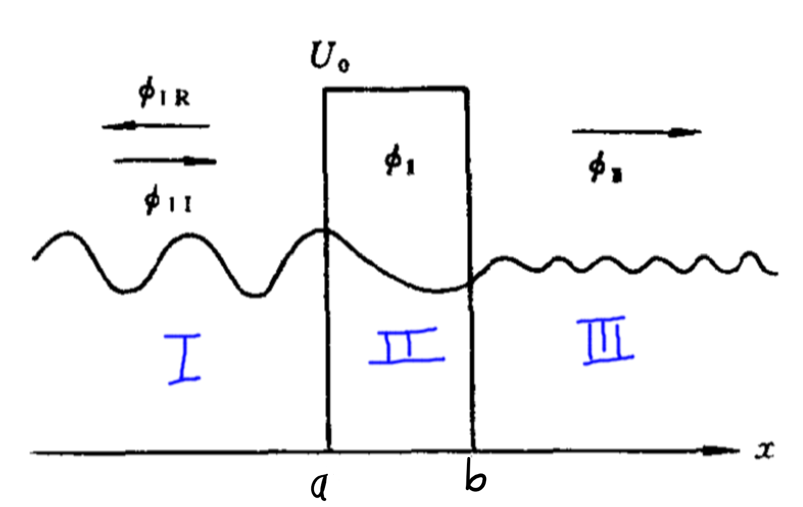
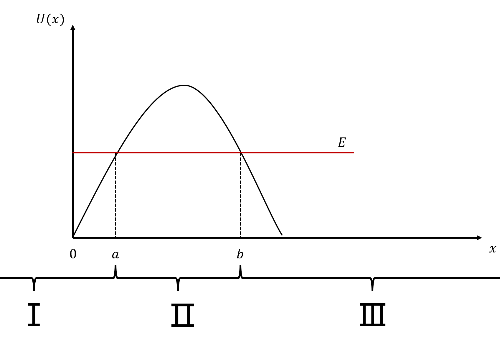
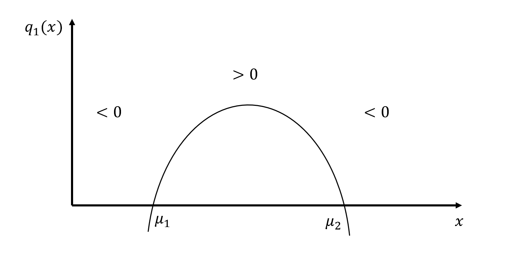

WKB方法用于解决一类含有大参数的微分方程
$$
y^{\prime \prime}+\left[\lambda^{2} q_{1}(x)+q_{n}(x)\right] y=0
\label{eq1}
$$
$\lambda\rightarrow \infty$时解的渐进行为

其中，自变量$x$也可以看作复数域

# 无转向点的WKB解

当方程$\eqref{eq1}$无转向点时，即没有$q_1(x)= 0$的点情况的通解

> 转向点也就是导数为0的点
>
> 对于方程$\eqref{eq1}$，由于$\lambda$是大参数，$q_n$相比于$\lambda^2 q_1$可以忽略，
>
> 因此，当$q_1$正定或负定时，方程没有转向点
>
> 而当$q_1$跨过0，则方程有转向点

首先进行Liouville-Green变换，令
$$
\begin{array}{l}z=\varphi(x) \\ v=\psi(x) y(x)\end{array}
$$

> 注意原方程中的$y(x)$未必能写成两含$x$的因子相乘的形式
>
> 因此该变换实际是为了求解的是一类特殊情形

$\eqref{eq1}$化为
$$
\frac{d^{2} v}{d z^{2}}+\frac{1}{\varphi^{\prime 2}}\left(\varphi^{\prime \prime}-\frac{2 \varphi^{\prime} \psi^{\prime}}{\psi}\right) \frac{d v}{d z}
+\frac{1}{\varphi^{\prime 2}}\left[\lambda^{2} q_{1}+q_{2}-\psi\left(\frac{\psi^{\prime}}{\psi^{2}}\right)^{\prime}\right] v=0
\label{eq3}
$$
> 先对原方程做变换
> $$
> y(x) \left(\lambda ^2 \text{q1}(x)+\text{q2}(x)\right)+y''(x)=0\text{/.}\, \left\{y(x)\to \frac{v(x)}{\psi (x)},y''(x)\to \frac{\partial ^2}{\partial x^2}\frac{v(x)}{\psi (x)}\right\}
> $$
> 有
> $$
> \frac{v(x) \left(\lambda ^2 \text{q1}(x)+\text{q2}(x)\right)}{\psi (x)}+\frac{v''(x)}{\psi (x)}-\frac{2 v'(x) \psi '(x)}{\psi (x)^2}+v(x) \left(\frac{2 \psi '(x)^2}{\psi (x)^3}-\frac{\psi ''(x)}{\psi (x)^2}\right)=0
> $$
> 再做变换
> $$
> \frac{v(x) \left(\lambda ^2 \text{q1}(x)+\text{q2}(x)\right)}{\psi (x)}+\frac{v''(x)}{\psi (x)}-\frac{2 v'(x) \psi '(x)}{\psi (x)^2}+v(x) \left(\frac{2 \psi '(x)^2}{\psi (x)^3}-\frac{\psi ''(x)}{\psi (x)^2}\right)=0\text{/.}\, \left\{v'(x)\to v'(z) \frac{\partial \phi (x)}{\partial x},v''(x)\to \left\{\frac{\partial }{\partial x}\left(\frac{\partial \phi (x)}{\partial x} v'(z(x))\right)\text{/.}\, z'(x)\to \phi '(x)\right\}\right\}
> $$
> 有
> $$
> \left\{\frac{v(x) \left(\lambda ^2 \text{q1}(x)+\text{q2}(x)\right)}{\psi (x)}-\frac{2 v'(z) \psi '(x) \phi '(x)}{\psi (x)^2}+\frac{\phi '(x)^2 v''(z(x))+\phi ''(x) v'(z(x))}{\psi (x)}+v(x) \left(\frac{2 \psi '(x)^2}{\psi (x)^3}-\frac{\psi ''(x)}{\psi (x)^2}\right)\right\}=0
> $$
> Simplify得
> $$
> \frac{v(x) \psi (x)^2 \left(\lambda ^2 \text{q1}(x)+\text{q2}(x)\right)-2 \psi (x) v'(z) \psi '(x) \phi '(x)+\psi (x)^2 \left(\phi '(x)^2 v''(z(x))+\phi ''(x) v'(z(x))\right)+v(x) \left(2 \psi '(x)^2-\psi (x) \psi ''(x)\right)}{\psi (x)^3}=0
> $$
> 约去分母
> $$
> \lambda ^2 \text{q1}(x) v(x) \psi (x)^2+\text{q2}(x) v(x) \psi (x)^2+\psi (x)^2 \phi '(x)^2 v''(z(x))+\psi (x)^2 \phi ''(x) v'(z(x))-2 \psi (x) v'(z) \psi '(x) \phi '(x)-v(x) \psi (x) \psi ''(x)+2 v(x) \psi '(x)^2=0
> $$
> 对$v,v',v''$分类
> $$
> \begin{aligned} 
> &v(x) \left(\lambda ^2 \text{q1}(x) \psi (x)^2+\text{q2}(x) \psi (x)^2-\psi (x) \psi ''(x)+2 \psi '(x)^2\right)
> \\+
> &\psi (x) v'(z(x)) \left(\psi (x) \phi ''(x)-2 \psi '(x) \phi '(x)\right)
> \\+
> &\psi (x)^2 \phi '(x)^2 v''(z(x))
> =0
> \end{aligned}
> $$
> 各项除$\psi (x)^2 \phi '(x)^2$有
> $$
> \begin{aligned} 
> &\frac{v(x) \left(\lambda ^2 \text{q1}(x) \psi (x)^2+\text{q2}(x) \psi (x)^2-\psi (x) \psi ''(x)+2 \psi '(x)^2\right)}{\psi (x)^2 \phi '(x)^2}
> \\+
> &\frac{\psi (x) \phi ''(x) v'(z(x))-2 v'(z) \psi '(x) \phi '(x)}{\psi (x) \phi '(x)^2}
> \\+
> &v''(z(x))
> =0
> \end{aligned}
> $$
> 一、二提取$v/\phi'^2$和$v'/\phi'^2$，有
> $$
> \lambda ^2 \text{q1}(x)+\text{q2}(x)-\frac{\psi ''(x)}{\psi (x)}+\frac{2 \psi '(x)^2}{\psi (x)^2}
> \\
> \phi ''(x)-\frac{2 \psi '(x) \phi '(x)}{\psi (x)}
> $$
> 利用，
> $$
> \psi (x) \frac{\partial }{\partial x}\frac{\psi '(x)}{\psi (x)^2}=\frac{\psi ''(x)}{\psi (x)}-\frac{2 \psi '(x)^2}{\psi (x)^2}
> $$
> 即得到结果

对于第二项，即一阶项，因为原方程就没有一阶项，因此让一阶项为0，即
$$
\varphi^{\prime \prime}-\frac{2 \varphi^{\prime} \psi^{\prime}}{\psi}=0
$$
移项并积分，有
$$
\varphi^{\prime}=\psi^{2}
\label{eq5}
$$
对于第三项，即零阶项，由于$\lambda$是大参数，近似为
$$
\frac{1}{\varphi^{\prime 2}}\left[\lambda^{2} q_{1}+q_{2}-\psi\left(\frac{\psi^{\prime}}{\psi^{2}}\right)^{\prime}\right]v
\sim
\frac{1}{\varphi^{\prime 2}}\left[\lambda^{2} q_{1}\right]v
$$
并为了保证最后一项是常系数的，要求
$$
\varphi^{\prime 2}=q_{1}
\label{eq7}
$$
根据$\eqref{eq5},\eqref{eq7}$，可以得到
$$
\begin{array}{l}\psi=\left[q_{1}(x)\right]^{\frac{1}{4}} \\ \varphi=\int^{x} \sqrt{q_{1}(\tau)} d \tau\end{array}
$$
则方程$\eqref{eq3}$简化为
$$
\frac{d^{2} v}{d z^{2}}+\lambda^{2} v=\delta v
\label{eq9}
$$
其中，$\delta=\frac{1}{4} \frac{q_{1}^{\prime \prime}}{q_{1}^{2}}-\frac{5}{16} \frac{q_{1}^{2}}{q_{1}^{3}}-\frac{q_{2}}{q_{1}}$

若在研究的取与内，$q_1\ne 0$，$q_1(x)$两次连续可微，$q_2$无奇点，$\delta$与$\lambda$相比是小量，所以，方程$\eqref{eq9}$的渐进解的首项为

> $\eqref{eq9}$是各Airay函数，因此有振荡解

$$
v \sim a \cos \lambda z+b \sin \lambda z, \quad \lambda \rightarrow \infty
$$

变换得到原方程$\eqref{eq1}$的渐进解首项，
$$
y \sim\left\{\begin{align}
&\frac{a \cos \left[\lambda \int \sqrt{q_{1}(\tau)}\right] d \tau+b \sin \left[\lambda \int \sqrt{q_{1}(\tau)} d \tau\right]}{\left[q_{1}(x)\right]^{\frac{1}{4}}} 
\qquad &q_{1}(x)>0, \quad \lambda \rightarrow \infty  
\label{eq11}
\\
&\frac{a \exp \left[-\lambda \int \sqrt{-q_{1}(\tau)} d \tau\right]+b \exp \left[\lambda \int \sqrt{-q_{1}(\tau)} d \tau\right]}{\left[-q_{1}(x)\right]^{\frac{1}{4}}} 
\qquad &q_1(x)<0 , \quad \lambda \rightarrow \infty
\label{eq12}
\end{align}\right.
$$

当$q_1(x)>0$时，为振荡解；当$q_1(x)<0$时，为指数解

## 指数近似法

考虑几何光学近似❓
$$
y(x) \sim \exp \left[\lambda \sum_{n=0}^{\infty} \lambda^{-n} s_{n}(x)\right]
\label{eq13}
$$
微分，
$$
\begin{array}{l}
y^{\prime}(x) \sim\left[\lambda \sum\limits_{n=0}^{\infty} \lambda^{-n} s_{n}^{\prime}(x)\right] \exp \left[\lambda \sum\limits_{n=0}^{\infty} \lambda^{-n} s_{n}(x)\right] 
\\
y^{\prime \prime}(x) \sim\left\{\lambda^{2}\left[\sum\limits_{n=0}^{\infty} \lambda^{-n} s_{n}^{\prime}(x)\right]^{2}+\lambda \sum\limits_{n=0}^{\infty} \lambda^{-n} s_{n}^{\prime \prime}(x)\right\} \exp \left[\lambda \sum\limits_{n=0}^{\infty} \lambda^{-n} s_{n}(x)\right]
\end{array}
$$
>  以$\lambda$来区分量阶，
>
> 仅考虑首项时，$q_2$可忽略

代入原方程$\eqref{eq1}$，并对其次幂有
$$
\begin{array}{l}s_{0}^{\prime 2}=-q_{1}(x) \\ 2 s_{0}^{\prime} s_{1}^{\prime}+s_{0}^{\prime \prime}=0 \\ 2 s_{0}^{\prime} s_{2}^{\prime}+s_{1}^{\prime \prime}+s_{1}^{\prime 2}=-q_{2}(x) \\ 2 s_{0}^{\prime} s_{n}^{\prime}+s_{n-1}^{\prime \prime}+\sum_{j=1}^{n-1} s_{j}^{\prime} \cdot s_{n-j}^{\prime}=0, \quad n>2\end{array}
$$
解得
$$
\begin{align}
&s_{0}(x)=\pm \int \sqrt{-q_{1}(\tau) d \tau} \label{eq15}
\\
&s_{1}(x)=-\frac{1}{2} \ln s_{0}^{\prime}=-\frac{1}{4} \ln \left[-q_{1}(x)\right] \label{eq16}
\end{align}
$$
$\eqref{eq15},\eqref{eq16}$代入$\eqref{eq13}$同样有WKB解，$\eqref{eq11},\eqref{eq12}$

## 成立条件

从指数近似法的推导过程，可以看出WKB成立的条件

1. ${\frac{s_{n+1}(x)}{s_{n}(x)}}$ 有界, 这是渐近展开式的要求;
2. 由渐近解的定义, 还要求${
\frac{y(x)-\exp \left[\lambda \sum_{n=0}^{N} \lambda^{-n} s_{n}(x)\right]}{y(x)} \ll 1
}$，即, 要求解的相对误差很小, 这就相当于:${
\lambda^{-n} s_{n+1}(x) \ll 1
}$

由于我们所能精确求解的微分方程数量极其有限, 即使二阶线 性变系数方程, 也只有少数几种方程可用特殊函数来表示. 因此, WKB 近似可以对任意的 ${q_{1}(x), q_{2}(x)}$ 获得通解, 这确实是有相当重 要意义的. 当然, 这里附加的条件是必须含有大参数 ${\lambda}$.

## 例题

### 5.1.1

**求下述方程的初值问题**
$$
\begin{array}{l}y^{\prime \prime}=\lambda^{2} Q(x) y, \quad Q(x)>0 \\ y(0)=A, \quad y^{\prime}(0)=B\end{array}
$$
记$q_1(x) = -Q(x)<0$

有WKB解
$$
\begin{aligned} 
y 
&= \frac{a \exp \left[-\lambda \int \sqrt{-q_{1}(\tau)} d \tau\right]+b \exp \left[\lambda \int \sqrt{-q_{1}(\tau)} d \tau\right]}{\left[-q_{1}(x)\right]^{\frac{1}{4}}}
\\
&= \frac{a \exp \left[-\lambda \int \sqrt{Q(\tau)} d \tau\right]+b \exp \left[\lambda \int \sqrt{Q(\tau)} d \tau\right]}{\left[Q(x)\right]^{\frac{1}{4}}}
\end{aligned}
$$
根据双曲函数
$$
\sinh x=\frac{e^{x}-e^{-x}}{2} 
\qquad
\cosh x=\frac{e^{x}+e^{-x}}{2}
$$
解可化为

> 积分限是可以任取的，这里取0到x是因为后面用边界条件好算

$$
y=\frac{1}{\sqrt[4]{Q(x)}}\left[a \operatorname{ch} \lambda \int_{0}^{x} \sqrt{Q(\tau)} d \tau+b \operatorname{sh} \lambda \int_{0}^{x} \sqrt{Q(\tau)} d \tau\right]
$$

和
$$
y' = \frac{a \lambda  \sqrt{Q(x)} \sinh \left(\lambda  \int \sqrt{Q(x)} \, dx\right)+b \lambda  \sqrt{Q(x)} \cosh \left(\lambda  \int \sqrt{Q(x)} \, dx\right)}{\sqrt[4]{Q(x)}}-\frac{Q'(x) \left(a \cosh \left(\lambda  \int \sqrt{Q(x)} \, dx\right)+b \sinh \left(\lambda  \int \sqrt{Q(x)} \, dx\right)\right)}{4 Q(x)^{5/4}}
$$
再由初始条件

> 利用$\sinh{0} = 0,\quad \cosh{0} = 1$
>
> $\sinh'x = \cosh x,\quad \cosh'x=\sinh x$

$$
\begin{aligned}
A &= y(0) = \frac{a}{\sqrt[4]{Q(0)}} 
\\
B &= y'(0) = b \lambda  \sqrt[4]{Q(0)}-\frac{a Q'(0)}{4 Q(0)^{5/4}}
\\&= \left(-\frac{1}{4}\right) Q(0)^{-\frac{5}{4}} Q(0)^{\prime} a+Q(0)^{\frac{1}{4}} b \lambda
\end{aligned}
$$

所以有
$$
a=A \sqrt[4]{Q(0)}
\\
b = \frac{\frac{A q'(x)}{4 q(x)}+B}{\lambda  \sqrt[4]{q(x)}}
$$
代入得$y$解

❓离大谱，算的都不一样

### 5.1.2

**求解边值问题**
$$
\begin{array}{l}\varepsilon y^{\prime \prime}+y=0 \\ y(0)=0, \quad y(1)=1\end{array}
$$
的渐进解

取$Q(x) = -1<0,\lambda = \frac{1}{\sqrt{\varepsilon}}$，有方程
$$
y'' - \lambda^2\cdot Q(x)\cdot y= 0
$$
有WKB解
$$
y(x) \sim c_{1} \cos \frac{x}{\sqrt{\varepsilon}}+c_{2} \sin \frac{x}{\sqrt{\varepsilon}}
$$
代入边界条件能确定$c_1,c_2$，有
$$
y=\frac{\sin \frac{x}{\sqrt{\varepsilon}}}{\sin \frac{1}{\sqrt{\varepsilon}}}
$$

### 5.1.3

**讨论本征值问题**
$$
\begin{array}{l}y^{\prime \prime}+E(\pi+x)^{4} y=0 \\ y(0)=y(\pi)=0\end{array}
$$
取，$q_1 = (\pi+x)^4>0$，有WKB解
$$
y \sim \frac{1}{\pi+x}\left[c \sin \sqrt{E} \int_{0}^{x} \sqrt{Q(\tau)} d \tau+d \cos \sqrt{E} \int_{0}^{x} \sqrt{Q(\tau)} d \tau\right]
$$
并且
$$
\begin{aligned} 
y(0) &\sim \frac{1}{\pi}\left[d \cos \sqrt{E} \right] =0
\end{aligned}
$$
所以，$d = 0$

再
$$
\begin{aligned} 
y(\pi)&\sim \frac{1}{2\pi}\left[c \sin \sqrt{E} \int_{0}^{\pi} \sqrt{Q(\tau)} d \tau+d \cos \sqrt{E} \int_{0}^{\pi} \sqrt{Q(\tau)} d \tau\right]
\\
&\sim \frac{1}{2\pi}\left[c \sin \sqrt{E} \frac{7 \pi ^3}{3}+d \cos \sqrt{E} \frac{7 \pi ^3}{3}\right] 
\\
&\sim \frac{1}{2\pi}\left[c \sin \sqrt{E} \frac{7 \pi ^3}{3}\right] 
= 0
\end{aligned}
$$
所以，
$$
\sqrt{E} \frac{7 \pi ^3}{3} = n\pi
$$
解得本征值
$$
E_{n} \sim \frac{9 n^{2}}{49 \pi^{4}}
$$
各能级有对应本征函数
$$
y_{n} \sim \frac{c_{n}}{\pi+x} \sin \left[\frac{n}{7 \pi^{2}} x\left(3 \pi^{2}+3 \pi x+x^{2}\right)\right]
$$
归一化要求

> 这是个边值问题，即函数的边界是$0,\pi$，因此积分限是$0,\pi$
>
> 带Q是因为，可以证明
> $$
> \int_{0}^{\pi} d x y_{m}(x) y_{m}(x) Q(x)=0, n \neq m

> $$
> 通过分布积分，可以证明
>
> 即，$\{\sqrt{Q(x)}y_n(x)\}$，也是各正交完备集，因此可以对这个完备集归一

$$
\int_{0}^{\pi} Q(x) y_{n}^{2}(x) d x=1
$$

即
$$
c_{n}^{2} \int_{0}^{\pi} \sqrt{Q(x)} \sin ^{2} \sqrt{E_{n}} \int_{0}^{x} \sqrt{Q(\tau)} d \tau d x=1
$$
令
$$
u=\sqrt{E_{n}} \int_{0}^{x} \sqrt{Q(\tau)} d \tau
$$
有
$$
\frac{c_{n}^{2}}{\sqrt{E_{n}}} \int_{0}^{n \pi} \sin ^{2} u d u=1
$$
所以
$$
c_{n}=2^{\frac{1}{2}} E_{n}^{\frac{1}{4}} / \sqrt{n \pi}=\sqrt{\frac{6}{7 \pi^{3}}}
$$
有一个归一化的本征函数
$$
y_{n} \sim \sqrt{\frac{6}{7 \pi^{3}}}\left[\sin \frac{n}{7 \pi^{2}} x\left(3 \pi^{2}+3 \pi x+x^{2}\right)\right] /(\pi+x)
$$

# 有转向点的一致有效渐进

当$q_1(x)$在所讨论的区域中有零点时，上述结论不成立

为处理有转向点情形，考虑分为几个区域求解，再进行匹配，或，通过Langer变换直接求在整个区域内的已知有效渐进解

## 匹配法

设在$x = \mu$处有零点
$$
q_1(x) = (x-\mu)f(x)
$$

> 该零点为一阶零点，$f(x)$无零点
>
> 二阶零点形式为：$q_1(x) = (x-\mu)^2f(x)$

设$f(x)>0$，此时原WKB解$\eqref{eq11},\eqref{eq12}$不适用，

在$x = \mu$邻域上做变换
$$
\xi = (x-\mu)\lambda^\nu
\quad \nu>0
\\\downarrow\\
x = \xi\lambda^{-\nu} +\mu
\label{eq24}
$$

> 此变换将坐标原点移动到$\mu$，并将邻域放大到整个坐标轴上
>
> 这样对于$\mu$两边各自无转向点

将变换$\eqref{eq24}$代入$\eqref{eq1}$有
$$
\begin{align} 
\frac{\dd{}^2 y}{{(\frac{\dd x}{\dd \xi}\dd\xi)}^2} 
+
\left[
\xi\lambda^{2-\nu}f(\xi\lambda^{-\nu} +\mu)+q_2(\xi\lambda^{-\nu} +\mu)
\right]y
=0
\\
\frac{\dd{}^2 y}{\lambda^{-2\nu}\dd {\xi}^2} 
+
\left[
\xi\lambda^{2-\nu}f(\xi\lambda^{-\nu} +\mu)+q_2(\xi\lambda^{-\nu} +\mu)
\right]y
=0
\\
\frac{\dd{}^2 y}{\dd {\xi}^2} 
+
\left[
\xi\lambda^{2-3\nu}f(\xi\lambda^{-\nu} +\mu)+\lambda^{-2\nu}q_2(\xi\lambda^{-\nu} +\mu)
\right]y
=0
\end{align}
$$
分以下三种情况来讨论

1. $f$系数$\lambda$正次幂，即，$\nu<\frac{2}{3}$，当$\lambda\rightarrow \infty$时，解为$y\sim 0$
2. $f$系数$\lambda$负次幂，即，$\nu>\frac{2}{3}$，当$\lambda\rightarrow \infty$时，解为$\xi$的线性函数
3. $f$系数$\lambda$零次幂，即，$\nu = \frac{2}{3}$，当$\lambda\rightarrow \infty$时，$y$满足方程$\frac{d^{2} y}{d \xi^{2}}+\xi f(\mu) y=0$

对于情形3，其方程类似Airy方程，

> $f$正定，可以当成一常数看

只有第三种满足匹配条件❓

其方程做变换
$$
z=-\xi \sqrt[3]{f(\mu)}
\\\downarrow\\

\xi = -z\cdot f(\mu)^{-1/3}
$$
有
$$
\begin{align} 
\frac{\dd{}^{2} y}{\left(\frac{\dd \xi}{\dd z}\dd{z}\right)^2}
-
z\cdot f(\mu)^{1/3} f(\mu) y=0
\\
\frac{\dd{}^{2} y}{f(u)^{-2/3}\dd{z}^{2}}
-
z\cdot f(\mu)^{2/3}y=0
\\
\frac{\dd{}^{2} y}{\dd{z}^{2}}
-
z\cdot y=0
\end{align}
$$
所以有Airy函数解
$$
y \sim a_{3} A i(z)+b_{3} B i(z)
\label{eq42}
$$
其中
$$
\begin{array}{l}A i(z) \sim\left\{\begin{array}{l}\frac{1}{2 \sqrt{\pi}} z^{-\frac{1}{4}} \exp \left(-\frac{2}{3} z^{\frac{3}{2}}\right) z \rightarrow+\infty 
\\
\frac{1}{\sqrt{\pi}}|z|^{-\frac{1}{4}} \sin \left(\frac{2}{3}|z|^{\frac{3}{2}}+\frac{\pi}{4}\right) z \rightarrow-\infty\end{array}\right. 
\\
B i(z)=\left\{\begin{array}{l}\frac{1}{\sqrt{\pi}} z^{-\frac{1}{4}} \exp \left(\frac{2}{3} z^{\frac{3}{2}}\right) z \rightarrow+\infty 
\\
\frac{1}{\sqrt{\pi}}|z|^{-\frac{1}{4}} \cos \left(\frac{2}{3}|z|^{\frac{3}{2}}+\frac{\pi}{4}\right) z \rightarrow-\infty\end{array}\right.\end{array}
$$
所以，当$x>\mu$且不靠近$\mu$时，$\xi\rightarrow +\infty,\quad z\rightarrow -\infty$

> $x\rightarrow +\infty \quad\Rightarrow \quad \xi\rightarrow \infty \quad\Rightarrow \quad z\rightarrow \infty$

有解
$$
\begin{aligned}

y &\sim a_3 Ai(z) + b_3Bi(z)
\\
& \sim \frac{1}{\sqrt{\pi} \xi^{\frac{1}{4}}[f(\mu)]^{\frac{1}{12}}}\left[a_{3} \sin \left(\frac{2}{3} \sqrt{f(\mu) \xi^{\frac{3}{2}}}+\frac{\pi}{4}\right)
+b_{3} \cos \left(\frac{2}{3} \sqrt{f(\mu) \xi^{\frac{3}{2}}}+\frac{\pi}{4}\right)\right]
\end{aligned}\label{eq34}
$$
当$x<\mu$且不靠近$\mu$时，$\xi\rightarrow -\infty,\quad z\rightarrow +\infty$

有解
$$
\begin{aligned}
y &\sim a_3 Ai(z) + b_3Bi(z)
\\
&\sim
\frac{1}{\sqrt{\pi}|\xi|^{\frac{1}{4}}[f(\mu)]^{\frac{1}{12}}}\left\{\frac{1}{2} a_{3} \exp \left(-\frac{2}{3} \sqrt{f(\mu) \xi^{\frac{3}{2}}}\right)
+
b_{3} \exp \left(\frac{2}{3} \sqrt{f(\mu) \xi^{\frac{3}{2}}}\right)\right\}
\end{aligned}\label{eq35}
$$
在$x>\mu,x<\mu$的也可以得到WKB解

> $z$视为WKB需要的大参数

考虑WKB解$\eqref{eq11},\eqref{eq12}$
$$
y \sim\left\{\begin{align}
&\frac{a \cos \left[\lambda \int \sqrt{q_{1}(\tau)}\right] d \tau+b \sin \left[\lambda \int \sqrt{q_{1}(\tau)} d \tau\right]}{\left[q_{1}(x)\right]^{\frac{1}{4}}} 
\qquad &q_{1}(x)>0, \quad \lambda \rightarrow \infty  
\label{eq36}
\\
&\frac{a \exp \left[-\lambda \int \sqrt{-q_{1}(\tau)} d \tau\right]+b \exp \left[\lambda \int \sqrt{-q_{1}(\tau)} d \tau\right]}{\left[-q_{1}(x)\right]^{\frac{1}{4}}} 
\qquad &q_1(x)<0 , \quad \lambda \rightarrow \infty
\label{eq37}
\end{align}\right.
$$

$x\rightarrow \mu$时，由于$q_1 = (x-\mu)f(\mu)  = \xi \lambda^{-\frac{2}{3}}f(\mu)$

> 此时$q_1\rightarrow 0$，即邻域边界处，两种解可以互相连接，

所以有WKB需要的系数关系

> 注意前面取了$\nu = \frac{2}{3}$

$$
\begin{align} 
&\left[q_{1}(x)\right]^{\frac{1}{4}},(\mu>0) \quad
=\quad \left[-q_{1}(x)\right]^{\frac{1}{4}},(\mu<0) \quad
=\quad f^{\frac{1}{4}}(\mu) \xi^{\frac{1}{4}} \lambda^{-\frac{1}{6}}
\label{eq38}
\\
&\lambda \int_{\mu}^{x} \sqrt{q_{1}(\tau)} d \tau,(\mu>0)\quad
=\quad \lambda \int_{\mu}^{x} \sqrt{-q_{1}(\tau)} d \tau,(\mu<0)\quad
=\quad \frac{2}{3} \sqrt{f(\mu) \xi^{\frac{3}{2}}}
\label{eq39}
\end{align}
$$

当$x>\mu$时，有WKB解并变换到Airy函数解带有$\frac{\pi}{4}$相位的形式，有
$$
\begin{aligned} 
y \sim & \frac{1}{\sqrt[4]{q_{1}(x)}}\left[a_{1} \sin \lambda \int_{\mu}^{x} \sqrt{q_{1}(\tau)} d \tau+b_{1} \cos \lambda \int_{\mu}^{x} \sqrt{q_{1}(\tau)} d \tau\right] 
\\
=& \frac{\lambda^{\frac{1}{6}}}{f^{\frac{1}{4}} \xi^{\frac{1}{4}}}\left[\widetilde{a_{1}} \sin \left(\frac{2}{3} \sqrt{f(\mu)} \xi^{\frac{3}{2}}+\frac{\pi}{4}\right)
+
\widetilde{b_{1}} \cos \left(\frac{2}{3} \sqrt{f(\mu)} \xi^{\frac{3}{2}}+\frac{\pi}{4}\right)\right] 
\end{aligned}
\label{eq40}
$$
其中，
$$
\begin{array}{l}a_{1}=\frac{\sqrt{2}}{2} \tilde{a}_{1}-\frac{\sqrt{2}}{2} \tilde{b}_{1} \\ b_{1}=\frac{\sqrt{2}}{2} \tilde{a}_{1}+\frac{\sqrt{2}}{2} \tilde{b}_{1}\end{array}
$$
当$x>\mu$，有WKB解

> 该形式已经符合Airy解形式，不考虑相位因素

$$
y \sim \frac{\lambda^{\frac{1}{6}}}{f^{\frac{1}{4}}|\xi|^{\frac{1}{4}}}\left[a_{2} \exp \left(-\frac{2}{3} \sqrt{f(\mu)}|\xi|^{\frac{3}{2}}+b_{2} \exp \left(\frac{2}{3} \sqrt{f(\mu)|\xi|^{\frac{3}{2}}}\right)\right]\right.
\label{eq52}
$$

再分别比较$\eqref{eq34}、\eqref{eq40}$和$\eqref{eq36}、\eqref{eq52}$，可以发现两种解的指数已经匹配，再匹配系数，得到对于两种解的系数要求

> 为保证匹配，使两种解的系数和指数分别保持在同一量级，再匹配系数$a,b$

$$
\begin{array}{l}\left(\tilde{a}_{1}, \tilde{b}_{1}\right)=\frac{f^{\frac{1}{6}}}{\sqrt{\pi} \lambda^{\frac{1}{6}}}\left(a_{3}, b_{3}\right) \\ \left(a_{2}, b_{2}\right)=\frac{f^{\frac{1}{6}}}{\sqrt{\pi} \lambda^{\frac{1}{6}}}\left(\frac{1}{2} a_{3}, b_{3}\right)\end{array}
$$

即
$$
\left(a_{2}, b_{2}\right)=\left(\frac{1}{2} \widetilde{a}_{1}, \widetilde{b}_{1}\right)
\label{eq44}
$$
通过此式将转向点两侧解的系数联系起来，称为**连接公式**

> ❓这不还是两个式子么

### 使用规则

1. 将WKB解化为$\eqref{eq40},\eqref{eq42}$形式
2. 再利用连接公式$\eqref{eq44}$，即，负指数幂项的系数使正弦项系数之半，正指数幂项的系数于余弦项的系数相等

### 例5.2.1

势垒问题，解薛定谔方程
$$
\frac{d^2\phi}{dx^2} + \frac{2\mu}{\hbar^2}[E - U(x)]\phi = 0
$$
其能量关系如下图所示

> 上图仅对应于方势垒情况，一般势垒有如下情况
>
> 
>
> 其中，$a,b$点为转向点

薛定谔方程视为以下形式
$$
\frac{d^2\phi}{dx^2} + \lambda^2 q(x)\phi = 0
\\
\lambda^2 =\frac{2\mu}{\hbar^2}
\qquad
q(x) = E-U(x)
$$

> $\hbar$为小量，因此$1/\hbar$视为大量

在$x<0,x>a$处，$q(x)>0$；在在$0<x<a$处，$q(x)<0$。故$q(x)$有转向点

**在Ⅰ、Ⅲ区内，**

$E>U(x)$，显然有振荡解，（两个线性独立解：一向右的行波解，和一向左的行波解）
$$
\begin{aligned}\phi(x) \sim \frac{1}{[k(x)]^{\frac{1}{2}}} \exp \left[\pm i \int^{x} k(\tau) d \tau\right]\end{aligned}
$$
> 这里实际是对三个区的波函数都除了一$\lambda$因此有了上述形式

其中
$$
k^{2}(x)=\frac{2 \mu}{\hbar^{2}}[E-U(x)]
$$
$\pm$分别表示向右、向左传播的行波

**在Ⅱ区域内**

$E<U(x)$，显然有指数解，在势垒内波函数指数下降，（$\pm$表示两个线性独立解）
$$
\begin{aligned}\phi(x) \sim \frac{1}{\left[k^{\prime}(x)\right]^{\frac{1}{2}}} \exp \left[\pm \int^{x} k^{\prime}(\tau) d \tau\right] \end{aligned}
$$
其中
$$
k^{\prime 2}(x)=\frac{2 \mu}{\hbar^{2}}[U(x)-E]
$$
**考虑**

一束波从Ⅰ区穿过Ⅱ区达到Ⅲ区，

在ⅠⅡ区内，由于反射，同时存在右行波和左行波，但Ⅲ区内仅存在右行波

**对于Ⅱ、Ⅲ区**

> 对于积分限，原本的解是不定积分
>
> $\int k(x)\dd{x} = k^{(-1)}(x)+C$
>
> 考虑边界后，有$C = k^{(-1)}(b)$，代回再换元，有定积分$\int_b^x k(\tau)\dd{\tau}$

Ⅲ区有右行波解
$$
\begin{aligned}
\phi_{Ⅲ} & \sim \frac{A}{\sqrt{k(x)}} \exp \left[i\left(\int_{b}^{x} k(\tau) d \tau+\frac{\pi}{4}\right)\right] 
\\
&=\frac{A}{\sqrt{k(x)}}\left[\cos \left(\int_{b}^{x} k(\tau) d \tau+\frac{\pi}{4}\right)+i \sin \left(\int_{b}^{x} k(\tau)+\frac{\pi}{4}\right)\right] 
\\
&=\frac{1}{\sqrt{k(x)}}\left[\widetilde{b_1}\cos \left(\int_{b}^{x} k(\tau) d \tau+\frac{\pi}{4}\right)
+
\widetilde{a_1}\sin \left(\int_{b}^{x} k(\tau)+\frac{\pi}{4}\right)\right] 
\end{aligned}
$$
其中，$A = \exp[-i\frac{\pi}{4}],\quad \widetilde{a_1} = Ai,\quad \widetilde{b_1} = A\cdot 1$

> 化到$\frac{\pi}{4}$形式是为了用连接公式
>
> Ⅲ区是$q>0$区域，连接公式要求三角函数叠加形式

Ⅱ区有指数解（一般解为两线性独立解的叠加，Ⅲ区使特殊情形可以看出来）

> Ⅱ区是$q<0$区域，连接公式要求指数叠加形式

$$
\begin{aligned}
\phi_Ⅱ 
&\sim \frac{1}{\left[k^{\prime}(x)\right]^{\frac{1}{2}}} 
\left\{
b_1\exp \left[\int_x^{b} k^{\prime}(\tau) d \tau\right]
+
a_1\exp \left[- \int_x^{b} k^{\prime}(\tau) d \tau\right]
\right\}
\end{aligned}
$$
根据连接公式：$\left(a_{2}, b_{2}\right)=\left(\frac{1}{2} \widetilde{a}_{1}, \widetilde{b}_{1}\right)$
$$
\begin{aligned}
\phi_Ⅱ
&\sim \frac{A}{\left[k^{\prime}(x)\right]^{\frac{1}{2}}} 
\left\{
\exp \left[\int_x^{b} k^{\prime}(\tau) d \tau\right]
+
\frac{i}{2}\exp \left[- \int_x^{b} k^{\prime}(\tau) d \tau\right]
\right\}
\end{aligned}
$$
**对于ⅠⅡ区**

为在$a$点使用连接公式，将Ⅱ区积分变换到$a$点
$$
\begin{aligned}
\phi_{\text {II }} 
&\sim \frac{A}{\sqrt{k^{\prime}(x)}}\left[\exp \left(\int_{a}^{b} k^{\prime}(\tau) d \tau\right) \exp \left(-\int_{a}^{x} k^{\prime}(\tau) d \tau\right)
+
\frac{i}{2} \exp \left(-\int_{a}^{b} k^{\prime}(\tau) d \tau\right) \exp \left(\int_{a}^{x} k^{\prime}(\tau) d \tau\right)\right]
\\
&\sim \frac{A}{\sqrt{k^{\prime}(x)}}
\left[a_1\cdot  \exp \left(-\int_{a}^{x} k^{\prime}(\tau) d \tau\right)
+
b_1\cdot \exp \left(\int_{a}^{x} k^{\prime}(\tau) d \tau\right)\right]
\end{aligned}
$$
其中，$a_2 = \exp \left(\int_{a}^{b} k^{\prime}(\tau) d \tau\right),\quad b_2 = \frac{i}{2} \exp \left(-\int_{a}^{b} k^{\prime}(\tau) d \tau\right) $

Ⅰ区有通解

> 根据连接公式，Ⅰ区$q>0$，要求三角函数叠加解
>
> 直接得到
> $$
> \phi_1 =\left\{
>  \widetilde{b}_{1}\cos \left[\left(\int_{x}^{a} k(\tau) d \tau+\frac{\pi}{4}\right)\right] 
> +
>  \widetilde{a}_{1}\cdot\sin \left[\left(\int_{x}^{a} k(\tau) d \tau+\frac{\pi}{4}\right)\right]
> \right\}
> $$
> 要是用这种情况，要对Ⅱ区波函数的系数取值要变动一下
>
> 下面这种从通解化过来的办法，可以让系数显然一些，本质是一回事

$$
\begin{aligned}
\phi_{Ⅰ} 
& \sim \frac{A}{\sqrt{k(x)}}
\left\{
C_1\exp \left[i\left(\int_{x}^{a} k(\tau) d \tau+\frac{\pi}{4}\right)\right] 
+
C_2\exp \left[-i\left(\int_{x}^{a} k(\tau) d \tau+\frac{\pi}{4}\right)\right] 
\right\}
\\
& \sim \frac{A}{\sqrt{k(x)}}
\left\{
C_1\cos \left[\left(\int_{x}^{a} k(\tau) d \tau+\frac{\pi}{4}\right)\right] 
+
C_1\cdot i\cdot\sin \left[\left(\int_{x}^{a} k(\tau) d \tau+\frac{\pi}{4}\right)\right]
\right.\\&\left.
+
C_2\cos \left[\left(\int_{x}^{a} k(\tau) d \tau+\frac{\pi}{4}\right)\right] 
-
C_2\cdot i\cdot\sin \left[\left(\int_{x}^{a} k(\tau) d \tau+\frac{\pi}{4}\right)\right] 
\right\}
\\
& \sim \frac{A}{\sqrt{k(x)}}
\left\{
 \widetilde{b}_{1}\cos \left[\left(\int_{x}^{a} k(\tau) d \tau+\frac{\pi}{4}\right)\right] 
+
 \widetilde{a}_{1}\cdot\sin \left[\left(\int_{x}^{a} k(\tau) d \tau+\frac{\pi}{4}\right)\right]
\right\}
\end{aligned}
$$

> 正弦的i系数被吸收

根据连接公式：$\left(a_{2}, b_{2}\right)=\left(\frac{1}{2} \widetilde{a}_{1}, \widetilde{b}_{1}\right)$

有，
$$
\widetilde{b}_{1} = \frac{i}{2} \exp \left(-\int_{a}^{b} k^{\prime}(\tau) d \tau\right)
\\
\widetilde{a}_{1} = 2 \exp \left(\int_{a}^{b} k^{\prime}(\tau) d \tau\right)
$$
所以有
$$
\begin{aligned}
\phi_{Ⅰ} 
\sim \frac{A}{\sqrt{k(x)}}
&\left\{
\frac{i}{2} \exp \left(-\int_{a}^{b} k^{\prime}(\tau) d \tau\right)
\cdot\cos \left[\left(\int_{x}^{a} k(\tau) d \tau+\frac{\pi}{4}\right)\right] 
\right.\\&\left.
+
2\exp \left(\int_{a}^{b} k^{\prime}(\tau) d \tau\right)
\cdot\sin \left[\left(\int_{x}^{a} k(\tau) d \tau+\frac{\pi}{4}\right)\right]
\right\}
\end{aligned}
$$

> 到这即可

进一步化成
$$
\begin{aligned} \phi_{\mathrm{I}} \sim & \frac{A i}{\sqrt{k(x)}}\left\{\left[\frac { 1 } { 4 } \operatorname { e x p } \left(-\int_{a}^{b} k^{\prime}(\tau) d \tau\right.\right.\right.\\ &\left.-\exp \int_{a}^{b} k^{\prime}(\tau) d \tau\right] \exp i\left(\frac{\pi}{4}-\int_{x}^{a} k(\tau) d \tau\right) \\ &+\left[\frac{1}{4} \exp \left(-\int_{a}^{b} k^{\prime}(\tau) d \tau\right)+\exp \int_{a}^{b} k^{\prime}(\tau) d \tau\right] \\ &\left.\cdot \exp i\left(\int_{a}^{x} k(\tau) d \tau-\frac{\pi}{4}\right)\right\} \end{aligned}
$$
由于能量与振幅的平方成正比，可以得到透射系数
$$
D=\frac{\phi_{\mathrm{III}}^{2}}{\phi_{\mathrm{I} i}^{2}}=\frac{1}{\left[\exp \int_{a}^{b} k^{\prime}(\tau) d \tau+\frac{1}{4} \exp \left(-\int_{a}^{b} k^{\prime}(\tau) d \tau\right)\right]^{2}}
$$
反射系数
$$
R=\frac{\phi_{1 R}^{2}}{\phi_{1 i}^{2}}=\left[\frac{1-\frac{1}{4} \exp \left(-2 \int_{a}^{b} k^{\prime}(\tau) d \tau\right.}{1+\frac{1}{4} \exp \left(-2 \int_{a}^{b} k^{\prime}(\tau) d \tau\right.}\right]^{2}
$$
容易证明：$R+D = 1$

由于$\hbar$是大参数因子，还可以近似得到
$$
D \approx \exp \left[-2 \int_{a}^{b} k^{\prime}(\tau) d \tau\right]=\exp \left[-\frac{2}{\hbar} \int_{a}^{b} \sqrt{2 \mu(U(\tau)-E)} d \tau\right]
\\
R=1-\exp \left[-\frac{2}{\tilde{h}} \int_{a}^{b} \sqrt{2 \mu(U(\tau)-E)} d \tau\right]
$$

## Langer变换

仿照Green-Liouville变换，令
$$
\begin{array}{l}z=\varphi(x) \\ v=\psi(x) y\end{array}
$$

> 变换后有
> $$
> \frac{d^{2} v}{d z^{2}}+\frac{1}{\varphi^{\prime 2}}\left(\varphi^{\prime \prime}-\frac{2 \varphi^{\prime} \psi^{\prime}}{\psi}\right) \frac{d v}{d z}
> +\frac{1}{\varphi^{\prime 2}}\left[\lambda^{2} q_{1}+q_{2}-\psi\left(\frac{\psi^{\prime}}{\psi^{2}}\right)^{\prime}\right] v=0
> $$

同样要求一阶导数系数为0，

第二个要求不同G-L变换，要求满足
$$
\frac{q_{1}}{\varphi^{\prime 2}}=\varphi(x)=z
$$

由此，可以解得❓
$$
\begin{align}
&\frac{2}{3} \varphi^{\frac{3}{2}}=\int_{\mu}^{x} \sqrt{(\tau-\mu) f(\tau)}, \quad x>\mu \quad(\varphi>0) 
\label{eq76}
\\
&\frac{2}{3}(-\varphi)^{\frac{3}{2}}=\int_{x}^{\mu} \sqrt{(\mu-\tau) f(\tau)}, \quad x<\mu \quad(\varphi<0)
\label{eq77}
\end{align}
$$
> 根号里面的是$q_1(x)$

此时
$$
\psi=\varphi^{\prime \frac{1}{2}}=\left(\frac{q_{1}}{\varphi}\right)^{\frac{1}{4}}
$$

> 对L-G变换方程再做上述代换

原方程经Langer变换为
$$
\frac{d^{2} v}{d z^{2}}+\lambda^{2} z v=0
$$
其解为
$$
v \sim c_{1} A i\left(-\lambda^{\frac{2}{3}} z\right)+c_{2} B i\left(-\lambda^{\frac{2}{3}} z\right)
$$
因此
$$
y \sim\left(\frac{\varphi}{q_{1}}\right)^{\frac{1}{4}}\left[c_{1} A i\left(-\lambda^{\frac{2}{3}} z\right)+c_{2} B i\left(-\lambda^{\frac{2}{3}} z\right)\right]
$$
比较于转向点附近的解$\eqref{eq42}$，有如下区别

① 自变量不同，

② 幅度不同，

### 例5.2.2

**考察本征值问题**
$$
\begin{array}{l}y^{\prime \prime}+\lambda^{2}\left(1-x^{3}\right) y=0 \\ y(0)=0\end{array}
$$
记，$q(x) = -(1-x^3)$

> $--(1-x^3) = (x-1)(x-1)^2$
>
> 这里取反，是为了让零点左边<0，右边>0，即$f(x)>0$，和前面的讨论一致
>
> 就有方程形式
> $$
> v'' - \lambda^2 qv=0
> $$
> 这样经Langer变换就有Airy方程形式

Langer变换有❓
$$
v^{\prime \prime}-\lambda^{2} z v=0
$$
> 这里应该是v的方程吧，然后解可以变换到y的渐进解
>
> 书上写的y

有$y$解
$$
\begin{aligned} 
y 
&\sim\left(\frac{\varphi}{q_{1}}\right)^{\frac{1}{4}}\left[c_{1} A i\left(-\lambda^{\frac{2}{3}} z\right)+c_{2} B i\left(-\lambda^{\frac{2}{3}} z\right)\right]
\\
&=\left(\frac{z}{x^3-1}\right)^{\frac{1}{4}}\left[c_{1} A i\left(\lambda^{\frac{2}{3}} z\right)+c_{2} B i\left(\lambda^{\frac{2}{3}} z\right)\right]
\end{aligned}
$$
束缚态要求$x\rightarrow \infty,\quad y\rightarrow 0$，

> 根据解$\eqref{eq76}$，可见$x\rightarrow \infty$有$z\rightarrow \infty$
>
> 对于$-\infty$处，振荡，但计算极限$\lim\limits_{x\rightarrow -\infty} \frac{\sin x}{x}= 0$

因为Ai在正无穷处是负幂，Bi在无穷处是正幂，所以$c_2 = 0$，所以解为
$$
y \sim c\left(\frac{z}{x^{3}-1}\right)^{\frac{1}{4}} A i\left(\lambda^{\frac{2}{3}} z\right)
\label{eq86}
$$
又根据边界条件，$y(0) = 0$，

因为$x=0<1,\quad q_1(0)<0$所以采用$\eqref{eq77}$表示$z_0$，有
$$
\frac{2}{3}(-z_0)^{\frac{3}{2}}=\int_{0}^{1} \sqrt{(\mu-\tau) f(\tau)}
\\
z_0=-\frac{3}{2}\int_{0}^{1} \sqrt{(\mu-\tau) f(\tau)}^{\frac{2}{3}}
$$
代入解$\eqref{eq86}$有
$$
A i\left(-\lambda^{\frac{2}{3}} \frac{3}{2}\int_{0}^{1} \sqrt{(\mu-\tau) =0f(\tau)}^{\frac{2}{3}}\right)
$$
当$\lambda \rightarrow \infty$，自变量趋于$-\infty$，代入Ai解，有渐进展开

> $\lambda$是大参数

$$
\sin \left[\lambda \int_{0}^{1} \sqrt{1-\tau^{3}} d \tau+\frac{\pi}{4}\right]=0
$$

周期性解得
$$
\lambda_{n}=\frac{\left(n-\frac{1}{4}\right) \pi}{\int_{0}^{1} \sqrt{1-\tau^{3}} d \tau}
$$

### 双转向点情况

有两个一阶零点，假定$f(x)>0$
$$
q_{1}(x)=\left(x-\mu_{1}\right)\left(\mu_{2}-x\right) f(x), \quad \mu_{2}>\mu_{1}
$$

> 结合此图，注意$\varphi$解$\eqref{eq76},\eqref{eq77}$是根据$q$的正负来定的

Langer变换

在$x = \mu_1$附近有解，采用单转向点结果

> 利用$\left(\frac{\varphi}{q_{1}}\right)^{\frac{1}{4}} = \frac{1}{(\varphi'_1)^{1/2}}$

$$
y=\frac{1}{\sqrt{\varphi_{1}^{\prime}(x)}}\left\{a_{1} A i\left[-\lambda^{\frac{2}{3}} \varphi_{1}(x)\right]+b_{1} B i\left[-\lambda^{\frac{2}{3}} \varphi_{1}(x)\right]\right\}
$$

其中，
$$
\begin{array}{l}\frac{2}{3} \varphi_{1}^{\frac{3}{2}}=\int_{\mu_{1}}^{x} \sqrt{\left(\tau-\mu_{1}\right)\left(\mu_{2}-\tau\right) f(\tau)} d \tau, \quad x>\mu_{1} \\ \frac{2}{3}\left(-\varphi_{1}\right)^{\frac{3}{2}}=\int_{x}^{\mu_{1}} \sqrt{\left(\mu_{1}-\tau\right)\left(\mu_{2}-\tau\right) f(\tau)} d \tau \quad x<\mu_{1}\end{array}
$$
在$x = \mu_2$附近有解，采用单转向点结果
$$
y \sim \frac{1}{\sqrt{\varphi_{2}^{\prime}(x)}}\left\{a_{2} A i\left[-\lambda^{\frac{2}{3}} \varphi_{2}(x)\right]+b_{2} B i\left[-\lambda^{\frac{2}{3}} \varphi_{2}(x)\right]\right\}
$$
其中，
$$
\begin{array}{l}\frac{2}{3} \varphi_{2}^{\frac{3}{2}}=\int_{x}^{\mu_{2}} \sqrt{\left(\tau-\mu_{1}\right)\left(\mu_{2}-\tau\right) f(\tau)} d \tau, \quad x<\mu_{2} \\ \frac{2}{3}\left(-\varphi_{2}\right)^{\frac{3}{2}}=\int_{\mu_{2}}^{x} \sqrt{\left(\mu_{1}-\tau\right)\left(\mu_{2}-\tau\right) f(\tau)} d \tau, \quad x>\mu_{2}\end{array}
$$

> 注意$q$的正负的影响

根据束缚态条件，$x = \pm\infty$处，$y$有界，所以
$$
b_1 = b_2 = 0
$$
在$\mu_1<x<\mu_2$间，$y$应有相同渐进表达式，有上述两侧解有
$$
y \sim \frac{a_{1} \lambda^{-\frac{1}{6}}}{\sqrt{\pi}\left[\left(x-\mu_{1}\right)\left(\mu_{2}-x\right) f(x)\right]^{\frac{1}{4}}} \sin \left[\frac{2}{3} \lambda \varphi_{1}^{\frac{3}{2}}+\frac{\pi}{4}\right]
$$
和
$$
y \sim \frac{a_{2} \lambda^{-\frac{1}{6}}}{\sqrt{\pi}\left[\left(x-\mu_{1}\right)\left(\mu_{2}-x\right) f(x)\right]^{\frac{1}{4}}} \sin \left[\frac{2}{3} \lambda \varphi_{2}^{\frac{3}{2}}+\frac{\pi}{4}\right]
$$
所以，应该有
$$
\begin{array}{l} 
|a_1| = |a_2|
\longrightarrow\quad
\left\{\begin{array}{l} 
a_1 = a_2
\\
\sin\alpha = \sin\beta\rightarrow \alpha+\beta = (2n+1)\pi
\end{array}\right.
\\and\\
|\sin\alpha| = |\sin\beta|
\longrightarrow\quad
\left\{\begin{array}{l} 
a_1 = -a_2
\\
\sin\alpha = -\sin\beta\rightarrow \alpha+\beta = 2n\pi
\end{array}\right.
\end{array}
$$
综上两种条件，

> 第二种的要求中，俩负号消了

有条件，
$$
a_1 =a_2
\\
\frac{2}{3} \lambda_{n}\left(\varphi_{1}^{\frac{3}{2}}+\varphi_{2}^{\frac{3}{2}}\right)+\frac{\pi}{2}=(n+1) \pi
$$
再将$\varphi_1,\varphi_2$的关系，得本征值
$$
\lambda_{n}=\frac{\left(n+\frac{1}{2}\right) \pi}{\int_{\mu_{1}}^{\mu_{2}}\left(\tau-\mu_{1}\right)\left(\mu_{2}-\tau\right) f(\tau) d \tau}(n=0,1,2, \cdots)
$$

### 例5.2.3

**势阱问题**
$$
\frac{d^{2} \phi}{d x^{2}}+\frac{2 \mu}{\widetilde{h}^{2}}[E-U(x)] \phi=0
$$
显然有俩转向点，根据前面结论，有
$$
\frac{1}{\widetilde{h}} \int_{a}^{b} \sqrt{2 \mu[E-U(\tau)]} d \tau=\left(n+\frac{1}{2}\right) \pi
\\
2 \int_{a}^{b} \sqrt{2 \mu(E-U(\tau)]} d \tau=\left(n+\frac{1}{2}\right) h
$$
再由德布罗意关系，
$$
p=k h=\sqrt{2 \mu[E-U(x)]}
$$
因此可以将$\tau$看作$q$，有
$$
\oint p d q=\left(n+\frac{1}{2}\right) h
$$
对于线性谐振子，$U=\frac{\mu}{2} \omega^{2} x^{2}$，两转向点为$\pm \sqrt{\frac{2 E}{\mu \omega^{2}}}$，有
$$
2 \int_{-\sqrt{\frac{2 E}{\omega \omega^{2}}}}^{\sqrt{\frac{2 E}{i \omega^{2}}}} \sqrt{2 \mu\left(E-\frac{\mu}{2} \omega^{2} r^{2}\right) d \tau}=\left(n+\frac{1}{2}\right.
$$
其积分值为$\pi E / \omega$，有
$$
E_{n}=\left(n+\frac{1}{2}\right) \omega \hbar
$$

