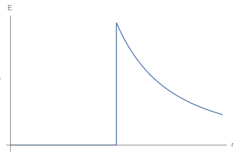
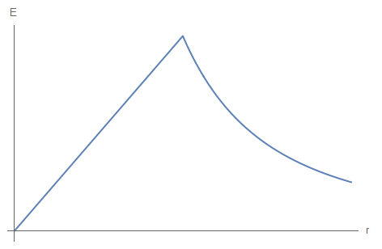
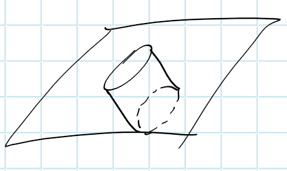

杜炳毅	SQT2100703054

# 1.3

**利用适当坐标系中的 $\delta$ 函数, 将下列电荷分布表示成三维电荷密度 $\rho(\mathbf{x})$.**
**a. 在球坐标中,均匀分布于半径为 $R$ 的球壳上的电荷 $Q$.**

**b.  在柱坐标中，均匀分布于半径为 $b$ 的圆柱面上的每单位长度电荷 $\lambda$.**

**c. 在柱坐标中,均匀分布于厚度忽略不计、半径为 $R$ 的平面圆盘上的电荷 $Q$.**

**d. 与 (c) 同, 但用球坐标.**

## a.

$$
\rho = \frac{Q}{4\pi R^2}\delta\left(\left|r - R\right|\right)
= \frac{Q}{4\pi R^2}\delta\left(\left|\sqrt{x^2 +y^2 +z^2} - R\right|\right)
$$
## b.

$$
\rho=\frac{\lambda}{2 \pi b} \delta(r-b) = \frac{\lambda}{2 \pi b} \delta\left(\left|\sqrt{x^2 +y^2 +z^2} - b\right|\right)
$$
## c.

$$
\rho = \frac{Q}{\pi R^{2}} \varepsilon(R-r) \delta(z) = \frac{Q}{\pi R^{2}} \varepsilon\left(\left|\sqrt{x^2 +y^2 +z^2} - r\right|\right) \delta(z)
$$
## d.

做变换$z \rightarrow r\cos\theta,\quad \delta(r\cos\theta) = \frac{1}{r}\delta(\theta-\frac{\pi}{2})$

由于维度的限制，$r$变不变结果一样
$$
\rho = \frac{Q}{\pi R^{2}} \varepsilon(R-r) \frac{\delta\left(\theta-\frac{\pi}{2}\right) }{r}
$$

# 1.4

**有三个半径均为 $a$ 的带电球, 其中一个球是导电的, 另一个球在体内有均匀分布的电荷密度, 第三个球的电荷密度是球对称分布的, 并在径向上按 $r^{n}$ $(n>-3)$ 变化, 这三个球各带总电荷 $Q$. 试用高斯定律求各球内、外的电场强度. 画出前两个球的电场强度对半径的关系曲线, 以及第三个球在 $n=-2 、+2$ 时的 上述曲线.**

## ①

球内电场强度为0

球外$r$处
$$
\oiint E \dd{S} = \frac{Q}{\varepsilon_0}
\quad \rightarrow \quad
E = \frac{Q}{\varepsilon_0 4\pi r^2}
$$

## ②

球内
$$
\oiint E \dd{S} = \frac{Q\cdot r^3/a^3}{\varepsilon_0}
\quad \rightarrow \quad
E = \frac{Q\cdot r^3/a^3}{\varepsilon_0 4\pi r^2} = \frac{Qr}{4\varepsilon_0\pi a^3}
$$
球外
$$
\oiint E \dd{S} = \frac{Q}{\varepsilon_0}
\quad \rightarrow \quad
E = \frac{Q}{\varepsilon_0 4\pi r^2}
$$

## ③

球内

> 均匀分布，即与体积正比，不同半径高斯球面电荷量比为$r^3/a^3$
>
> 沿径向$r^n$分布，则比值为$r^{3+n}/a^{3+n}$
>
> 此处也可积分证明

$$
\oiint E \dd{S} = \frac{Q\cdot r^{3+n}/a^{n+3}}{\varepsilon_0}
\quad \rightarrow \quad
E = \frac{Q\cdot r^{n+3}/a^{n+3}}{\varepsilon_0 4\pi r^2} = \frac{Qr^{n-1}}{4\varepsilon_0\pi a^{n+3}}
$$
球外
$$
\oiint E \dd{S} = \frac{Q}{\varepsilon_0}
\quad \rightarrow \quad
E = \frac{Q}{\varepsilon_0 4\pi r^2}
$$
| n = -2                                                       | n = 2                                                        |
| ------------------------------------------------------------ | ------------------------------------------------------------ |
|  |  |

# 1.5

**中性氢原子的势对时间的平均值由下式给出:**
$$
\Phi=\frac{q}{4 \pi \epsilon_{0}} \frac{e^{-\alpha r}}{r}\left(1+\frac{\alpha r}{2}\right)
$$
**式中 $q$ 是电子电荷的量值, $\alpha^{-1}=a_{0} / 2, a_{0}$ 是玻尔半径。**

**试求出能够给出这一势的电荷分布 (连续的与离散的两种情形), 并从物理上解释你的结果.**

根据泊松方程，$\nabla^2 \Phi = \frac{\rho}{\varepsilon_0}$，有
$$
\begin{aligned} 
\nabla^2 \Phi 
&= \nabla^2\left[\frac{q}{4 \pi \epsilon_{0}} \frac{e^{-\alpha r}}{r}\left(1+\frac{\alpha r}{2}\right)\right]
\\
&= \nabla^2\left[
\frac{q}{4 \pi \epsilon_{0}} \frac{e^{-\alpha r}}{r}\left(1+\frac{\alpha r}{2}\right) 
-\frac{q}{4 \pi \epsilon_{0}}\frac{1}{r}
+ \frac{q}{4 \pi \epsilon_{0}}\frac{1}{r}\right]
\\
&= \nabla^2\left[
\frac{q}{4 \pi \epsilon_{0}} \left(\frac{e^{-\alpha r}-1}{r}\right) 
+\frac{1}{8 \pi \epsilon_{0}}q\alpha e^{-\alpha r}\right]
+ \nabla^2\frac{q}{4 \pi \epsilon_{0}}\frac{1}{r}
\\
&= \frac{\alpha ^3 q e^{\alpha  (-r)}}{8 \pi  \epsilon_{0}} - \frac{q}{\epsilon_{0}}\delta(r)
=-\frac{\rho}{\epsilon_0}
\end{aligned}
$$

> $\frac{q}{4 \pi \epsilon_{0}}\frac{1}{r}$，为了把奇异项$\frac{1}{r}$提到外面单独用$\delta$表示

得到
$$
\rho(r) = -\frac{\alpha ^3 q e^{\alpha  (-r)}}{8 \pi } + q\delta(r)
$$
即，$r=0$处有一离散分布正电荷，全空间有一总电量为$-\frac{\alpha ^3 q }{8 \pi }$、电荷密度沿径向指数衰减的连续分布的电子云

# 1.10

**证明均值定理：在无电荷空间中任一点的静电势之值，等于以该点为球心的任一球面上势的平均值**

对无电荷区域取任意球面为边界，可视为给定边界电荷面密度为0，

考虑Neumanu边界条件，有电势
$$
\begin{aligned} 
\varphi(\vec{r})
&=
\frac{1}{4\pi\varepsilon_0}\int_{V'} \rho\left(\vec{r'}\right) G dV'
+
\frac{1}{4\pi}\oint_{S'}\left[ G \frac{\partial \varphi}{\partial n'}\right] d S' 
+
\langle \varphi \rangle_S
\\
&=\frac{1}{4\pi}\oint_{S'}\left[ G \frac{\partial \varphi}{\partial n'}\right] d S' 
+
\langle \varphi \rangle_S
\\
&=-\frac{1}{4\pi}\oint_{S'} G E d S' 
+
\langle \varphi \rangle_S
\\
&=\langle \varphi \rangle_S
\end{aligned}
$$
QED

# 1.11 

**试用高斯定律证明，在弯曲的带电导体的表面上，电场强度的法向导数由下式给出**
$$
\frac{1}{E} \frac{\partial E}{\partial n}=-\left(\frac{1}{R_{1}}+\frac{1}{R_{2}}\right)
$$
**式中，$R_1.R_2$是曲面的主曲率半径**

> 关于主曲率半径 ${R_{1}}$ 和 ${R_{2}}$ 定义: 由于对一个曲面, 过其中一点做一个切平面, 平行切平 面总有两个互相垂直的方向, 对每一个方向都有一个曲率半径, 所以总共有两个曲率半径。

在导体的表面的一面积元 ${\Delta S}$ 处沿导体的表面法向方向取一小体积元，使两底面分别在导体内外,

设导体 ${\Delta S}$ 上所带的电荷为 ${\mathrm{q}}$,，而上下底面均与法向垂直, 

取一包住整个面元$\Delta S$的高斯面，由高斯定理
$$
{\oint \vec{E} \cdot d \vec{S}=\frac{q}{\varepsilon_{0}}}
\quad\longrightarrow\quad
{\vec{E} \cdot \Delta \vec{S}=\frac{q}{\varepsilon_{0}}}
$$
导体静电平衡时，导体附近的电场强度处处于表面垂直，故 ${\vec{E} // \Delta \vec{S}}$ ， 有
$$
\begin{aligned} 
E \Delta S&=\frac{q}{\varepsilon_{0}}
\\
E&=\frac{q}{\Delta S \varepsilon_{0}}
\end{aligned}
$$
记 ${s=\Delta S}$ ，则 ${E=\frac{q}{s \varepsilon_{0}}}$，有
$$
\frac{\partial E}{\partial s}=-\frac{q}{s^{2} \varepsilon_{0}}=-\frac{E}{s}
\\
\frac{\partial E}{\partial n}=\frac{\partial E}{\partial s} \frac{\partial s}{\partial n}=-\frac{E}{s} \frac{\partial s}{\partial n}
$$
对于曲面主曲率半径$R_1,R_2$有

> $$
> \mathbf{n}=\frac{\mathbf{R}_{\mathbf{1}}}{R_{1}}+\frac{\mathbf{R}_{\mathbf{2}}}{R_{2}}
> \\
> \begin{aligned} \frac{\partial E}{\partial n} &=\frac{\partial E}{\partial R_{1}}+\frac{\partial E}{\partial R_{2}} \\ &=\frac{1}{\epsilon_{0}} \frac{d q}{d \theta_{1} d \theta_{2}}\left(-\frac{1}{R_{1}^{2} R_{2}}-\frac{1}{R_{1} R_{2}^{2}}\right) \\ &=-E\left(\frac{1}{R_{1}}+\frac{1}{R_{2}}\right) \Rightarrow \\ \frac{1}{E} \frac{\partial E}{\partial n} &=-\left(\frac{1}{R_{1}}-\frac{1}{R_{2}}\right) \end{aligned}
> $$
>
> 

$$
{\frac{\partial s}{\partial n}=s\left(\frac{1}{R_{1}}+\frac{1}{R_{2}}\right)}
\\
$$
所以，
$$
{\frac{1}{E} \frac{\partial E}{\partial n}=-\left(\frac{1}{R_{1}}+\frac{1}{R_{2}}\right)}
$$
QED

# 1.12 

**证明格林互易定理: 若 ${\Phi}$ 是体积 ${V}$ 内的体电荷密度 ${\rho}$ 与导电曲面 ${S(V}$ 的边界面）上面电荷密度 ${\sigma}$ 所产生的势, 而 ${\Phi{\prime}}$ 是另一电荷分布 ${\rho{\prime}}$ 与 ${\sigma{\prime}}$ 所产生的势, 则**
$$
\int_{V} \rho \Phi^{\prime} d^{3} x+\int_{S} \sigma \Phi^{\prime} d a=\int_{V} \rho^{\prime} \Phi d^{3} x+\int_{S} \sigma^{\prime} \Phi d a
$$

上式移项得
$$
\int_{V} \left(\rho \Phi^{\prime}-\rho^{\prime} \Phi\right) dV
=
\int_{S} \left(\sigma^{\prime} \Phi -\sigma \Phi^{\prime}\right) \cdot d\vec S
$$
**对于左侧**

根据泊松方程有，
$$
\rho = -\varepsilon_0\nabla^2 \Phi
\qquad
\rho' = -\varepsilon_0\nabla^2 \Phi'
$$
代入左侧有，并利用格林定理有
$$
\begin{aligned} 
\int_{V} \left(\rho \Phi^{\prime}-\rho^{\prime} \Phi\right) dV
&=
\varepsilon_0\int_{V} \left( \Phi\nabla^2 \Phi' - \Phi^{\prime}\nabla^2 \Phi\right) dV
\\
&=
\varepsilon_0\int_{S} \left( \Phi\nabla \Phi' - \Phi^{\prime}\nabla \Phi\right) \cdot d\vec S
\\
&=
\varepsilon_0\int_{S} \left( \Phi^{\prime}\vec E - \Phi \vec E' \right) \cdot d\vec S
\\
&=
\int_{S} \left( \Phi^{\prime}\vec D - \Phi \vec D' \right) \cdot d\vec S
\end{aligned}
$$
对于导体表面，考虑边界条件$\hat{n} \cdot\left(\vec{D}_{2}-\vec{D}_{1}\right)=\sigma_{f}$，进一步有
$$
\int_{V} \left(\rho \Phi^{\prime}-\rho^{\prime} \Phi\right) dV
=\int_{S} \left( \Phi^{\prime}\sigma - \Phi \sigma' \right) \cdot dS
$$
QED

# 1.14

**考虑1.10节中，由曲面$S$包围得体积$V$中Dirichlet和Neumann边界条件下的格林函数。应用格林定理（1.35）,取积分变量为$y$、令$\phi=G(\mathbf{x}, \mathbf{y}), \psi=G\left(\mathbf{x}^{\prime}, \mathbf{y}\right)$，且$\nabla_{\mathrm{y}}^{2} G(\mathbf{z}, \mathbf{y})=-4 \pi \delta(\mathbf{y}-\mathbf{z})$，找出差分$\left[G\left(\mathbf{x}, \mathbf{x}^{\prime}\right)-G\left(\mathbf{x}^{\prime}, \mathbf{x}\right)\right]$在边界曲面$S$上的积分的表达式**

**(a) 根据电势的Dirichlet边界条件和格林函数的其他相关边界条件，证明$G_D(x,x')$必关于$x,x'$对称**

**(b) 根据电势的Neumann边界条件，和格林函数$G_{N}\left(\mathbf{x}, \mathbf{x}^{\prime}\right)$的边界条件（1.45）式，证明$G_{N}\left(\mathbf{x}, \mathbf{x}^{\prime}\right)$一般不对称，但$G_{N}\left(\mathbf{x}, \mathbf{x}^{\prime}\right)-F(\mathbf{x})$必关于$x,x'$对称，其中，**
$$
F(\mathbf{x})=\frac{1}{S} \oint_{S} G_{N}(\mathbf{x}, \mathbf{y}) d a_{y}
$$
**(c) 证明对格林函数附加$F(x)$，不影响电势$\Phi(x)$。关于Neumann格林函数的例子，见问题3.26**

> 1.35
> $$
> \int_{V}\left(\phi \nabla^{2} \psi-\psi \nabla^{2} \phi\right) d^{3} x=\oint_{S}\left[\phi \frac{\partial \psi}{\partial n}-\psi \frac{\partial \phi}{\partial n}\right] d a
> $$
> 1.45
> $$
> \frac{\partial G_{N}}{\partial n^{\prime}}\left(\mathbf{x}, \mathbf{x}^{\prime}\right)=-\frac{4 \pi}{S} \quad \text { for } \mathbf{x}^{\prime} \text { on } S
> $$
> 

## (a)

取积分变量为$y$、令$\phi=G(\mathbf{x}, \mathbf{y}), \psi=G\left(\mathbf{x}^{\prime}, \mathbf{y}\right)$，根据格林定理，有
$$
\int_{V}\left(G(x, y) \nabla^{2} G(x', y)-G(x', y) \nabla^{2} G(x, y)\right) d^{3} x=\oint_{S}\left[G(x, y) \frac{\partial G(x', y)}{\partial n}-G(x', y) \frac{\partial G(x, y)}{\partial n}\right] d a
$$
对于右侧，考虑Dirichlet边界条件$\left. G_D(\vec r,\vec {r'})\right|_S'=0$，故为0

对于左侧，考虑$\nabla^{\prime 2} G\left(\mathbf{x}, \mathbf{x}^{\prime}\right)=-4 \pi \delta\left(x-x'\right)$，有
$$
\int_{V}\left(4 \pi G(x', y)  \delta(x-y) -  4 \pi G(x, y) \delta(x'- y)\right) d^{3} x
=4 \pi \left( G(x', y) - G(x, y)\right)
=0
$$

得到
$$
G(x', y) = G(x, y)
$$
所以，Dirichlet情况下，$G_D$关于$x,x'$对称

## （b）

同(a)，考虑Neumann边界条件，$\left.\frac{\partial G_{N}(\bar{r}, r)}{\partial n^{\prime}}\right|_{S^{\prime}}=-\frac{4 \pi}{S}$，有
$$
4 \pi \left( G(x', y) - G(x, y)\right)
=\frac{4\pi}{S}\oint_{S}\left[G(x', y) - G(x, y)\right] d a
\\
G(x', y) - G(x, y)
=\frac{1}{S}\oint_{S}\left[G(x', y) - G(x, y)\right] d a
$$
所以对于Neumann边界条件下，$G_N$不一定关于$x,x'$对称

上式变形有
$$
G(x', y) - \frac{1}{S}\oint_{S}G(x', y)d a
=G(x, y) - \frac{1}{S}\oint_{S} G(x, y) d a
$$
取$F(\mathbf{x})=\frac{1}{S} \oint_{S} G_{N}(\mathbf{x}, \mathbf{y}) d a_{y}$

则有，
$$
G_{N}\left(\mathbf{x}, y\right)-F(\mathbf{x}) = G_{N}\left(\mathbf{x'}, y\right)-F(\mathbf{x'})
$$
所以对于Neumann边界条件下，$G_{N}\left(\mathbf{x}, \mathbf{x}^{\prime}\right)-F(\mathbf{x})$必关于$x,x'$对称

## (c)

> 由静电场唯一性定理，电势仅取决于边界条件，故$F$不影响电势$\Phi(x)$

有加上$F$有电势变化量
$$
\begin{aligned} \Delta \Phi(\mathbf{x}) &=\frac{1}{4 \pi \epsilon_{0}} \int_{V} \rho\left(\mathbf{x}^{\prime}\right) F(\mathbf{x}) d^{3} x^{\prime}+\frac{1}{4 \pi} \oint_{S} \frac{\partial \Phi}{\partial n^{\prime}} F(\mathbf{x}) d a^{\prime} \\ &=\frac{F(\mathbf{x})}{4 \pi}\left(\frac{1}{\epsilon_{0}} \int_{V} \rho\left(\mathbf{x}^{\prime}\right) d^{3} x^{\prime}+\oint_{S} \frac{\partial \Phi}{\partial n^{\prime}} d a^{\prime}\right) \\ &=\frac{F(\mathbf{x})}{4 \pi}\left(\frac{1}{\epsilon_{0}} \int_{V} \rho\left(\mathbf{x}^{\prime}\right) d^{3} x^{\prime}+\oint_{S} \nabla \Phi \cdot \mathbf{n}^{\prime} d a^{\prime}\right) \\ &=\frac{F(\mathbf{x})}{4 \pi}\left(\frac{1}{\epsilon_{0}} \int_{V} \rho\left(\mathbf{x}^{\prime}\right) d^{3} x^{\prime}-\oint_{S} \mathbf{E} \cdot \mathbf{n}^{\prime} d a^{\prime}\right) \\ &=0 \end{aligned}
$$
在最后一步，第二项用高斯定理，确定为0
