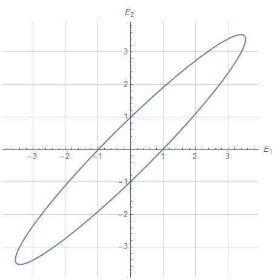
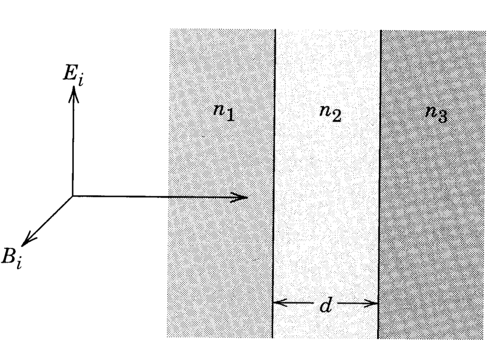
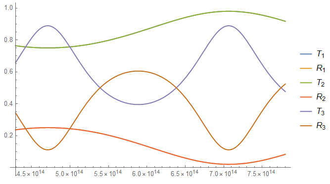

杜炳毅 SQT2100703054

# 7.1

对于下面给出的每一组斯托克斯参数，在线偏振基和圆偏振基中推导出电场的幅值，和相位，并作出与Fig. \( 7.4 \) 类似的精确图形，表明其中一个椭圆的轴线长度及取向

(a) $s_{0}=3, \quad s_{1}=-1, \quad s_{2}=2, \quad s_{3}=-2 $
(b) $s_{0}=25, \quad s_{1}=0, \quad s_{2}=24, \quad s_{3}=7 $

## （b）

联立
$$
\begin{array}{l
}s_{0} =a_{1}^{2}+a_{2}^{2} 
\\
s_{1}=\left|\mathbf{\epsilon}_{1} \cdot \mathbf{E}\right|^{2}-\left|\boldsymbol{\epsilon}_{2} \cdot \mathbf{E}\right|^{2}=a_{1}^{2}-a_{2}^{2} 
\\
s_{2}=2 a_{1} a_{2} \cos \left(\delta_{2}-\delta_{1}\right) 
\\
s_{3}=2 a_{1} a_{2} \sin \left(\delta_{2}-\delta_{1}\right)
\end{array}
$$
解得
$$
a_1 = a_2 = \frac{5}{\sqrt{2}}
\\
\delta_2 = \left[-2 \pi  c_1+\delta_1+\tan ^{-1}\left(\frac{7}{24}\right),c_1\in \mathbb{Z}\right]
$$
取$\delta_1= 0$，有
$$
\vec E_1 =a_{1} e^{i \delta_{1}} = \frac{5 e^{-i \omega t}}{\sqrt{2}}\epsilon_1
\\
\vec E_2 =a_{2} e^{i \delta_{2}} =\frac{5 e^{-i \left(\omega t-\tan ^{-1}\left(\frac{7}{24}\right)\right)}}{\sqrt{2}}\epsilon_2
$$
画图有

# 7.2 

平面波入射到分界面上，如图所示。三种非渗透性介质得折射率分别为$n_1,n_2,n_3$，中间层厚度为$d$，其它每种介质都是半无线得

(a) 计算传输和反射系数（透射和反射坡印廷矢量与入射坡印廷矢量的比值），并对他们关于频率的函数在$n_{1}=1, n_{2}=2, n_{3}=3 ; n_{1}=3, n_{2}=2, n_{3}=1$和$n_{1}=2, n_{2}=4, n_{3}=1$情况下绘制草图，

(b) 介质$n_{1}$是光学系统（如透镜）的一部分；介质$n_3$为空气$\left(n_{3}=1\right)$，希望在表面涂上光学薄膜（介质$n_2$），使得对于频率$\omega_0$没有反射波，需要什么厚度$d$和折射率$n_2$？

## (a)

各介质内有电磁波
$$
\begin{array}{l}
\mathbf{E}_{1}=a e^{i k_{1} z-i\omega t}+b e^{-i k_{1} z-i\omega t} \\
\mathbf{E}_{2}=\alpha e^{i k_{2} z-i\omega t}+\beta e^{-i k_{2} z-i\omega t} \\
\mathbf{E}_{3}=\eta e^{i k_3 z-i\omega t}
\end{array}
$$
其中
$$
\begin{aligned} 
k_{1}=n_{1} c / \omega
\quad k_{2}=n_{2} c / \omega 
\quad
k_3= n_3 c / \omega
\end{aligned}
$$
入射波为振幅$a$的部分

界面处连续，有

> 直接一个，一阶导数一个

$$
\begin{align} 

&a+b=\alpha+\beta\\
&a-b=\frac{n_{2}}{n_{1}}(\alpha-\beta)
\\
&\alpha e^{i k_{2} d}+\beta e^{i k_{2} d}=\eta e^{i k_3 d}\\
&\alpha e^{i k_{2} d}-\beta e^{i k_{2} d}=\frac{n_3}{n_{2}} \eta e^{i k_3 d} 
\end{align}
$$

解得
$$
b\to \frac{a \left(\text{n1} \left((\text{n2}-1) e^{2 i d \text{k2}}+\text{n2}+1\right)+\text{n2} \left((\text{n2}-1) e^{2 i d \text{k2}}-\text{n2}-1\right)\right)}{\text{n1} \left((\text{n2}-1) e^{2 i d \text{k2}}+\text{n2}+1\right)+\text{n2} \left((\text{n2}-1) \left(-e^{2 i d \text{k2}}\right)+\text{n2}+1\right)}
\\
\alpha \to \frac{2 a \text{n1} (\text{n2}+1)}{\text{n1} \left((\text{n2}-1) e^{2 i d \text{k2}}+\text{n2}+1\right)+\text{n2} \left((\text{n2}-1) \left(-e^{2 i d \text{k2}}\right)+\text{n2}+1\right)}
\\
\beta \to \frac{2 a \text{n1} (\text{n2}-1) e^{2 i d \text{k2}}}{\text{n1} \left((\text{n2}-1) e^{2 i d \text{k2}}+\text{n2}+1\right)+\text{n2} \left((\text{n2}-1) \left(-e^{2 i d \text{k2}}\right)+\text{n2}+1\right)}
\\
\eta \to \frac{4 a \text{n1} \text{n2} e^{-i d (k-\text{k2})}}{\text{n1} \left((\text{n2}-1) e^{2 i d \text{k2}}+\text{n2}+1\right)+\text{n2} \left((\text{n2}-1) \left(-e^{2 i d \text{k2}}\right)+\text{n2}+1\right)}
$$
记入射波振幅$a = 1$

有传输系数
$$
\begin{aligned} 
T &= \frac{\left| \eta e^{i k_3 z-i\omega t}\right|^2}{\left|a e^{i k_{1} z-i\omega t}\right|^2}\cdot \frac{n_3}{n_1}
\\
&=\frac{\eta\cdot \eta^*}{a\cdot a^*}\cdot \frac{n_3}{n_1}
\\
&=\frac{8 \text{n1} \text{n2}^2 \text{n3}}{\left(\text{n1}^2-\text{n2}^2\right) \left(\text{n2}^2-\text{n3}^2\right) \cos (2 d \text{k2})+\text{n1}^2 \left(\text{n2}^2+\text{n3}^2\right)+4 \text{n1} \text{n2}^2 \text{n3}+\text{n2}^2 \left(\text{n2}^2+\text{n3}^2\right)}
\\
&=
\frac{8 \text{n1} \text{n2}^2 \text{n3}}{\left(\text{n1}^2-\text{n2}^2\right) \left(\text{n2}^2-\text{n3}^2\right) \cos (2 d \frac{\text{n2}}{c}\omega)+\text{n1}^2 \left(\text{n2}^2+\text{n3}^2\right)+4 \text{n1} \text{n2}^2 \text{n3}+\text{n2}^2 \left(\text{n2}^2+\text{n3}^2\right)}
\end{aligned}
\label{eq11}
$$
1-传输系数即为反射系数
$$
R = 1-T
$$
取$d = 10^{-6}\mathrm m$，在可见光频率下，有

下标分别对应题干三种情况，1，2情况下系数一致

## (b)

无反射时，有
$$
T = 
\frac{8 \text{n1} \text{n2}^2 \text{n3}}{\left(\text{n1}^2-\text{n2}^2\right) \left(\text{n2}^2-\text{n3}^2\right) \cos (2 d \frac{\text{n2}}{c}\omega)+\text{n1}^2 \left(\text{n2}^2+\text{n3}^2\right)+4 \text{n1} \text{n2}^2 \text{n3}+\text{n2}^2 \left(\text{n2}^2+\text{n3}^2\right)}
= 1
$$
解得
$$
n_2 = \sqrt{n_1}
\qquad
d = \frac{c\pi\left(2n - 1\right)}{2n_2\omega} \quad n \in Z
$$

# 7.3

两个相同、均匀、各向同性、非渗透性、折射率为$n$的无损耗介质的平面半无限平板，有一个宽度为$d$的气隙$(n=1)$分隔开，一个频率为$\omega $平面电磁波从一个入射角为$i$的板条间隙入射。对于平行和垂直与入射平面的线偏振情况，

(a) 计算入射到第二块平板的功率与入射功率的比值，以及反射与入射功率的比值

## (a)

记入射角为$\theta_1$，

各介质内有电磁波
$$
\begin{array}{l}
\mathbf{E}_{1}=a e^{i k_{1} \mathbf{x}}+b e^{-i k_{1} \mathbf{x}} \\
\mathbf{E}_{2}=\alpha e^{i k \mathbf{x}}+\beta e^{-i k \mathbf{x}} \\
\mathbf{E}_{3}=\eta e^{i k_{1} \mathbf{x}}
\end{array}
$$
考虑边界连续性有
$$
\begin{array}{ll}
a+b=\alpha+\beta & \alpha e^{i k \lambda}+\beta e^{i k \lambda}=\eta e^{i k_{1} \lambda} ; \\
a-b=\frac{\cos \theta_2}{n \cos \theta_1}(\alpha-\beta) & \alpha e^{i k \lambda}-\beta e^{i k \lambda}=\frac{n \cos \theta_1}{\cos \theta_2} \eta e^{i k_{1} \lambda}
\end{array}
$$
其中，
$$
\theta_2 = \arccos(1-n^2\sin(\theta_1)^2)
\qquad
\lambda = d/\cos\theta_2
$$
解得
$$
b\to \frac{a \left(-1+e^{2 i k \lambda }\right) (n-\sec (\text{$\theta $1}) \cos (\text{$\theta $2})) (\sec (\text{$\theta $1}) \cos (\text{$\theta $2})+n)}{\sec ^2(\text{$\theta $1}) \cos ^2(\text{$\theta $2}) \left(-1+e^{2 i k \lambda }\right)+n^2 \left(-1+e^{2 i k \lambda }\right)-2 n \sec (\text{$\theta $1}) \cos (\text{$\theta $2}) \left(1+e^{2 i k \lambda }\right)}
\\
\alpha \to -\frac{2 a n (\sec (\text{$\theta $1}) \cos (\text{$\theta $2})+n)}{\sec ^2(\text{$\theta $1}) \cos ^2(\text{$\theta $2}) \left(-1+e^{2 i k \lambda }\right)+n^2 \left(-1+e^{2 i k \lambda }\right)-2 n \sec (\text{$\theta $1}) \cos (\text{$\theta $2}) \left(1+e^{2 i k \lambda }\right)}
\\
\beta \to \frac{2 a n e^{2 i k \lambda } (n-\sec (\text{$\theta $1}) \cos (\text{$\theta $2}))}{\sec ^2(\text{$\theta $1}) \cos ^2(\text{$\theta $2}) \left(-1+e^{2 i k \lambda }\right)+n^2 \left(-1+e^{2 i k \lambda }\right)-2 n \sec (\text{$\theta $1}) \cos (\text{$\theta $2}) \left(1+e^{2 i k \lambda }\right)}
\\
\eta \to -\frac{4 a n \sec (\text{$\theta $1}) \cos (\text{$\theta $2}) e^{i \lambda  (k-\text{k1})}}{\sec ^2(\text{$\theta $1}) \cos ^2(\text{$\theta $2}) \left(-1+e^{2 i k \lambda }\right)+n^2 \left(-1+e^{2 i k \lambda }\right)-2 n \sec (\text{$\theta $1}) \cos (\text{$\theta $2}) \left(1+e^{2 i k \lambda }\right)}
$$
取$a = 1$，有
$$
\begin{aligned} 
T 
&= \frac{|\eta|^2}{|a|^2}
\\
&=-\frac{8 n^2 \cos ^2(\text{$\theta $1}) \left(n^2 \sin ^2(\text{$\theta $1})-1\right)}{-\cos (2 k \lambda )-n^4 \cos (2 k \lambda )+2 n^2 \cos (2 k \lambda )+n^4 \cos (4 \text{$\theta $1})+4 n^2 \cos (2 \text{$\theta $1})+2 n^2+1}
\end{aligned}
$$
其中，$k = \frac{\omega}{c}$

反射比为
$$
R = 1-T
$$
