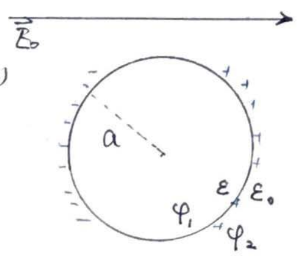

#### 导体球

考虑半径为$a$的均匀导体球，施加图示电场，球内外电势分布

导体球表面生成感应电荷，故导体球内部无电荷，外部无电荷，内外电势满足
$$
\varphi_{1}=\varPhi_0 \quad, \quad \nabla^{2} \varphi_{2}=0
$$
根据通解有
$$
\left\{\begin{array}{l}
\varphi_{1}=\sum\limits_{l=0}^{\infty}\left(A_{l} r^{l}+\frac{B_{l}}{r^{l+1}}\right) P_{l}(\cos \theta) 
\\
\varphi_{2}=\sum\limits_{l=0}^{\infty}\left(C_{l} r^{l}+\frac{D^{l}}{r^{l+1}}\right) P_{c}(\cos \theta)
\end{array}\right.
$$
**考虑边界，**

$r\rightarrow 0$时，

$\varphi_1$为一有限值，则$B_l = 0$，

$r\rightarrow \infty$时，

此时导体球上电荷对电势的影响可以忽略，可以认为无穷远处电势有没有导体球电势不变，

记无导体球时，导体球中心位置电势为$\varphi_0$，则积分得到无穷远处电势
$$
\varphi_2 = \varphi_0 -\int_0^r \vec E_0 \cdot\dd{\vec l} = \varphi_0 -rE_0\cos\theta
$$
为了简便，取$\varphi_0 = 0$，有$\varphi_2 = -E_0r\cos\theta$，有$-E_0r\cos\theta = \sum\limits_{l=0}^{\infty}\left(C_{l} r^{l}\right) P_{c}(\cos \theta)$

通解简化为
$$
\left\{\begin{array}{l}
\varphi_{1}=\sum\limits_{l=0}^{\infty} A_{l} r^{l}  P_{l}(\cos \theta) 
\\
\varphi_{2}=-E_0r\cos\theta+\sum\limits_{l=0}^{\infty} \frac{D^{l}}{r^{l+1}} P_{c}(\cos \theta)
\end{array}\right.
$$
**考虑表面**，

利用边值关系，得到
$$
\left\{\begin{array}{l}
\hat{n} \cdot\left(\vec{D}_{2}-\vec{D_1}\right)=0 
\\
\hat{n} \times\left(\vec{E}_{2}-\vec{E_1}\right)=0\end{array}\right.
\qquad\longrightarrow\qquad
\left\{\begin{array}{l}
\hat n \cdot(\varepsilon_0\vec E_2 - \varepsilon_0\vec E_1) = 0
\\
\hat n \times (\vec E_2 - \vec E_1) = 0
\end{array}\right.
\qquad\longrightarrow\qquad
\left\{\begin{array}{l}
\left.-\varepsilon_0 \frac{\partial \psi_2}{\partial r}\right|_a + \left.\varepsilon_0 \frac{\partial \psi_1}{\partial r}\right|_a  = 0
\\
\left.-\frac{1}{r}\frac{\partial \psi_2}{\partial \theta}\right|_a + \left.\frac{1}{r}\frac{\partial \psi_1}{\partial \theta}\right|_a=0
\end{array}\right.
$$
代入通解到边值关系有
$$
\begin{aligned}
-\varepsilon_0E_0\cos\theta - \left.\varepsilon_0 \frac{\partial \sum\limits_{l=0}^{\infty} (l+1)\frac{D_{l}}{r^{l+1}} P_{l}(\cos \theta)}{\partial r}\right|_a 
&= 
\left.\varepsilon_0 \frac{\partial \sum\limits_{l=0}^{\infty} l A_{l} r^{l}  P_{l}(\cos \theta) }{\partial r}\right|_a  
\\
-\varepsilon_0E_0\cos\theta - \left.\varepsilon_0  \sum\limits_{l=0}^{\infty} (l+1)\frac{D_{l}}{r^{l+2}} P_{l}(\cos \theta) \right|_a 
&=
\left.\varepsilon_0  \sum\limits_{l=0}^{\infty} l A_{l} r^{l-1}  P_{l}(\cos \theta)  \right|_a
\\
- E_0\cos\theta -  \sum\limits_{l=0}^{\infty} (l+1)\frac{D_{l}}{a^{l+2}} P_{l}(\cos \theta) 
&=
\sum\limits_{l=0}^{\infty} l A_{l} a^{l-1}  P_{l}(\cos \theta) 
\end{aligned}
$$

$$
\begin{aligned} 
E_0\sin\theta
+
\left.\frac{1}{r}\frac{\partial \sum\limits_{l=0}^{\infty} \frac{D_{l}}{r^{l+1}} P_{l}(\cos \theta)}{\partial \theta}\right|_a 
&=
\left.\frac{1}{r}\frac{\partial \sum\limits_{l=0}^{\infty} A_{l} r^{l}  P_{l}(\cos \theta) }{\partial \theta}\right|_a
\\
E_0\sin\theta
+
\left. \sum\limits_{l=0}^{\infty} \frac{D_{l}}{r^{l+2}} \frac{\partial P_{l}(\cos \theta)}{\partial \theta}\right|_a 
&=
\left. \sum\limits_{l=0}^{\infty} A_{l} r^{l-1}  \frac{\partial P_{l}(\cos \theta) }{\partial \theta}\right|_a
\\
E_0\sin\theta
+
\sum\limits_{l=0}^{\infty} \frac{D_{l}}{a^{l+2}} \frac{\partial P_{l}(\cos \theta)}{\partial \theta} 
&=
\sum\limits_{l=0}^{\infty} A_{l} a^{l-1}  \frac{\partial P_{l}(\cos \theta) }{\partial \theta} 
\end{aligned}
$$

考虑到，$P_1(\cos\theta) = \cos\theta$，上述两式化为
$$
\begin{align} 
-E_0 P_1 - \sum\limits_{l=0}^{\infty} (l+1) \frac{D_{l}}{a^{l+2}} P_{l}(\cos \theta) 
&=
\sum\limits_{l=0}^{\infty} l A_{l} a^{l-1}  P_{l}(\cos \theta) 
\\
-E_0 \frac{\partial P_1}{\partial\theta}
+
\sum\limits_{l=0}^{\infty} \frac{D_{l}}{a^{l+2}} \frac{\partial P_{l}(\cos \theta)}{\partial \theta} 
&=
\sum\limits_{l=0}^{\infty} A_{l} a^{l-1}  \frac{\partial P_{l}(\cos \theta) }{\partial \theta} 
\end{align}
$$
考虑$P_l$各项正交

对于$l=1$
$$
\begin{array}{l} 
-E_0 P_1 - 2\frac{D_1}{a^3}P_1 = A_{1} a^{0}  P_{1}
\\
-E_0 \frac{\partial P_1}{\partial\theta}
+
\frac{D_{1}}{a^{3}} \frac{\partial P_{1}}{\partial \theta} 
=
A_{1} \frac{\partial P_{1} }{\partial \theta}
\end{array}
\quad\longrightarrow\quad
\begin{array}{l} 
-E_0 - 2\frac{D_1}{a^3} = A_{1}
\\
-E_0+\frac{D_{1}}{a^{3}}
=
A_{1}
\end{array}
\quad\longrightarrow\quad
\begin{array}{l} 
A_{1} = -E_0
\\
D_{1} = 0
\end{array}
$$
对于$l\ne 1$

则，$A_l = D_l = 0$

**代回系数**
$$
\left\{\begin{array}{l}
\varphi_{1}= -E_0 r\cos\theta
\\
\varphi_{2}=-E_0r\cos\theta
\end{array}\right.
$$
