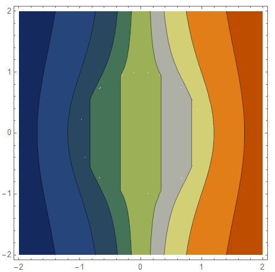
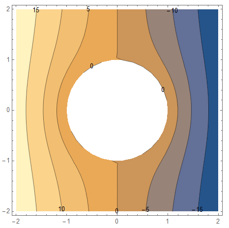
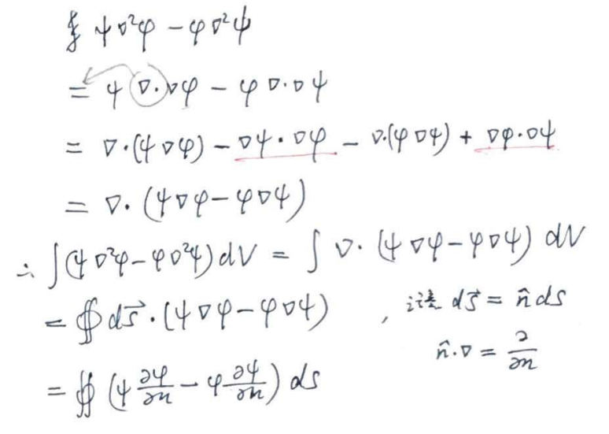

# 静电学一般规律

## 库伦定律

$$
\vec E = \frac{1}{4\pi\varepsilon_0} \frac{Q}{r^2}\hat e_r
$$

源坐标用$'$表示，场点直接表示，单个量用小写表示

> 常用关系，$\nabla^2 \frac{1}{r} = -4\pi\delta(\vec r)$
>
> 对于点电荷，场利用$\delta$函数来表示

离散电荷表示为
$$
\vec{E}=\frac{1}{4 \pi \varepsilon} \sum_{i} \frac{q_{i}}{r_{i}^{2}} \hat{e}_{i}
$$
连续电荷表示为
$$
\frac{1}{4 \pi \varepsilon_{0}} \int_{V} \frac{d q}{r^{2}} \hat{e_{r}}
\qquad
d q=\left\{\begin{array}{l}\rho d v \\ \sigma d s \\ y d t\end{array}\right.
$$

## 高斯定理

$$
\oiint \vec{E} \cdot d \vec{S}=\frac{Q}{4 \pi \varepsilon_{0}} \int \frac{\hat{e_{r}}}{r^{2}} \cdot d \vec{S}=\frac{Q}{4 \pi \varepsilon_{0}} \int d \Omega=\frac{Q}{\varepsilon_{0}}
$$

其中，$\oiint \frac{\hat e_r}{r^2}\cdot d\vec S = \int d\Omega$实际就是立体角，

> 平面角
> $$
> d\theta = dr/r❓
> $$
>
>
> 立体角
> $$
> d \Omega=\sin \theta d \theta d \varphi
> $$
> 对于球的立体角为$4\pi$，可从其表面积$4\pi r^2$理解

在一般情况下，有
$$
\oiint \vec{E} \cdot d \vec{S}=\frac{1}{\varepsilon_{0}} \iiint \rho(\vec{r}) d V
$$
考虑高斯公式，$\oiint \vec{A} \cdot d \vec{S}=\iiint(\nabla \cdot \vec{A}) d V$，得到
$$
\iiint\nabla\cdot \vec E\dd V = \iiint\frac{\rho}{\varepsilon_0}\dd V
\\\Downarrow\\
\nabla\cdot \vec E = \frac{\rho}{\varepsilon_0}
$$
即**麦克斯韦方程组第一式**

## 静电场环路定理

静电力$\vec F = q\vec E$是保守力，静电场$\vec E$是保守场，做功与路径无关，等价于，
$$
\oint \vec E\cdot d\vec l = 0
$$
再由斯托克斯公式，$\oint_{l} \vec{A} \cdot d \vec{l}=\iint_{S} \nabla \times \vec{A} \cdot d \vec{S}$

$$
\oiint_s \nabla\times \vec E\cdot d\vec S = 0
\\\Downarrow\\
\nabla\times \vec E = 0
$$
即**麦克斯韦方程组第二式**

## 势方程-泊松方程

考虑$\nabla\times\nabla \varphi = 0$，定义$\varphi$为标势
$$
\vec{E}=-\nabla \varphi 
\qquad \Leftrightarrow \qquad 
d \varphi=-\vec{E} \cdot d\vec{l}
$$
考虑$\nabla\frac{1}{r} = -\frac{\hat e_r}{r^2}$，得到
$$
\vec E = \frac{1}{4\pi\varepsilon_0} \frac{Q}{r^2}\hat e_r = -\nabla\varphi
\qquad\longrightarrow\qquad
\varphi=\frac{1}{4 \pi \varepsilon_{0}} \frac{Q}{r}
$$
将$\vec E = -\nabla \varphi$代入麦克斯韦方程组第一式，得静电势方程，
$$
\nabla^{2} \varphi=-\frac{\rho}{\varepsilon_{0}}
$$
也称**泊松方程**

> 泊松方程展开，
> $$
> \nabla^{2} \varphi= \nabla^2 \frac{1}{4 \pi \varepsilon_{0}} \frac{Q}{r} = -\frac{\rho}{\varepsilon_{0}}
> $$
> 其中，$\nabla^2\frac{1}{r}$为一奇异项，形式上该项可用狄拉克函数表示
> $$
> \nabla^2 \frac{1}{r} = -4\pi\delta(\vec r)
> $$
> 可以写成更普遍的形式
> $$
> \nabla^{2}\left(\frac{1}{\left|x-x^{\prime}\right|}\right)=-4 \pi \delta\left(x-x^{\prime}\right)
> $$

对于连续电荷分布，表示为
$$
\varphi=\frac{1}{4 \pi \varepsilon_{0}} \int \frac{d q}{r}, \quad 
d q=\left\{ \begin{array}{l}\rho d w \\ \sigma d s \\ y d l\end{array}\right.
$$
一般来叔，对于静电场，电场可突变，电势必连续

> 应该是后面那个单位向量$\hat e_r$的原因，导致的方向突变
>
> 存在特例，课本1.6 1.24式
>
> 对于电偶极子层
>
> 当电场强度沿着法向$\vec n$穿过电荷面密度为$\sigma$时，电场强度的法向分量发生$4\pi\sigma$的突变
>
> 对于电势，越过偶极层时有电势突变，

P35回去看，怎么证明那啥的

### 拉普拉斯方程

势方程，$\nabla^{2} \varphi=-\frac{\rho}{\varepsilon_{0}}$，在无源区，转化为
$$
\nabla^2\varphi = 0
$$

称为拉普拉斯方程

球坐标系下有通解
$$
\begin{aligned} \varphi(r, \theta, \phi) &=\sum_{n, m}\left(a_{n m} r^{n}+b_{n m} r^{-(n+1)}\right) P_{n}^{m}(\cos \theta) \cos m \phi \\ &+\sum_{n, m}\left(c_{n m} r^{n}+d_{n m} r^{-(n+1)}\right) P_{n}^{m}(\cos \theta) \sin m \phi \end{aligned}
$$

> z轴对称情形，经度任意势相同,$m=0$

$$
\varphi(r, \theta)=\sum_{n}\left(a_{n} r^{n}+b_{n} r^{-(n+1}\right) P_{n}(\cos \theta)
$$

$P_n$为勒让德函数，若问题具有球对称性，则$\varphi = a+\frac{b}{R}$

> $$
> P_{n}(x)=\frac{1}{2^{n} n !} \frac{\mathrm{d}^{n}}{\mathrm{~d} x^{n}}\left[\left(x^{2}-1\right)^{n}\right]
> $$

### 电磁介质的性质

**电极化**

定义电极化强度矢量：$\vec{P}=\frac{\sum \vec{p}_{i}}{\Delta V}$，即单位体积内的电偶极矩，对于均匀各向同性线性电介质有，$\vec P =\frac{\sum \vec{p}_{i}}{\Delta V} = \chi_e\varepsilon_0 \vec E$，$\chi_e$称为极化率

代入高斯定理得到

> 结合静电场高斯定理，消除$\rho_p$，因为极化电荷难以确定

$$
\nabla\cdot\vec P = -\rho_P
\quad\longrightarrow\quad 
\nabla \cdot \vec D = \rho_f
$$

其中，
$$
\begin{array}{l} 
\vec D &= \varepsilon_0 \vec E +\vec P
\\
&= (1+\chi_e)\varepsilon_0 \vec E
\\
&=\varepsilon \vec E
\end{array}
$$
其中，$\varepsilon_r = (1+\chi_e)$

**磁化**

定义磁化强度：$\vec{M}=\frac{\sum \vec{m}_{i}}{\Delta V} = \chi_M\cdot \vec H$，即，单位体积内的等效磁偶极矩，第二等式对于各向同性线性铁磁介质，$\chi_M$称为磁化率

> 每个电流环具有磁偶极矩，$\vec m = i\vec a $

微观分子中电子的运用，可以等效成电流环，得到磁化电流密度
$$
\vec{J}_{M}=\nabla \times \vec{M}
\quad\longrightarrow\quad 
\nabla\times \vec H = \vec J_f
$$
其中，
$$
\begin{array}{l} 
\vec B 
&= \mu_0 (\vec H + \vec M)
\\
&=(1+\chi_M)\mu_0 \vec H 
\\
&= \mu \vec H

\end{array}
$$
其中，$(1+\chi_M) = \mu_r$

磁化电流不会出现在均匀介质内部，只出现在介质表面

### 分离变量法求解-边值关系的应用

#### 电介质球

考虑半径为$a$的均匀电介质球，施加图示电场，球内外电势分布

> 定理
> $$
> \rho_p = -\left(1-\frac{\varepsilon_0}{\varepsilon}\right)\rho_f
> $$
> 给出极化电荷和自由电荷的关系，自由电荷为0的地方，极化电荷也为0
>
> 郭电动力学给出证明，课本4.4

介质球极化后，极化电荷分布在外表面，根据上述定理得知，介质球外部没有自由电荷也没有极化电荷，内部没有也没有自由和极化电荷，故内外电势满足
$$
\nabla^{2} \varphi_{1}=0 \quad, \quad \nabla^{2} \varphi_{2}=0
$$
根据通解有
$$
\left\{\begin{array}{l}
\varphi_{1}=\sum\limits_{l=0}^{\infty}\left(A_{l} r^{l}+\frac{B_{l}}{r^{l+1}}\right) P_{l}(\cos \theta) 
\\
\varphi_{2}=\sum\limits_{l=0}^{\infty}\left(C_{l} r^{l}+\frac{D_{l}}{r^{l+1}}\right) P_{c}(\cos \theta)
\end{array}\right.
$$
**考虑边界，**

$r\rightarrow 0$时，

$\varphi_1$为一有限值，则$B_l = 0$，

$r\rightarrow \infty$时，

此时介质球上电荷对电势的影响可以忽略，可以认为无穷远处电势有没有介质球电势不变，

记无介质球时，介质球中心位置电势为$\varphi_0$，则积分得到无穷远处电势
$$
\varphi_2 = \varphi_0 -\int_0^r \vec E_0 \cdot\dd{\vec l} = \varphi_0 -rE_0\cos\theta
$$
为了简便，取$\varphi_0 = 0$，有$\varphi_2 = -E_0r\cos\theta$，有$C_l=0$

通解简化为
$$
\left\{\begin{array}{l}
\varphi_{1}=\sum\limits_{l=0}^{\infty} A_{l} r^{l}  P_{l}(\cos \theta) 
\\
\varphi_{2}=-E_0r\cos\theta+\sum\limits_{l=0}^{\infty} \frac{D_{l}}{r^{l+1}} P_{c}(\cos \theta)
\end{array}\right.
$$
**考虑表面**，

利用边值关系，得到
$$
\left\{\begin{array}{l}\hat{n} \cdot\left(\vec{D}_{2}-\vec{D_1}\right)=0 \\ \hat{n} \times\left(\vec{E}_{2}-\vec{E_1}\right)=0\end{array}\right.
\qquad\longrightarrow\qquad
\left\{\begin{array}{l}
\hat n \cdot(\varepsilon_0\vec E_2 - \varepsilon\vec E_1) = 0
\\
\hat n \times (\vec E_2 - \vec E_1) = 0
\end{array}\right.
\qquad\longrightarrow\qquad
\left\{\begin{array}{l}
\left.-\varepsilon_0 \frac{\partial \psi_2}{\partial r}\right|_a + \left.\varepsilon \frac{\partial \psi_1}{\partial r}\right|_a  = 0
\\
\left.-\frac{1}{r}\frac{\partial \psi_2}{\partial \theta}\right|_a + \left.\frac{1}{r}\frac{\partial \psi_1}{\partial \theta}\right|_a=0
\end{array}\right.
$$
> 表面法向场强，$\hat n\cdot \vec E$，即，标势对$r$求导再取负
>
> 表面切向场强，$\hat n\times \vec E$，即，标势对$\theta$求导再取负
>
> 注意在球坐标下，
> $$
> \boldsymbol{\nabla} \psi= \mathbf{e}_{1} \frac{\partial \psi}{\partial r}+\mathbf{e}_{2} \frac{1}{r} \frac{\partial \psi}{\partial \theta}+\mathbf{e}_{3} \frac{1}{r \sin \theta} \frac{\partial \psi}{\partial \phi}
> $$

代入通解到边值关系有
$$
\begin{aligned}
-\varepsilon_0E_0\cos\theta - \left.\varepsilon_0 \frac{\partial \sum\limits_{l=0}^{\infty} (l+1)\frac{D_{l}}{r^{l+1}} P_{l}(\cos \theta)}{\partial r}\right|_a 
&= 
\left.\varepsilon \frac{\partial \sum\limits_{l=0}^{\infty} l A_{l} r^{l}  P_{l}(\cos \theta) }{\partial r}\right|_a  
\\
-\varepsilon_0E_0\cos\theta - \left.\varepsilon_0  \sum\limits_{l=0}^{\infty} (l+1)\frac{D_{l}}{r^{l+2}} P_{l}(\cos \theta) \right|_a 
&=
\left.\varepsilon  \sum\limits_{l=0}^{\infty} l A_{l} r^{l-1}  P_{l}(\cos \theta)  \right|_a
\\
-\varepsilon_0E_0\cos\theta - \varepsilon_0  \sum\limits_{l=0}^{\infty} (l+1)\frac{D_{l}}{a^{l+2}} P_{l}(\cos \theta) 
&=
\varepsilon  \sum\limits_{l=0}^{\infty} l A_{l} a^{l-1}  P_{l}(\cos \theta) 
\end{aligned}
$$

$$
\begin{aligned} 
E_0\sin\theta
+
\left.\frac{1}{r}\frac{\partial \sum\limits_{l=0}^{\infty} \frac{D_{l}}{r^{l+1}} P_{l}(\cos \theta)}{\partial \theta}\right|_a 
&=
\left.\frac{1}{r}\frac{\partial \sum\limits_{l=0}^{\infty} A_{l} r^{l}  P_{l}(\cos \theta) }{\partial \theta}\right|_a
\\
E_0\sin\theta
+
\left. \sum\limits_{l=0}^{\infty} \frac{D_{l}}{r^{l+2}} \frac{\partial P_{l}(\cos \theta)}{\partial \theta}\right|_a 
&=
\left. \sum\limits_{l=0}^{\infty} A_{l} r^{l-1}  \frac{\partial P_{l}(\cos \theta) }{\partial \theta}\right|_a
\\
E_0\sin\theta
+
\sum\limits_{l=0}^{\infty} \frac{D_{l}}{a^{l+2}} \frac{\partial P_{l}(\cos \theta)}{\partial \theta} 
&=
\sum\limits_{l=0}^{\infty} A_{l} a^{l-1}  \frac{\partial P_{l}(\cos \theta) }{\partial \theta} 
\end{aligned}
$$
考虑到，$P_1(\cos\theta) = \cos\theta$，上述两式化为
$$
\begin{align} 
-E_0 P_1 - \sum\limits_{l=0}^{\infty} (l+1) \frac{D_{l}}{a^{l+2}} P_{l}(\cos \theta) 
&=
\frac{\varepsilon}{\varepsilon_0}  \sum\limits_{l=0}^{\infty} l A_{l} a^{l-1}  P_{l}(\cos \theta) 
\\
-E_0 \frac{\partial P_1}{\partial\theta}
+
\sum\limits_{l=0}^{\infty} \frac{D_{l}}{a^{l+2}} \frac{\partial P_{l}(\cos \theta)}{\partial \theta} 
&=
\sum\limits_{l=0}^{\infty} A_{l} a^{l-1}  \frac{\partial P_{l}(\cos \theta) }{\partial \theta} 
\end{align}
$$
考虑$P_l$各项正交

对于$l=1$
$$
\begin{array}{l} 
-E_0 P_1 - 2\frac{D_1}{a^3}P_1 = \frac{\varepsilon}{\varepsilon_0}  A_{1} a^{0}  P_{1}
\\
-E_0 \frac{\partial P_1}{\partial\theta}
+
\frac{D_{1}}{a^{3}} \frac{\partial P_{1}}{\partial \theta} 
=
A_{1} \frac{\partial P_{1} }{\partial \theta}
\end{array}
\quad\longrightarrow\quad
\begin{array}{l} 
-E_0 - 2\frac{D_1}{a^3} = \frac{\varepsilon}{\varepsilon_0}  A_{1}
\\
-E_0+\frac{D_{1}}{a^{3}}
=
A_{1}
\end{array}
\quad\longrightarrow\quad
\begin{array}{l} 
A_{1} = -\frac{3 E_0 \varepsilon_0}{\varepsilon+2 \varepsilon_0}
\\
D_{1} = \frac{a^3 E_0 (\varepsilon-\varepsilon_0)}{\varepsilon+2 \varepsilon_0}
\end{array}
$$
对于$l\ne 1$

则，$A_l = D_l = 0$

**代回系数**
$$
\left\{\begin{aligned}
&\varphi_{1}=-\frac{3 \varepsilon_{0}}{\varepsilon+2 \varepsilon_{0}} E_{0} r \cos \theta 
\\
&\varphi_{2}=-E_{0} r \cos \theta + \frac{a^3 E_0 (\varepsilon-\varepsilon_0)}{\varepsilon+2 \varepsilon_0} \cos \theta
\end{aligned}\right.
$$

> [在均匀外电场中置入半径为R0的导体球 - 道客巴巴 (doc88.com)](https://www.doc88.com/p-543677510404.html)

#### 导体球

考虑半径为$a$的均匀导体球，施加图示电场，球内外电势分布

导体球表面生成感应电荷，故导体球内部无电荷，外部无电荷，内外电势满足
$$
\varphi_{1}=\varPhi_0 \quad, \quad \nabla^{2} \varphi_{2}=0
$$
根据通解有
$$
\left\{\begin{array}{l}
\varphi_{1}=\varPhi_0
\\
\varphi_{2}=\sum\limits_{l=0}^{\infty}\left(C_{l} r^{l}+\frac{D_{l}}{r^{l+1}}\right) P_{c}(\cos \theta)
\end{array}\right.
$$
**考虑边界，**

$r\rightarrow \infty$时，

此时导体球上电荷对电势的影响可以忽略，可以认为无穷远处电势有没有导体球电势不变，

记无导体球时，导体球中心位置电势为$\varphi_0$，则积分得到无穷远处电势
$$
\varphi_2 = \varphi_0 -\int_0^r \vec E_0 \cdot\dd{\vec l} = \varphi_0 -rE_0\cos\theta
$$
为了简便，取$\varphi_0 = 0$，有$\varphi_2 = -E_0r\cos\theta$，有$-E_0r\cos\theta = \sum\limits_{l=0}^{\infty}\left(C_{l} r^{l}\right) P_{c}(\cos \theta)$

通解简化为
$$
\left\{\begin{array}{l}
\varphi_{1}=\varPhi_0
\\
\varphi_{2}=-E_0r\cos\theta+\sum\limits_{l=0}^{\infty} \frac{D^{l}}{r^{l+1}} P_{c}(\cos \theta)
\end{array}\right.
$$
**考虑表面**，

利用边值关系，得到
$$
\varphi_1(a) = \varphi_2(a)
$$
代入通解到边值关系有
$$
-E_0 a \cos\theta+\sum\limits_{l=0}^{\infty} \frac{D_{l}}{a^{l+1}} P_{c}(\cos \theta) = \varPhi_0
$$

考虑$P_l$各项正交

对于$l=1$
$$
\begin{array}{l} 
-E_0 a+\frac{D_{1}}{a^{2}}
=0
\end{array}
\quad\longrightarrow\quad
\begin{array}{l} 
D_1 = E_0a^3
\end{array}
$$
对于$l=0$
$$
\frac{D_0}{a} = \varPhi_0
$$
对于$l\ne 1$

则，$D_l = 0$

**代回系数**
$$
\left\{\begin{aligned}
&\varphi_{1}= \varPhi_0
\\
&\varphi_{2}= \varPhi_0 a -E_0r\cos\theta + \frac{E_0 a^3}{r^2}\cos\theta
\end{aligned}\right.
$$

## 格林定理

预习一下。1.3啥的那几页

$$
\int_{V}\left(\phi \nabla^{2} \psi-\psi \nabla^{2} \phi\right) d^{3} x=\int_{S}(\phi \nabla \psi-\psi \nabla \phi) \cdot \mathbf{n} d a
\\或写作\\
\iint_{D}\left(\frac{\partial Q}{\partial x}-\frac{\partial P}{\partial y}\right) \mathrm{d} x \mathrm{~d} y=\oint_{C}(P \mathrm{~d} x+Q \mathrm{~d} y)
\\
\int_{V}\left(\phi \nabla^{2} \psi-\psi \nabla^{2} \phi\right) d^{3} x=\oint_{S}\left[\phi \frac{\partial \psi}{\partial n}-\psi \frac{\partial \phi}{\partial n}\right] d a
$$
证明

### 静电势形式解

模仿静电势，假设一点电荷产生的场

$$
\nabla^{2} \varphi(\vec{r}) = -\frac{\rho(\vec{r})}{\varepsilon_{0}}
$$
定义Green函数
$$
\nabla'^{2} G\left(\vec{r}, \vec{r}^{\prime}\right)=-4 \pi \delta\left(\vec{r}-\vec{r'}\right)
$$
其中，$\vec r$为观测点，$\vec {r'}$为积分变数

> 注意，$G$关于$r,r'$对称，则$\nabla r^2$也成立

其中，
$$
G(\vec r,\vec {r'}) = \frac{1}{|r-r'|} + F(\vec r,\vec {r'})
$$
其中，$F$在区域$V$内满足拉普拉斯方程，$\nabla'^2 F = 0$

> $F$实际是标势，普遍满足：$\nabla'^2 F = 4\pi\rho$
>
> 只是在区域内没电荷，才满足拉普拉斯❓

取Green定理中，$\phi = F,\quad \psi = G$

> $\nabla^2 F = -\frac{\rho}{\varepsilon_0}$

有
$$
\begin{aligned} 
\int_{V'}\left(F \nabla'^{2} G- G \nabla'^{2} F\right) dV'
&=
\oint_{S}\left[F \frac{\partial G}{\partial n'}-G \frac{\partial F}{\partial n'}\right] d S'
\\
\int_{V'} -F 4\pi\delta(\vec r-\vec{r'})  dV'
-
\frac{1}{\varepsilon_0}\int_{V'} G \rho(\vec{r'}))  dV'
&=
\oint_{S'}\left[F \frac{\partial G}{\partial n'}-G \frac{\partial F}{\partial n'}\right] d S'
\\
\frac{1}{4\pi\varepsilon_0}\int_{V'} G \rho(\vec{r'}))  dV'
+
\frac{1}{4\pi}\oint_{S'}\left[ G \frac{\partial F}{\partial n'} - F \frac{\partial G}{\partial n'}\right] d S'
&=F(\vec{r})
\end{aligned}
$$

> 对于$F$，$\vec {r'}$已经积分没了

所以
$$
F(\vec{r})
=
\frac{1}{4\pi\varepsilon_0}\int_{V'} \rho\left(\vec{r'}\right) G dV'
+
\frac{1}{4\pi}\oint_{S'}\left[ G \frac{\partial F}{\partial n'} - F \frac{\partial G}{\partial n'}\right] d S'
$$

> 这个$\rho$是所考虑的区域内部的电荷密度，不包含边界上的，边界上的算在第二项之内

### 两类边值问题

对于**Dirichlet边界条件**，要求

> 给定闭合曲面上的势$\varphi|_{s'}$值

$$
对于边界S上的\vec{r'}
\qquad
G_D(\vec r,\vec {r'})=0
$$

于是面积分的第一项为0，得到
$$
\varphi(\vec{r})
=
F(\vec{r})
=
\frac{1}{4\pi\varepsilon_0}\int_{V'} \rho\left(\vec{r'}\right) G dV'
-
\frac{1}{4\pi}\oint_{S'}\left[F \frac{\partial G}{\partial n'}\right] d S'
$$
对于**Neumanu边界条件**，要求

> 给定闭合曲面上的电场强度（即势的法向导数）$\left.\frac{\partial \varphi}{\partial n'}\right|_{s'}$，相当于给定电荷面密度，取$\left.\frac{\partial G_{N}(\bar{r}, r)}{\partial n^{\prime}}\right|_{S^{\prime}}=-\frac{4 \pi}{S}$，这是最简单的条件

$$
对于边界S上的\vec {r'}
\qquad
\frac{\partial G_{N}}{\partial n^{\prime}}\left(\vec{r}, \vec{r'}\right)= \frac{-4\pi}{S}
$$

于是提出面积分的第二项，得到
$$
\varphi(\vec{r})
=
F(\vec{r})
=
\frac{1}{4\pi\varepsilon_0}\int_{V'} \rho\left(\vec{r'}\right) G dV'
+
\frac{1}{4\pi}\oint_{S'}\left[ G \frac{\partial F}{\partial n'}\right] d S' 
+
\langle \Phi \rangle_S
$$
其中，$\langle \Phi \rangle_S$为势在表面上的均值，一般对于Neumanu问题，该值为0

