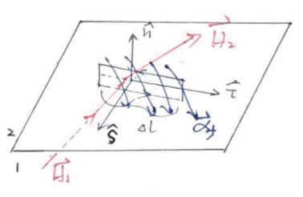

# 第零章 电动力学引论

## Maxwell方程组

| 真空中                                                       | 介质中                                                       |
| ------------------------------------------------------------ | ------------------------------------------------------------ |
| $\begin{align}\nabla \cdot \vec{E}&=\frac{\rho}{\varepsilon_{0}} \\ \nabla \times \vec{E}&=-\frac{\partial \vec{B}}{\partial q} \\ \nabla \cdot \vec{B}&=0 \\ \nabla \times \vec{B}&=\mu_{0} \vec{J}+\mu_{0} \varepsilon_{0} \frac{\partial \vec{E}}{\partial t}\end{align}$ | $\begin{align}\nabla \cdot \vec{D}&=\rho_{f} \\ \nabla \times \vec{E}&=-\frac{\partial \vec{B}}{\partial t} \\ \nabla \cdot \vec{B}&=0 \\ \nabla \times \vec{H}&=\vec{J}_{f}+\frac{\partial \vec{D}}{\partial t}\end{align}$ |

真空$\rho$包括所有电荷，介质$\rho$只包括自由电荷

电荷密度$\rho$，电流密度$\vec J$所在公式说明，电荷作为源激发电场，电流作为源激发磁场和感生电场

但由于不存在磁荷，故不存在磁荷密度、磁流密度，故电场的旋度，磁场的散度为0

第一式，由安培环路定理推广

第二式，由法拉第电磁感应定律推广

第三式，为磁通连续性原理

第四式，由高斯定理推广

**洛伦兹力**
$$
\vec F = q(\vec E + \vec v\times\vec B)
$$
方向按右手定则判断

**电荷守恒**

电荷变化量即：$\frac{\partial \rho}{\partial t}+\nabla \cdot \vec{v}$，积分有

$$
\begin{array}{l}\frac{\partial}{\partial t} \int \rho d v+\int \nabla \cdot \vec{v} d v=0 \\ \frac{d Q}{d t}+\oiint \underbrace{\vec{J} \cdot d \vec{s}}_{d I}=0 \\ \therefore \frac{d Q}{d t}+I=0\end{array}
$$
该电流为流出电流，电荷为内部增加电荷，

得电荷守恒，
$$
\frac{\partial \rho}{\partial t}+\nabla \cdot \vec{v} = 0
$$

## Maxwell方程组的边值形式

这些式子和麦克斯韦方程组等价，是其在边界上的形式

真空中Maxwell方程组的积分形式有
$$
\left\{\begin{array}{l}
\oiint \vec{E} \cdot d \vec{S}=\frac{1}{\varepsilon_{0}} \iiint \rho d V=\frac{q}{\varepsilon_{0}} 
\\
\oint \vec{E} \cdot d \vec{l}=-\iint \frac{\partial \vec{B}}{\partial t} \cdot d \vec{S} 
\\
\oiint \vec{B} \cdot d \vec{S}=0 
\\
\oint \vec{B} \cdot d \vec{l}=\mu_{0} \iint \vec{J} \cdot d \vec{S}+\mu_{0} \varepsilon_{0} \iint \frac{\partial \vec{E}}{\partial \vec{t}} \cdot d \vec{S}\end{array}\right.
$$

其中$\mu_{0} \iint \vec{J}$也为$\mu_0 I$

介质中Maxwell方程组的积分形式有
$$
\begin{aligned}
&\oiint_{\mathbb{S}} \mathbf{D} \cdot \mathrm{d} \mathbf{s}=Q_{f} 
\\
&\oiint_{\mathbb{S}} \mathbf{B} \cdot \mathrm{d} \mathbf{s}=0 
\\
&\oint_{\mathbb{L}} \mathbf{E} \cdot \mathrm{d} \boldsymbol{\ell}=-\frac{\mathrm{d} \Phi_{\mathbf{B}}}{\mathrm{d} t} 
\\
&\oint_{\mathbb{L}} \mathbf{H} \cdot \mathrm{d} \boldsymbol{\ell}=I_{f}+\frac{\mathrm{d} \Phi_{\mathbf{D}}}{\mathrm{d} t}
\end{aligned}
$$

### 考虑边界上的通量

在边界上，考虑电位移通量，有
$$
\oiint \vec{D} \cdot d \vec{s}=Q_{f}
\\\Downarrow\\
\left(\vec{D}_{2}-\vec{D}_{1}\right) \cdot \Delta \vec{n}=\sigma_{f} \Delta S
\\\Downarrow\\
\hat{n} \cdot\left(\vec{D}_{2}-\vec{D}_{1}\right)=\sigma_{f}
\quad or\quad
D_{2 n}-D_{1 n}=\sigma_{f}
$$
同理，考虑$\vec B$有
$$
\hat{n} \cdot\left(\vec{B}_{2}-\vec{B}_{1}\right)=0
$$

> 注意，法向方向规定为$2\rightarrow 1$，
>
> 因此，这里写为$\hat B_2 - \hat B_1$
>
> 下同

### 在边界上考虑环量

考虑一穿过边界的矩形回线，其短边足够窄，使$\iint \frac{\partial \vec D}{\partial t}\cdot \vec s \rightarrow 0$
$$
\oint \vec{H} \cdot \vec{d}=Z_{f}+\frac{d}{d} \cdot \int_{\sqrt{S}} \vec{D} \cdot d \vec{L}
$$
利用，$\begin{aligned} I &=\iint \vec{J} \cdot d \vec{S} \text { （体)} =\int \vec{d} \cdot d\vec l (面)\end{aligned}$，有

> 方向问题，差一负号

$$
\begin{aligned}\left(\vec{H}_{2}-\vec{H}_{1}\right) \cdot(-\hat{\tau} \Delta l) &=\vec{\alpha}_{f} \cdot \Delta l \hat{s} \\ \hat{s} \cdot \hat{n} \times\left(\vec{H}_{2}-\vec{H}_{1}\right) &=\vec{\alpha}_{f} \cdot \widehat{s} 
\\
\therefore \hat{n} \times\left(\overrightarrow{H_{2}}-\vec{H}_{1}\right) &=\vec{\alpha}_{f} 
\quad or\quad
H_{2 s}-H_{1 s}=\alpha_{f}
\end{aligned}
$$

同理对于$\vec E$，（电场右侧没有电流项），有
$$
\hat{n} \times\left(\vec{E}_{2}-\vec{E}_{1}\right)=0
$$

### 综上

电磁场的边值关系为
$$
\hat{n} \cdot\left(\vec{D}_{2}-\vec{D}_{1}\right)=\sigma_{f}
\\
\hat{n} \cdot\left(\vec{B}_{2}-\vec{B}_{1}\right)=0
\\
\hat{n} \times\left(\overrightarrow{H_{2}}-\vec{H}_{1}\right) =\vec{\alpha}_{f}
\\
\hat{n} \times\left(\vec{E}_{2}-\vec{E}_{1}\right)=0
$$

------

⭐体现做第一章3，4，5

