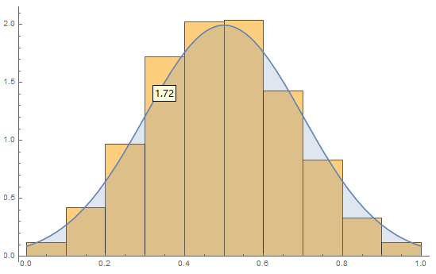
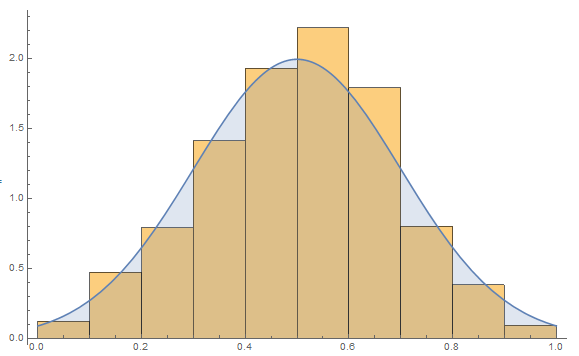

# Metropolis-Hastings

## 马尔科夫链

最近的将来的**统计性质**由现时状态完全决定，与过去无关（无记忆性）的过程称为马尔可夫过程、

> 统计性质即多次重复经理最近的将来所得得将来得状态概率分布

定义序列$x_0,x_1,...,x_n,...,$如果对任何$n$都有条件概率满足
$$
P\left(x_{n} \mid x_{n-1}, \ldots, x_{1}, x_{0}\right)=P\left(x_{n}=i \mid x_{n-1}=j\right)
$$

> 最近的将来仅与现在有关

则称此序列为一马尔可夫链

$x_n = i$表示过程在时刻$n$处于状态$i$，称$\{0,1,2,...\}$，构成的可数集称为该链的“状态空间$S$”

> 在每一时刻，全体状态各自的概率可以构成一组**概率分布向量**

此序列发生的概率可以分解为条件概率形式
$$
P\left(x_{0}, \ldots, x_{n}\right)=P\left(x_{n} \mid x_{n-1}\right) P\left(x_{n-1} \mid x_{n-2}\right) \cdots P\left(x_{1} \mid x_{0}\right) P\left(x_{0}\right)
$$
其中，$P\left(x_{n}=i \mid x_{n-1}=j\right)$可以理解为马尔科夫链上$x_{n-1}$的状态$j$转换到$x_n$的状态$i$的概率，称为马尔科夫链的一步转移概率，记为$P_{ij}$

因此，马尔科夫链可以理解为“在状态空间（相空间）上经历从一种状态到另一种状态的转换的随机过程”

一般情况下，转移概率与状态$i,j$和时刻$n$有关

若转移概率仅与状态$i,j$有关，而与时刻$n$无关，则称为时对马尔科夫链

否则，称为非时齐马尔科夫链

若马尔科夫链其状态空间有限，称为有限链，否则称为无限链

> 更多概念见《应用随机过程》（第四版）张波等著


### 转移矩阵

随机矩阵（stochastic matrix），概率矩阵（probability matrix）、转移矩阵（transition matrix）、替代矩阵（substitution matrix）、马尔可夫矩阵（Markov matrix）或转移概率矩阵（transition probability matrix）

类似于通过概率切换状态的有限状态机，但无论状态有限与否，我们都可以吧马尔科夫链的转移概率排成转移矩阵的形式

> 状态取值

$$
P = \quad
\begin{array}{c|c c c c} 
 & 1 & 2 & ... & j  \\ \hline
1 & P_{11} & P_{12} & ... & P_{1j}  \\
2 & P_{21} & P_{22} & ... & P_{2j} \\ 
\vdots & \vdots & \vdots & \vdots &	\vdots \\
i & P_{i1} & P_{i2} & ... & P_{ij}
\end{array}
$$

有性质

1. $P_{ij}\ge 0,\quad i,i\in S$
2. $\sum\limits_{j\in S}p_{ij}=1,\quad \forall i\in S$

若矩阵元全部非零，则马尔科夫链状态空间中任意两态都可以用转移矩阵中的一个矩阵元连通


### 马尔可夫收敛定理

根据《应用随机过程》（第四版）张波 定理5.3.3：

**遍历的Markov链（即不可约、正常返、非周期的Markov链）的极限分布是平稳分布且是唯一的平稳分布**

考虑这样一个马尔科夫链，具有概率转移矩阵$P$、离散状态空间$S$

记其极限分布为$\pi_i = \lim_{n\rightarrow\infty} \sum_{j} P_{ij}^{n}$，$\pi_i$表示Markov链经长时间运行（极限）后处于状态$i$的概率

显然有方程
$$
\left\{\begin{aligned} 
&\left(\pi_1,..,\pi_N\right) = P\cdot\left(\pi_1,..,\pi_N\right)
\\
&\sum\limits_{j = 1}^{N} = 1
\end{aligned}\right.
$$
对第一个方程考虑单个矩阵元，可以得到
$$
\pi_j = \sum_{i=1}^{N}P_{ij}\cdot \pi_i
$$
可以看出，$\pi_j$表示了从全部状态转移到$j$的概率之和，即，平稳分布下处于状态$j$的概率

其中，

$\pi=\left\{\pi_{1}, \pi_{2} \ldots \pi_{j}\right\}$称为马尔科夫链的稳定分布

$\pi$是$P^n$方程的唯一非负解，该平稳分布是唯一的

即，无论初始给定何种概率分布，经足够长时间的马尔科夫链游走后，总会得到一个仅由概率转移矩阵$P$决定的概率分布

> 此时，全体状态概率组成的概率分布向量是不变的，即$\pi_n = \{\pi_1,...,\pi_j\}$
>
> 初始概率分布，即在初始时刻任意给定的一组概率分布向量

由此，我们就能够生成任意概率分布的采样点，使用蒙特卡洛法不再有障碍


## Metropolis-Hastings算法

### 马尔科夫链细致平衡条件

当马尔科夫链上两个相邻时间点上的分布不变时，马尔科夫链上个状态的统计分布就达到了平衡，可以通过以下方程来表示是否达到平衡

有非周期马尔科夫链的转移矩阵$P$和分布$\pi_x$，对于$S$内任意两状态$i,j$都满足
$$
\begin{aligned} 
\pi_i \cdot P_{ij} &= \pi_j\cdot P_{ji}
\\
处于j状态的概率\times从j状态转移到i状态的概率 &= 处于i状态的概率 \times从i状态转移到j状态的概率
\end{aligned}
$$
则$\pi_x$是马尔科夫链的平衡分布

等式说明：在下一次转移中，有多少状态$j$转移到状态$i$，就有多少状态$i$转移到状态$j$，即达到一动态平衡，此时描述这两个相邻节点上状态的概率分布不发生变化

> 想象有n条满足同意概率分布的马尔科夫链同时进行随机过程演化，同一时间点的不同马尔科夫链的节点是满足一概率分布的

### Metropolis采样算法

设，预期得到的平稳分布为$\Pi(x)$，

希望找到一个转移矩阵$Q$，可以把状态$i$转移到状态$j$，对应矩阵元记为$Q_{ij}$

由于转移矩阵是任意的，未必满足细致平衡条件，我们引入$\alpha_{ij}$辅助，使细致平衡条件成立
$$
\Pi_i\cdot Q_{ij}\cdot \alpha_{ij} = \Pi_j\cdot Q_{ji} \cdot \alpha_{ji}
$$
从对称角度考虑，如取
$$
\alpha_{ij} = \Pi_j\cdot Q_{ji}
\qquad
\alpha_{ji} = \Pi_i\cdot Q_{ij}
$$
则平衡条件必定成立

至此，我们构造了对应于目标概率分布$\Pi_x$的**概率转移矩阵**$P_{ij} = Q_{ij}\cdot \alpha_{ij}$

把引入的$\alpha_{ij}$称为接受率，它表示状态$i$按照转移矩阵$P_{ij}$从状态$i$转移到状态$j$的过程中，按照$\alpha_{ij}$的概率选择是否接受这次转移，或，按照$1-\alpha_{ij}$的概率拒绝该次转移

> 任取的矩阵转移后再考虑一次根据$\alpha$的舍选，是和根据转移矩阵$P$进行一次转移等效的


### Metropolis-Hastings采样算法

Metropolis算法缺点在于接受率低，对数情况下的转移都被拒绝了

Hastings后改进了该算法，称为Metropolis-Hastings采样算法

对于先前的细致平衡条件
$$
\Pi_i\cdot Q_{ij}\cdot \alpha_{ij} = \Pi_j\cdot Q_{ji} \cdot \alpha_{ji}
$$
对等式两侧缩放等式仍成立，考虑以下两种情况

**① 当$\alpha_{ij} < \alpha_{ji}$时 **

两边同时放大$\frac{1}{\alpha_{ji}}$，有
$$
\Pi_i\cdot Q_{ij}\cdot \frac{\alpha_{ij}}{\alpha_{ji}} = \Pi_j\cdot Q_{ji} \cdot 1
$$
则，左侧$\alpha'_{ij} = \frac{\alpha_{ij}}{\alpha_{ji}}$，右侧$\alpha_{ji} = 1$

转移接受率：$\alpha'_{ij} = \frac{\alpha_{ij}}{\alpha_{ji}}$

**② 当$\alpha_{ij}>\alpha_{ji}$时**

两边同时放大$\frac{1}{\alpha_{ij}}$，有
$$
\Pi_i\cdot Q_{ij}\cdot 1 = \Pi_j\cdot Q_{ji} \cdot \frac{\alpha_{ji}}{\alpha_{ij}}
$$
则，左侧$1$，右侧$\alpha'_{ji} = \frac{\alpha_{ji}}{\alpha_{ij}}$

转移接受率：$\alpha'_{ij} = 1$

**综上两种情况**

转移接受率变为
$$
\alpha'_{ij} = \min\left(\frac{\alpha_{ij}}{\alpha_{ji}},1\right)
=\min\left(\frac{\Pi_j\cdot Q_{ji}}{\Pi_i\cdot Q_{ij}},1\right)
$$

> 再程序实现上，只要$[0,1]$上抽样得概率$U\le \frac{\Pi_j\cdot Q_{ji}}{\Pi_i\cdot Q_{ij}}$就可以接受转移
>
> 如果$\frac{\Pi_j\cdot Q_{ji}}{\Pi_i\cdot Q_{ij}}>1$，因为$U$最大也才取到1，则$U<\frac{\Pi_j\cdot Q_{ji}}{\Pi_i\cdot Q_{ij}}$恒成立，接受转移
>
> 如果$\frac{\Pi_j\cdot Q_{ji}}{\Pi_i\cdot Q_{ij}}<1$，则$\alpha_{ij}' = \frac{\Pi_j\cdot Q_{ji}}{\Pi_i\cdot Q_{ij}}$，所进行的判断仍然是$U<\frac{\Pi_j\cdot Q_{ji}}{\Pi_i\cdot Q_{ij}}$

采用这种接受率的Metropolis算法就是Metropolis-Hastings算法，

该算法对接受率进行了方法，提高了效率

一般情况下，为方便计算，选择的转移矩阵$Q$是对称的，即$Q_{ij} = Q_{ji}$，此时接受率可以简化为
$$
\alpha'_{ij} 
=\min\left(\frac{\Pi_j }{\Pi_i },1\right)
$$
**可以将算法流程总结如下**

记作为采样母体的目标分布为$\Pi(x)$，建议分布（初始分布）为$g(x)$

抽样方法①

1. 从建议分布$g(x)$抽样得服从该分布的样本$\{X_{k}^{0}\}$
2. 从建议分布$g(x)$计算条件概率$g\left(·|X_{k}^{0}\right)$，再对这个条件概率抽样，得到样本$\{Y_k\}$
3. 对于每一个$k$考虑，从$[0,1]$均匀抽样概率$U$，若满足$U\le \frac{\Pi(Y_k) \cdot g(Y_k|X_k^0)}{\Pi(X_k^0)\cdot g(X_k^0|Y_k)}$，则$X_k^1 = Y_k$，否则，$X_k^1 = X_k^0$
4. 重复上述步骤（$0\rightarrow t,1\rightarrow t+1$），直到马尔科夫链达到平稳状态


抽样方法②

1. 从建议分布$g(x)$抽样得服从该分布的一个样本$X^{0}$
2. 从建议分布$g(x)$计算条件概率$g\left(·|X_{k}^{0}\right)$，再对这个条件概率抽样，得到一个样本$Y$
3. 从$[0,1]$均匀抽样概率$U$，若满足$U\le \frac{\Pi(Y) \cdot g(Y|X^0)}{\Pi(X^0)\cdot g(X^0|Y)}$，则$X^1 = Y$，否则，$X^1 = X^0$
4. 重复2，3步骤（$0\rightarrow t,1\rightarrow t+1$），直到马尔科夫链达到平稳状态
5. 达到平衡后，继续重复2，3步骤，但每次记录$X^t$的值为母体采样点，继续重复多少次就是抽取母体的几个采样点

> ⭐步骤4使Markov链达到平稳分布后，继续让Markov演化得到的一系列状态就是服从平稳分布的抽样


### 无限维状态空间

当状态空间连续，如数轴上的一个区间，其维度是无穷的，此时不再能写出状态转移矩阵

且由于存在无穷个状态，状态之间的转移概率显然为0

但此时可以借用简化转移接受率绕过转移矩阵$Q$，

因此，引入一个更广泛的概念：马尔可夫核Markov kernel (also known as a stochastic kernel or probability kernel) ，

有限维状态空间的马尔科夫链的马尔可夫核即为概率转移矩阵

无限维状态空间的马尔可夫链的马尔可夫核即为概率密度函数

## 抽样正态分布

正态分布有概率密度函数
$$
f(x)=\frac{1}{\sigma \sqrt{2 \pi}} \exp \left[-\frac{(x-\mu)^{2}}{2 \sigma^{2}}\right]
$$
取，$\mu = 0.5, \sigma = 0.1$

考虑采样区间为$[0,1]$

取建议分布为$[0,1]$上的均匀分布


**算法①**，

采样点1000，迭代50步

```mathematica
(*目标分布*)
\[CapitalPi]pdf[x_] := PDF[NormalDistribution[0.5, 0.2], x];
(*建议分布*)
gpdf[x_] := PDF[UniformDistribution[{0, 1}], x];
(*建议分布抽样*)
markovx = RandomVariate[UniformDistribution[{0, 1}], 1000];
(*计算单个状态的一步转移*)
onestatetrans[i_] := (
  u = RandomReal[{0, 1}];
  y = RandomReal[{0, 1}];
  If[u <= \[CapitalPi]pdf[y]/\[CapitalPi]pdf[markovx[[i]]], 
   markovx[[i]] = y, markovx[[i]] = markovx[[i]]]
  )

start = AbsoluteTime[];
For[n = 1, n <= 50, n++,
 markovx = ParallelTable[onestatetrans[i], {i, 1, Length[markovx], 1}];
 ]
end = AbsoluteTime[];
Print[end - start]
Show[{
  Histogram[markovx, 10, "PDF"],
  Plot[\[CapitalPi]pdf[x], {x, 0, 1}, Filling -> Axis, 
   Exclusions -> None]
  }]
```

对采样结果绘制直方图有



计算耗时：15.4271469秒


**算法②**，

迭代50步后，进行1000步采样

```mathematica
markovx = RandomVariate[UniformDistribution[{0, 1}]];
start = AbsoluteTime[];
For[n = 1, n <= 50, n++,
 (
  u = RandomReal[{0, 1}];
  y = RandomReal[{0, 1}];
  If[u <= \[CapitalPi]pdf[y]/\[CapitalPi]pdf[markovx], markovx = y, 
   markovx = markovx]
  )
 ]
simplex = ConstantArray[0, 1000];
For[n = 1, n <= Length[simplex], n++,
 (
  u = RandomReal[{0, 1}];
  y = RandomReal[{0, 1}];
  If[u <= \[CapitalPi]pdf[y]/\[CapitalPi]pdf[markovx], markovx = y, 
   markovx = markovx];
  simplex[[n]] = markovx
  )
 ]
end = AbsoluteTime[];
Print[end - start]

Show[{
  Histogram[simplex, 10, "PDF"],
  Plot[\[CapitalPi]pdf[x], {x, 0, 1}, Filling -> Axis, 
   Exclusions -> None]
  }]
```

计算耗时：0.2781387秒

对采样结果绘制直方图有



可见第二种算法的效率要远高于第一种算法，

第一种算法除最后一次迭代外的每一次迭代中其他的999个样本点的迭代实际都是多余的，仅需要迭代一个点就能保证分布趋于平稳分布