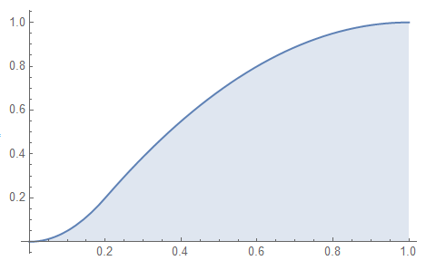

# 蒙特卡罗方法概述

## 蒲丰投针实验

考虑全空间分布有间距为$2a$的平行线，向其中投掷长度为$l(l<a)$的针，求针与平行线相交的概率$P$？

记，针中点与最近的平行线距离为$x$，针与最近的平行线的夹角为$\theta$，

两变量独立，各有概率密度函数
$$
X(x) = \frac{1}{a},\qquad x\in[0,a]
\\
\Theta(\theta) = \frac{1}{\pi}, \qquad \theta\in[0,\pi]
$$
有二维分布概率密度
$$
f(x,\theta) = X\cdot\Theta = \frac{1}{a\pi}
,\qquad
x\in[0,a],\quad
\theta\in[0,\pi]
$$
记，针与平行线相交为事件$A$，事件$A$为真的条件为
$$
A:x\in[0,l\sin\theta],\quad \theta\in[0,\pi]
$$
有概率
$$
P_A = \int_0^\pi \int_0^{l\sin\theta} f(x,\theta)dxd\theta = \frac{2 l}{\pi  a}
$$
通过实验获得$P_A$，即可计算处$\pi$

### 抽样误差

事件$A$构成一二项分布

> $n$次实验中，概率为$p$事件$A$发生$k$次的概率
>
> 单次的二项分布称为伯努利分布

$$
A\sim b(k,n,p) = C_n^k p^k \cdot (1-q)^{n-k}
=\frac{n !}{k !(n-k) !} \cdot (1-q)^{n-k}
$$

该二项分布等效于一个$n$次伯努利实验，在一次伯努利实验中可以计算出

> 该实验进行的操作，既可以看作1次n重伯努利实验
>
> 也可以看作，n次1重伯努利实验
>
> 但前者，仅能存在样本均值，不存在样本均值的方差
>
> 后者，则存在样本均值的方差

各统计量满足
$$
\begin{align} 
&\mu = np
\\
&\var = p(1-p)
\\
&\sigma=\sqrt{p q}
\end{align}
$$
考虑定理，有

> 设总体$X$具有二阶矩，即，$E(X)=\mu,Var(X) = \sigma^2< \infty,\quad x$为从该总体得到的样本，$\bar x, s^2$分别是样本均值和样本方差，则
> $$
> E(\bar x) = \mu,
> \qquad 
> Var(\bar x) = \sigma^2/n
> \qquad
> E(s^2) = \sigma^2
> $$
> 

$$
\mu_n = \mu
\\
\sigma = \frac{\sigma}{\sqrt{n}}
$$

可见，投针次数每提高两个数量级，样本标准误差降低一个数量级

## 蒙卡法求积分

对于积分
$$
I = \int_0^1 f(x) dx
$$
对$f(x)$归一化到$[0,1]$，则$f(x)$在一$1\times 1$方框内，对方框内撒点共$N$个，若落在$f(x)$曲线下有$\mu$个点，则得到积分
$$
I = \frac{\mu}{N}
$$

# 蒙卡的收敛性及误差

## 收敛性


大数定理保证了蒙卡的收敛性

## 误差


### 中心极限定理

从正态分布总体 ${N(\mu, \sigma)}$ 中随机抽样(每个样本 的含量为 ${n[}$ 如 10]), 可得无限多个样本 [如 1000 次], 每个样本计算样本均数, 则样本均数也服从正态分布。

从非正态分布总体(均数为 ${\mu}$, 方差为 ${\sigma}$ )中随机 抽样(每个样本的含量为 ${n)}$, 可得无限多个样 本, 每个样本计算样本均数, 则只要抽样次 数足够 ${大(n>50)}$, 样本均数也近似服从正态分布。


考虑布丰投针实验，

记每次实验进行$n$次投针，投中$m$次，

其理想概率记$P_理 = \frac{2l}{\pi a}$，样本概率记$P_样 = \frac{m}{n}$

根据中心极限定理，其样本均数$\overline X$满足正态分布，其标准差$\sigma_x = \frac{\sigma}{\sqrt{n}}$

在$\overline X$归一情况下（0-1分布），
$$
\overline X = \frac{m\times 1 +(n-m)\times 0}{n} = \frac{m}{n} = P_样
$$


这种情况下$\sigma_{P_样} = \sigma_{\overline X}$

在$\overline X$不归一情况下（记为a-b分布），
$$
\overline X = \frac{m\cdot a +(n-m)\cdot b}{a-b} = \frac{(a-b)\cdot m}{n} + b
\\
P_样 = (\overline X -b)/(a-b)
$$
这种情况下$\sigma_{P_样} = \sigma_{\overline X}/(a-b)$

⭐实际上蒙卡中只会出现第一种情况，因此后边就只考虑$\sigma_{P_样} = \sigma_{\overline X}$

所以，$P_样$满足$\mu = P_理,\quad \sigma = \frac{\sigma_理}{\sqrt{n}}$的正态分布

通过$P_样-P_理$，将$\mu = 0$

通过$(P_样-P_理)/\frac{\sigma_理}{n}$，将$\sigma =1$，

转换得到满足标准正态分布的$(P_样-P_理)/\frac{\sigma_理}{n}$，其PDF为
$$
\frac{1}{\sqrt{2\pi}}\cdot \exp\left(-\frac{x^2}{2}\right)
$$
因此的$(P_样-P_理)/\frac{\sigma_理}{n}$的取值$\in [-\lambda_\alpha, \lambda_\alpha]$的概率可以通过对PDF积分得到
$$
\lim_{n\rightarrow \infty} P\left\{\left|\frac{P_{样}-P_理}{\frac{\sigma}{\sqrt{n}}}\right| < \lambda_\alpha\right\}
=\int_{-\lambda_\alpha}^{\lambda_\alpha} \exp(-\frac{t^2}{2})\dd t = 1-\alpha 
$$
即，$(P_样-P_理)/\frac{\sigma_理}{n}$的取值$\in [-\lambda_\alpha, \lambda_\alpha]$的概率为$1-\alpha$

其中，$\alpha$称为显著水平，$1-\alpha$称为置信水平、置信度，$\lambda_\alpha$为置信区间，$\lambda_\alpha$与$\alpha$的关系可以通过查表获得

> $1-\alpha$才是对应的概率
>
> 对于$[-\lambda_\alpha,\lambda_\alpha] = [-\sigma,\sigma]$，则有$1-\alpha = 68.2689492\%$

变换得到

$P_样-P_理$的取值$\in \left[-\frac{\lambda_\alpha\cdot \sigma}{\sqrt{n}},\frac{\lambda_\alpha\cdot \sigma}{\sqrt{n}}\right]$的概率为$1-\alpha$，

记，$\varepsilon = \frac{\lambda_\alpha\cdot \sigma}{\sqrt{n}}$

考虑布丰投针的具体结论
$$
\left| \frac{\frac{m}{n} - \frac{2l}{\pi a}}{\frac{\sigma}{\sqrt{n}}} \right| < \lambda_\alpha
\\\downarrow\\
\frac{m}{n} - \frac{2l}{\pi a}<\varepsilon
\qquad
\frac{m}{n} - \frac{2l}{\pi a}>-\varepsilon
\\\downarrow\\
\pi \in \left[\frac{2l}{a\left(\frac{\mathrm{m}}{\mathrm{n}}+\epsilon\right)}, \frac{2l}{a\left(\frac{\mathrm{m}}{\mathrm{n}}-\epsilon\right)}\right]
$$
因此，布丰投针计算得到的圆周率$\pi$的取值在$\pi \in \left[\frac{2l}{a\left(\frac{\mathrm{m}}{\mathrm{n}}+\epsilon\right)}, \frac{2l}{a\left(\frac{\mathrm{m}}{\mathrm{n}}-\epsilon\right)}\right]$的概率为$1-\alpha$，即置信水平

$\left[\frac{2l}{a\left(\frac{\mathrm{m}}{\mathrm{n}}+\epsilon\right)}, \frac{2l}{a\left(\frac{\mathrm{m}}{\mathrm{n}}-\epsilon\right)}\right]$即置信区间

也理解为，$\pi$的理论值落在该置信区间内的可能性（可靠性）为$1-\alpha$

------

⭐第一版

如果随机变量$x_1,x_2,...,x_N$满足独立同分布，且具有有限非零的方差
$$
0\ne\sigma^2 = \int[x-E(x)]^2 f(x)dx <\infty
$$
其中，$f(x)$是$X$的分布密度函数，

即，任何独立同分布的抽样都会趋近于正态分布


则当$N$特别大时，有如下近似
$$
P(|\bar{X}_N - E(x)| < \frac{\lambda_\alpha\sigma}{\sqrt{N}}) \approx 
\frac{1}{\sqrt{2\pi}} \int_{-\lambda_\alpha}^{\lambda_\alpha} e^{-\frac{t^2}{2}} dt = 1-\alpha
$$
> 此处的$|\bar{X}_N - E(x)| < \frac{\lambda_\alpha\sigma}{\sqrt{N}}$，即是通过$\bar{X}_N - E(x)$使$\mu = 0$，通过$/\frac{\sigma}{\sqrt{n}}$使$\sigma=1$，将上述的正态分布改造成标准正态分布


其中，$\alpha$称为显著水平，$1-\alpha$称为置信水平、置信度，$\lambda_\alpha$为置信区间，$\lambda_\alpha$与$\alpha$的关系可以通过查表获得

> $1-\alpha$才是对应的概率
>
> 对于$[-\lambda_\alpha,\lambda_\alpha] = [-\sigma,\sigma]$，则有$1-\alpha = 68.2689492\%$

不等式$|\bar{X}_N - E(x)|<\frac{\lambda\alpha\sigma}{\sqrt{N}}$成立的概率近似为$1-\alpha$，且误差收敛速度的阶为$O(N^{-1/2})$

> 即满足标准正态分布（$\mu = 0,\sigma^2 = 1$的正态分布）
>
> $\operatorname{erf}(x)=\frac{1}{\sqrt{\pi}} \int_{-x}^{x} e^{-t^{2}} \mathrm{~d} t=\frac{2}{\sqrt{\pi}} \int_{0}^{x} e^{-t^{2}} \mathrm{~d} t .$称为误差函数

[布丰投针试验的仿真和误差估计_赛亚茂的博客-CSDN博客](https://blog.csdn.net/shengzimao/article/details/109205394)

------


### 蒙卡误差

定义蒙卡误差为：

> 根据上一节，可以发现这个东西正好是$P_样$偏离中心值$P_理$的量，$|P_样-P_理|$

$$
\varepsilon = \frac{\lambda_\alpha\sigma}{\sqrt{N}}
$$
因此，对于不同的置信水平有不同的$\alpha$，有固定的误差，即，中心极限定理确定了蒙卡的误差

置信区间的大小代表了区间估计都精确性，$1-\alpha$置信水平表达了区间估计的可靠性，  $\alpha$表达了区间估计的不可靠程度

> varepsilon即物理实验中的不确定度
>

蒙卡的误差是概率误差，是和其他计算方法误差的重要区别，

如，取


**降低蒙卡误差的方法**

1. 增加试验次数$N$，将$\varepsilon$提升1个数量级，$N$必须增加2个数量级
2. 通过选择最优的随机变量减少样本的均方差$\sigma$，$\sigma$减少一半，则误差减少一半，相当于$N$增加四倍的效果

**蒙卡的效率**

一般情况下，降低方差的技巧，往往使得观察一个子样的时间增加，即，在固定的时间内，做观察的样本数量减少

记，观察一个子样的时间为$C$，定义蒙卡算法效率为$\sigma^2 C$

该数值越小越好

## 68-95-99.7法则

在實際應用上，常考慮一組數據具有近似於[常態分布](https://zh.wikipedia.org/wiki/常態分佈)的機率分布。若其假設正確，則約**68.3%**數值分布在距離平均值有1個標準差之內的範圍，約**95.4%**數值分布在距離平均值有2個標準差之內的範圍，以及約**99.7%**數值分布在距離平均值有3個標準差之內的範圍。稱為「**[68-95-99.7法則](https://zh.wikipedia.org/wiki/68–95–99.7原則)**」或「**經驗法則**」。


实验上一般$1- \alpha$一般取这三个数中一个，然后再查表得到$\lambda_\alpha$


# 蒙卡的优缺点

## 优点

1. 能够逼真的描述具有随机性的事物的物理过程
2. 受几何条件限制小，可以解决高维问题（如高维积分）
3. 收敛速度与问题的维数无关
4. 具有同时计算多个方案和多个未知量的能力
5. 误差容易确定，给定置信水平下可以估算期望位于置信区间内的概率，知道$\sigma,N$则能算出误差
6. 程序结构简单，分块性强，易于实现

### 计算高维积分

计算$S$维空间中的一区域$D_S$上的积分
$$
g = \int\dots\int_{D_S} g(x_1,x_2,...,x_S) dx_x dx_2...dx_S
$$
积分离散为
$$
g = \frac{D_S}{N} \sum_{i = 1}^{N} g(x_1^{(i)},x_2^{(i)},...,x_S^{(i)})
\\
D_S = \int\dots\int_{D_S} dx_x dx_2...dx_S
$$

### 粒子穿越壳层

考虑粒子穿越多层金属板的模型，

计算粒子穿透最后一层的概率后，则穿透任何层的概率都已在中间过程中计算得到

> 波恩奥本海默近似，第一性原理计算

## 缺点

1. 收敛速度较慢，收敛速度$\sim O(N^{-1/2})$，低维问题不如其他方法

2. 误差具有概率性，不是一般意义上的误差

3. 计算结果与概率大小有关，不适用于小概率情况的计算


# 随机数的产生与检验

## 概率概念

### 概率密度函数

密度函数（PDF），描述概率的函数

对于离散随机变量，对每一个随机变量取值都有唯一对应的概率，这种对应关系称为概率函数

对于连续随机变量，由于随机变量取值有无穷个，因此不存在某一个点的概率（因为有无穷个点，那么每个点的概率其实都是0），类比于物体的质量，对于离散的质点系可以直接对每个点的质量求和，但对于连续物体，只能用密度积分来描述质量。

因此，用于描述随机变量的概率的函数称为概率密度函数，概率密度函数的积分则为对应区间的概率，也就是分布函数

对于一维实随机变量$X$，设它的累积分布函数是$F_X(x)$，如果存在可测函数$f_X(x)$满足
$$
\forall-\infty<a<\infty, \quad F_{X}(a)=\int_{-\infty}^{a} f_{X}(x) d x
$$
那么$X$是一个连续随机变量，$f_X(x)$是它的概率密度函数

而且，显然，对于具有单位质量的物体，它局部的密度是可以大于整体密度1（整体密度积分再除单位体积）的，因此某一点的概率密度也是可以大于概率总和1的

### 概率质量函数

PMF

但对于离散体系，不能用密度来描述（理论上密度是无限大的），描述离散体系的函数称为概率质量函数

假设X是一个定义在可数样本空间$S$上的离散随机变量 $S ⊆ R$，则其概率质量函数$ f_X(x) $为
$$
f_{X}(x)=\left\{\begin{array}{ll}\operatorname{Pr}(X=x), & x \in S \\ 0, & x \in \mathbb{R} \backslash S\end{array}\right.
$$
类比于质点系，显然对于单个质点的质量是不能大于整体质量的，因此概率质量函数也是不能大于整体概率之和1的

### 分布函数

累积分布函数（分布函数CDF），是概率密度函数的积分，能完整描述一个实随机变量$X$的概率分布

定义如下
$$
F_{X}(x)=\mathrm{P}(X \leq x)
$$
右侧表示随机变量$x$取值小于或等于$x$的概率

与概率密度函数（PDF）有关系
$$
F_{X}(x)=\int_{-\infty}^{x} f_{X}(t) d t
$$
注意，分布函数是不可测量的，但概率密度函数是可测量的，

## 随机数的产生

产生随机数的方法

1. 真随机数
2. 准随机数
3. 伪随机数


## 抽样检验

抽样（Sampling）是一种推论統計方法，它是指从目标总体（Population，或称为母体）中抽取一部分个体作为样本（Sample），通过观察样本的某一或某些属性，依据所获得的数据对总体的数量特征得出具有一定可靠性的估计判断，从而达到对总体的认识。

通过某种抽样方法，抽选出部分随机变量的取值，这些取值可以用来描述目标总体

| 概率密度函数                                                 | 累积分布函数                                                 |
| ------------------------------------------------------------ | ------------------------------------------------------------ |
|  |  |

以这个三角分布为例，

将随机变量取值等分为10个区间，根据概率密度函数计算各区间取值概率如下


可以发现，区间越靠近$[0.2,0.3]$，概率越高

因此，我们如果想抽取一个子样来描述母体，那么我们应该在$[0.2,0.3]$区间抽样的样本点最多，而两侧区间抽样样本点递减

但如果去取样$[0,1]$区间上的均匀随机数，那么显然样本和母体的统计特征有很大差别

所以，只有选择了合适的抽样方法对均匀随机数做处理，才能保证样本和母体有相同的统计特征

> 抽样样本的概率-取值关系不等于概率密度函数，
>
> 只是跟上面这个分区间的概率分布图一样，
>
> 实际上是直方图的“ProbabilityDensity”跟这个分区间概率图是一个画法，
>
> mma的直方图也有PDF和CDF参数，是可以直接画出相应图像的

考虑到蒙卡算法的特性，我们用的都是随机抽样算法，即，基于均匀随机数的抽样方法


> [直接抽样方法(反函数方法) - 道客巴巴 (doc88.com)](http://www.doc88.com/p-771492147678.html)
>
> [随机抽样方法整理 - 知乎 (zhihu.com)](https://zhuanlan.zhihu.com/p/24915332)

### 直接抽样方法

#### 连续分布

考虑，母体分布为$\xi = F(x)$，是随机变量$x$的连续累积分布函数，$x,\xi$是一一对应的，

累积分布函数为
$$
F(x) = \int_{-\infty}^{x}f(x)dX
$$
要求$F(x)$是归一化的，且$F(x)$存在反函数$x = F^{-1}(\xi)$


抽样步骤如下

1. 我们首先在$[0,1]$上随机抽取一系列样本$\{\xi_n\}$，

2. 然后将$\{\xi_n\}$作为概率带入反函数$F^{-1}$，可求得对应概率下的一系列随机变量取值$\{x_n\}$

这一系列$\{x_n\}$就是我们抽取的样本


还是以上面的三角分布为例

先生成800个$[0,1]$上均匀的随机数，带回CDF的反函数求出随机变量$x_n$，

```mathematica
fcdf[x_] := CDF[TriangularDistribution[{0, 1}, 0.2], x]
fcdfi[\[Xi]_] := InverseFunction[fcdf][\[Xi]]

\[Xi]array = RandomReal[1, {800}];
Parallelize[cyres = fcdfi[#] & /@ \[Xi]array];
Histogram[cyres, 10, "PDF"]
```

对求得的样本cyres绘制直方图有


可见比较好的符合了母体的统计规律

#### 离散分布

考虑，离散随机变量$X$的取值可能为$\{x_n\}$，对应概率为$p_n = P(x = x_n)$

> 上面这句离散变量的表述对应于连续变量的概率密度函数

累积分布函数为
$$
F(x) = P(X \le x) = \sum_{x_n\le x} p_n
$$
抽样步骤如下

1. 计算$k_n = y_{n-1}+p_n,\quad n=2,3,...\qquad y_1 = p_1$
2. 生成在$[0,1]$上的一系列均匀随机数$\{\xi\}$
3. 球满足$y_{k-1}<\xi<y_k$的对应$k$
3. $\{x_k\}$即为抽样样本

> 此处的$y$实际就对应于累积分布函数$F(x)$


还是用那个三角分布

把三角分布的连续概率密度，换成离散的，并缩放下，改造成概率质量函数


取样1000次

```mathematica
temp1 = fpdf[#] & /@ Range[0, 1, 0.05];
lsp = temp1/Total[temp1];
ListPlot[Transpose[{Range[0, 1, 0.05], lsp}]]

lsy = Sum[lsp[[n]], {n, 1, #}] & /@ Range[2, Length[lsp]];
calk[\[Xi]_] := Position[\[Xi] < # & /@ lsy, True][[1, 1]]
ls\[Xi]array = RandomReal[1, {1000}];
Parallelize[xkarray = Range[0, 1, 0.05][[calk[#]]] & /@ ls\[Xi]array;]

Histogram[xkarray, 21, "PDF"]
Histogram[xkarray, 21, "Probability"]
```

取样结果xkarray画直方图有，分别是PDF，和概率（PMF）

> ❓离散采样是用均匀分布随机数采，还是用均匀离散随机数采
>
> 下面是连续随机数采的，还原出来的是概率密度函数，
>
> 如果用离散随机出，好像也行


效果不如连续的


#### 另一个例子

1

考虑一$\beta$分布，
$$
f(x) = 
\left\{\begin{array}{l} 
2x \quad &0\le x\le 1
\\
0 & other
\end{array}\right.
$$
得抽样函数
$$
F(x) = \int_0^x f(x')dx' = x^{2} = \varepsilon
\\
X_F = \sqrt{\varepsilon}
$$

2

 若粒子迁移的自由程分布服从如下分布
$$
f(x) = \lambda e^{_\lambda x} \qquad x\ge 0
$$
其中，$\lambda$为粒子在介质中穿透$x$距离后所在位置的宏观总截面
$$
F(x) = \int ... = 1-e^{-\lambda X_F} = \varepsilon
\\
X_F = -\frac{1}{\lambda}\ln (1-\varepsilon) =  -\frac{1}{\lambda}\ln (\varepsilon) 
$$
$\varepsilon$是个分布，两种分布是相等的


#### 直接抽样的困难

1. 原函数写不出来，积分算不出来
2. 存在原函数$F(x)$，反函数$F^{-1}$写不出来
3. 原函数的反函数求解计算量过大


### 舍选法抽样

接受-拒绝抽样（ARS）

[接受拒绝采样（Acceptance-Rejection Sampling） - 知乎 (zhihu.com)](https://zhuanlan.zhihu.com/p/75264565)

[(10条消息) 接受拒绝采样（Acceptance-Rejection Sampling）_Anne033的博客-CSDN博客_接受拒绝采样](https://blog.csdn.net/Anne033/article/details/109841951)


直接抽样方法非常依赖于$F(x)$的形式，但抽样效率100%，抽样的每一个$\xi$，都能得到一个样本点$x_n$，每一次抽样都被接受了


舍选法效率达不到100%，但对$F(x)$要求不高


#### 简单分布的舍选法

抽样母体为$[0,1]$上的分布密度函数$f(x)$，上界$f(x)\le M,\quad M\ge 1$

> 对于其他区间上的分布密度函数，可以通过缩放，变形到$[0,1]$区间
>
> ❓为啥取上界大于1

分布$U(\xi)$是一个$[0,1]$区间上的均匀分布，概率密度函数为$u(\xi)$

分布$G(\xi')$是一个$[0,1]$区间上的均匀分布，概率密度函数为$g(\xi')$


抽样步骤如下

1. 对在$[0,1]$上抽取一系列二维随机数$(\xi_n,\xi'_n)$
2. 如果$M\times \xi'_k < f(\xi_k)$，则保留这组随机数$(\xi_k,\xi'_k)$，否则不保留
3. 保留随随机数$(\xi_k,\xi'_k)$的$\xi_k$就是我们的抽样点

$\{\xi_k\}$分布和母体相同


还以三角分布为例

```mathematica
M = 2;
\[Xi]array = RandomReal[1, {800, 2}];
sample = DeleteCases[
   If[M*\[Xi]array[[#, 2]] < 
       fpdf[\[Xi]array[[#, 1]]], \[Xi]array[[#]], Null;] & /@ 
    Range[Length[\[Xi]array]],
   Null];
Histogram[sample[[;; , 1]], 21, "PDF"]
Show[
 {
  Plot[fpdf[x]/M, {x, 0, 1}, PlotStyle -> {Blue}],
  ListPlot[\[Xi]array, PlotStyle -> {Red}],
  ListPlot[sample, PlotStyle -> {Blue}]
  }
 ]
```


蓝色线为$\frac{f(x)}{M}$，蓝色点为保留的点，红色为抛弃的点

对保留点的横坐标绘制直方图有


根据上面的点图可以发现，其实有相当大的一部分点是被抛弃的，因此简单舍选法的效率并不高

该例效率为0.4825


#### 乘分布舍选法

为了改进简单舍选法，我们将抽取$(\xi,\xi')$中横坐标的分布由原来的均匀分布更换为一个更贴近母体分布的分布，

记纵坐标$\xi$的$[0,1]$上的均匀分布记为$U(\xi')$，新的更贴近母体的$\xi$的分布为$G(\xi)$


记原来的$U(\xi)$分布不变，仍为$[0,1]$上的均匀分布

$G(\xi)$分布改为$[0,1]$区间上的任意一种分布，

$G$概率密度函数$g$和母体概率密度函数$f$满足
$$
f(x) \le  g(x)\cdot h(x)
$$
其中，$h$为有界正函数，一般取正实数


对$U$采样，得$\{\xi_n\}$，对$G$采样得点取值$\{\xi'_n\}$

把对$G$采样的点取值$\{\xi'_n\}$分别带入$g,f,h$得到三概率密度值$g(\xi'_n),f(\xi'_n),h(\xi'_n)$，

那么，$\frac{f(\xi'_n)}{h(\xi'_n)\times g(\xi'_n)}$就代表了在该随机变量取值下，$f$的概率密度密度占$hg$概率密度的比例，

> 也就是把原来横坐标的分布给改了

当$\xi_k$小于这个比例，就可以认为当$f$缩放到$[0,1]$区间的时候$\xi_k$落在了$f$以下，就保留一个$\xi'_k$

即，当$\xi_k<\frac{f(\xi'_n)}{h(\xi'_n)\times g(\xi'_n)}$，则保留一次$\xi'_k$，$\{\xi_k\}$即为抽样样本

> 几何理解下，样本点坐标为$\left[\xi'_k, \xi_k\times h(\xi'_k)\times g(\xi'_k)\right]$


抽样步骤如下

1. 分别从$U,G$分布抽样得$\{\xi_n\},\{\xi'_n\}$
2. 如果$\xi_k<\frac{f(\xi'_n)}{h(\xi'_n)\times g(\xi'_n)}$则保留$\xi'_n$

或者按照下述方式两个分布每次单独取一个，如果以文件方式存储结果应该比较节省内存

1. 进行总采样次数的循环
2. 每次循环中抽取$\xi_k,\xi'_k$
3. 如果$\xi_k<\frac{f(\xi'_n)}{h(\xi'_n)\times g(\xi'_n)}$则保留$\xi'_n$

> 下图中点的纵坐标是$\xi_k\times h(\xi'_k)\times g(\xi'_k)$


还是以上面的三角分布为例，


选取$G(x)$为一正态分布，概率密度$h*g$如蓝色所示，$h$取常数$=1.92$

```mathematica
gpdf[x_] := PDF[NormalDistribution[0.2, 0.38], x];
h = 1.92;
garray = RandomVariate[NormalDistribution[0.2, 0.38], 1000];
uarray = RandomReal[{0, 1}, {1}];
sm = ConstantArray[Null, 1000];
smex = ConstantArray[Null, 1000];
For[i = 1, i <= 1000, i += 1,
 (
  gt = RandomVariate[NormalDistribution[0.2, 0.38]];
  ut = RandomReal[{0, 1}]; 
  If[ut < fpdf[gt]/(h*gpdf[gt]), sm[[i]] = {gt, ut*h*gpdf[gt]}, 
   smex[[i]] = {gt, ut*h*gpdf[gt]}]
  )
 ]
sm = DeleteCases[sm, Null];
smex = DeleteCases[smex, Null];

Show[{
  ListPlot[smex, PlotStyle -> {Red}],
  ListPlot[sm, PlotStyle -> {Blue}],
  Plot[{gpdf[x]*h, fpdf[x]}, {x, 0, 1}, PlotLegends -> {"g*h", "f"}, 
   PlotStyle -> {Red, Blue}]
  },
 PlotRange -> {{0, 1}, {0, 2}}
 ]
 
 Histogram[sm[[;; , 1]], 10, "PDF"]
```

采样结果如下图，


可以发现，采样点的利用效率大大提高了

效率也就是$\xi'_k,\xi_k$选中得概率的乘积，该例子的效率为0.543

> 由于用的正太分布是在$[-\infty,\infty]$上的，而母体三角分布仅在$[0,1]$上，实际上在$[0,1]$区间外的采样点全部浪费了，因此效率提升不大
>
> 如果我们对建议分布的采样全部取绝对值，则效率可以达到0.738
>
> 这里仅作示意，实际建议分布和母体分布应该尽量区间一致
>
> ❓效率这么算对么

可以想见，对于随机变量取值为无穷的母体，简单舍选法效率会趋于0

但可以通过乘分布舍选法，构造一个同样取值无穷的$f_1$来采样，则可以抽样


#### 另外两个例子


$\beta$为例
$$
f(x) = 
\left\{
\begin{array}{l} 
2x,\quad 0\le x\le 1
\\
0,\quad other
\end{array}
\right.
$$
直接抽样


例2

考虑一麦克斯韦分布


### 复合抽样方法

#### 离散复合抽样

[复合分布的抽样方法 - 豆丁网 (docin.com)](https://www.docin.com/p-277987248.html)

设随机变量$X$的概率密度函数$f(x)$可以写成其他概率密度的线性叠加，即具有加分布形式，满足
$$
f(x) = \sum_n \alpha_n g_n(x)
\qquad \alpha_n>0,g_n>0
$$
其中，$\int f(x)dx = 1$。然而一般情况下，$\int g_n(x) dx \ne 1$

> ❓为什么要等于1

为了使$\int g_n(x) dx = 1$，引入一系数分布密度函数$h_n(x)$和$\beta _n$，满足
$$
h_n(x)\ge 0
\qquad
\int h_n dx = 1
\\
\beta_n\ge 0 
\qquad
\sum_n \beta_n = 1
$$
取法如下
$$
h_n(x) = \frac{g_n(x)}{\int g_n(x)dx}
\\
\beta_n = \alpha_n\cdot \int g_n(x)dx
$$
所以
$$
f(x) = \sum_n\beta _n h_n
$$
可以看出，$\beta_n$为选择事件$n$的概率


抽样步骤如下，

1. 从$[0,1]$均匀分布抽取两组$\{\xi_k\}$，$\{\xi'_k\}$，作为抽取事件的概率
2. 判断，$\sum\limits_{i=1}^{n-1}\beta_i\le \xi_k <\sum\limits_{i=1}^n \beta _i$，则取$k$号事件，即$n = k$
3. 利用作为概率的$\xi'_k$，（这里得重新抽分布，不然CDF会有部分取不到），对$g_{n=k}$分布进行直接抽样

>  先抽个签看看抽到几号事件，再对哪个分布抽


##### 举个例子

$$
f(x)=\frac{1}{4}\left(\frac{1}{\sqrt{x}}+\frac{1}{\sqrt{1-x}}\right), \quad 0 \leq x \leq 1
$$

按照加分布形式进行改写，有
$$
f(x)=\frac{1}{2}\left(\frac{1}{2 \sqrt{x}}+\frac{1}{2\sqrt{1-x}}\right)
$$

> 根据$\int_{0}^{1} \frac{1}{\sqrt{x}} d x=2，\int_{0}^{1} \frac{1}{\sqrt{1-x}} d x=2$，分别进行了归一化

即，
$$
\beta_1 = \frac{1}{2}
\quad
\beta_2 = \frac{1}{2}
\qquad
h_1(x) = \frac{1}{2\sqrt{x}}
\quad
h_2(x) = \frac{1}{2\sqrt{1-x}}
$$
并求概率分布有
$$
\begin{array}{l} 
H_1(x) = \int h_1(x) dx = \sqrt{x}
\\
H_2(x) = \int h_2(x) dx = 1-\sqrt{1-x}
\end{array}
$$
对于1，2两个事件分别有直接抽样公式
$$
x_1 = \xi‘^2
\qquad
x_2 = 2-\xi’^2
$$
若$\xi<\frac{1}{2}$，则取$x_1$进行直接抽样

若$\xi>\frac{1}{2}$，则取$x_2$进行直接抽样


```mathematica
\[Beta] = {1/2, 1/2};
ls\[Beta] = Sum[\[Beta][[n]], {n, 1, #}] & /@ Range[Length[\[Beta]]];
xfun = {Function[\[Xi], \[Xi]^2], Function[\[Xi], 2 \[Xi] - \[Xi]^2]};
chpdf = {Function[x, 1/(2*Sqrt[x])], Function[x, 1/(2*Sqrt[1 - x])]};

cfpdf[x_] := Sum[\[Beta][[n]]*chpdf[[n]][x], {n, 1, 2}];
calk[\[Xi]_] := Position[\[Xi] < # & /@ ls\[Beta], True][[1, 1]];

\[Xi]array = RandomReal[{0, 1}, {800}];
xkarray = xfun[[#]][RandomReal[{0, 1}]] & /@ (calk[#] & /@ \[Xi]array);

Histogram[xkarray, 40, "PDF"]
Histogram[xkarray, 40, "CDF"]
Plot[{cfpdf[x]}, {x, 0, 1}]
Plot[NIntegrate[cfpdf[x], {x, 0, r}], {r, 0, 1}]
```


抽样结果如下

|      | PDF                                                          | CDF                                                          |
| ---- | ------------------------------------------------------------ | ------------------------------------------------------------ |
| 理论 |  |  |
| 抽样 |  |  |


#### 连续复合抽样

联合概率分布的概率密度函数$f(x,y)$，可以写成条件概率×概率密度形式

> $$
> \int_{x} \int_{y} f_{X, Y}(x, y) d y d x=1
> $$

$$
f(x,y) = f_X(x|y) f_Y(y)
$$

则有
$$
f(x) = \int_{-\infty}^{\infty} f(x,y) dy 
=\int_{-\infty}^{\infty} f_X(x|y) \cdot f_Y(y) dy
$$
对具有上述形式概率密度函数$f(x)$的抽样结果满足：$X_f = X_{f_X}(x|y_{f_Y})$

其中，

$y_{f_Y}$由$f_Y(y)$抽样得到，

$f_X(x|y_{f_Y})$是将$Y_{f_Y}$的取值带入$f_X(x|y)$中后抽样的$x$样本点


##### 举个例子

指数分布，
$$
E_n(x) = \int_1^{\infty} \frac{n\cdot e^{-xy}}{y^n} dy \quad x\ge 0
$$
由于这个概率密度是由积分给出的，没法用前面的抽样方法解决，

改造成联合概率分布，取
$$
f_Y = n\cdot y^{-n-1}
\qquad y\ge 1
\\
f_X = y\cdot e^{-xy}
\qquad x\ge 0
$$

> 含$x$的项完全包含再$f_X$内
>
> 因为要考虑到各概率密度积分为1，$\int e^{-xy} dx = \frac{1}{y}$，因此不是直接分离变量
>
> 因为$E_n$积分是1，只要再让$f_X$或$f_Y$有一个积分为1，就都满足了

则母体可以写成
$$
E_n(x) = \int_1^{\infty} f_X(x|y) f_Y(y) dy
$$
抽样过程如下，

先由$f_Y$抽取$y_{f_Y}$，直接抽样即可$y = (1-\xi)^{-1/n} = \xi^{-1/n}$

> 第二个等号是从统计分布意义上说的

再带入$f_X(x|y_{f_Y})$，由$f_X$抽取$x_{f_X}$，

直接抽样有
$$
1-e^{-x y} = \xi'
\\
\xi' = e^{-x y}
\\
x = -\frac{\ln\xi'}{y}
$$

> 第二个等号还是从统计上说的

带入$y_{f_Y}$，有
$$
x = -\xi^{1/n}\cdot \ln (\xi')
$$
把两个随机抽样$\xi,\xi'$代入即可

```mathematica
xarray = -RandomReal[{0, 1}, {1000}]^(1/2)*
   Log[RandomReal[{0, 1}, {1000}]];
Show[
 {Histogram[xarray, 20, "PDF"],
  Plot[en[x, 2], {x, 0, 2.5}]}
 ]
```


抽样结果如下（$n = 2$）


### 变换抽样

已知随机变量的分布密度函数为$f(x)$，将$x$通过$y = \varphi(x)$变换为随机变量$y$，

设$y$的分布密度函数为$f_1(y)$，满足
$$
\begin{aligned} 
&f(x)dx = f_1\left(y\right) dy
\\
&f_1(y) = f(x)\cdot\frac{dx}{dy} = f\left(\varphi^{-1}(y)\right)\cdot\frac{dx}{dy}
\end{aligned}
$$

#### 环带上的分布

考虑一在内径$R_0$，外径$R_1$上分布的概率密度函数
$$
f(R) = \frac{2R}{R_1^2- R_0^2}
\quad (R_0\le R\le R_1)
$$
**采用直接抽样方法**，有
$$
\begin{aligned} 
F(R) &= \int_{R_0}^{R} f(R) \dd R
\\
&=\frac{\text{R0}^2-R^2}{\text{R0}^2-\text{R1}^2}
\\
F^{-1} &= R(F) = \sqrt{f\left(R_1^2 - R_0^2  \right)+ R_0^2}
\end{aligned}
$$


采样有


**采用变换抽样**，

引入变量，
$$
x = \frac{R-R_0}{R_1 - R_0}
\quad 0\le x\le 1
$$
使区间平移到坐标原点，并缩放到01区间

根据前面变换抽样那俩公式，就有$x$的分布密度函数
$$
\begin{aligned} 
f_1(x) 
&= \frac{dR}{dx}\cdot f(R)
\\
&= \frac{R_1 - R_0}{R_1 + R_0}\cdot 2x + \frac{2R_0}{R_1+R_0}\cdot 1
\end{aligned}
$$
变换得到的PDF满足加分布形式，可以通过复合抽样解决，即
$$
f_1(x) = P_1\cdot f^{(1)}(x) + P_2\cdot f^{(2)}(x)
\\
P_1 =  \frac{R_1 - R_0}{R_1 + R_0} 
\quad P_2 = \frac{2R}{R_1+R_0}
\quad P_1 + P_2 = 1
\\
f^{(1)}(x) = 2x
\quad 
f^{(2)}(x) = 1
$$
根据加分布复合抽样方法

1. 先抽取01之间的均匀分布随机数$\varepsilon_1$

2. 若$P_1\le \varepsilon< 1$，则 $X_f$由$f^{(2)}(x)$直接抽样，$X_{f^{(1)}} = \varepsilon_2$，则$R_f = R_0 + \varepsilon_2\left(R_1 -  R_0\right)$

3. 若$\varepsilon< P_1$，则$X_f$由$f^{(1)}(x)$直接抽样，

   

#### 用变换法产生标准正态分布随机数

标准正态分布PDF为
$$
f(x) = \frac{1}{\sqrt{2\pi}}\cdot e^{-\frac{x^2}{2}}\dd x
$$
无法直接求反函数

考虑两个独立的服从高斯分布的变量$x,y$

有联合概率密度函数
$$
f(x,y) = f_1(x) \cdot f_2(y)
=\frac{1}{2\pi}\cdot e^{-\frac{x^2+y^2}{2}}
$$
令$x = r\cos\theta,\quad y = r\sin\theta$，其中，$r\in[0,\infty),\quad \theta\in [0,2\pi]$

有联合CDF
$$
\begin{aligned} 
&\int_{-\infty}^{X_f}\int_{-\infty}^{Y_f} \frac{1}{2\pi}\cdot e^{-\frac{x^2+y^2}{2}}\dd x \dd y
\\
&=\int_0^{R_f}\int_0^{\theta_f} \frac{1}{2\pi}\cdot e^{-\frac{r^2}{2}}
\\
&=
\underbrace{[1-e^{-\frac{R_f^2}{2}}]}_{\varepsilon_1}
\cdot
\underbrace{\frac{\theta_f}{2\pi}}_{\varepsilon_2}
\end{aligned}
$$
对于该形式可以采用连续复合抽样，对$\varepsilon_1,\varepsilon_2$分别求反函数有
$$
R_f = \sqrt{-2\ln \varepsilon_1}
\qquad
\theta_f = 2\pi\varepsilon_2
\\
X_f = \sqrt{-2\ln\varepsilon_1}\cdot\cos(2\pi\varepsilon_2)
\\
Y_f = \sqrt{-2\ln\varepsilon_1}\cdot\sin(2\pi\varepsilon_2)
$$
这种方法称为，Box-Miuller方法

更详细的证明，可见“一种正态分布抽样算法.md”


