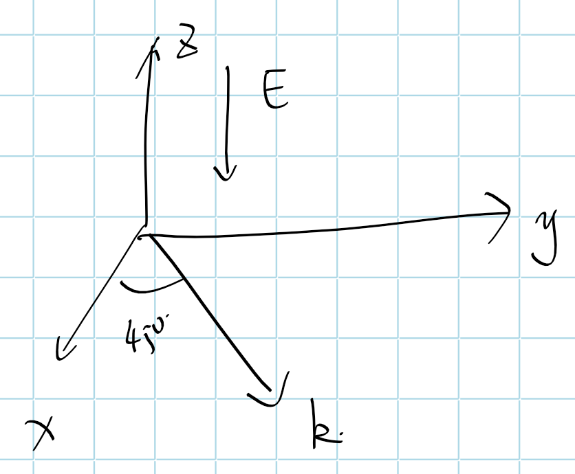

### 横向应用

电场施加方向与光束传播方向垂直，如上图所示
$$
k_x= \sin\theta
\qquad
k_y = \cos\theta
$$
以$\bar 4 3m$晶类为例，有介电张量和二阶极化率张量为
$$
\begin{pmatrix} \varepsilon_{xx}&0&0 \\ 0&\varepsilon_{xx}& 0 \\ 0&0&\varepsilon_{xx}\end{pmatrix}
\qquad

\left[\begin{array}{ccccccccc}
0 & 0 & 0 & x y z & x y z & 0 & 0 & 0 & 0 \\
0 & 0 & 0 & 0 & 0 & x y z & x y z & 0 & 0 \\
0 & 0 & 0 & 0 & 0 & 0 & 0 & x y z & x y z
\end{array}\right]
$$
根据电光效应下相对介电常数张量变换，$(\varepsilon_{\mu\alpha})_{eff}
=
\left[
\varepsilon_{r\mu\alpha} + 2\vec{\vec{\vec{\chi}}}_{\mu\alpha\beta}^{(2)}(\omega,0)\cdot E_{0\beta}
\right]$，

有施加电场后，有相对介电常数变化，
$$
\begin{array}{l} 
(\varepsilon_{\mu\alpha})_{eff}
&=
\left[
\varepsilon_{r_{\mu\alpha}} + 2\vec{\vec{\vec{\chi}}}_{\mu\alpha\beta}^{(2)}(\omega,0)\cdot E_{0\beta}
\right]
\\
&=
\begin{pmatrix}
\varepsilon_{xx}+2\chi^{(2)}_{xxz}E_{0z} & 0 +2\chi^{(2)}_{xyz}E_{0z} & 0+2\chi^{(2)}_{xzz}E_{0z}
\\
0+2\chi^{(2)}_{yxz}E_{0z} & \varepsilon_{xx}+2\chi^{(2)}_{yyz}E_{0z} & 0+2\chi^{(2)}_{yzz}E_{0z}
\\
0+2\chi^{(2)}_{zxz}E_{0z} & 0+2\chi^{(2)}_{zyz}E_{0z} & \varepsilon_{xx}+2\chi^{(2)}_{zzz}E_{0z}
\end{pmatrix}
\\
&=
\begin{pmatrix}
\varepsilon_{xx} & 2\chi^{(2)}_{xyz}E_{0z} & 0
\\
2\chi^{(2)}_{yxz}E_{0z} & \varepsilon_{xx} & 0
\\
0 & 0 & \varepsilon_{xx}
\end{pmatrix}
\end{array}
$$
代入晶体光学基本方程$D=\frac{n^{2}}{\mu_{0} c^{2}}[\boldsymbol{E}-\boldsymbol{k}(\boldsymbol{k} \cdot \boldsymbol{E})]=\varepsilon_{eff} \cdot \boldsymbol{E}$，有
$$
\begin{align}
\frac{n^2}{\mu_0 c^2} \begin{pmatrix} E_{x}(\omega) \\ E_{y}(\omega) \\ E_{z}(\omega) \end{pmatrix}
-\frac{n^2}{\mu_0 c^2} 
\hat k\cdot(\hat k\cdot\vec E)

&=
\varepsilon_0
\begin{pmatrix}
\varepsilon_{xx} & 2\chi^{(2)}_{zxy}E_{0z} & 0
\\
2\chi^{(2)}_{zyx}E_{0z} & \varepsilon_{xx} & 0
\\
0 & 0 & \varepsilon_{xx}
\end{pmatrix}
\begin{pmatrix} E_{x}(\omega) \\ E_{y}(\omega) \\ E_{z}(\omega) \end{pmatrix}
\\

\begin{pmatrix}\varepsilon_{x x} & 2 \chi_{x y z}^{(2)} E_{0 z} & 0 \\ 2 \chi_{x y z}^{(2)} E_{0 z} & \varepsilon_{x x} & 0 \\ 0 & 0 & \varepsilon_{x x}\end{pmatrix}
\begin{pmatrix} E_{x}(\omega) \\ E_{y}(\omega) \\ E_{z}(\omega)\end{pmatrix}
+
n^2\cdot
\begin{pmatrix} k_x^2&k_x k_y&0
\\k_y k_x&k_y^2&0
\\0&0&0
\end{pmatrix}
\begin{pmatrix} E_x\\ E_y\\E_z \end{pmatrix}
&=
\begin{pmatrix} n^{2} & 0 & 0 \\ 0 & n^{2} & 0 \\ 0 & 0 & n^{2}\end{pmatrix} \begin{pmatrix} E_{x}(\omega) \\ E_{y}(\omega) \\ E_{z}(\omega)\end{pmatrix}
\\

\begin{pmatrix}\varepsilon_{x x}+k_x^2n^2 & 2 \chi_{x y z}^{(2)} E_{0 z}+k_x k_y n^2 & 0 \\ 2 \chi_{x y z}^{(2)} E_{0 z}+k_yk_x n^2 & \varepsilon_{x x}+k_y^2n^2 & 0 \\ 0 & 0 & \varepsilon_{x x}\end{pmatrix}
\begin{pmatrix} E_{x}(\omega) \\ E_{y}(\omega) \\ E_{z}(\omega)\end{pmatrix}

&=
\begin{pmatrix} n^{2} & 0 & 0 \\ 0 & n^{2} & 0 \\ 0 & 0 & n^{2}\end{pmatrix} \begin{pmatrix} E_{x}(\omega) \\ E_{y}(\omega) \\ E_{z}(\omega)\end{pmatrix}

\end{align}
$$
求久期方程，有

$$
\begin{vmatrix}\varepsilon_{x x}+k_x^2n^2-n^2 & 2 \chi_{x y z}^{(2)} E_{0 z}+k_x k_y n^2& 0 \\ 2 \chi_{x y z}^{(2)} E_{0 z}+k_yk_x n^2& \varepsilon_{x x}+k_y^2n^2-n^2 & 0 \\ 0 & 0 & \varepsilon_{x x}-n^2\end{vmatrix}=0
$$
可以看出有一个解为
$$
\begin{array}{l}
n_{1}^{2}=\varepsilon_{xx} 
\end{array}
$$
代入$k_x = \sin\theta,\quad k_y=cos\theta $，取久期方程前两阶有
$$
\begin{align} 
\left(\varepsilon_{x x}+n^2\sin^2\theta-n^2\right)\left(\varepsilon_{x x}+n^2\cos^2\theta-n^2\right) &= \left(2 \chi_{x y z}^{(2)} E_{0 z}+n^2\sin\theta\cos\theta\right)^2
\\
n_{2}^{2}&=
\frac{\sec ^2(\theta ) \sqrt{\left(\epsilon  \left(\text{Cod}(\theta )^2+\sin ^2(\theta )-2\right)-2 a \chi  \sin (2 \theta )\right)^2-2 \cos ^2(\theta ) \left(\epsilon ^2-4 a^2 \chi ^2\right) \left(-2 \text{Cod}(\theta )^2+\cos (2 \theta )+1\right)}-4 a \chi  \tan (\theta )+\epsilon  \left(\text{Cod}(\theta )^2-1\right) \sec ^2(\theta )-\epsilon }{2 \left(\text{Cod}(\theta )^2-\cos ^2(\theta )\right)}
\end{align}
$$
代回基本方程，有本征方向

