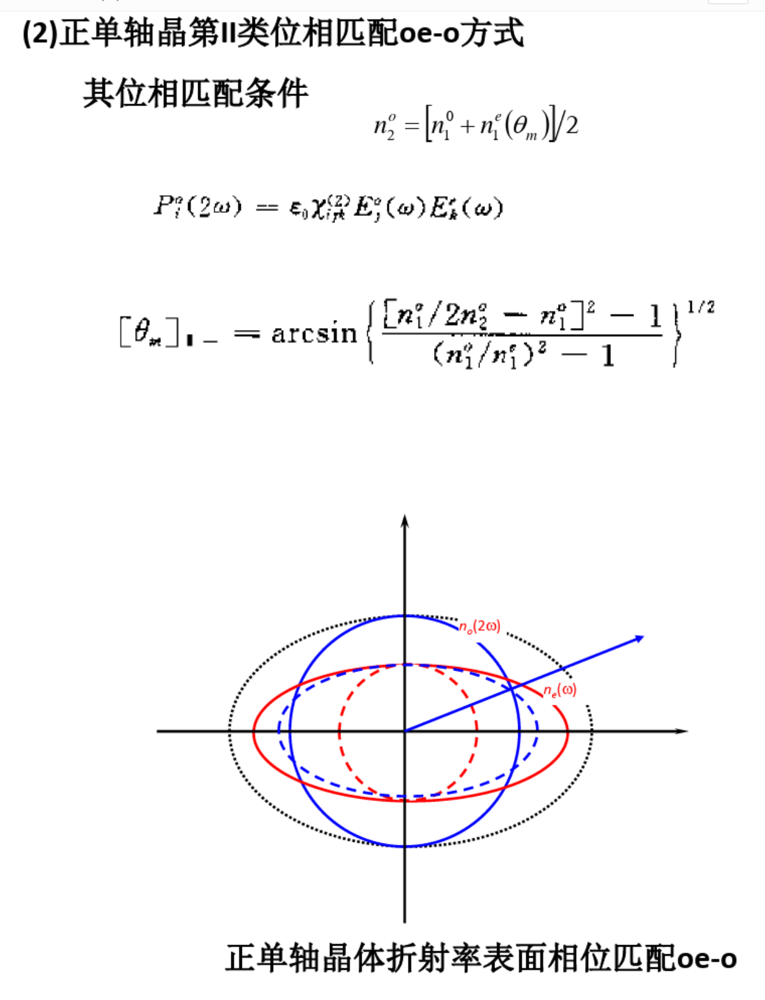

# 在倍频过程中，运用正单轴晶体实现第二类相位匹配$e+o \rightarrow o$，确定$\vec k_1,\vec k_1',\vec k_2,\vec k'_2$与光轴的夹角

记$\vec k_1$为$e$光，$\vec k_2,\vec k_3$为$o$光
$$
\omega_1(n_1 - n_3) = \omega_2(n_3 - n_2)
\\
n_3 = \frac{(\omega_1+ \omega_2)n_3 -\omega_2 n_2}{\omega_1}
$$
代入
$$
\frac{1}{n_{e}^{2}(\theta)}
=\frac{\cos ^{2} \theta}{n_{o}^{2}}+\frac{\sin ^{2} \theta}{n_e^{2}(90^\circ)}
$$
解得$\vec k_1$的$\theta$角
$$
\theta =
$$

# 求$\bar 4 2m$晶体内在$o+e\rightarrow e$类相位匹配下的有效二阶非线性极化率

再考虑$\varphi$，记入射光电场振动方向为单位矢量$\hat e_1,\hat e_2$，和频光电场振动方向为$\hat e_3$，矢量坐标如下
$$
\hat e_1 = (\sin\varphi,\cos\varphi,0)
\\
\hat e_2 = \hat e_3 = (-\cos\theta\cdot\sin\varphi,-\cos\theta\cdot\sin\varphi,\sin\theta)
$$
通过改这个三个分量，就有oee的有效极化率

有极化强度和有效极化率
$$
P_3^{(2)} = 2\varepsilon_0 \chi_{eff}^{(2)}\cdot E_1E_2
\\
\chi_{eff}^{(2)} = \hat e_3 \cdot \overline{\overline{\overline{\chi}}}^{(2)}:\hat e_1\hat e_2
$$

KDP晶体，四角晶系$\bar 4 2m$晶类，有二阶极化率张量
$$
\left[\begin{array}{ccccccccc}0 & 0 & 0 & x y z & x z y & 0 & 0 & 0 & 0 \\ 0 & 0 & 0 & 0 & 0 & x z y & x y z & 0 & 0 \\ 0 & 0 & 0 & 0 & 0 & 0 & 0 & z x y & z x y\end{array}\right]
$$
代入上式，可以得到$xyz$方向的有效极化率
$$
\begin{array}{l} 
\chi_{effx}^{(2)} = \chi_{xyz}^{(2)} e_{1y} e_{2z} + \chi_{xzy}^{(2)} e_{1z}e_{2y} = 0
\\
\chi_{effy}^{(2)} = \chi_{yxz}^{(2)} e_{1x} e_{2z} + \chi_{yzx}^{(2)} e_{1z}e_{2x} = 0
\\
\chi_{effz}^{(2)} = \chi_{zxy}^{(2)} e_{1x} e_{2y} + \chi_{zyx}^{(2)} e_{1y}e_{2x} 
= 2\chi_{zxy}e_{1x}e_{2y}
\end{array}
$$

# OPO角度调谐关系

共线相位匹配时有
$$
k_3 = k_1 + k_2
\\\downarrow\\
n_3\omega_3 = n_1\omega_1 + n_2\omega_2
\\\downarrow\\
\frac{\omega_1}{\omega_2} = \frac{n_2 - n_3}{n_3 - n_1}
$$
可见通过$n$连续变换，使$\omega_1.\omega_2$连续变化，实现调谐

以负单轴晶体Ⅰ型应用为例，即$\stackrel{\omega_1}{o}+\stackrel{\omega_2}{o}\rightarrow \stackrel{\omega_3}{e}$，通过调节频率为$\omega_3$的$e$光的$\theta$实现折射率调节，

根据相位匹配条件，有
$$
n_e(\omega_3,\theta) \omega_3 = n_o(\omega_1)\omega_1 + n_o(\omega_2)\omega_2
$$
改变输出后
$$
\left[n_e(\omega_3,\theta) +\frac{\partial n_e(\omega_3)}{\partial\theta}\Delta\theta\right]\omega_3 
= 
\left[ n_o(\omega_1)+\frac{dn_o(\omega_1)}{d\omega}\Delta\omega \right](\omega_1 +\Delta\omega)
+ 
\left[n_o(\omega_2)+\frac{dn_o(\omega)}{d\omega}\Delta \omega_2\right]
(\omega_2-\Delta\omega)
$$
左侧变动由晶体各向异性引起；右侧变动由色散引起，由材料唯一确定

上述两方程做差并移项有
$$
\Delta\omega = 
\frac{\omega_3\frac{\partial n_e(\omega_3,\theta)}{\partial\theta}\Delta\theta}
{
\omega_1\frac{dn_o(\omega_1)}{d\omega} - \omega_2\frac{dn_o(\omega_2)}{d\omega}+n_o(\omega_1)-n_o(\omega_2)
}
\tag{9}
$$
代入$e$光角度关系公式
$$
\frac{1}{n_{e}^{2}(\theta)}
=\frac{\cos ^{2} \theta}{n_{o}^{2}}+\frac{\sin ^{2} \theta}{n_e^{2}(90^\circ)}
\\\downarrow\\
n_e(\omega_3,\theta) = \frac{n_o(\omega_3)^2 n_e(\omega_3,90^\circ)^2}{n_o(\omega_3)^2 \sin ^2(\theta )+n_e(\omega_3,90^\circ)^2 \cos ^2(\theta )}
$$
有
$$
\begin{array}{l} 
\frac{\partial n_e(\omega_3,\theta)}{\partial \theta} 
&= 
\frac{n_o(\omega_3)^2 n_e(\omega_3,90^\circ)^2 \left(n_e(\omega_3,90^\circ)^2-n_o(\omega_3)^2\right) \sin (2 \theta )}{\left(n_o(\omega_3)^2 \sin ^2(\theta )+n_e(\omega_3,90^\circ)^2 \cos ^2(\theta )\right)^2}
\\&=
\frac{\left(n_o(\omega_3)^2 n_e(\omega_3,90^\circ)^2 \right)^2}{\left(n_o(\omega_3)^2 \sin ^2(\theta )+n_e(\omega_3,90^\circ)^2 \cos ^2(\theta )\right)^2} 
\cdot\left(\frac{1}{n_e(\omega_3,90^\circ)^2}-\frac{1}{n_o(\omega_3)^2}\right)\sin(2\theta)
\\&=
n_{e}(\omega_3,\theta)^2 \cdot t\left(\frac{1}{n_e(\omega_3,90^\circ)^2}-\frac{1}{n_o(\omega_3)^2}\right) \cdot \sin(2\theta)
\end{array}
\tag{10}
$$
❓这里老师算的多了一个$-\frac{1}{2}$

结合式（9，10）就能得到$\omega_1$或$\omega_2$对$\theta$的角度调谐曲线

