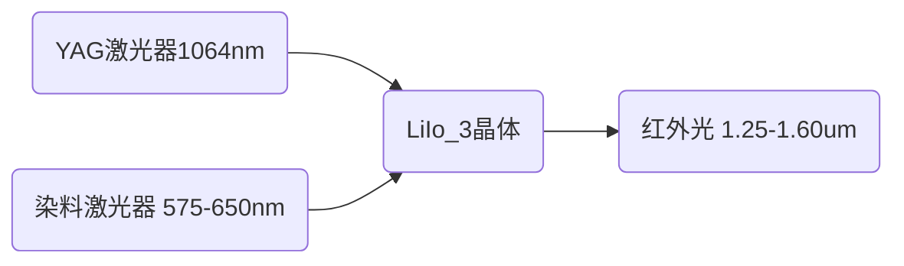
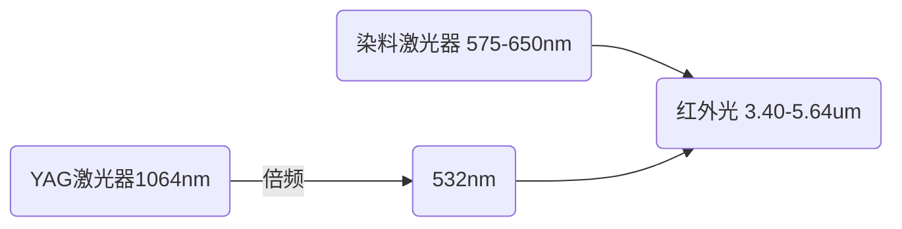
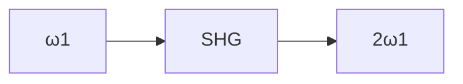
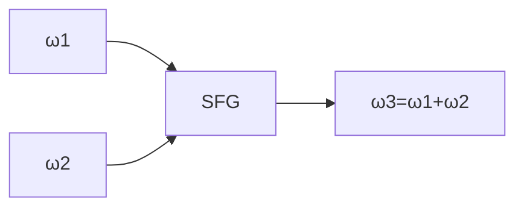
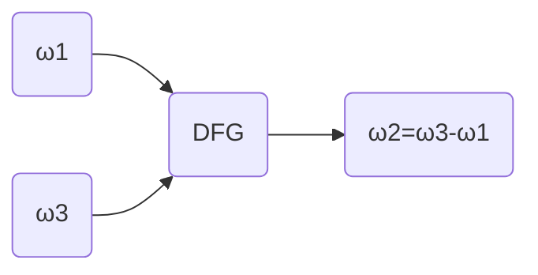
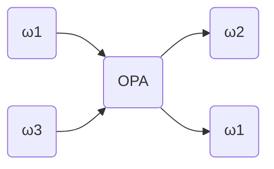
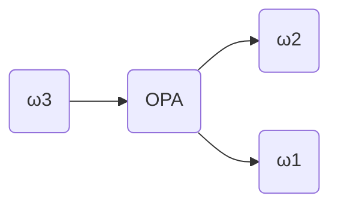
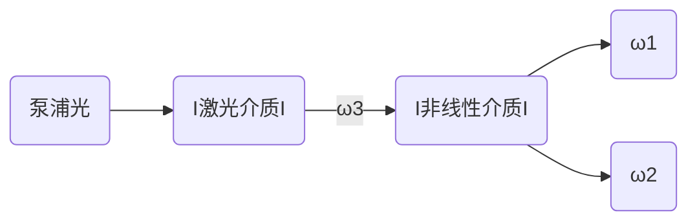

[TOC]

# 二阶非线性光学效应

## 简介

限于不具有空间反演对称性的介质

应用于

- 和频
- 差频
- 参量上转换

## 和频的小信号近似解

不考虑分界面处反射、投射，仅考虑块状介质内部，

由理想非磁介质非线性极化的耦合波方程
$$
\nabla^{2} \boldsymbol{E}-\mu_{0} \varepsilon_{0} \varepsilon^{(1)}_r \frac{\partial^{2} \boldsymbol{E}}{\partial t^{2}}
=\mu_{0} \frac{\partial^{2} \boldsymbol{P}^{NL}}{\partial t^{2}}
$$
可以描述和频过程，由下列方程描述
$$
\left\{
\begin{array}{l} 
\nabla^{2} \boldsymbol{E}(\omega_1)-\mu_{0} \varepsilon_{0} \varepsilon^{(1)}_r \frac{\partial^{2} \boldsymbol{E}(\omega_1)}{\partial t^{2}}
=\mu_{0} \frac{\partial^{2} \boldsymbol{P}^{(2)}(\omega_1)}{\partial t^{2}}
\\
\nabla^{2} \boldsymbol{E}(\omega_2)-\mu_{0} \varepsilon_{0} \varepsilon^{(1)}_r \frac{\partial^{2} \boldsymbol{E}(\omega_2)}{\partial t^{2}}
=\mu_{0} \frac{\partial^{2} \boldsymbol{P}^{(2)}(\omega_2)}{\partial t^{2}}
\\
\nabla^{2} \boldsymbol{E}(\omega_3)-\mu_{0} \varepsilon_{0} \varepsilon^{(1)}_r \frac{\partial^{2} \boldsymbol{E}(\omega_3)}{\partial t^{2}}
=\mu_{0} \frac{\partial^{2} \boldsymbol{P}^{(2)}(\omega_3)}{\partial t^{2}}
\end{array}
\right.
\\
P^{(2)}(\omega_3 ) = 2\varepsilon_0 \chi^{(2)}(\omega_3;\omega_1,\omega_2):E(\omega_1)E(\omega_2)
= 2\varepsilon_0 \chi^{(2)}(\omega_3;\omega_1,\omega_2):A(\omega_1)A(\omega_2)e^{i\Delta kz}
\\
P^{(2)}(\omega_2 ) = 2\varepsilon_0 \chi^{(2)}(\omega_2;\omega_1,\omega_3):E(\omega_1)E(\omega_3)
= 2\varepsilon_0 \chi^{(2)}(\omega_2;\omega_1,\omega_3):A^*(\omega_1)A(\omega_3)e^{-i\Delta kz}
\\
P^{(2)}(\omega_1 ) = 2\varepsilon_0 \chi^{(2)}(\omega_1;\omega_2,\omega_3):E(\omega_2)E(\omega_3)
= 2\varepsilon_0 \chi^{(2)}(\omega_1;\omega_2,\omega_3):A^*(\omega_2)A(\omega_3)e^{-i\Delta kz}
$$
其中，$\omega_1,\omega_2$为入射光（泵浦光），$\omega_3 = \omega_1 +\omega_2$为和频光，$\Delta k = k_1 +k_2 -k_3$

> 三个极化波的波矢分别为，
>
> $\Delta k_1 = k_3-k_2 - k_1,\Delta k_2 = k_3-k_1 - k_2,\Delta k_3 = k_1+k_2 - k_3$,
>
> 统一取$\Delta k = k_1 +k_2 - k_3$,才有了右边指数幂的正负号区别
>
> 
>
> 也可以考虑为同时入射三种光

#### 小信号近似

认为从泵浦光到和频光的转换效率$\ll 1$，即认为$E(\omega_3) = 0$，

> ❓这里是不是也把泵浦光的振幅看成常数了

所以$P^{2}(\omega_1) = P^{(2)}(\omega_2) = 0$，则方程简化
$$
\left\{
\begin{align} 
&\nabla^{2} \boldsymbol{E}(\omega_1)-\mu_{0} \varepsilon_{0} \varepsilon^{(1)}_r \frac{\partial^{2} \boldsymbol{E}(\omega_1)}{\partial t^{2}}
=0
\tag{1.1}
\\
&\nabla^{2} \boldsymbol{E}(\omega_2)-\mu_{0} \varepsilon_{0} \varepsilon^{(1)}_r \frac{\partial^{2} \boldsymbol{E}(\omega_2)}{\partial t^{2}}
=0
\tag{1.2}
\\
&\nabla^{2} \boldsymbol{E}(\omega_3)-\mu_{0} \varepsilon_{0} \varepsilon^{(1)}_r \frac{\partial^{2} \boldsymbol{E}(\omega_3)}{\partial t^{2}}
=\mu_{0} \frac{\partial^{2} \boldsymbol{P}^{(2)}(\omega_3)}{\partial t^{2}}
\tag{1.3}
\end{align}
\right.
\\
P^{(2)}(\omega_3 ) = 2\varepsilon_0 \chi^{(2)}(\omega_3;\omega_1,\omega_2):E(\omega_1)E(\omega_2)
= 2\varepsilon_0 \chi^{(2)}(\omega_3;\omega_1,\omega_2):A(\omega_1)A(\omega_2)e^{i\Delta kz}
$$

#### 无限大平面波假设

假设泵浦光$\omega_1,\omega_2$为平面波，因此由方程(1.1)、(1.2)的解为
$$
\begin{align} 
& E(\omega_1) = \frac{1}{2}\left( \zeta_1\cdot e^{ik_1 r - i\omega_1 t}+c.c\right)
\tag{2.1}
\\
& E(\omega_2) = \frac{1}{2}\left( \zeta_2\cdot e^{ik_2 r - i\omega_2 t}+c.c\right)
\tag{2.2}
\end{align}
$$

#### 立方晶体假设

电位移矢量与外电场有如下关系
$$
\vec{D}=\varepsilon_{\alpha \beta} \vec{E}
$$
其中介电常数为一张量
$$
\varepsilon_{\alpha \beta}=\left(\begin{array}{lll}\varepsilon_{x x} & \varepsilon_{x y} & \varepsilon_{x z} \\ \varepsilon_{y x} & \varepsilon_{y y} & \varepsilon_{y z} \\ \varepsilon_{z x} & \varepsilon_{z y} & \varepsilon_{z z}\end{array}\right)
$$

> ❓对应于$1+\chi^{(1)} = 这个？$

对于立方对称的晶体，利用绕$z$轴的四重旋转对称轴，可以证明，介电常数为对角阵，

因此可以视为一常数

#### 空间慢变振幅近似

则方程（1.3）简化为
$$
\frac{\partial A_n(z)}{\partial z}=\frac{i \mu_0\omega_{n}^2}{2  k_n} \boldsymbol{B}_{n}^{NL} \mathrm{e}^{i\Delta k\cdot z}
$$
其中，$A_3(z)$为和频光$\omega_3$的振幅，限于稳态情况，$\Delta k = k_1+k_2 - k_3$

> 极化波波矢量$k' = k_1 +k_2$,再除去$\omega_3$电场，就有上式

将(2.1)(2.2)代入(3)，

考虑
$$
P^{(2)}(\omega_3) = 2\varepsilon_0 \chi^{(2)}:E(\omega_1)E(\omega_2)
$$
由于$E(\omega_1),E(\omega_2)$无损耗，其振幅无衰减，所以$P^{(2)}(\omega_3)$有形式
$$
P^{(2)}(\omega_3) = B_3^{NL}\cdot e^{i\Delta k z - i\omega t}
$$
其中，振幅$B_3^{NL}$为常数，

所有有（1.3）的简化
$$
\frac{\partial A_3(z)}{\partial z}
&=\frac{i \mu_0\omega_{3}^2}{2  k_n} \boldsymbol{B}_{3}^{NL} \mathrm{e}^{i\Delta k\cdot z}
\\
&=\frac{i \omega_{3}^2}{2 \varepsilon_0 k_n c^2} \boldsymbol{B}_{3}^{NL} \mathrm{e}^{i\Delta k\cdot z}
\tag{3}
$$
其中，$\Delta k = k_1+k_2 - k_3$，

方程（3）两侧做定积分$\int_0^z$，有
$$
A_3(z) - A_3(0)
= \frac{\omega_{3}^2}{2 \varepsilon_0 k_n^2 c^2} \boldsymbol{B}_{3}^{NL}\cdot e^{i \Delta k z} - \frac{\omega_{3}^2}{2 \varepsilon_0 k_n^2 c^2} \boldsymbol{B}_{3}^{NL}

\\\downarrow\\

A_3(z)
= \frac{\omega_{3}^2}{2 \varepsilon_0 k_n^2 c^2} \boldsymbol{B}_{3}^{NL}\cdot \left(e^{i \Delta k z} - 1\right) + A_3(0)
$$
为**和频光的耦合波方程**，其中，$A_3(0)$为入射的$\omega_3$光的振幅，一般为0

#### 和频光强的讨论

因为光强$I\propto A^2$，所以有
$$
I&\propto
{B_3^{NL}}^2 \cdot |e^{i\Delta k}-1|^2
\\&\propto
{B_3^{NL}}^2 \cdot (e^{i\Delta k}-1)^2
$$
其中，
$$
\begin{array}{l} 
|e^{i\Delta k}-1|
&= |i \sin (k z)+\cos (k z)-1|
\\
&= \sqrt{\sin ^2(k z)+(\cos (k z)-1)^2}
\\
&= \sqrt{2-2 \cos (k z)}
\end{array}
$$

$$
\begin{array}{l} 
|e^{i\Delta k}-1|^2
&= 2-2 \cos (\Delta k z)
\\
&= 2(1-\cos(\Delta kz))
\\
&= 4\cdot \sin^2 (\frac{\Delta kz}{2})
\\
&= 4\cdot\left(\frac{\sin\frac{\Delta kz}{2}}{\frac{\Delta kz}{2}}\right)^2 \cdot\left(\frac{\Delta kz}{2}\right)^2
\\
&= \Delta k^2
\cdot\left(\frac{\sin\frac{\Delta kz}{2}}{\frac{\Delta kz}{2}}\right)^2 \cdot z^2
\end{array}
$$

所以
$$
I \propto
{B_3^{NL}}^2 \cdot\Delta k^2
\cdot\left(\frac{\sin\frac{\Delta kz}{2}}{\frac{\Delta kz}{2}}\right)^2 \cdot z^2
$$

##### 对于${B_3^{NL}}^2$部分，

有
$$
\begin{array}{l} 
\left|B_3^{NL}\right|^2 
&= \left|\varepsilon_0 \chi^{(2)}:E_1E_2\right|^2
\\
&\sim {\chi^{(2)}_f}^2 I_1\cdot I_2
\end{array}
$$
$\chi_f^{(2)}$，称为二阶有效极化率张量，$\chi^{(2)}_f = \hat e_3 \cdot \chi^{(2)}:\hat{e_1}\hat{e_2}$，$\hat{e}$为电场极化方向，有效极化率为在各光偏振方向上的投影，因此为一标量

即
$$
I\propto {\chi^{(2)}_f}^2 I_1\cdot I_2
$$
可见，通过聚焦提高入射光光强，可以提高和频效率

##### 对于$\left(\frac{\sin\frac{\Delta kz}{2}}{\frac{\Delta kz}{2}}\right)^2$部分，

有

横坐标为$\frac{\Delta kz}{2}$,

其主极大，称为相位匹配峰值，当相位匹配，即$\Delta k =0$时，峰值最高

> ❓相位匹配峰值左右移动跟$\Delta$k的问题

相位匹配宽度，
$$
\frac{\Delta kz}{2} = \pi \longrightarrow \Delta kz = 2\pi 
\stackrel{z = 1cm\quad k\sim 10^{-5}}{\longrightarrow}
\left|\frac{\Delta k}{k}\right| \sim 10^{-4}
$$
说明保证相位匹配对于提高和频效率的重要性

> 匹配宽度取一半

##### 对于$z^2$项

有
$$
I\propto z^2
$$
可见，材料越厚，和频效率越高，

但由于，$z\rightarrow \infin,\quad I\rightarrow\infin$，会发生能量不守恒的矛盾，这是由于小信号近似导致的。

可以定义相干长度$l_{相干}$，$\Delta k \cdot l_{相干} = 2\pi$，使
$$
\left \{
\begin{array}{l} 
l<l_{相干}, \quad I_3\propto z^2
\\
l\ge l_{相干}, \quad I_3\propto l^2_{相干}
\end{array}
\right.
$$

#### 局限性

- 忽略了界面处的反射（在实际应用中，常通过晶体镀膜，使晶体界面增透）
- 忽略介质吸收，即$\sigma = 0$，若考虑吸收，则增加一衰减长度，或理解为使$l_{相干}$变短
- 小信号近似，导致能量不守恒

## 和频的高转换效率解

$$
\left\{
\begin{array}{l} 
\nabla^{2} \boldsymbol{E}(\omega_1)-\mu_{0} \varepsilon_{0} \varepsilon^{(1)}_r \frac{\partial^{2} \boldsymbol{E}(\omega_1)}{\partial t^{2}}
=\mu_{0} \frac{\partial^{2} \boldsymbol{P}^{(2)}(\omega_1)}{\partial t^{2}}
\\
\nabla^{2} \boldsymbol{E}(\omega_2)-\mu_{0} \varepsilon_{0} \varepsilon^{(1)}_r \frac{\partial^{2} \boldsymbol{E}(\omega_2)}{\partial t^{2}}
=\mu_{0} \frac{\partial^{2} \boldsymbol{P}^{(2)}(\omega_2)}{\partial t^{2}}
\\
\nabla^{2} \boldsymbol{E}(\omega_3)-\mu_{0} \varepsilon_{0} \varepsilon^{(1)}_r \frac{\partial^{2} \boldsymbol{E}(\omega_3)}{\partial t^{2}}
=\mu_{0} \frac{\partial^{2} \boldsymbol{P}^{(2)}(\omega_3)}{\partial t^{2}}
\end{array}
\right.
\\
P^{(2)}(\omega_3 ) = 2\varepsilon_0 \chi^{(2)}(\omega_3;\omega_1,\omega_2):E(\omega_1)E(\omega_2)
= 2\varepsilon_0 \chi^{(2)}(\omega_3;\omega_1,\omega_2):A(\omega_1)A(\omega_2)e^{i\Delta kz}
\\
P^{(2)}(\omega_2 ) = 2\varepsilon_0 \chi^{(2)}(\omega_2;\omega_1,\omega_3):E(\omega_1)E(\omega_3)
= 2\varepsilon_0 \chi^{(2)}(\omega_2;\omega_1,\omega_3):A^*(\omega_1)A(\omega_3)e^{-i\Delta kz}
\\
P^{(2)}(\omega_1 ) = 2\varepsilon_0 \chi^{(2)}(\omega_1;\omega_2,\omega_3):E(\omega_2)E(\omega_3)
= 2\varepsilon_0 \chi^{(2)}(\omega_1;\omega_2,\omega_3):A^*(\omega_2)A(\omega_3)e^{-i\Delta kz}
$$

其中，$\chi_{effn}$为有效极化率，为一标量，满足
$$
\chi_{eff3} = \hat e_3 \cdot \vec{\vec{\vec \chi}} \cdot \hat e_1 \cdot \hat e_2
$$

该方程中$\omega_2$指强度较弱的入射光

#### 考虑空间慢变振幅近似

> 在一个波长范围（$\le 1\mu m$）内，非线性效应不及发生，空间慢变振幅仍然满足

记
$$
P^{(2)}(\omega_3) =B_3^{NL}\cdot e^{i\Delta k z - i\omega t}
$$
方程化为
$$
\left\{
\begin{align}
&\frac{\partial A_1(z)}{\partial z}
=\frac{i \,u_0\omega_{1}^2}{2  k_1} B_{1}^{NL} \mathrm{e}^{-i\Delta k\cdot z}
=\frac{i \omega_{1}^2}{k_1c^2} A^*_{2}(z) A_{3}(z)\cdot \chi_{eff1}^{(2)}\cdot \mathrm{e}^{-i\Delta k\cdot z}
\\
&\frac{\partial A_2(z)}{\partial z}
=\frac{i \mu_0\omega_{2}^2}{2  k_2} \boldsymbol{B}_{2}^{NL} \mathrm{e}^{-i\Delta k\cdot z}
=\frac{i \omega_{2}^2}{k_2c^2} A^*_{1}(z) A_{3}(z)\cdot \chi_{eff2}^{(2)}\cdot \mathrm{e}^{-i\Delta k\cdot z}
\\
&\frac{\partial A_3(z)}{\partial z}
=\frac{i \mu_0\omega_{3}^2}{2  k_3} \boldsymbol{B}_{3}^{NL} \mathrm{e}^{i\Delta k\cdot z}
=\frac{i \omega_{3}^2}{k_3c^2} A_{1}(z) A_{2}(z)\cdot \chi_{eff3}^{(2)}\cdot \mathrm{e}^{i\Delta k\cdot z}
\end{align}
\right.
$$
其中，$\Delta k = k_1 +k_2 - k_3$

#### 考虑Kelman对称性

当原理共振区时，有
$$
\begin{aligned} \chi_{e f f}^{(2)} &=\vec{a}_{1} \cdot \bar{\chi}^{(2)}\left(-\omega_{1} ; \omega_{3},-\omega_{2}\right): \vec{a}_{3} \vec{a}_{2} \\ &=\vec{a}_{2} \cdot \bar{\chi}^{(2)}\left(-\omega_{2} ; \omega_{3},-\omega_{1}\right): \vec{a}_{3} \vec{a}_{1} \\ &=\vec{a}_{3} \cdot \bar{\chi}^{(2)}\left(-\omega_{3} ; \omega_{1}, \omega_{2}\right): \vec{a}_{1} \vec{a}_{2} \end{aligned}
$$
所以方程组化为
$$
\left\{
\begin{align}
&\frac{\partial A_1(z)}{\partial z}
=\frac{i \,u_0\omega_{1}^2}{2  k_1} B_{1}^{NL} \mathrm{e}^{-i\Delta k\cdot z}
=\frac{i \omega_{1}^2}{k_1c^2} A^*_{2}(z) A_{3}(z)\cdot \chi_{eff}^{(2)}\cdot \mathrm{e}^{-i\Delta k\cdot z}
\\
&\frac{\partial A_2(z)}{\partial z}
=\frac{i \mu_0\omega_{2}^2}{2  k_2} \boldsymbol{B}_{2}^{NL} \mathrm{e}^{-i\Delta k\cdot z}
=\frac{i \omega_{2}^2}{k_2c^2} A^*_{1}(z) A_{3}(z)\cdot \chi_{eff}^{(2)}\cdot \mathrm{e}^{-i\Delta k\cdot z}
\\
&\frac{\partial A_3(z)}{\partial z}
=\frac{i \mu_0\omega_{3}^2}{2  k_3} \boldsymbol{B}_{3}^{NL} \mathrm{e}^{i\Delta k\cdot z}
=\frac{i \omega_{3}^2}{k_3c^2} A_{1}(z) A_{2}(z)\cdot \chi_{eff}^{(2)}\cdot \mathrm{e}^{i\Delta k\cdot z}
\end{align}
\right.\tag{4}
$$

#### 门莱-罗（Manley-Rowe）关系

设完全相位匹配，$\Delta k = 0$（有效产生和频）

方程组三式两侧乘以相应复共轭光电场，即$\frac{k_n}{\omega_n}A_n^*$，则有
$$
\left\{
\begin{align}
&
\frac{k_1}{\omega_1}A_1^*\frac{\partial A_1(z)}{\partial z}
=\frac{i \omega_{1}}{c^2} A^*_{1}(z)A^*_{2}(z) A_{3}(z)\cdot \chi_{eff}^{(2)}\cdot \mathrm{e}^{-i\Delta k\cdot z}
\tag{5.1}
\\
&
\frac{k_2}{\omega_2}A_2^*\frac{\partial A_2(z)}{\partial z}
=\frac{i \omega_{2}}{c^2} A^*_{1}(z) A^*_{2}(z) A_{3}(z)\cdot \chi_{eff}^{(2)}\cdot \mathrm{e}^{-i\Delta k\cdot z}
\tag{5.2}
\\
&
\frac{k_3}{\omega_3}A_3^*\frac{\partial A_3(z)}{\partial z}
=\frac{i \omega_{3}}{c^2} A_{1}(z) A_{2}(z) A_{3}^*(z)\cdot \chi_{eff}^{(2)}\cdot \mathrm{e}^{i\Delta k\cdot z}
\tag{5.3}
\end{align}
\right.
$$

可见，前两者相等，而与第三者具有复共轭关系，
$$
\frac{k_1}{\omega_1}A_1^*\frac{\partial A_1(z)}{\partial z}
=
\frac{k_2}{\omega_2}A_2^*\frac{\partial A_2(z)}{\partial z}
=
-
\frac{k_3}{\omega_3}A_3^*\frac{\partial A_3(z)}{\partial z}
$$

> 根据真实性条件，振幅共轭直接取负号❓

根据光强公式

$$
I_{i}=\frac{1}{2} \varepsilon_{0} c n_{i} E_{i} E_{i}^{*}=\frac{1}{2} \varepsilon_{0} c n_{i}\left|E_{i}\right|^{2}
\\\Downarrow\\
\frac{d I_{i}}{d z}=\frac{1}{2} \varepsilon_{0} c n_{i}\left(\frac{d E_{i}}{d z} E_{i}^{*}+\frac{d E_{i}^{*}}{d z} E_{i}\right)=\frac{1}{2} \varepsilon_{0} c n_{i}\left(\frac{d E_{i}}{d z} E_{i}^{*}+c . c .\right)
$$
有
$$
\frac{\mathrm{d}}{\mathrm{d} z}\left(\frac{I_{1}}{\omega_{1}}\right)=\frac{\mathrm{d}}{\mathrm{d} z}\left(\frac{I_{2}}{\omega_{2}}\right)=-\frac{\mathrm{d}}{\mathrm{d} z}\left(\frac{I_{3}}{\omega_{3}}\right)
\\\Downarrow\\
\left\{\begin{array}{l} 
\frac{I_{1}}{\omega_{1}}- \frac{I_{2}}{\omega_{2}} = Const
\\
\frac{I_{1}}{\omega_{1}}+\frac{I_{3}}{\omega_{3}} = Const
\\
\frac{I_{2}}{\omega_{2}}+\frac{I_{3}}{\omega_{3}} = Const
\end{array}\right.
$$
又光子数通量$N(\omega_n) \sim \frac{I_n}{\omega_n} $，所以有
$$
\left\{\begin{array}{l} 
N(\omega_1) + N(\omega_3) = Const
\\
N(\omega_2) + N(\omega_3) = Const
\\
N(\omega_1) - N(\omega_2) = Const
\end{array}\right.
\tag{6}
$$

另，(5.1)、(5.2)、(5.3)*相加，有
$$
\frac{k_1}{\omega_1}A_1^*\frac{\partial A_1(z)}{\partial z}
+
\frac{k_2}{\omega_2}A_2^*\frac{\partial A_2(z)}{\partial z}
+
\frac{k_3}{\omega_3}A_3\frac{\partial A_3^*(z)}{\partial z}
=
C\cdot(\omega_1+\omega_2 - \omega_3)

\\\Downarrow\\
\frac{d}{d z}\left(I_{1}+I_{2}+I_{3}\right)
=C\cdot\Delta k
\xlongequal{当完全相位匹配时}
0
$$

所以有

$$
I_{1}(z)+I_{2}(z)+I_{3}(z)=I \tag{7}
$$

其中，$I$为常数，即初始位置$z=0$的总入射光强，

等式（6）、（7）合称为**门莱-罗（Manley-Rowe）关系**

- 式（6），表明相互作用中三个光电场光子数的变化关系。如果频率为$\omega_1$和$\omega_2$的两个光子同时湮没，可以产生频率为$\omega_3$的一个光子，这就是和频和倍频的情况；反过来3光子湮没，同时产生两个频率为$\omega_1$和$\omega_2$的光子，这就是参量产生的情况
- 式（7），表明无损耗介质中非线性相互作用的能量守恒关系

#### 雅可比椭圆函数解

对于方程组（4），初始条件为$A(\omega_3 ,z=0) = 0$有解
$$
A(\omega_3,z) = \left(\frac{k_2\omega_3^2}{k_3\omega_2}\right)^{\frac{1}{2}} 
\cdot A(\omega_2,0)\cdot Sn(u,\gamma) \tag{8}
$$
其中，$A(\omega_2,0)$为两束入射光中较弱光的入射振幅，$Sn$为雅可比椭圆函数

其中，
$$
u = \frac{1}{2c^2} \left(\frac{\omega_2^2\omega_3^2}{k_2k_3}\right)\left|\chi_{eff}^{(2)}\right|\cdot A(\omega_1,0)
=
\frac{z}{l_m}
\\
\gamma = \left(\frac{\omega_1^2k_2}{\omega_2^2k_1}\right)^{\frac{1}{2}}\cdot \frac{A(\omega_2,0)}{A(\omega_1,0)}
=\sqrt{\frac{N(\omega_2)}{N(\omega_1)}} \lt 1
\quad
\longrightarrow\quad
\gamma^2 = \frac{N(\omega_2)}{N(\omega_1)}
$$
可见，$u$与晶体内部位置有关，$\gamma$与入射光通量之比有关

（8）式平方，并根据门莱-罗关系，得方程之解
$$
\begin{array}{l} 
N(\omega_3,z) = N(\omega_2,0)\cdot Sn^2\left[\frac{z}{l_m},\sqrt{\frac{N(\omega_2)}{N(\omega_1)}}\right]
\\
N(\omega_1,z) = N(\omega_1,0) - N(\omega_3,z)
\\
N(\omega_2,z) = N(\omega_2,0) - N(\omega_3,z)
\end{array}
$$

##### 雅可比椭圆函数

雅可比椭圆函数为第一类椭圆积分的逆变换，即下式的逆变换
$$
F(\gamma,\varphi) = \int_0^{\varphi} \frac{d\varphi'}{\sqrt{1-\gamma^2\cdot \sin^2\varphi'}} = u
\\\downarrow\\
\sin\varphi = Sn(u,\gamma)
$$
为一周期函数，最大值为1

##### 特殊情形1

当$N(\omega_2,0)\ll N(\omega_1,0)$时，有
$$
\gamma = 0
\\
u = \int_0^{\varphi} d\varphi' = \varphi
\quad
\rightarrow
\quad
\sin\varphi = \sin u = \sin(\frac{z}{l_m})
$$
方程解为
$$
\begin{array}{l} 
N(\omega_3,z) = N(\omega_2,0)\cdot \sin^2(\frac{z}{l_m})
\\
N(\omega_1,z) = N(\omega_1,0) - N(\omega_2,0)\cdot \sin^2(\frac{z}{l_m})
\\
N(\omega_2,z) = N(\omega_2,0)\left[1-\sin^2(\frac{z}{l_m})\right]
\end{array}
$$
图像如下所示

可见，

在$z = \frac{\pi}{2}l_m$处，$N_3$做大，和频效率最高，

在$z>\frac{\pi}{2}l_m$处，$N_1$开始与$N_3$发生差频过程

又
$$
l_m = \left[\frac{1}{2c^2}\left(\frac{\omega_2^2 \omega_3^2}{k_2 k_3}\right)\chi_{eff}^{(2)}A(\omega_1,0)\right]^{\frac{1}{2}}
$$
可见，

- $\chi^{(2)}_{eff}$越大$\stackrel{}{\longrightarrow}$说明物质、方向选择的重要性
- $A(\omega_1,0)$越大$\stackrel{}{\longrightarrow}$说明聚焦的重要性

和频越有效

##### 特殊情形2

当$N(\omega_1) \approx N(\omega_2)$时
$$
\gamma = 1
\\
u = \int_0^{\varphi} \frac{d\varphi'}{\sqrt{1-\sin^2\varphi}} = \int_0^\varphi \frac{1}{\cos\varphi'}d\varphi' = \ln(\frac{1+\sin\varphi}{1-\sin\varphi})
\\\downarrow\\
e^u = \ln(\frac{1+\sin\varphi}{1-\sin\varphi})
\\\downarrow\\
\sin\varphi = \frac{e^u-1}{e^u +1} = \tanh\left(\frac{u}{2}\right) 
= \tanh\left(\frac{z}{2l_m}\right)
$$
方程解为
$$
\begin{array}{l} 
N(\omega_3,z) = N(\omega_2,0)\cdot \tanh\left(\frac{z}{2l_m}\right)
\\
N(\omega_1,z) = N(\omega_1,0) - N(\omega_2,0)\tanh\left(\frac{z}{2l_m}\right)
\\
N(\omega_2,z) = N(\omega_2,0)\left[1-\tanh\left(\frac{z}{2l_m}\right)\right]
\end{array}
$$

可见此时在，在相干长度$l_m$之外，和频效率趋于恒定

当$N(\omega_1) = N(\omega_2)$时，即为和频

## 如何有效产生和频

根据前面的讨论，可以发现，完全相位匹配$\Delta k = (k_1+k_2-k_3)_z = 0$是能否有效产生和频的关键，

但在实际使用中，还要考虑两入射光是否共线，

当两光束不共线时，如下图所示

可发现，其仅在两光束交汇的红色区域内才能发生和频

因此，实验上有效产生和频的条件称为**共线相位匹配**

接下来考虑实现完全相位匹配的条件

完全相位匹配条件，即
$$
\Delta k = k_1 + k_2 -k_3 = 0
\\\downarrow \frac{c}{n} =\frac{1}{v_相} = \frac{\omega}{k} \\
n_1\omega_1 + n_2\omega_2 = n_3(\omega_1+\omega_2)
\\\downarrow\\
\omega_1(n_1 - n_3) = \omega_2(n_3 - n_2)
$$
可见，条件关键在于介质的折射率，

#### 利用反常色散

介质中的折射率存在正常色散和反常色散，

⚪在正常色散情况下，介质折射率随波长的增加而减小，与频率正相关，即$n_3>n_1,n_2$，所以$n_3-n_2 >0,\quad n_1-n_3<0$，相位匹配条件不能成立

⚪在反常色散情况下，介质折射率仍随波长的增加而减小，但在材料吸收区附近，在吸收区的低频边的折射率，比高频边的折射率要大，中间有明显的不连续

通过适当选择，使$\omega_3$落在吸收区的高频边、$\omega_1,\omega_2$落在低频边，
有$(n_3-n_2),(n_1 - n_3)$都大于0或都小于0，可以保证相位匹配条件
$$
\omega_1(n_1 - n_3) = \omega_2(n_3 - n_2)
$$
成立

因此，通过利用介质的反常色散，可以实现完全相位匹配
一般实验上，利用碱金属（吸收带在常用区域）蒸汽的混合来实现

#### 利用双折射晶体

双折射晶体分为单轴晶体和双轴晶体，下述讨论以单轴晶体为例

单轴晶体有一光轴，沿光轴入射的光遵循折射定律，不发生双折射现象

主平面：由光轴及所考察光线组成的平面，
光线偏振方向与主平面垂直的线偏振光称为$o$光，
光线偏振方向与主平面平行的线偏振光称为$e$光

$o$光遵循折射定律，记为$n_o$，其折射率固定
$e$光不遵循折射定律，记为$n_e$，其折射率取决于入射光线与光轴夹角$\theta$，满足
$$
\frac{1}{n_{e}^{2}(\theta)}
=\frac{\cos ^{2} \theta}{n_{o}^{2}}+\frac{\sin ^{2} \theta}{n_e^{2}(90^\circ)}
$$

当$n_e(90^\circ)>n_0$时，$n_e(\theta)\in [n_o,n_e]$，称为正单轴晶体

当$n_e(90^\circ < n_0)$时，$n_e(\theta)\in [n_e,n_o]$，称为负单轴晶体

通过适当安排入射光的偏振方向和$\theta$角，可以保证相位匹配条件成立，如下表所示

|      | 正单轴$n_e>n_o$       | 负单轴$n_e < n_o$  |
| ---- | --------------------- | ------------------ |
| Ⅰ型  | $e + e \rightarrow o$ | $o+o\rightarrow e$ |
| Ⅱ型  | $e+o \rightarrow o$   | $o+e\rightarrow e$ |

角度通过，$e$光折射率关系得出，

实验中，通过切割晶体调整入射面与光轴角度，称为**角度相位匹配技术**，

以负单轴晶体KDP为例，采用Ⅰ型方案，

入射光为$\omega_1,\omega_2$，和频光为$\omega_3$
$$
\lambda_1 = 532nm \qquad \lambda_2 = 630nm \qquad \lambda_3 = 286.3nm
\\
n_o(\omega_1) = 1.5283 \qquad n_o(\omega_2) = 1.5231 \qquad n_o(\omega_3) = 1.5757
\\
n_e(\omega_1) = 1.482 \qquad n_e(\omega_2) = 1.4783 \qquad n_e(\omega_3) = 1.5231
$$
首先考虑$\theta$，采用$o+o\rightarrow e$，有
$$
\omega_1(n_1 - n_3) = \omega_2(n_3 - n_2)
\\
n_3 = 1.52592
\\\downarrow\\
\frac{1}{n_{e}^{2}(\theta)}
=\frac{\cos ^{2} \theta}{n_{o}^{2}}+\frac{\sin ^{2} \theta}{n_e^{2}(90^\circ)}
\\
\theta = \pm 1.81022 \quad or \quad \pm1.33138
$$

再考虑$\varphi$，记入射光电场振动方向为单位矢量$\hat e_1,\hat e_2$，和频光电场振动方向为$\hat e_3$，矢量坐标如下
$$
\hat e_1 = \hat e_2 = (\sin\varphi,-\cos\varphi,0)
\\
\hat e_3 = (-\cos\theta\cdot\cos\varphi,-\cos\theta\cdot\sin\varphi,\sin\theta)
$$
> 分解的是电场方向

有极化强度和有效极化率
$$
P_3^{(2)} = 2\varepsilon_0 \chi_{eff}^{(2)}\cdot E_1E_2
\\
\chi_{eff}^{(2)} = \hat e_3 \cdot \overline{\overline{\overline{\chi}}}^{(2)}:\hat e_1\hat e_2
$$

KDP晶体，四角晶系$\bar 4 2m$晶类，有二阶极化率张量
$$
\left[\begin{array}{ccccccccc}0 & 0 & 0 & x y z & x z y & 0 & 0 & 0 & 0 \\ 0 & 0 & 0 & 0 & 0 & x z y & x y z & 0 & 0 \\ 0 & 0 & 0 & 0 & 0 & 0 & 0 & z x y & z x y\end{array}\right]
$$
代入上式，可以得到$xyz$方向的有效极化率
$$
\begin{array}{l} 
\chi_{effx}^{(2)} = \chi_{xyz}^{(2)} e_{1y} e_{2z} + \chi_{xzy}^{(2)} e_{1z}e_{2y} = 0
\\
\chi_{effy}^{(2)} = \chi_{yxz}^{(2)} e_{1x} e_{2z} + \chi_{yzx}^{(2)} e_{1z}e_{2x} = 0
\\
\chi_{effz}^{(2)} = \chi_{zxy}^{(2)} e_{1x} e_{2y} + \chi_{zyx}^{(2)} e_{1y}e_{2x} 
= \chi_{zxy}\Big(e_{1x}e_{2y}+e_{1y}e_{2x} \Big)
\end{array}
$$
可见，KDP只能生成电场振动方向在$z$上的和频光$P_{3z}$，且产生条件为
$$
\chi_{effz}^{(2)} = 2\sin\theta\cdot\sin2\varphi
\\
\\\Downarrow\\
\varphi = 45^\circ
$$
综上所述，只有当$(\theta = 76.6^\circ, \varphi = 45^\circ)$时，才能实现共线相位匹配

$\theta$角的选择通过切割晶体入射面，$\varphi$角的选择通过旋转晶体

#### 温度相位匹配

略

#### 对晶体的考量

选择合适的非线性晶体，使对$\omega_1,\omega_2,\omega_3$的吸收最少，$\chi^{(2)}$最大,可以进行共线相位匹配

选择合适的相位匹配方向$(\theta,\varphi)$，

选择晶体厚度（考虑相干长度）

是否要镀膜

## 差频的小信号近似解
入射光为$\omega_1,\omega_3$，差频光为$\omega_3$

根据小信号近似，忽略$\omega_1,\omega_3$的耦合波方程，简化方程
$$
\frac{\partial A_2(z)}{\partial z} 
=\frac{i\omega_2 ^2}{k_2 c^2}\cdot\chi_{eff}^{(2)} A^*(\omega_1,0)A(\omega_3,0)e^{-i\Delta k z}
$$
解得
$$
A_2(z) =\frac{i\omega_2^2}{k_2 c^2}\chi_{eff}^{(2)} A^*(\omega_1,0)A(\omega_3,0)z
$$
该解也说明了聚焦和缩束对提高差频效率的原因

## 差频的高转换效率解

耦合波方程组
$$
\frac{\partial A_1(z)}{\partial z} 
=\frac{i\omega_1 ^2}{k_1 c^2}\cdot\chi_{eff}^{(2)} A^*(\omega_2,0)A(\omega_3,0)e^{i\Delta k z}
\\
\frac{\partial A_2(z)}{\partial z} 
=\frac{i\omega_2 ^2}{k_2 c^2}\cdot\chi_{eff}^{(2)} A^*(\omega_1,0)A(\omega_3,0)e^{-i\Delta k z}
\\
\frac{\partial A_3(z)}{\partial z} 
=\frac{i\omega_3 ^2}{k_3 c^2}\cdot\chi_{eff}^{(2)} A(\omega_1,0)A(\omega_2,0)e^{i\Delta k z}
$$

#### 特殊函数解

方程组解
$$
N(\omega_2,z) = \frac{N(\omega_1,0)N(\omega_3,0)}{N(\omega_1,0)+N(\omega_3,0)}\cdot 
f^2\left[u,k\right]
\\
u = \left(\frac{N(\omega_1,0)+N(\omega_3,0)}{N(\omega_1,0)}\right)^{\frac{1}{2}}\cdot \frac{z}{l_m}
\\
k = \left(\frac{N(\omega_3,0)}{N(\omega_1,0)+N(\omega_3,0)}\right)^{\frac{1}{2}}
\\
f(u,k) = \frac{Sn(u,k)}{dn(u,k)} = \frac{Sn(u,k)}{\sqrt{1-k^2\cdot Sn^2(u,k)}}
$$

#### 特殊情形1

$N_1(0)\gg N_3(0)$时，$k = 0$，有
$$
f(u,k) = Sn(u,k) = \sin(u) = \sin\frac{z}{l_m}
$$
有光子通量
$$
N_2(z) = \frac{N_1(0)N_3(0)}{N_1(0)+N_3(0)}\cdot \sin^2\frac{z}{l_m} 
= N_3(0)\cdot \sin^2\frac{z}{l_m}
$$

#### 特殊情形2

$N_3(0)\gg N_1(0)$时，$k=1$，有
$$
f = \frac{\tanh(u)}{\sqrt{1-\tanh^2(u)}}
\\
N_2(z) = \frac{N_1(0)N_3(0)}{N_1(0)+N_3(0)}\cdot \frac{\tanh^2(u)}{1-\tanh^2(u)}
=N_1(0)\cdot\sinh^2(x)
$$

#### 特殊情形3

直接对耦合波方程考虑$\omega_3$光强度极大，损耗忽略，因此化为两一阶微分，
$$
\frac{\partial A_1(z)}{\partial z} 
=\frac{i\omega_1 ^2}{k_1 c^2}\cdot\chi_{eff}^{(2)} A^*(\omega_2,z)A_3 \cdot e^{i\Delta k z}
\\
\frac{\partial A_2(z)}{\partial z} 
=\frac{i\omega_2 ^2}{k_2 c^2}\cdot\chi_{eff}^{(2)} A^*(\omega_1,z)A_3\cdot e^{-i\Delta k z}
$$
对第一式求导，并把第二式的共轭代入，有
$$
\begin{array}{l} 
\frac{\partial^2 A_2(z)}{\partial z^2} 
-\frac{\omega_1^2\omega_2^2}{k_1 k_2 c^4}\left|\chi_{eff}^{(2)}\right|^2 \cdot A_3^2 A_1 (z)=0

\end{array}
$$
其中，$g^2 = \frac{\omega_1^2\omega_2^2}{k_1 k_2 c^4}\left|\chi_{eff}^{(2)}\right| A_3^2$记为增益系数$g$

该二阶方程有通解 
$$
A_1(z) = D_1 \sinh(gz) + D_2\cosh(gz)
\\
A_2(z) = i\sqrt{\frac{k_1}{k_2}}\frac{\omega_2}{\omega_1}\left[D_1^*\cosh(gz) + D_2^*\sinh(gz) \right]
$$

代入边界条件
$$
A_{2}(z=0)=0, A_{1}(z)=A_{1}(0)
$$
有
$$
\begin{array}{l}A_{1}(z)=\mathrm{i} A_{1}(0) \cosh (g z) \\ A_{2}^{*}(z)=g^{*} / g A_{1}(0) \sinh (g z)\end{array}
$$
从解可见，$g,A_3$越大，差频效率越高

可以发现，结果同情形2下相同，可见先数学求解再近似和先近似再求解结果一样

## 差频的应用

#### 产生红外波段强相干可调谐辐射

利用两束高频激光的差频，生成低频激光
**Eg.1**

**Eg.2**

**Eg.3**

利用超短脉冲产生产生远红外光
超短脉冲为连续谱宽谱脉冲，利用其相近频率的光差频产生远红外光

#### 参量放大（OPA）

Second harmonic generation

Sum frequency generation

Difference frequency generation

Optical parametric amplification

OPA过程中，输出的$\omega_1$光称为信号光、$\omega_2$光称为空闲光，$omega_3$差频生成的$\omega_2$光子可以对输入的$\omega_2$光实现增益，对比可以发现，参量放大和差频是同一物理过程的不同应用
定义$\omega_1$放大倍数$M$，当$\Delta k=0, A_2(0)=0$时，有
$$
M = \frac{|A_1(z)|^2}{|A_1(z)|^2} = \cosh^2(gz)\stackrel{gz\ll 1}{\approx} \frac{1}{4}e^{2gz}
$$

以下例做一估计，

取$\lambda_1=\lambda_2 = 1\mu m.\quad \lambda_2 = 0.5\mu m$，$\mathrm{LiNbO_3}$的$d=5.6\times 10^{-12}m/V$，

取$n_1=n_2=n_3=2.2,\quad I_3=P_3/A=5\times 10^6 W/cm^2$

所以，$E_3 = (2I_3/c\varepsilon_0n_3)^{\frac{1}{2}}=4.14\times 10^6 V/m, \quad g = \frac{2d}{c}(\frac{\omega_1\omega_2}{n_1n_2})^{\frac{1}{2}}E_3=0.44 cm^{-1}$

可见增益系数并不大，放大倍数较小，再利用光学参量振荡可以获得大增益输出

#### 参量振荡（OPO）

optical parametric oscillation

将非线性戒指放在谐振器内，该腔对$\omega_1,\omega_2$共振（或者只对1共振），

其实现如下图

其中，

激光器部分，谐振器双向增益，

参量振荡部分，左侧谐振腔壁，对$\omega_1,\omega_2$高反，对$\omega_3$透明；右侧谐振腔壁对$\omega_1,\omega_2$反射，单反射率低于左侧，使可以出射，对$\omega_3$透射，单向增益

参量振荡和激光器的受激辐射都可以实现对光束的增益，

但根据相位匹配条件，$\omega_1(n_1 - n_3) = \omega_2(n_3 - n_2)$

对于相同的输入光$\omega_3$，可以通过调节$n_1,n_2$实现不同的输出频率，实现可调激光

##### 激光器稳定输出条件

激光器稳定输出，要求谐振腔增益和损耗平衡，

即，光束在谐振腔内从左到右，再从右向左一次重新反射到右侧回到入射时状态，光束振幅不变：
$$
TODO 传输矩阵
$$

另外，为提高输出强度，激光器要求输出相干光，相干光满足下列条件

1. 振动方向相同
2. 振动频率相同
3. 相位差恒定

对于振动方向相同的要求，通过对反射镜利用布儒斯特定律解决；

对于振动频率相同的要求，由于激光的受激辐射原理，保证满足；

对于相位差恒定的要求，即，光束在谐振腔内从左到右，再从右向左一次重新反射到右侧回到入射时状态，光束相位相差$2m\pi$：
$$
k_1L+\phi_1 + k_1 L +\phi_2 = 2m\pi
$$
其中，$k_1$为波矢，$L$为增益介质宽度，$\phi_1,\phi_2$为谐振腔两镜面反射造成的相位突变，$k_1$对应的频率$\omega_1$称为$m$阶纵模

因此，激光其稳定输出条件包括

1. 振幅条件：光束在谐振腔内从左到右，再从右向左一次重新反射到右侧回到入射时状态，光束振幅不变，（可以写成传输矩阵形式）
2. 相位条件：$k_1L+\phi_1 + k_1 L +\phi_2 = 2m\pi$

##### 双共振OPO稳定输出条件

如下定义一谐振腔，

$a\rightarrow b$为OPA过程，$c\rightarrow d$为反向传输过程，$b\rightarrow c,d\rightarrow a$为两次谐振腔反射过程，这四次过程构成一次振荡

增益介质长度为$L$

讨论双共振情形

谐振腔壁对两种出射光$\omega_1,\omega_2$的反射率记为
$$
r_1^2 = R_1\cdot e^{-i\varphi_1}
\\
r_2^2 = R_2\cdot e^{-i\varphi_2}
$$
其指数部分描述相位突变，系数部分表示振幅突变

$\omega_1,\omega_2$光的波动方程写作传输矩阵形式有
$$
\overset{\sim}{A}(z) = 
\begin{pmatrix} 
A_1(z)\cdot e^{ik_1z}
\\
A_2(z)^*\cdot e^{-ik_2z}
\end{pmatrix}
$$
在初始位置$a$处（初始时刻$t = 0$），有
$$
\overset{\sim}{A}(0) = 
\begin{pmatrix} 
A_1(0)
\\
A_2(0)^*
\end{pmatrix}
$$
经历$a\rightarrow b$过程后，在$b$点有波动方程（取差频的$\omega_3$无损耗解）
$$
A_1(L) = A_1(0)\cdot \coth(gL) + i\cdot\sqrt{\frac{k_2}{k_1}}\cdot \frac{\omega_1}{\omega_2} \cdot A^*_2(0)\sinh(gL)
\\
A_2^*(L) = A_2(0)^*\cdot \coth(gL) + i\cdot\sqrt{\frac{k_1}{k_2}}\cdot \frac{\omega_2}{\omega_1} \cdot A_1(0)\sinh(gL)
$$
写作传输矩阵
$$
\overset{\sim}{A}(b) = 
\begin{pmatrix} 
\cosh(gL)\cdot e^{ik_1L} &  i\sqrt{\frac{k_2}{k_1}}\frac{\omega_1}{\omega_2}\sinh(gL)e^{ik_1L}
\\ 
i\sqrt{\frac{k_1}{k_2}}\frac{\omega_2}{\omega_1}\sinh(gL)e^{-ik_2L}
& \cosh(gL)\cdot e^{-ik_2L}
\end{pmatrix}

\begin{pmatrix} A_1(0)\\ A_2^*(0) \end{pmatrix}
\\
= \begin{pmatrix} 
\cosh(gL)\cdot e^{ik_1L} &  i\sqrt{\frac{k_2}{k_1}}\frac{\omega_1}{\omega_2}\sinh(gL)e^{ik_1L}
\\ 
i\sqrt{\frac{k_1}{k_2}}\frac{\omega_2}{\omega_1}\sinh(gL)e^{-ik_2L}
& \cosh(gL)\cdot e^{-ik_2L}
\end{pmatrix} \overset{\sim}{A}(a)
$$
经历$b\rightarrow c$过程后，在$c$点有传输矩阵
$$
\overset{\sim}{A}(c) = 
\begin{pmatrix} r_1&0\\ 0&r_2^* \end{pmatrix} 
\overset{\sim}{A}(b)
$$
经历$c\rightarrow d$过程后，在$d$点有传输矩阵
$$
\overset{\sim}{A}(d) = 
\begin{pmatrix} e^{ik_1 L}& 0 \\ 0&e^{-ik_2L} \end{pmatrix}
\overset{\sim}{A}(c)
$$
经历$d\rightarrow a$过程后，在$c$点有传输矩阵
$$
\overset{\sim}{A}(a)' = 
\begin{pmatrix} r_1&0\\ 0&r_2^* \end{pmatrix} 
\overset{\sim}{A}(d)
$$
综上有一次振荡过程的传输矩阵形式
$$
\overset{\sim}{A}(a)' = 
\begin{pmatrix} r_1&0\\ 0&r_2^* \end{pmatrix}
\begin{pmatrix} e^{ik_1 L}& 0 \\ 0&e^{-ik_2L} \end{pmatrix}
\begin{pmatrix} r_1&0\\ 0&r_2^* \end{pmatrix}
\begin{pmatrix} 
\cosh(gL)\cdot e^{ik_1L} &  i\sqrt{\frac{k_2}{k_1}}\frac{\omega_1}{\omega_2}\sinh(gL)e^{ik_1L}
\\ 
i\sqrt{\frac{k_1}{k_2}}\frac{\omega_2}{\omega_1}\sinh(gL)e^{-ik_2L}
& \cosh(gL)\cdot e^{-ik_2L}
\end{pmatrix} \overset{\sim}{A}(a)
\\\downarrow\\

\overset{\sim}{A}(a)'
= 
\begin{pmatrix} 
r_1^2\cdot\cosh(gL)\cdot e^{i2k_1L} &  r_1^2\cdot i\sqrt{\frac{k_2}{k_1}}\frac{\omega_1}{\omega_2}\sinh(gL)e^{i2k_1L}
\\ 
-r_2^{*2}\cdot i\sqrt{\frac{k_1}{k_2}}\frac{\omega_2}{\omega_1}\sinh(gL)e^{-i2k_2L}
& r_2^{*2}\cosh(gL)\cdot e^{-i2k_2L}
\end{pmatrix} \overset{\sim}{A}(a)
$$

稳定输出时，有放大倍数$M = \frac{|A_1(z)|^2}{|A_1(z)|^2} = 1$即
$$
\left[\begin{pmatrix} 
r_1^2\cdot\cosh(gL)\cdot e^{i2k_1L} &  r_1^2\cdot i\sqrt{\frac{k_2}{k_1}}\frac{\omega_1}{\omega_2}\sinh(gL)e^{i2k_1L}
\\ 
-r_2^{*2}\cdot i\sqrt{\frac{k_1}{k_2}}\frac{\omega_2}{\omega_1}\sinh(gL)e^{-i2k_2L}
& r_2^{*2}\cosh(gL)\cdot e^{-i2k_2L}
\end{pmatrix} -1\right]
\cdot
\overset{\sim}{A}(a) = 0
$$
$\overset{\sim}{A}\ne 0$，解得
$$
\begin{pmatrix} 
r_1^2\cdot\cosh(gL)\cdot e^{i2k_1L}-1 &  r_1^2\cdot i\sqrt{\frac{k_2}{k_1}}\frac{\omega_1}{\omega_2}\sinh(gL)e^{i2k_1L}
\\ 
-r_2^{*2}\cdot i\sqrt{\frac{k_1}{k_2}}\frac{\omega_2}{\omega_1}\sinh(gL)e^{-i2k_2L}
& r_2^{*2}\cosh(gL)\cdot e^{-i2k_2L}-1
\end{pmatrix} = 0
$$

$$
\left( r_1^2\cdot\cosh(gL)\cdot e^{i2k_1L}-1 \right) \left(r_2^{*2}\cosh(gL)\cdot e^{i2k_2L}-1\right)
=
r_1^2r_2^{*2}\cdot \frac{k_2}{k_1}\frac{\omega_1^2}{\omega_2^2}\sinh^2(gL)e^{i(2k_1L-2k_2L)}
$$

上式称为参量振荡的阈值方程，即稳定输出条件

类比激光器的稳定输出条件，有双共振OPO的稳定输出条件

**对于相位条件，**

代入$r_1^2 = R_1\cdot e^{i\varphi_1}
r_2^2 = R_2\cdot e^{i\varphi_2}$到阈值方程有
$$
\left( R_1^2\cdot\cosh(gL)\cdot e^{i(2k_1L-\varphi_1)}-1 \right) \left(R_2^{*2}\cosh(gL)\cdot e^{i(2k_2L-\varphi_2)}-1\right)
=
R_1^2R_2^{*2}\cdot \frac{k_2}{k_1}\frac{\omega_1^2}{\omega_2^2}\sinh^2(gL)e^{i(2k_1L-2k_2L - \varphi_1 - \varphi_2)}
$$
要求同时满足相位条件满足
$$
-\varphi_1 + 2k_1 L = 2m\pi
\\
-\varphi_2 + 2k_2 L = 2n\pi
$$

**对于振幅条件，**

考虑谐振腔内$\omega_1,\omega_2$光是低损耗的，即$R_1,R_2$接近于1，并考虑$\cosh ^{2} x-\sinh ^{2} x=1$,有阈值方程

$$
\left(R_{1}+R_{2}\right) \cosh (g L)-R_{1} R_{2}=1
$$

当$(gl)$较小时，$\cosh(gl)\approx 1+\frac{(gl)^2}{2}$，有
$$
\begin{array}{l}\left(R_{1}+R_{2}\right)\left(1+\frac{1}{2} g^{2} L^{2}\right)-R_{1} R_{2}=1 \\ g^{2} L^{2}=\frac{2\left(1-R_{1}\right)\left(1-R_{2}\right)}{R_{1}+R_{2}}\end{array}
$$
得到双共振OPO的振幅阈值条件
$$
\left(g_{t} L\right)_{\mathrm{DRO}}=\sqrt{\left(1-R_{1}\right)\left(1-R_{2}\right)}
$$
又因为
$$
g = \frac{\omega_1\omega_2}{\sqrt{k_1 k_2}c^2} \chi_{eff}^{(2)}|A_3,0|
$$
所以有双共振OPO的阈值光强，利用$k = \frac{n\omega}{c}$
$$
I(\omega_3)_{阈值} = \frac{\varepsilon_0 n_1 n_2 n_3 c^3}{2\omega_1\omega_2{\chi_{eff}^{(2)}}^2} \cdot 
\frac{(1-R_1)(1-R_2)}{L^2}
$$

##### 双共振OPO的优缺点

**优点：**振荡阈值较低

eg. 在$LiO_3$晶体中，进行$\omega_1 = \omega_2 = 1\mu m,\quad \omega_3 = 0,5\mu m$的OPA过程，谐振腔$R_1 = R_2 = 98\%$，折射率$n_1\approx n_2\approx n_3\approx 2.23$，有效极化率$\chi_{eff}^{(2)}\sim 10^{-11} m/V$，可以得到光强阈值
$$
I_{阈}^{\omega_3} = 10^4 W/cm^2
$$
连续激光器的激光强度远高于这一阈值，因此振荡阈值较低

**缺点：**振荡不稳定

双共振OPO除振幅条件外，还需要满足相位条件和差频条件
$$
-\varphi_1 + 2k_1 L = -\varphi_1 + 2\frac{n_1\omega_{1m}}{c}L = 2m\pi
\\
-\varphi_2 + 2k_2 L = -\varphi_1 + 2\frac{n_2\omega_{2n}}{c}L= 2n\pi
\\
\omega_3 = \omega_1 +\omega_2
$$
因此，当非线性晶体长度$L$发生变化时（如，热胀冷缩）将导致$\omega_{1m},\omega_{2n}$发生变化

> 对于激光器而言，其输出纵模$\omega_{n}$不需要满足差频条件，当$L$改变时，新的输出纵模$\omega_n'$不需要改变阶数，只在原纵模$\omega_n$周围略微偏移，频率变化很小

对于OPO而言，需要使$\omega_{1m}$降阶、$\omega_{2n}$升阶，使重新满足差频条件$\omega_3 = \omega_1 +\omega_2$（或反之使满足差频条件）

记腔长改变为$\Delta L$，根据相位条件，得到频率漂移和相邻纵模频率差
$$
\begin{array}{l}\left|\Delta \omega_{1}\right|=\frac{\pi c}{n_{1} L} \frac{\Delta L}{L} \\ \left|\Delta \omega_{2}\right|=\frac{\pi c}{n_{2} L} \frac{\Delta L}{L}
\\
\Delta \omega_{1m} = \frac{\pi c}{n_1 L}
\qquad
\Delta \omega_{2n} = \frac{\pi c}{n_2 L}

\end{array}
$$
❓推导不出来，做了约化？

当
$$
\Delta \omega = (N+1)\Delta\omega_1, = N\Delta\omega_2
\\
\omega_3 = \omega_1' + \omega_2'
$$
时，
$$
\frac{N+1}{n_{1}}=\frac{N}{n_{2}}, N=\frac{n_{2}}{n_{1}-n_{2}}
$$
有最小重新满足差频条件的最小纵模改变量
$$
\Delta \omega=\frac{\pi c}{\left(n_{1}-n_{2}\right) L} \frac{\Delta L}{L}
$$
TODO 钱P93量级估计

##### 单参量OPO稳定输出条件

单参量OPO只对信号光$\omega_1$进行振荡，因此往往不采用共线相位匹配，以使$\omega_1,\omega_2$方向不同，如下图所示

从双共振的OPO的阈值方程
$$
\left( R_1^2\cdot\cosh(gL)\cdot e^{i(2k_1L-\varphi_1)}-1 \right) \left(R_2^{*2}\cosh(gL)\cdot e^{i(2k_2L-\varphi_2)}-1\right)
=
R_1^2R_2^{*2}\cdot \frac{k_2}{k_1}\frac{\omega_1^2}{\omega_2^2}\sinh^2(gL)e^{i(2k_1L-2k_2L - \varphi_1 - \varphi_2)}
$$
代入$r_2 = 0$，可以得到单参量OPO的阈值方程
$$
r_1^2 \cdot \cosh(gL)\cdot e^{i2k_1L}  = 1
$$
可以得到相位条件及振幅条件
$$
2k_1 L - \varphi_1 = 2m\pi
\\
R_1 \cosh(g_1L) = 1
\longrightarrow g_1 L = 2\sqrt{1-R_1}
$$
及阈值光强，$r_1 = R_1 \cdot e^{-i\varphi_1}$
$$
I_{阈} =R_1^2 \cdot e^{i(2k_1L - 2\varphi_1)}\cosh(gL)
$$

##### 单参量OPO的优缺点

**缺点：**振荡阈值较高

eg. 
$$
\frac{g_单}{g_双} \sim \sqrt{\frac{2}{1-R_2}}
\stackrel{R_2 = 99\%}{\longrightarrow} 10倍

\longrightarrow 
\frac{I_单}{I_双} \sim 10^2倍
\longrightarrow 
I_单 =  10^6 W/cm^2
$$
可见单参量OPO较双共振OPO振荡阈值较高，但相对于激光器仍为较低水平

**优点：**输出稳定性高

除振幅条件外满足
$$
\vec k_3 = \vec k_1 + \vec k_1
\\
\omega_3 = \omega_1 + \omega_2
$$

##### 角度调谐技术

共线相位匹配时有
$$
k_3 = k_1 + k_2
\\\downarrow\\
n_3\omega_3 = n_1\omega_1 + n_2\omega_2
\\\downarrow\\
\frac{\omega_1}{\omega_2} = \frac{n_2 - n_3}{n_3 - n_1}
$$
可见通过$n$连续变换，使$\omega_1.\omega_2$连续变化，实现调谐

以负单轴晶体Ⅰ型应用为例，即$\stackrel{\omega_1}{o}+\stackrel{\omega_2}{o}\rightarrow \stackrel{\omega_3}{e}$，通过调节频率为$\omega_3$的$e$光的$\theta$实现折射率调节，

根据相位匹配条件，有
$$
n_e(\omega_3,\theta) \omega_3 = n_o(\omega_1)\omega_1 + n_o(\omega_2)\omega_2
$$
改变输出后
$$
\left[n_e(\omega_3,\theta) +\frac{\partial n_e(\omega_3)}{\partial\theta}\Delta\theta\right]\omega_3 
= 
\left[ n_o(\omega_1)+\frac{dn_o(\omega_1)}{d\omega}\Delta\omega \right](\omega_1 +\Delta\omega)
+ 
\left[n_o(\omega_2)+\frac{dn_o(\omega)}{d\omega}\Delta \omega_2\right]
(\omega_2-\Delta\omega)
$$
左侧变动由晶体各向异性引起；右侧变动由色散引起，由材料唯一确定

上述两方程做差并移项有
$$
\Delta\omega = 
\frac{\omega_3\frac{\partial n_e(\omega_3,\theta)}{\partial\theta}\Delta\theta}
{
\omega_1\frac{dn_o(\omega_1)}{d\omega} - \omega_2\frac{dn_o(\omega_2)}{d\omega}+n_o(\omega_1)-n_o(\omega_2)
}
\tag{9}
$$
代入$e$光角度关系公式
$$
\frac{1}{n_{e}^{2}(\theta)}
=\frac{\cos ^{2} \theta}{n_{o}^{2}}+\frac{\sin ^{2} \theta}{n_e^{2}(90^\circ)}
\\\downarrow\\
n_e(\omega_3,\theta) = \frac{n_o(\omega_3)^2 n_e(\omega_3,90^\circ)^2}{n_o(\omega_3)^2 \sin ^2(\theta )+n_e(\omega_3,90^\circ)^2 \cos ^2(\theta )}
$$
有
$$
\begin{array}{l} 
\frac{\partial n_e(\omega_3,\theta)}{\partial \theta} 
&= 
\frac{n_o(\omega_3)^2 n_e(\omega_3,90^\circ)^2 \left(n_e(\omega_3,90^\circ)^2-n_o(\omega_3)^2\right) \sin (2 \theta )}{\left(n_o(\omega_3)^2 \sin ^2(\theta )+n_e(\omega_3,90^\circ)^2 \cos ^2(\theta )\right)^2}
\\&=
\frac{\left(n_o(\omega_3)^2 n_e(\omega_3,90^\circ)^2 \right)^2}{\left(n_o(\omega_3)^2 \sin ^2(\theta )+n_e(\omega_3,90^\circ)^2 \cos ^2(\theta )\right)^2} 
\cdot\left(\frac{1}{n_e(\omega_3,90^\circ)^2}-\frac{1}{n_o(\omega_3)^2}\right)\sin(2\theta)
\\&=
n_{e}(\omega_3,\theta)^2 \cdot \left(\frac{1}{n_e(\omega_3,90^\circ)^2}-\frac{1}{n_o(\omega_3)^2}\right) \cdot \sin(2\theta)
\end{array}
\tag{10}
$$
❓这里老师算的多了一个$-\frac{1}{2}$

结合式（9，10）就能得到$\omega_1$或$\omega_2$对$\theta$的角度调谐曲线

##### 温度调谐技术

通过调节温度使折射率改变

