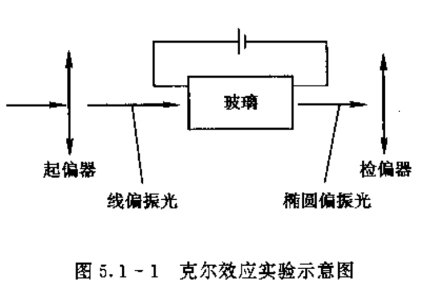
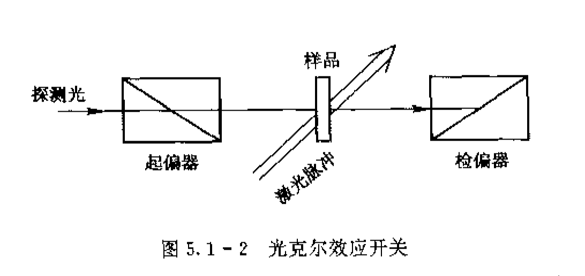
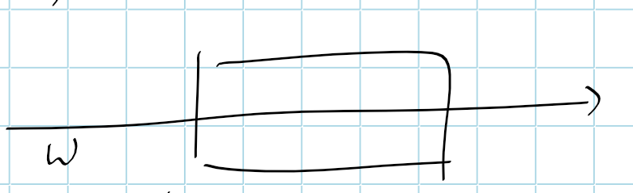
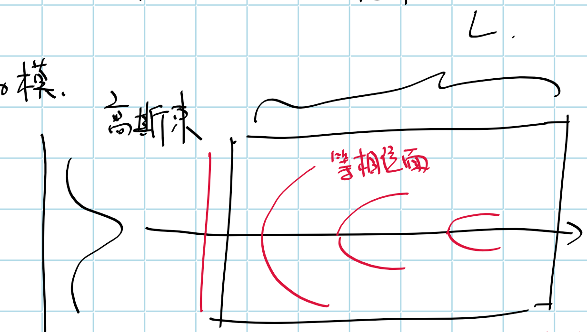
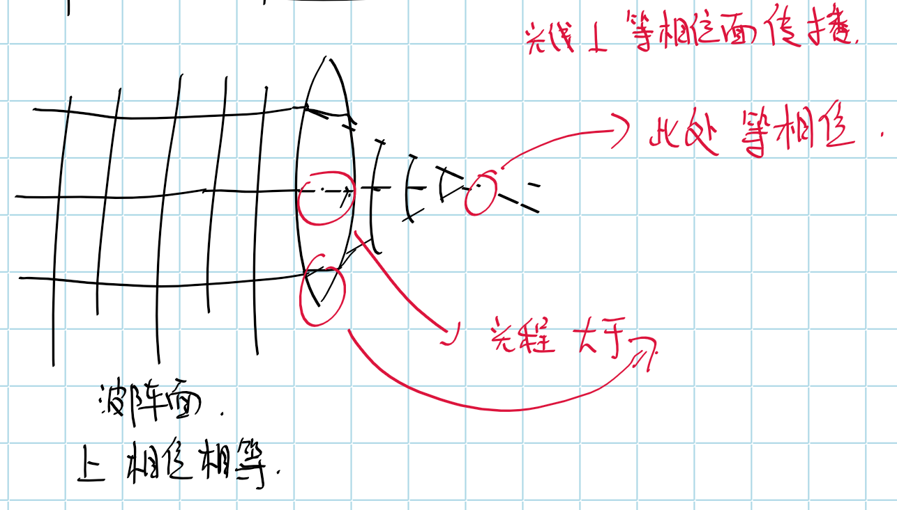
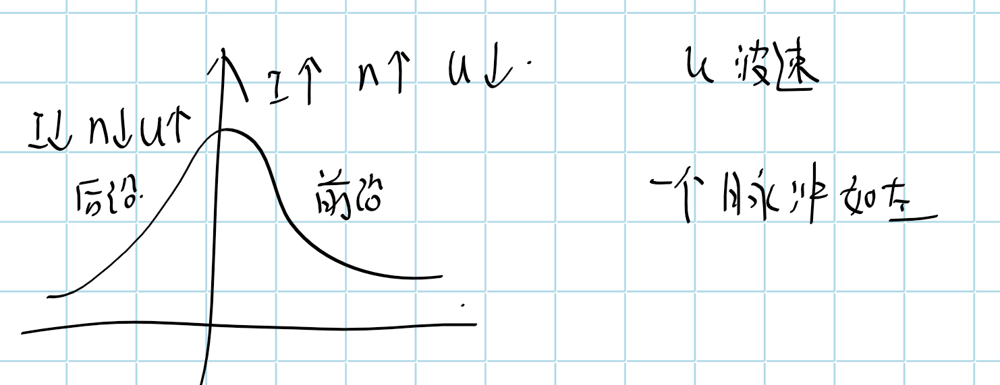
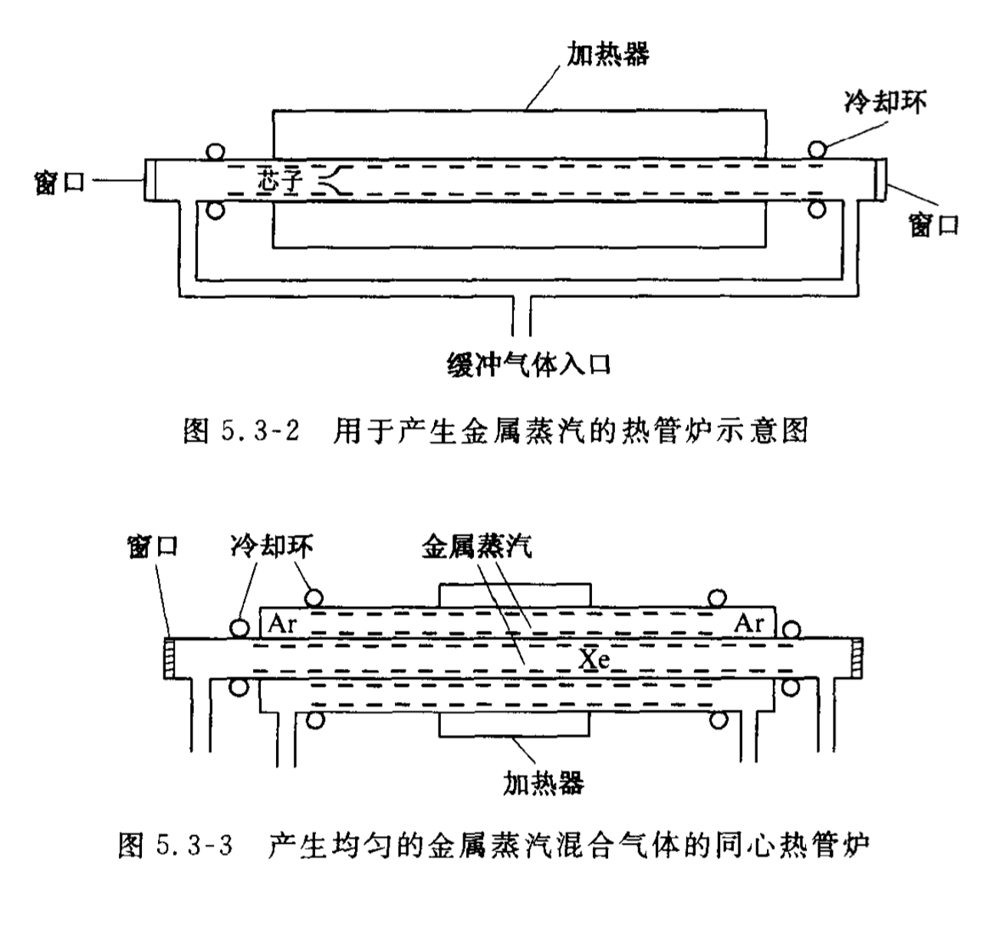
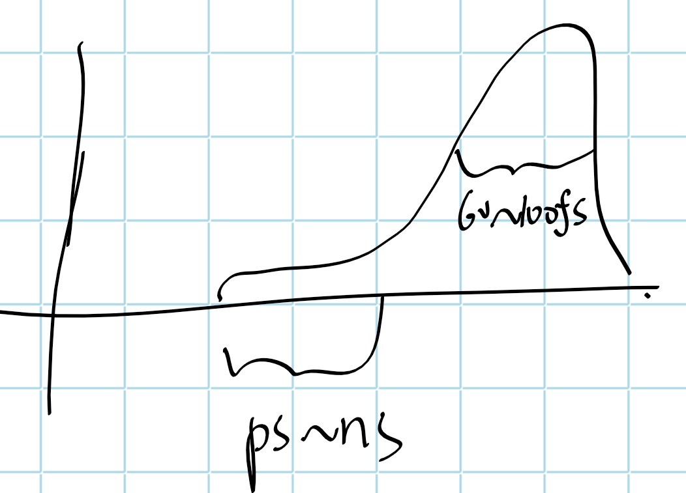
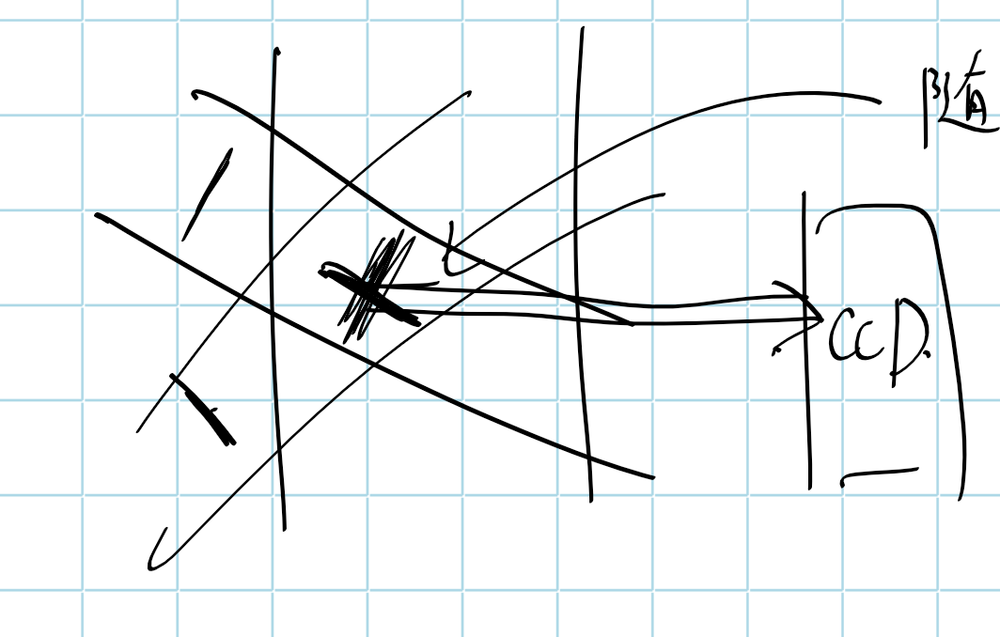

[TOC]

# 三阶非线性光学效应

|      | 二阶                                                   | 三阶                                                         |
| ---- | ------------------------------------------------------ | ------------------------------------------------------------ |
|      | 三光波相互作用                                         | 四光波相互作用（不一定是四个不一样频率的光波）               |
|      | 对于空间反演对称介质，$\chi^{(2)}=0$，即不发生二阶效应 | 对于任何介质，$\chi^{(3)}$总有非0元，任何介质内都发生三阶效应 |

## 典型效应

1. 折射率变换： 光克尔效应、自聚焦
2. 四波混频
3. 受激拉曼散射
4. 三次谐波

**四波混频**

即和频效应，有极化强度
$$
P^{(3)}(\omega_4) = 6\varepsilon_0 \chi^{(3)}(-\omega_4;\omega_1.\omega_2,\omega_3)\vdots \vec E(\omega_1)\vec E(\omega_2)\vec E(\omega_3)
\\
\chi_{eff}^{(3)} = \hat e_4 \cdot \chi^{(3)}\vdots \hat e_1 \hat e_2 \hat e_3
$$
对于简并因子6，

> 对$P^{(3)}\propto (E_1 + E_2 + E_3)^3$进行六项式展开
>
> 取$n = 3$，
>
> 有$\exp \left(i \omega_{1} t\right) \exp \left(i \omega_{2} t\right) \exp \left(i \omega_{3} t\right)$对应的系数为$\frac{3!}{1!1!1!} = 6$

**三次谐波**

即三倍频，有极化强度
$$
P^{(3)}(3\omega) = \varepsilon_0 \chi^{(3)}(3\omega;\omega.\omega,\omega)\vdots \vec E(\omega)\vec E(\omega)\vec E(\omega)
$$
简并因子为1

> 对应系数$\frac{3!}{3!} = 1$

**饱和吸收**

当一个强的$\omega$光入射非线性介质，$\omega$为介质的跃迁频率，介质对$\omega$光显著吸收，在加一弱$\omega$光，发现光强的增加比不存在强光时要大，介质产生饱和吸收

该过程的极化率为
$$
\chi^{(3)}(-\omega:\omega,-\omega,\omega)
$$
极化强度
$$
P^{(3)}(\omega)=3 \varepsilon_{0} \chi^{(3)}(-\omega, \omega,-\omega, \omega) E^{2}(\omega) E^{*}(\omega)
$$
简并因子为$\frac{3!}{1!2!} = 3$

**双光子吸收**

当$\omega_1,\omega_2$两束光通过非线性介质时，若$\omega_1 + \omega_2$接近介质的某一跃迁频率，就会发现两束光都衰减

此时介质同时从每一束光中各吸收一个光子，即同时吸收两个光子，引起两束光的衰减

其极化率表示为
$$
\chi^{(3)} (-\omega_1;\omega_2,-\omega_2,\omega_1)
\\
\chi^{(3)} (-\omega_2;\omega_1,-\omega_1,\omega_2)
$$
有极化强度
$$
P^{(3)}\left(\omega_{1}\right)=6 \varepsilon_{0} \chi^{(3)}\left(-\omega_{1}, \omega_{2},-\omega_{2}, \omega_{1}\right)\left|E\left(\omega_{2}\right)\right|^{2} E\left(\omega_{1}\right)
$$
简并因子都是6

❓这个极化率什么意思，上述两个极化率相等？根据什么对称性来的，钱P117实际107

**受激拉曼散射**

TODO

# 克尔效应

## 电光克尔效应

克尔效应是外加恒定电场和光电场在非线性介质中产生的三阶非线性极化效应

该过程极化率为
$$
\chi^{(3)}(\omega;\omega,0,0)
$$
简并因子$\frac{3!}{1!2!} = 3$

记，外加恒定电场为$E_0$，光电场$\vec E(\omega) = \frac{A(\omega)}{2}\exp(i\omega t) + c.c = =E(\omega,z,t)\cdot \hat a(\omega)$，且玻璃各向同性不存在二阶效应

有频率为$\omega$的极化强度在$\mu$方向上的分量
$$
\begin{aligned} 
P_{\mu}(\omega, t) &=P_{\mu}^{(1)}(\omega, t)+P_{\mu}^{(3)}(\omega, t) 
\\
&=\varepsilon_{0}\chi_{\mu \alpha}^{(1)}(\omega)\frac{A_{\alpha}}{2} \mathrm{e}^{-\mathrm{i} \omega t}
+
\varepsilon_{0}3 \chi_{\mu \alpha \beta \gamma}^{(3)}(\omega, 0,0) E_{0 \beta} E_{0 \gamma}\frac{A_{\alpha}}{2} \mathrm{e}^{-\mathrm{i} \omega t}
+c.c 
\\
&=\varepsilon_{0}
\left[
\chi_{\mu \alpha}^{(1)}(\omega)
+3 \chi_{\mu \alpha \beta \gamma}^{(3)}(\omega, 0,0) E_{0 \beta} E_{0 \gamma}
\right]
\frac{A_{\alpha}}{2} \mathrm{e}^{-\mathrm{i} \omega t}
+c.c 
\end{aligned}
$$
可见，光电场和外加电场共同引起的三阶效应导致介质介电张量变化，有效相对介电张量为
$$
(\varepsilon_{\mu\alpha})_{eff} = 1+\chi^{(1)}_{\mu \alpha}(\omega) + 3\chi^{(3)}_{\mu\alpha\beta\gamma}(\omega,0,0)E_{0\beta}E_{0\gamma}
$$

## 光克尔效应

用另一光电场$\vec E(\omega') = \frac{A(\omega')}{2}\exp(i\omega' t) + c.c$代替直流电场$E_0$同样发生克尔效应，其极化率为
$$
\chi^{(3)}(\omega;\omega,\omega',-\omega')
$$
简并因子$\frac{3!}{1!1!1!} = 6$

> 如果另一个光电场和本就有的光电场频率相同，即一束光发生克尔效应
>
> 可以推出$\varepsilon_{eff} = 1 + \chi^{(1)} + 3\chi^{(3)}$
>
> 这是正常的介电张量么？相当于没有变化❓

有$\omega$频率的极化强度
$$
P^{(3)}(\omega)=6 \varepsilon_{0} \chi^{(3)}\left(\omega, \omega^{\prime},-\omega^{\prime}\right) \vdots E(\omega) E\left(\omega^{\prime}\right) E^{*}\left(\omega^{\prime}\right)
$$
### 克尔常数

引入克尔常数，
$$
K_{\omega^{\prime}}(\omega)=
\frac{\Delta n_{//}(\omega)-\Delta n_{\perp}(\omega)}{\lambda E(\omega')^2}
$$

$\omega'$为控制光，$\omega$为信号光

### 克尔常数于三阶非线性极化率的关系

假定，$\omega'$偏振方向为$\hat y$，偏振方向的单位矢量$\vec a(\omega ') = (0,1,0)$

有$\omega$频率的三阶极化
$$
P^{(3)}(\omega) = 6\varepsilon_0 \chi^{(3)}(\omega,\omega',-\omega')\vdots \vec E(\omega)\vec E(\omega')\vec E^*(\omega')
$$
有分量形式
$$
P_{\mu}^{(3)}(\omega)= 
6\varepsilon_{0} 
E(\omega')E^*(\omega^{\prime}) E(\omega)
\sum_{\alpha=x, y, z} \chi_{\mu \alpha yy}^{(3)}\left(\omega, \omega^{\prime},-\omega^{\prime}\right)
\hat a_{\alpha}(\omega)
$$

> $\omega',-\omega'$光电场的偏振都取$\hat y$，把这两次投影直接吸收进$\chi$的下标，只保留$\omega$的偏振方向的单位向量

对于各项同性介质，有三阶极化率非0元
$$
\begin{array}{l}x x x x=y y y y=z z z z \\ y y z z=z z y y=z z x x=x x z z=x x y y=y y x x \\ y z y z=z y z y=z x z x=x z x z=x y x y=y x y x \\ y z z y=z y y z=z x x z=x z z x=x y y x=y x x y \\ x x x x=x x y y+x y x y+x y y x\end{array}
$$
代入张量元，并利用$\vec E(\omega)$，化简有各方向分量

> 由于$\omega$光沿$\hat z$传播，故$\hat a_z(\omega) = 0,\hat a_x(\omega)\ne 0,\hat a_y(\omega)\ne 0$

$$
P^{(3)}_x(\omega) = 6\varepsilon_0 \chi^{(3)}_{xxyy}E_x(\omega)E_y(\omega')E_y^*(\omega') \ne0
\\
P^{(3)}_y(\omega) = 6\varepsilon_0 \chi^{(3)}_{yyyy}E_y(\omega)E_y(\omega')E_y^*(\omega') \ne 0
\\
P^{(3)}_z(\omega) = 6\varepsilon_0 \chi^{(3)}_{zzyy}E_z(\omega)E_y(\omega')E_y^*(\omega') =0
$$

再考虑**无损耗介质非线性极化的稳态耦合波方程**
$$
\frac{\partial E_n(z)}{\partial z}=\frac{i \mu_0\omega_{n}^2}{2  k_n} \boldsymbol{B}_{n}^{NL} \mathrm{e}^{i k\cdot z}
$$

> 前面推的形式是
> $$
> \frac{\partial A_n(z)}{\partial z}=\frac{i \mu_0\omega_{n}^2}{2  k_n} \boldsymbol{B}_{n}^{NL} \mathrm{e}^{i\Delta k\cdot z}
> $$
> 如果，左边不把$e^{ikz}$除到右边，就不是相位差形式，且认为极化波和光电场波矢相同
>
> 因此，用到的这个耦合波方程左侧$E$是含$e^{ikx}$项的
>
> ❓西电书上，3.3.23，右侧指数上有负号，

**对于$\omega,\omega'$偏振方向平行情况**

此时，$\omega $光$y$偏振，$E_x(\omega) = 0 \rightarrow P_x=0$

$\omega',\omega$的电场偏振方向相同
$$
\begin{aligned}
\frac{\mathrm{d} E(\omega, z)}{\mathrm{d} z} &=\frac{\mathrm{i} \omega^{2} \mu_{0}}{2 k} \boldsymbol{a}(\omega) \cdot \boldsymbol{P}^{(3)}(\omega) 
\\
&=\frac{\mathrm{i} \omega^{2} \mu_{0}}{2 k} P_{y}^{(3)}(\omega)
\\
&=\frac{3\mathrm{i} \varepsilon_{0} \mu_{0} \omega^{2}}{k} E^{2}\left(\omega^{\prime}\right) E(\omega) \chi_{y y y y}^{(3)}\left(\omega, \omega^{\prime},-\omega^{\prime}\right) 
\end{aligned}
$$
在$E(\omega')$为不变情况下，有
$$
E(\omega, z) \propto e^{i \frac{\omega}{c}\left[\frac{3 \omega}{ kc} E^{2}\left(\omega^{\prime}\right) \chi_{y y y y}^{(3)}\left(\omega, \omega^{\prime},-\omega^{\prime}\right)\right] z}
$$
其中，指数因子括号内的量即为折射率变化量，即$\Delta n_{//}$，
$$
\Delta n_{/ /}(\omega)=\frac{3 \omega}{k c} E^{2}\left(\omega^{\prime}\right) \chi_{y y y y}^{(3)}\left(\omega, \omega^{\prime},-\omega^{\prime}\right)
$$
**对于$\omega,\omega'$偏振方向垂直情况**

此时，$\omega$光$x$偏振，$E_y(\omega) = 0 \rightarrow P_y=0$

代入耦合波方程，有
$$
\begin{aligned}
\frac{\mathrm{d} E(\omega, z)}{\mathrm{d} z} &=\frac{\mathrm{i} \omega^{2} \mu_{0}}{2 k} \boldsymbol{a}(\omega) \cdot P^{(3)}(\omega)
\\
&=\frac{\mathrm{i} \omega^{2} \mu_{0}}{2 k} P_{x}^{(3)}(\omega)
\\
&=\frac{3\mathrm{i} \varepsilon_{0} \mu_{0} \omega^{2}}{k} E^{2}\left(\omega^{\prime}\right) E(\omega) \chi_{x x y y}^{(3)}\left(\omega, \omega^{\prime},-\omega^{\prime}\right)
\end{aligned}
$$
在$E(\omega')$为不变情况下，有
$$
E(\omega, z) \propto e^{i \frac{\omega}{c}
\left[
\frac{3 \omega}{k c} E^{2}\left(\omega^{\prime}\right) \chi_{x x y y}^{(3)}\left(\omega, \omega^{\prime},-\omega^{\prime}\right)
\right] z}
$$
有折射率变化率，即$\Delta n_{\perp}$，
$$
\Delta n_{\perp}(\omega)=\frac{3 \omega}{k c} E^{2}\left(\omega^{\prime}\right) \chi_{x x y y}^{(3)}\left(\omega, \omega^{\prime},-\omega^{\prime}\right)
$$
**综上所述**

得到克尔常数与极化率间的关系
$$
K_{\omega^{\prime}}(\omega)=\frac{3 \omega}{2 \pi c}\left[\chi_{y y y y}^{(3)}\left(\omega, \omega^{\prime},-\omega^{\prime}\right)-\chi_{x x y y}^{(3)}\left(\omega, \omega^{\prime},-\omega^{\prime}\right)\right]
$$
> 西电写的是这个形式
> $$
> K_{\omega^{\prime}}(\omega)=\frac{3 \omega}{8 \pi c}\left[\chi_{y y y y}^{(3)}\left(\omega, \omega^{\prime},-\omega^{\prime}\right)-x_{x x y y}^{(3)}\left(\omega, \omega^{\prime},-\omega^{\prime}\right)\right]
> $$
> ❓系数咋搞的？

当取$\omega'=0$时，就是电光克尔效应常数

### 光克尔效应的应用

**改变光的偏振状态**

eg. 

对于硝基苯，

无外加电场时，有各向同性

外加电场$E_0$时，具有各向异性，为单轴晶体

传播方向平行$E_0$、偏振方向垂直$E_0$的光束经过长度为$L$的硝基苯有相位变化
$$
\Delta \varphi = \frac{2 \pi}{\lambda}\left(\Delta n_{/ /}-\Delta n_{\perp}\right) L
\propto K_{\omega'}(\omega) |E(\omega')|^2\cdot L
$$
通过调节$E(\omega')$就能改变相位差

**光克尔开关**

$\omega'$光采用脉冲光

相比于Pockel盒

优势：

1. 开关频率高，达到$fs$量级

劣势

1. 需要激光器，体积大：但介质加电场后极化需要时间，介质响应可能为$ps$量级，实际瓶颈在于材料
2. 开关效果差，不稳定

# 光束自作用

光束自作用指有下述极化率
$$
\chi^{(3)}(\omega,\omega,-\omega)
$$
描述的现象

## 自聚焦作用

介质中，光束传播影响自身传播，

>  简并因子3，西电P174那个分母上的4哪来的❓

设$\omega$光在各向同性介质内传播

有极化强度
$$
P(\omega) = P^{(1)}(\omega) + P^{(3)}(\omega)
\\
=\varepsilon_0 \chi^{(1)} + 3\varepsilon_0 \chi^{(3)}\cdot |E(\omega)|^2 E(\omega)
$$

> 即光克尔效用中，取$\omega' = \omega$的情况
>
> $E(\omega)E(\omega)E^*(\omega) = |E(\omega)|^2E(\omega)$

有相对介电常数
$$
\varepsilon_r = 1+\chi^{(1)}(\omega) + 3\chi^{(3)}(\omega,\omega,-\omega)\cdot |E(\omega)|^2 = n^2
$$

> 注意，$\chi$可以有虚部存在的，但此处仅考虑影响光束振幅的实部

考虑，有折射率
$$
\begin{array}{l} 
n 
&= \sqrt{1+\chi^{(1)} + 3\chi^{(3)}|E(\omega)|^2}
\\
&\xlongequal{最后一项小量，取近似} \sqrt{1+\chi^{(1)}} + \frac{3\chi^{(3)}|E(\omega)|^2}{2n_0}
\\
&=n_0 + n_2\cdot|E(\omega)|^2
\end{array}
$$
其中，$n_0 = \sqrt{1+\chi^{(1)}}$​，$n_2$称为非线性折射率系数

可以发现，入射光强度$|E(\omega)|^2$会影响光束自身的传播

一般认为$n_2>0$，

> $n_2<0$发生自散焦效应，但一般自发散效应并不是由非线性效应引起的

此时，考虑$TEM_{00}$模，

光束中轴处，光强大，则$n_2$越大；远轴处，光强越小，$n_2$越小

因此，介质中光束光程存在不同，类比于凸透镜

可以发生类似凸透镜的聚焦效应，该过程为一正反馈过程

也称为感应的透镜效应：由于光束在非线性介质中传播使本身收到波前畸变所引起

### 稳态自聚焦

高斯光束，

### 动态&瞬态自聚焦

热效应，$ms$量级

### 意义

1. 导致高功率激光器在透明介质中的丝状光学损伤
2. 要求光强分布近尽可能均匀
3. 物理实验SRS

### 其他自聚焦原因

#### 相对论效应

在等离子体中，有
$$
\omega^2 = c^2 k^2 +\omega_{pe}^2
$$
其中，$\omega_{pe} = \frac{n_e e^2}{m\varepsilon_0}$

对于折射率有
$$
n^2 = 1-\frac{\omega_p^2}{\omega^2} = 1-\frac{n_ee^2}{\omega^2m\varepsilon_0}
$$
在相对论情形下，光强越大，能量越大，则速度越大、质量$m$越大，导致$n$越大

且

以高斯束为例，光压分布不均匀导致光束中轴上$n_e$小，导致$n$增大

#### 有质动力

TODO

## 自相位调制SPM

脉冲激光入射，使

钱 P126

## 自变陡现象

# 三次谐波

THG，Triple harmonics generation

记入射$\omega$光为
$$
\vec E(\omega,z) = E(\omega,z)e^{ik_1 z}
$$
出射$3\omega$光，$\vec E(3\omega,z)$

该过程有极化强度
$$
P^{(3)}(3\omega) = \varepsilon_0 \chi^{(3)}(-3\omega;\omega,\omega,\omega)\vdots \vec E(\omega)\vec E(\omega)\vec E(\omega)
$$
考虑无损耗介质非线性极化的稳态耦合波方程，有

> 此处进行了空间慢变振幅近似

$$
\begin{array}{l} 

\frac{\partial  E(3 \omega, z)}{\partial z}
&=
\frac{\mathrm{i}(3 \omega)^{2} \mu_{0}}{2 k_{3}}\cdot \boldsymbol{P}_{eff}^{(3)}(3 \omega) \mathrm{e}^{\mathrm{i} \Delta k z}
\\
&=\frac{3i\omega}{2n_3 c}\chi_{eff}^{(3)}E^3(\omega,z)\cdot e^{i\Delta k z}
\end{array}
\label{eq36}
$$

其中，
$$
\begin{array}{l}
\chi_{\mathrm{eff}}^{(3)}=\vec e(3 \omega) \cdot \chi^{(3)}(\omega, \omega, \omega) \vdots \vec e(\omega) \vec e(\omega) \vec e(\omega) 
\\ 
\Delta k=3k_1 - k_3 = \frac{3 n(\omega)\omega}{c}-\frac{n(3\omega) 3\omega}{c} = \frac{3\omega}{c}\Big[n(\omega) - n(3\omega)\Big]
\end{array}
$$

> 此处，$n(\omega),n(3\omega)$也记作$n_1,n_3$

对$\eqref{eq36}$考虑小信号近似，$3\omega$光为小信号，$\omega$光为无损耗泵浦光，即，$E(\omega,z) = E(\omega,0)$不含有$z$，有
$$
\begin{aligned} 
\frac{\partial E(\omega,z)}{\partial z } &= \frac{3i\omega}{2n_3 c}\cdot \chi_{eff}^{(3)}\cdot E^3(\omega)\cdot e^{i\Delta k z}
\\
E(\omega,z) &= \frac{3\omega}{2n_3 c}\cdot \frac{1}{\Delta k}\cdot \chi_{eff}^{(3)}\cdot E^3(\omega,0)\cdot (e^{i\Delta kz}-1)
\end{aligned}
$$
有三次谐波光强
$$
I_3(z) \propto \cdots\left|\chi_{eff}^{(3)}\right|^2\cdot I^2(\omega,0)\cdot z^2\cdot\left(\frac{\sin\frac{\Delta kz}{2}}{\Delta k z/2}\right)^2
$$
可见，结果同和频过程

> 三次谐波转换效率目前无法提高，因此仅讨论小信号近似，不必讨论高转换效率解

## 非线性介质的选择

### 晶体内的三次谐波

通常考虑

1. 晶体的$\chi^{(3)}$通常较小,在$10^{-20}\sim10^{-23}\mathrm{(SI)}$量级，而$\chi^{(2)}$一般在$10^{-11}\sim 10^{-13}\mathrm{(SI)}$量级
2. 晶体损伤阈值的存在，使得不能无限制聚焦以提高光强提高转换效率
3. 相位匹配需要考虑$\Delta k = \frac{3\omega}{c}\left[n(\omega) - n(3\omega)\right]$，使得一般的反常色散和各向异性晶体很难实现

方解石是目前唯一能够实现三次谐波的相位匹配的晶体

目前，可从4mm方解石晶体中获得转化效率达到$3\cdot 10^{-6}$的$3\omega$光，

一般为高效生成$3\omega$光，通常通过两二阶过程叠加，

|          | 非线性过程                                | 相位匹配条件                        |
| -------- | ----------------------------------------- | ----------------------------------- |
| 第一阶段 | $\qquad \omega+\omega\rightarrow 2\omega$ | $n(\omega) = n(2\omega)$            |
| 第二阶段 | $2\omega+\omega\rightarrow 3\omega$       | $n(3\omega) = n(\omega)_n(2\omega)$ |

该方法相位匹配条件更容易满足，转换效率可达到20%

### 气体内的三次谐波

#### 碱金属蒸汽的优势

**一、在可见光区域中有共振跃迁**

金属蒸汽在可见光区域有共振跃迁，使$|\chi^{(3)}|$增强

实际实验中采用近共振匹配，因为完全是$\omega$落在共振带，将使光束被吸收

**二、极限光强比固体极限光强高几个数量级**

当光强达到气体阈值光强使焦点附近气体电离后，由于气体的流动性，对气体整体无明显影响，称为自治愈

即，气体极限光强>阈值光强

**三、共线相位匹配更容易实现**

金属蒸汽是一种负色散介质，可以填充正色散的惰性气体，以实现相位匹配

以，$Rb$蒸汽为例，利用反常色散，

对于基频波$\omega,\quad1.06\mu m$；THG波$3\omega,\quad 0.355\mu m$

有，$n(\omega)>m_3\omega$

与正色散气体（$n(\omega)<n(3\omega)$）混合，通过调控比例，使满足$n_{反}(\omega) + n_{正}(\omega) = n_{反}(3\omega) + n_{正}(3\omega)$即实现相位匹配

**四、除某些分立波段之外，介质对低于电离能级的辐射是透明**

金属蒸汽是线光谱，因此在电离限以下金属蒸汽具有相当好的透明性，除少数共振线外，从紫外、可见光到红外有很宽的透明范围

**五、实验室中容易获得长度>10cm的均匀气体介质，从而增加相互作用距离**

利用热管炉对气体均匀加热

## THG的应用

### 实现激光脉冲对比度测量

对于脉冲激光，在脉冲前有一ps-ns量级平台，

测量脉宽

脉宽越大，两光束相互作用时间越长，产生的和频光宽度越大，通过CCD对空间宽度进行测量，即得脉宽

# 受激拉曼散射

Stimulated Raman Scattering, SRS

## 自发拉曼散射

1928年，印度拉曼在液体苯内发现

入射光$\omega_p$透过过介质（固、液、气），相对入射光有一定平移光谱成分$\omega_s$，

平移量为$\omega_p-\omega_s$，对应于介质内部某种确定能级跃迁频率，如分子振动能级、晶格振动频率

但该效应发生效率很低，相应于每个入射光子，散射光子仅有$10^{-6\sim-7}$个

