[TOC]

# 晶体光学

## 晶体的介电常数张量

在线性光学中，

各向同性介质中，有
$$
\vec D = \varepsilon_0 \vec E + \vec P 
\xlongequal{\vec P = \varepsilon_0\chi^{(1)} E}
\varepsilon_0\varepsilon_r \vec E
$$
各向异性介质中，在主轴坐标系中
$$
D = \varepsilon_0 \varepsilon_r \cdot \vec E
\\
D_{i}=\varepsilon_{0} \varepsilon_{i}, E_{j} \quad i, j=x, y, z
$$

> 用有效极化率表示各向异性介质中的，在各分量方向上仍然有类似同性的关系                                                       

在线性光学中可见，$\varepsilon_r$也是个二阶张量，$\varepsilon_r$称为介电常数张量，反映了极化和电场之间的关系

且，由于$\chi^{(1)}$是对角阵，介电常数张量也是对角的，经变换后必有如下形式
$$
\left[\begin{array}{lll}\varepsilon_{x x} & 0 & 0 \\ 0 & \varepsilon_{y y} & 0 \\ 0 & 0 & \varepsilon_{z z}\end{array}\right]
$$
其中，$\varepsilon_{xx},\varepsilon_{yy},\varepsilon_{zz}$称为相对主介电常数，根据，麦克斯韦关系$n = \sqrt{\varepsilon_r}$，可以定义三个主折射率，$n_{x},n_{y},n_{z}$

各类物质的介电常数张量如下，晶体主轴坐标系上

| 分类                       | 介电常数张量                                                 |
| -------------------------- | ------------------------------------------------------------ |
| 立方晶体，各向同性         | $\begin{pmatrix} \varepsilon_{xx}&0&0 \\ 0&\varepsilon_{xx}& 0 \\ 0&0&\varepsilon_{xx}\end{pmatrix}$ |
| 单轴晶体：三方、四方、六方 | $\begin{pmatrix} \varepsilon_{xx}&0&0 \\ 0&\varepsilon_{xx}& 0 \\ 0&0&\varepsilon_{zy} \end{pmatrix}$ |
| 双轴晶体：三斜、单斜、正交 | $\begin{pmatrix} \varepsilon_{xx}&0&0 \\ 0&\varepsilon_{yy}& 0 \\ 0&0&\varepsilon_{zy} \end{pmatrix}$ |

## 晶体中光波的电磁结构

从介质中的麦克斯韦方程组及物质方程出发
$$
\begin{array}{l} 
\nabla\times \vec H = \frac{\partial \vec D}{\partial t} + \vec J
\\
\nabla\times \vec E = -\frac{\partial \vec B}{\partial t}
\\
\nabla\cdot\vec D = \rho 
\\
\nabla\cdot\vec B = 0
\end{array}
$$
均匀不导电非磁性介质中，
$$
\vec D = \varepsilon_r \vec E
\\
\vec B = \mu_0 \vec H
$$
且没有自由电荷、没有传导电流，有
$$
\begin{align} 
&\nabla\times \vec H = \frac{\partial \vec D}{\partial t}
\\
&\nabla\times \vec E = -\mu_0 \frac{\partial\vec H}{\partial t}
\\
&\nabla\cdot\vec D = 0
\\
&\nabla\cdot\vec B = 0
\end{align}
$$
讨论在介质中传播的单色平面波（不需要考虑色散特性，任意波可通过傅里叶变换用单色波叠加）

对于单色平面波的电磁结构，记，
$$
\vec E,\vec D, \vec H = (\vec E_0,\vec D_0,\vec H_0)e^{-i\omega(t-\frac{n}{c}\hat k \vec r)}
$$

> 注意$\hat k$是$\vec k$的单位矢量
>
> 可以发现，$\nabla (\vec E_0,\vec D_0,\vec H_0) = \frac{i\omega n\hat k}{c}(\vec E,\vec D, \vec H)$❓为什么可以替代计算

可进一步简化麦克斯韦方程组
$$
\begin{align} 
&\vec H \times \hat k = \frac{c}{n} \vec D \tag{1}
\\
&\vec E\times \hat k = -\frac{\mu_0 c}{n}\vec H \tag{2}
\\
&\hat k\cdot \vec D = 0
\\
&\hat k\cdot \vec H = 0
\end{align}
$$
>  [4.2 光在晶体中传播的解析法描述 - 豆丁网 (docin.com)](https://www.docin.com/p-551956530.html)

根据各矢量关系可以得到下图，波阵面和$\vec k$垂直

需要注意，$\vec E$不必处在与$\vec k$垂直的平面内，在晶体内光波可以有纵波成分，$\vec E$可在$\vec D \vec k$平面内与$\vec D$有一夹角$\alpha$

另，还可以推导坡印廷矢量与$\vec k$的关系

> 坡印廷矢量描述了能流密度

$$
\vec S \equiv \frac{1}{\mu_{0}}(\vec E \times \vec B)
$$
因此，一般情况下，晶体内，$\vec S,\vec k$不同向，光的能量传播的方向，通常与波法线方向是不同的

根据关系，❓（哪来的）能流密度= 光能量密度×波速，即，$S = W \cdot u$，可以得到

$$
\vec S\cdot \vec k = W\cdot u
$$

### 晶体光学基本方程

利用拉格朗日双叉乘公式$(\mathbf{a} \times \mathbf{b}) \times \mathbf{c}=\mathbf{b}(\mathbf{a} \cdot \mathbf{c})-\mathbf{a}(\mathbf{b} \cdot \mathbf{c})$

对方程$(2)\times \hat k = \frac{c}{n}\vec D$考虑
$$
\vec D = -\frac{n^2}{\mu_0 c^2}\left(\vec E\times \hat k\right)\cdot \hat k
\\
=-\varepsilon_0 n^2 (\vec E\times \hat k)\times \hat k
\\
= \varepsilon_0 n^2 [\vec E - \hat k(\hat k\cdot \vec E)]
$$
若给定光的传播方向$\vec k$，则上式决定光电场和电位移的关系

称为晶体光学的基本方程

各方向有分量
$$
D_i = \varepsilon_0 n^2 [\vec E_i - k_i (\hat k\cdot \vec E)]
$$

### 菲涅尔波法线方程

主轴坐标系下有
$$
 \begin{array}{l} 
\vec D = \varepsilon_0 \vec{\vec{\varepsilon_r}} \vec E
=
 \begin{pmatrix} \varepsilon_{xx}&0&0\\ 0&\varepsilon_{yy} &0 \\ 0&0& \varepsilon_{zz}\end{pmatrix}
 \cdot
 \begin{pmatrix} E_i\\E_j\\E_j \end{pmatrix}
\\
 D_i = \varepsilon_0 \varepsilon_i E_i 
 \end{array}
$$
类比于晶体光学基本方程的分量形式：$D_i = \varepsilon_0 n^2 [\vec E_i - k_i (\hat k\cdot \vec E)]$类比于上式的形式有
$$
\begin{array}{l} 
D_i = \varepsilon_0 n^2 [\vec E_i - k_i (\hat k\cdot \vec E)]
\\
D_i = \varepsilon_0 \varepsilon_i E_i
\end{array}
$$
有
$$
D_i = \varepsilon_0 n^2[\frac{D_i}{\varepsilon_0 \varepsilon_i} - k_i(\hat k\cdot \vec E)]
\\
=\frac{\varepsilon_0 k_i (\hat k\cdot \hat E)}{\frac{1}{\varepsilon_i}- \frac{1}{n^2}}
$$
又因为，$\hat k\cdot \vec D = k_i D_i + k_j D_j + k_k D_k = 0$，得
$$
\frac{k_i^2}{\frac{1}{n^2}-\frac{1}{\varepsilon_i}}
+
\frac{k_j^2}{\frac{1}{n^2}-\frac{1}{\varepsilon_j}}
+
\frac{k_k^2}{\frac{1}{n^2}-\frac{1}{\varepsilon_k}}

=0
$$
称为菲涅尔波法线方程，其中，$k_i,k_j.k_k$单位矢量$\hat k$在各轴的投影

因此，只要确定光的传播方向，晶体给定（介电常数张量），可以推出折射率

一般情况下，$n$有两个独立的根，即折射率主值有两个，❓有三个折射率主值，为什么一般有两个解

### 光在晶体中的传播规律

菲涅尔波法线方程，整理得到
$$
n^4(\varepsilon_{xx} k_x^2 + \varepsilon_{yy} k_y^2 + \varepsilon_{zz}k_z^2) 
-
n^2\left[\varepsilon_{xx}\varepsilon_{yy}(k_x^2+k_y^2)+\varepsilon_{yy}\varepsilon_{zz}(k_y^2+k_z^2) + \varepsilon_{zz}\varepsilon_{xx}(k_z^2+ k_x^2)\right]
+
\varepsilon_{xx}\varepsilon_{yy}\varepsilon_{zz} = 0
$$

#### 在各向同性晶体中

$\varepsilon_{xx} = \varepsilon_{yy}  = \varepsilon_{zz} = \varepsilon_r$

代入菲涅尔波法线方程，
$$
\begin{align} 
n^4\cdot \varepsilon_r \hat {k}^2 
- 2n^2\varepsilon_r^2 \hat{k}^2 + \varepsilon_r^3 &= 0
\\
\left(n^2\right)^2 - 2\varepsilon_r n^2 +\varepsilon_r^2 &= 0
\\
(n^2 - \varepsilon_r)^2 &= 0
\\
n^2 &= \varepsilon_r
\end{align}
$$
得到折射率为常数
$$
n = \sqrt{\varepsilon_r}
$$

且整理过程中没有限定$\hat k$，也体现了各向同性：光的传播方向从哪进去，折射率都一样

#### 在单轴晶体中

$$
\begin{pmatrix} \varepsilon_{xx}&0&0\\0 &\varepsilon_{xx}&0\\0&0&\varepsilon_{zz} \end{pmatrix}
$$

记，$\varepsilon_{xx} = \varepsilon_{yy} = \varepsilon_{\perp},\quad \varepsilon_{zz} = \varepsilon_{\parallel}$，设光的传播方向在$yz$平面，与$z$夹角为$\theta$

> 可以类比到到xz平面，结果不变

有$\hat k$的投影
$$
k_x = 0
\quad
k_y = \sin\theta
\quad 
k_z = \cos\theta
$$
代入菲涅尔波法线，有
$$
(n_{\perp} - \varepsilon_\perp)^2 [n^2(\varepsilon_{\parallel}\cos^2\theta + \varepsilon_\perp\sin^2\theta)-\varepsilon_{\parallel}\varepsilon_\perp]=0
$$
**对第一项取0，有第一个解**
$$
\begin{array}{l} 
n^2 &= \varepsilon_\perp
\\
n &= \sqrt{\varepsilon_\perp}
\end{array}
$$
可以发现，该折射率与$\theta$无关，记为寻常光$n_o^2 = \varepsilon_\perp$，该折射率也记为寻常折射率本征值

代回基本方程
$$
\begin{array}{l} 
\varepsilon_0\varepsilon_{\perp}E_x = \varepsilon_0 \varepsilon_{\perp}\left[E_x - 0\cdot(\hat k\cdot \vec E)\right]
\\
\varepsilon_0\varepsilon_{\perp}E_y = \varepsilon_0 \varepsilon_{\perp}\left[E_y - \sin\theta\cdot(\hat k\cdot \vec E)\right]
\\
\varepsilon_0\varepsilon_{\parallel}E_z = \varepsilon_0 \varepsilon_{\parallel}\left[E_z - \cos\theta\cdot(\hat k\cdot \vec E)\right]
\end{array}
$$
为满足这个式子，可得
$$
E_x\ne 0
\quad
E_y = E_z = 0
$$
称为该折射率本征值对应的电场振动的本征方向，该情况即$o$光入射情形

**对第二项取0，有第二个解**

得到
$$
\frac{1}{n^2} = \frac{\cos^2\theta}{\varepsilon_\perp} + \frac{\sin^2\theta }{\varepsilon_{\parallel}}
$$
即，$e$光折射率特性

代会基本方程
$$
\begin{array}{l} 
\varepsilon_0\varepsilon_{\perp}E_x = \varepsilon_0 
\frac{\varepsilon_\perp\varepsilon_\parallel}{\varepsilon_\parallel\cos^2\theta + \varepsilon_\perp\sin^2\theta}
\left[E_x - 0\cdot(\hat k\cdot \vec E)\right]
\\
\varepsilon_0\varepsilon_{\perp}E_y = \varepsilon_0 
\frac{\varepsilon_\perp\varepsilon_\parallel}{\varepsilon_\parallel\cos^2\theta + \varepsilon_\perp\sin^2\theta}
\left[1 - \sin\theta \right]E_y
\\
\varepsilon_0\varepsilon_{\parallel}E_z = \varepsilon_0 
\frac{\varepsilon_\perp\varepsilon_\parallel}{\varepsilon_\parallel\cos^2\theta + \varepsilon_\perp\sin^2\theta}
\left[1 - \cos\theta \right]E_z
\end{array}
$$

并得到电场本征振动方向，
$$
E_x = 0
\quad 
E_y \ne 0
\quad
E_z \ne 0
$$

双轴晶体折射率相对于单轴晶体变化更丰富，但单轴晶体更易于控制

推一下双轴晶体TODO

## 折射率椭球

西电TODO

# 线性电光效应

电光效应（Pockler效应）：当没有反演中心的晶体受到直流电场或低频电场作用时，其折射率发生与外加电场成线性关系的变化，$\Delta n \propto E$

> 此处低频指相对于光波是低频
>
> 电光效应是一种二阶非线性效应

## 非线性光学表述

设，作用在介质上的直流电场$\vec E_0$，入射光电场$\frac{1}{2}\left[\vec E(\omega)\cdot e^{-i\omega t} + c.c\right]$，如下

TODO示意图

有

一阶极化强度
$$
\vec P^{(1)} =
\varepsilon_0 \vec{\vec{\chi}}^{(1)}(0) \cdot \vec E_0
+
\varepsilon_0 \vec{\vec{\chi}}^{(1)}(\omega)\cdot \frac{1}{2}\left[\vec E(\omega)\cdot e^{-i\omega t} + c.c\right]
$$
其中，第一项为直流电场导致的直流极化，第二项为光电场导致的一阶极化

二阶极化强度
$$
\vec P^{(2)} = 
\varepsilon_0 \vec{\vec{\vec{\chi}}}^{(2)}(0,0):\vec E_0\vec E_0
+
2\varepsilon_0 \vec{\vec{\vec{\chi}}}^{(2)}(\omega,-\omega):\frac{\vec E(\omega)}{2}\frac{\vec E(\omega)}{2}
\\
+
2\varepsilon_0 \vec{\vec{\vec{\chi}}}^{(2)}(\omega,0):\frac{1}{2}\left[\vec E(\omega)\vec E_0\cdot e^{-i\omega t} + c.c\right]
\\
+
\varepsilon_0 \left[\vec{\vec{\vec{\chi}}}^{(2)}(\omega,\omega):\frac{\vec E(\omega)}{2}\frac{\vec E(\omega)}{2}e^{-2i\omega t} +c.c\right]
$$
其中，第一项为直流电场导致的二阶极化，第二项为光整流效应，第三项为和频效应，第三项为倍频效应

可以得到极化强度的频率为$\omega$的在$\mu$方向的分量
$$
\begin{array}{l} 
P_\mu(\omega,t) &= 
\varepsilon_0 \vec{\vec{\chi}}^{(1)}_{\mu\alpha}(\omega)\cdot \frac{1}{2}\left[\vec E_\alpha(\omega)\cdot e^{-i\omega t} + c.c\right]
+
2\varepsilon_0 \vec{\vec{\vec{\chi}}}_{\mu\alpha\beta}^{(2)}(\omega,0):\frac{1}{2}\left[\vec E_\alpha(\omega)\vec E_{0\beta}\cdot e^{-i\omega t} + c.c\right]
\\
&=\varepsilon_0\left\{
\left[
\vec{\vec{\chi}}^{(1)}_{\mu\alpha}(\omega) + 2\vec{\vec{\vec{\chi}}}_{\mu\alpha\beta}^{(2)}(\omega,0)\cdot E_{0\beta}
\right]
\cdot\frac{E_\alpha(\omega)}{2}e^{-i\omega t} + c.c
\right\}
\end{array}
$$
> $\alpha,\beta$表示张量元下标
>
> $\beta$是根据矩阵元来的？

有对应的电位移
$$
\begin{array}{l} 
\vec D 
&= \varepsilon_0 \vec E + \vec P_L +\vec P_{NL}
\\
&=\varepsilon_0 \vec{\vec{\varepsilon_r}}\cdot \vec E + \vec P_{NL}
\end{array}
$$
有$\mu$方向分量
$$
\begin{array}{l} 
D_\mu &= \varepsilon_0 \frac{E_\alpha(\omega)}{2} 
+\varepsilon_0\cdot \left[
\vec{\vec{\chi}}^{(1)}_{\mu\alpha}(\omega) 
+ 2\vec{\vec{\vec{\chi}}}_{\mu\alpha\beta}^{(2)}(\omega,0)\cdot E_{0\beta}
\right]\cdot \frac{E_{\alpha}(\omega)}{2}
\\
&=\varepsilon_0\left[
\varepsilon_{r_{\mu\alpha}} + 2\vec{\vec{\vec{\chi}}}_{\mu\alpha\beta}^{(2)}(\omega,0)\cdot E_{0\beta}
\right]\cdot \frac{E_{\alpha}(\omega)}{2}
\end{array}
$$
对比于线性光学中电位移
$$
\vec D = \varepsilon_0\varepsilon_r \cdot \vec E
\\
\vec D_\mu = \varepsilon_0 \cdot\varepsilon_{r\mu} E
$$
可以发现相对介电常数张量有如下变换
$$
(\varepsilon_{\mu\alpha})_{eff}
=
\left[
\varepsilon_{r\mu\alpha} + 2\vec{\vec{\vec{\chi}}}_{\mu\alpha\beta}^{(2)}(\omega,0)\cdot E_{0\beta}
\right]
$$
记为有效相对介电常数张量。可以看出，频率为$\omega$的外加光电场，使介电常数发生了改变

> $\mu,\alpha$是介电张量下标，$\beta$是直流电场向量下标
>
> 此处$\chi_{\mu\alpha\beta} E_{0\beta}$是爱因斯坦斯坦求和约定的省略，实际上是$\sum\limits_{\beta = xyz}\chi_{\mu\alpha\beta} E_{0\beta}$

XXXX空了块不知道是啥的⭐

## KDP中的线性电光效应

有介电常数张量与二阶极化率张量
$$
\left[\begin{array}{ccc}x x & 0 & 0 \\ 0 & x \boldsymbol{x} & 0 \\ 0 & 0 & 2 z\end{array}\right]
\qquad\qquad
\left[\begin{array}{ccccccccc}0 & 0 & 0 & x y z & x y z & 0 & 0 & 0 & 0 \\ 0 & 0 & 0 & 0 & 0 & x y z & x y z & 0 & 0 \\ 0 & 0 & 0 & 0 & 0 & 0 & 0 & x y z & x y z\end{array}\right]
$$
### 纵向应用

#### 无外加电场时

#### 有外加电场时

纵向应用，记$\vec E_0 = E_{0z}\cdot\hat k$，光束与光轴平行，$\hat k = k_z \cdot \hat z ,\quad k_x = k_y = 0$

加电场后，介电张量变化
$$
\begin{array}{l} 
(\varepsilon_{\mu\alpha})_{eff}
&=
\left[
\varepsilon_{r_{\mu\alpha}} + 2\vec{\vec{\vec{\chi}}}_{\mu\alpha\beta}^{(2)}(\omega,0)\cdot E_{0\beta}
\right]
\\
&=
\begin{pmatrix}
\varepsilon_{xx}+2\chi^{(2)}_{xxz}E_{0z} & 0 +2\chi^{(2)}_{xyz}E_{0z} & 0+2\chi^{(2)}_{xzz}E_{0z}
\\
0+2\chi^{(2)}_{yxz}E_{0z} & \varepsilon_{xx}+2\chi^{(2)}_{yyz}E_{0z} & 0+2\chi^{(2)}_{yzz}E_{0z}
\\
0+2\chi^{(2)}_{zxz}E_{0z} & 0+2\chi^{(2)}_{zyz}E_{0z} & \varepsilon_{zz}+2\chi^{(2)}_{zzz}E_{0z}
\end{pmatrix}
\\
&=
\begin{pmatrix}
\varepsilon_{xx} & 2\chi^{(2)}_{xyz}E_{0z} & 0
\\
2\chi^{(2)}_{yxz}E_{0z} & \varepsilon_{xx} & 0
\\
0 & 0 & \varepsilon_{zz}
\end{pmatrix}
\end{array}
$$

代入晶体光学基本方程$D=\frac{n^{2}}{\mu_{0} c^{2}}[\boldsymbol{E}-\boldsymbol{k}(\boldsymbol{k} \cdot \boldsymbol{E})]=\varepsilon_{eff} \cdot \boldsymbol{E}$，有
$$
\begin{align}
\frac{n^2}{\mu_0 c^2} \begin{pmatrix} E_{x}(\omega) \\ E_{y}(\omega) \\ E_{z}(\omega) \end{pmatrix}
-\frac{n^2}{\mu_0 c^2} \hat k\cdot \vec E\begin{pmatrix} 0\\0\\k_z \end{pmatrix}
&=
\varepsilon_0
\begin{pmatrix}
\varepsilon_{xx} & 2\chi^{(2)}_{zxy}E_{0z} & 0
\\
2\chi^{(2)}_{zyx}E_{0z} & \varepsilon_{xx} & 0
\\
0 & 0 & \varepsilon_{zz}
\end{pmatrix}
\begin{pmatrix} E_{x}(\omega) \\ E_{y}(\omega) \\ E_{z}(\omega) \end{pmatrix}
\\

\left[\begin{array}{ccc}\varepsilon_{x x} & 2 \chi_{x y z}^{(2)} E_{0 z} & 0 \\ 2 \chi_{x y z}^{(2)} E_{0 z} & \varepsilon_{x x} & 0 \\ 0 & 0 & \varepsilon_{z z}+k_{z} k_{z} n^{2}\end{array}\right]\left[\begin{array}{l}E_{x}(\omega) \\ E_{y}(\omega) \\ E_{z}(\omega)\end{array}\right]
&=
\left[\begin{array}{ccc}n^{2} & 0 & 0 \\ 0 & n^{2} & 0 \\ 0 & 0 & n^{2}\end{array}\right]\left[\begin{array}{l}E_{x}(\omega) \\ E_{y}(\omega) \\ E_{z}(\omega)\end{array}\right]\tag{3}

\end{align}
$$
> 其中，
> $$
> \begin{array}{l} 
> \vec k\cdot(\vec k\cdot \vec E) 
> &=
> \begin{pmatrix} (k_xE_x+k_yE_y + k_z E_z)k_x\\ (k_xE_x+k_yE_y + k_z E_z)k_y \\ (k_xE_x+k_yE_y + k_z E_z)k_z \end{pmatrix}
> \\
> &=\begin{pmatrix} k_x^2&k_x k_y&k_x k_z
> \\k_y k_x&k_y^2&k_y k_z
> \\k_zk_x&k_zk_y&k_z^2
> \end{pmatrix}
> \begin{pmatrix} E_x\\ E_y\\E_z \end{pmatrix}
> \end{array}
> $$
> $c^2 = \frac{1}{\mu_0\varepsilon_0}$

有
$$
\left\{\begin{array}{l} 
2\chi^{(2)}_{xyz}\cdot E_{0z}\cdot E_y = (n^2 -\varepsilon_{xx})E_x
\\
2\chi^{(2)}_{xyz}\cdot E_{0z}\cdot E_x = (n^2 -\varepsilon_{xx})E_y
\\
(\varepsilon_{zz} + k_z^2\cdot n^2) E_z = n^2 E_z
\end{array}\right.
$$

> 注意$E_z(\omega)$是光电场，$E_{0z}$是直流电场，基本方程里的$\vec E$是光电场

为保证第三个方程恒成立，则要求，$E_z = 0$，即光波必须为横波

解得，
$$
\begin{array}{l} 
n_1^2 = \varepsilon_{xx} -2\chi^{(2)}_{xyz}E_{0z}
\\
n_2^2 = \varepsilon_{xx} + 2\chi^{(2)}_{xyz}E_{0z}
\end{array}
$$
又因为$\varepsilon_{xx} = \varepsilon_{yy} = n_o^2$❓出处
$$
\begin{array}{l} 
n_1 = n_0\sqrt{1-\frac{2\chi^{(2)}_{xyz}E_{0z}}{n_o^2}}
\\
n_1 = n_0\sqrt{1+\frac{2\chi^{(2)}_{xyz}E_{0z}}{n_o^2}}
\end{array}

\qquad\stackrel{对小量展开}{\longrightarrow}\qquad

\begin{array}{l} 
n_1 = n_0\left(1-\frac{2\chi^{(2)}_{xyz}E_{0z}}{n_o^2}\right)
\\
n_1 = n_0\left(1+\frac{2\chi^{(2)}_{xyz}E_{0z}}{n_o^2}\right)
\end{array}
$$
再代回方程（3）有折射率对应的本征方向
$$
\begin{pmatrix} 1\\ -1\\0 \end{pmatrix}
\qquad
\begin{pmatrix} 1\\ 1\\0 \end{pmatrix}
$$
> 晶体主轴发生变化，变化后的主轴$x',y'$称为感应主轴
>
> 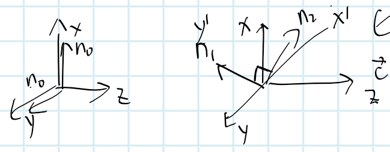

说明对两正交的偏振光有不同的折射率，两正交偏振光沿$\hat z$转播$L$距离后，发生相位移动（电光延迟）
$$
\Delta \varphi=\frac{2 \pi}{\lambda} \delta n L=\frac{4 \pi \chi_{x y z}^{(2)} E_{0 z} L}{\lambda n_{\circ}}=\frac{4 \pi \chi_{x y z}^{(2)} U}{\lambda n_{0}}
$$

#### 综上

线性电光效应即，$\Delta n \propto E_{0z}$

可将单轴晶体转变成双轴晶体：其相对介电常数张量，由单轴形式变为双轴形式

#### 线性电光张量

一些书中采用线性电光张量代替极化率张量来表示电光效应，

定义线性电光张量，
$$
\gamma_{\mu\alpha\beta} = \frac{2\chi^{(2)}_{\mu\alpha\beta}}{\varepsilon_{\mu\mu}\varepsilon_{\alpha\alpha}}
$$
其中，下标$\mu\alpha$是可交换的，可以简记为
$$
\mu\alpha = \stackrel{1}{xx},\stackrel{2}{yy},\stackrel{3}{zz},\stackrel{4}{yz},\stackrel{5}{zx},\stackrel{6}{xy}
$$
此时，
$$
\gamma_{11} = \gamma_{xxx}
\qquad
\gamma_{23} = \gamma_{yyz}
\\
U_{\frac{\lambda}{2}} = \frac{\lambda}{2\gamma_{63}n_o^3}
$$
对于$\lambda = 1\mu m,\quad \gamma_{63}=10.6\times 10^{-12} m/v,\quad \gamma_0 = 1.51$有半波电压$U_{\frac{\lambda}{2}} = 15000V$

可见对于一般物质的半波电压是很大的

### 横向应用

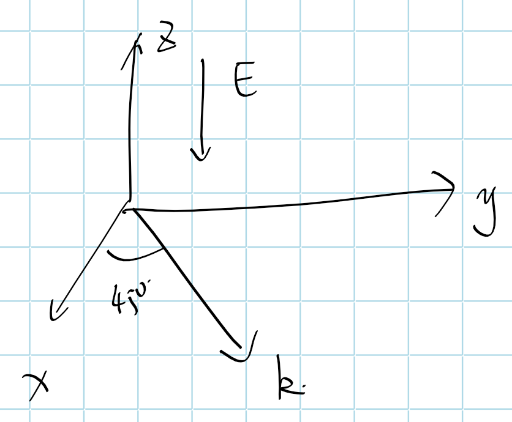

电场施加方向与光束传播方向垂直，如上图所示
$$
k_x = k_y ,\quad k_z=0
$$
以$\bar 4 3m$晶类为例，有介电张量和二阶极化率张量为
$$
\begin{pmatrix} \varepsilon_{xx}&0&0 \\ 0&\varepsilon_{xx}& 0 \\ 0&0&\varepsilon_{xx}\end{pmatrix}
\qquad

\left[\begin{array}{ccccccccc}
0 & 0 & 0 & x y z & x y z & 0 & 0 & 0 & 0 \\
0 & 0 & 0 & 0 & 0 & x y z & x y z & 0 & 0 \\
0 & 0 & 0 & 0 & 0 & 0 & 0 & x y z & x y z
\end{array}\right]
$$
根据电光效应下相对介电常数张量变换，$(\varepsilon_{\mu\alpha})_{eff}
=
\left[
\varepsilon_{r\mu\alpha} + 2\vec{\vec{\vec{\chi}}}_{\mu\alpha\beta}^{(2)}(\omega,0)\cdot E_{0\beta}
\right]$，

有施加电场后，有相对介电常数变化
$$
\begin{array}{l} 
(\varepsilon_{\mu\alpha})_{eff}
&=
\left[
\varepsilon_{r_{\mu\alpha}} + 2\vec{\vec{\vec{\chi}}}_{\mu\alpha\beta}^{(2)}(\omega,0)\cdot E_{0\beta}
\right]
\\
&=
\begin{pmatrix}
\varepsilon_{xx}+2\chi^{(2)}_{xxz}E_{0z} & 0 +2\chi^{(2)}_{xyz}E_{0z} & 0+2\chi^{(2)}_{xzz}E_{0z}
\\
0+2\chi^{(2)}_{yxz}E_{0z} & \varepsilon_{xx}+2\chi^{(2)}_{yyz}E_{0z} & 0+2\chi^{(2)}_{yzz}E_{0z}
\\
0+2\chi^{(2)}_{zxz}E_{0z} & 0+2\chi^{(2)}_{zyz}E_{0z} & \varepsilon_{xx}+2\chi^{(2)}_{zzz}E_{0z}
\end{pmatrix}
\\
&=
\begin{pmatrix}
\varepsilon_{xx} & 2\chi^{(2)}_{xyz}E_{0z} & 0
\\
2\chi^{(2)}_{yxz}E_{0z} & \varepsilon_{xx} & 0
\\
0 & 0 & \varepsilon_{xx}
\end{pmatrix}
\end{array}
$$
代入晶体光学基本方程$D=\frac{n^{2}}{\mu_{0} c^{2}}[\boldsymbol{E}-\boldsymbol{k}(\boldsymbol{k} \cdot \boldsymbol{E})]=\varepsilon_{eff} \cdot \boldsymbol{E}$，有
$$
\begin{align}
\frac{n^2}{\mu_0 c^2} \begin{pmatrix} E_{x}(\omega) \\ E_{y}(\omega) \\ E_{z}(\omega) \end{pmatrix}
-\frac{n^2}{\mu_0 c^2} 
\hat k\cdot(\hat k\cdot\vec E)
&=
\varepsilon_0
\begin{pmatrix}
\varepsilon_{xx} & 2\chi^{(2)}_{zxy}E_{0z} & 0
\\
2\chi^{(2)}_{zyx}E_{0z} & \varepsilon_{xx} & 0
\\
0 & 0 & \varepsilon_{xx}
\end{pmatrix}
\begin{pmatrix} E_{x}(\omega) \\ E_{y}(\omega) \\ E_{z}(\omega) \end{pmatrix}
\\

\begin{pmatrix}\varepsilon_{x x} & 2 \chi_{x y z}^{(2)} E_{0 z} & 0 \\ 2 \chi_{x y z}^{(2)} E_{0 z} & \varepsilon_{x x} & 0 \\ 0 & 0 & \varepsilon_{x x}\end{pmatrix}
\begin{pmatrix} E_{x}(\omega) \\ E_{y}(\omega) \\ E_{z}(\omega)\end{pmatrix}
+
n^2\cdot
\begin{pmatrix} k_x^2&k_x k_y&0
\\k_y k_x&k_y^2&0
\\0&0&0
\end{pmatrix}
\begin{pmatrix} E_x\\ E_y\\E_z \end{pmatrix}
&=
\begin{pmatrix} n^{2} & 0 & 0 \\ 0 & n^{2} & 0 \\ 0 & 0 & n^{2}\end{pmatrix} \begin{pmatrix} E_{x}(\omega) \\ E_{y}(\omega) \\ E_{z}(\omega)\end{pmatrix}
\\

\begin{pmatrix}\varepsilon_{x x}+k_x^2n^2 & 2 \chi_{x y z}^{(2)} E_{0 z}+k_x k_y n^2 & 0 \\ 2 \chi_{x y z}^{(2)} E_{0 z}+k_yk_x n^2 & \varepsilon_{x x}+k_y^2n^2 & 0 \\ 0 & 0 & \varepsilon_{x x}\end{pmatrix}
\begin{pmatrix} E_{x}(\omega) \\ E_{y}(\omega) \\ E_{z}(\omega)\end{pmatrix}

&=
\begin{pmatrix} n^{2} & 0 & 0 \\ 0 & n^{2} & 0 \\ 0 & 0 & n^{2}\end{pmatrix} \begin{pmatrix} E_{x}(\omega) \\ E_{y}(\omega) \\ E_{z}(\omega)\end{pmatrix}

\end{align}
$$
求久期方程，有

对于矩阵第三阶，有：$n = \sqrt{\varepsilon_{xx}} = n_o$

对前两阶求久期方程，有
$$
\begin{vmatrix}\varepsilon_{x x}+k_x^2n^2-n^2 & 2 \chi_{x y z}^{(2)} E_{0 z}+k_x k_y n^2& 0 \\ 2 \chi_{x y z}^{(2)} E_{0 z}+k_yk_x n^2& \varepsilon_{x x}+k_y^2n^2-n^2 & 0 \\ 0 & 0 & \varepsilon_{x x}-n^2\end{vmatrix}=0
$$
可以看出有一个解为
$$
\begin{array}{l}
n_{1}^{2}=\varepsilon_{r} 
\end{array}
$$
当$k_x = k_y $即夹角为$45^\circ$时，取久期方程前两阶有
$$
\begin{align} 
\left(\varepsilon_{x x}+k_x^2n^2-n^2\right)^2 &= \left(2 \chi_{x y z}^{(2)} E_{0 z}+k_x^2n^2\right)^2
\\
n_{2}^{2}&=\varepsilon_{r}-2 \chi_{x y z}^{(2)} E_{0 z}
\end{align}
$$
代回基本方程，有本征方向
$$
\begin{array}{r}
\boldsymbol{E}_{1}=\boldsymbol{E}_{0}(\omega)\begin{pmatrix}
0 \\
0 \\
1
\end{pmatrix} \\
\boldsymbol{E}_{2}=\boldsymbol{E}_{0}(\omega)\begin{pmatrix}
1 \\
-1 \\
0
\end{pmatrix}
\quad\mathrm{or}\quad
\begin{pmatrix} 1\\ 1\\0 \end{pmatrix}
\end{array}
$$
可见，折射率$n_2$正比于横向电场，

其介电张量由各向同性晶体形式，转变为单轴晶体形式

#### 优点

1. 所施加电压和光波传播方向分开，便于实验操作
2. 电压尺度$d$和光传播长度$L$翻开，可以缩小$d$，并延长$L$，以提升$\Delta\varphi$，来缩小半波电压$U_{\frac{\lambda}{2}}$

## 线性电光效应的应用

常利用线性电光效应制作电光调制器，通常有振幅、相位、偏振调制

### 偏振调制

通过电光效应影响光波的偏振状态。

记有两沿着主轴$y',x'$的偏振光

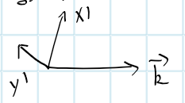

沿$\hat z$传播$L$距离后，两偏振光有相位差
$$
\Delta \varphi=\frac{2 \pi}{\lambda} \delta n L=\frac{4 \pi \chi_{x y z}^{(2)} E_{0 z} L}{\lambda n_{\circ}}=\frac{4 \pi \chi_{x y z}^{(2)} U}{\lambda n_{0}}
$$
其中，$U$即加在晶体纵向的电压

随$U$的增大，光束由线偏振光$\rightarrow$椭圆偏振光$\rightarrow $圆偏振光$\rightarrow $椭圆偏振光$\rightarrow$线偏振光（此时两偏振光相位差为$\pi$）

> TODO⭐图像解释

再度成为线偏振光时，光偏振方向旋转$90^\circ$，$\Delta \varphi = \pi$，此时$U$记为半波电压$U_{\frac{\lambda}{2}}$
$$
U_{\frac{\lambda}{2}} = \frac{n_o \lambda}{4\pi \chi^{(2)}_{xyz}}
$$
这种调制方式称为偏振调制，可以通过偏振方向编码电压信息

以此调制方式为基础，可以实现光开关（快门）、调Q技术、对光脉冲的输出进行选取和控制

### 光开关

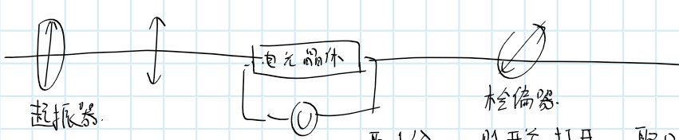

电压取$U_{\frac{\lambda}{2}}$时开关打开，其他情况关闭

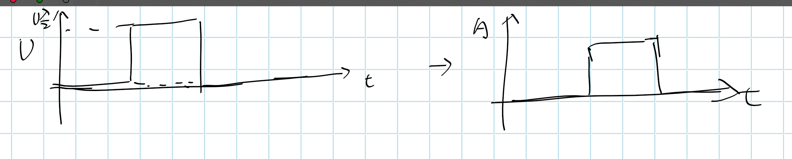

该装置也成为Pocler盒，可用于：选单、净化脉冲

**选单**

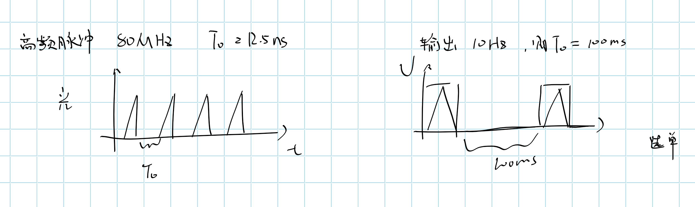

**净化脉冲**

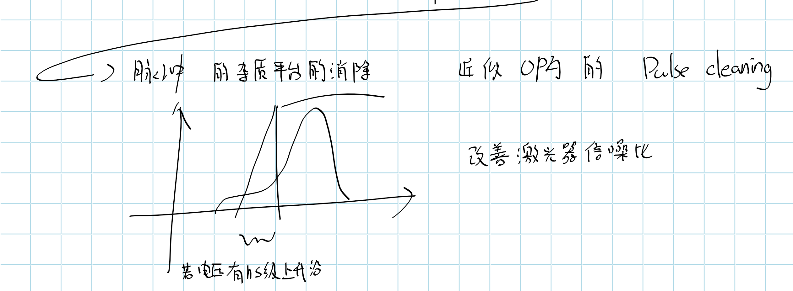

### 电光调Q技术

Q值即激光器的损耗

常见的调Q技术有：机械、声光、电光三种

> 机械调Q也称为转镜调Q
>
> 转动反射镜，使Q值（损耗）瞬间增大，使得光脉冲输出

电光调Q激光器结构如下所示

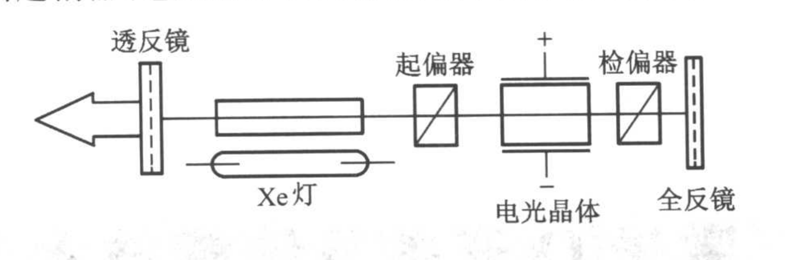

在脉冲激光器的谐振腔内加入一组由起偏器、电光晶体和检偏器所构成的电光开关

激光介质在Xe灯彭浦下产生无规则偏振光，通过起偏器后，成为线偏振光，

对电光晶体施加半波电压，使入射偏振光旋转90°，不能通过检偏器，光开关关闭，实现低Q

> 在时间上，积累泵浦能量以积累激光介质上能级粒子数
>
> ❓
>
> 光开关关闭后，向右传播的光到哪去了，
>
> 被检偏器吸收了？那如何起振

撤去半波电压，光开关打开，实现高Q

### 相位调制

纵向应用，入射光偏振方向沿感应主轴$x',y'$，

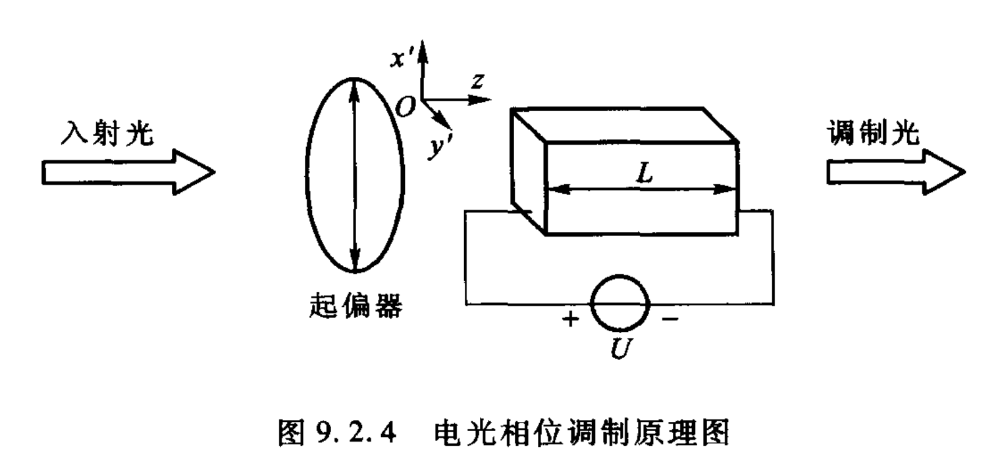

由于线偏振光且振动方向平行主轴，因此光束经过电光晶体后的初相改变不会影响偏振方向，出射光为同偏振方向的不同相位的偏振光出射光的初相位变化为：
$$
\Delta \varphi = \frac{2\pi n_0 L}{\lambda}
$$
记入射光沿$x'$方向偏振，入射光场为，$E_{\mathrm{in}}=A_{\mathrm{c}} \cos \omega_{\mathrm{c}} t$

外加电场为，$E_{z}=E_{m} \sin \omega_{m} t$

纵向应用有折射率：$n_{\mathrm{x}^{\prime}}=n_{0}-\frac{1}{2} n_{\mathrm{o}}^{3} r_{63} E_{\mathrm{z}}$

则有输出光场
$$
E_{\mathrm{o}}=A_{\mathrm{c}} \cos \left[\omega_{\mathrm{c}} t-\frac{\omega_{\mathrm{c}}}{c}\left(n_{\mathrm{o}}-\frac{1}{2} n_{\mathrm{o}}^{3} r_{63} E_{\mathrm{m}} \sin \omega_{\mathrm{m}} t\right) L\right]
$$
略去相位中的常数项，有
$$
E_{\text {out }}=A_{\mathrm{c}} \cos \left(\omega_{\mathrm{c}} t+m_{\phi} \sin \omega_{\mathrm{m}} t\right)
$$
其中，$m_{\phi}=\frac{\omega_{\mathrm{c}} n_{\mathrm{o}}^{3} r_{63} E_{\mathrm{m}} L}{2 c}=\frac{\pi n_{\mathrm{o}}^{3} r_{63} E_{\mathrm{m}} L}{\lambda}$称为相位调制系数

### 振幅调制

类似于偏振调制，输出光强随外加电场变化而变化

# 光整流效应

一光波通过非线性介质时，由于二阶非线性极化作用产生一个直流极化强度$\vec P_0$的现象

1962年，由Armstrong理论预言

1962年，由Bass实验观察到

## 理论推导

考虑下图所示KDP晶体及光波矢，

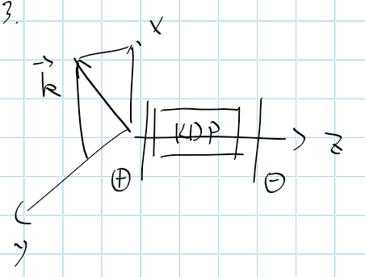

忽略其他非线性效应

记光电场：$\vec E = E_0\cdot\hat a\cdot e^{i\frac{\omega n}{c}\hat k\vec r}$

KDP晶体有极化率张量

由于二阶非线性极化，产生的直流极化强度为
$$
\boldsymbol{P}_{0}=2 \varepsilon_{0} \chi^{(2)}(0;\omega,-\omega): \boldsymbol{E} \boldsymbol{E}^{*}=2 \varepsilon_{0}\left|E_{0}\right|^{2} \chi^{(2)}(\omega,-\omega): \boldsymbol{a a}
$$
对于$o$光，有
$$
\hat a = \begin{pmatrix} a_x\\ a_y\\a_z \end{pmatrix}
= \begin{pmatrix} \ne 0\\ \ne 0\\0 \end{pmatrix}
$$

有各方向极化强度
$$
\begin{array}{l} 
P_{ox} &= 2\varepsilon_0 |E_0|^2 \cdot \left[\chi^{(2)}_{xij}:a_i a_j\right]
\\&=2\varepsilon_0 |E_0|^2 \cdot \left[\chi^{(2)}_{xyz}:a_y a_z + \chi^{(2)}_{xzy}:a_z a_y\right]
\\&=0
\\
P_{oy} &= 2\varepsilon_0 |E_0|^2 \cdot \left[\chi^{(2)}_{yij}:a_i a_j\right]
\\&=0
\\
P_{oz} &= 2\varepsilon_0 |E_0|^2 \cdot \left[\chi^{(2)}_{zij}:a_i a_j\right]
\\&= 2\varepsilon_0 |E_0|^2 \cdot \left[\chi^{(2)}_{zxy}:a_x a_y + \chi^{(2)}_{zyx}:a_y a_x\right]
\\&\ne 0
\end{array}
$$

> $\left[\chi^{(2)}_{xij}:a_i a_j\right]$为爱因斯坦求和，后同

可见$o$光有光整流效应仅发生在$z$方向

对于$e$光，有

> 考虑晶体中光的电磁结构
>
> |  | 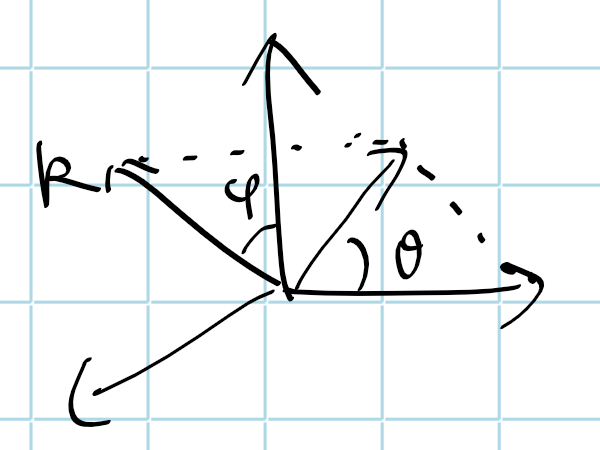 |
> | ------------------------------------------------------------ | ------------------------------------------------------------ |
>
> 记$\vec k$在$xoy$平面内和$z$轴垂直，可以发现，$e$光的偏振方向是可以不垂直于$z$轴，
>
> 考虑均匀不导电非磁性介质中
> $$
> \vec D = \varepsilon_0\varepsilon_r \vec E
> $$
> 对于KDP晶体，有介电张量，$\begin{pmatrix} \varepsilon_{xx}&0&0\\ 0&\varepsilon_{xx}&0\\0&0&\varepsilon_{zz} \end{pmatrix}$
>
> 电位移各方向分量
> $$
> D_x = \varepsilon_0\varepsilon_{xx}E_x
> \\
> D_y = \varepsilon_0\varepsilon_{xx}E_y
> \\
> D_z = \varepsilon_0\varepsilon_{zz}E_z
> $$
> 可以发现KDP晶体中，电位移$\vec D$和光电场$\vec E$是同向的，因此$e$光电场也垂直于$\vec k$，即平行于$\hat z$轴

$$
\hat a = \begin{pmatrix} a_x\\ a_y\\a_z \end{pmatrix}
= \begin{pmatrix} = 0\\ = 0\\\ne 0 \end{pmatrix}
$$

有各方向极化强度
$$
\begin{array}{l} 
P_{ex} &= 2\varepsilon_0 |E_0|^2 \cdot \left[\chi^{(2)}_{xij}:a_i a_j\right]
\\&=2\varepsilon_0 |E_0|^2 \cdot \left[\chi^{(2)}_{xyz}:a_y a_z + \chi^{(2)}_{xzy}:a_z a_y\right]
\\&=0
\\
P_{ey} &= 2\varepsilon_0 |E_0|^2 \cdot \left[\chi^{(2)}_{yij}:a_i a_j\right]
\\&=0
\\
P_{ez} &= 2\varepsilon_0 |E_0|^2 \cdot \left[\chi^{(2)}_{zij}:a_i a_j\right]
\\&= 2\varepsilon_0 |E_0|^2 \cdot \left[\chi^{(2)}_{zxy}:a_x a_y + \chi^{(2)}_{zyx}:a_y a_x\right]
\\&= 0
\end{array}
$$
因此$e$光不产生光整流效应

综上所述，

将检测直流极化的极板加在$z$方向，将可以检测到极化电流

## 应用

1. 用于光电探测，可进行快速检测，达到亚$ps$量级
2. 用于产生短电脉冲，可亚$ns$，量级

