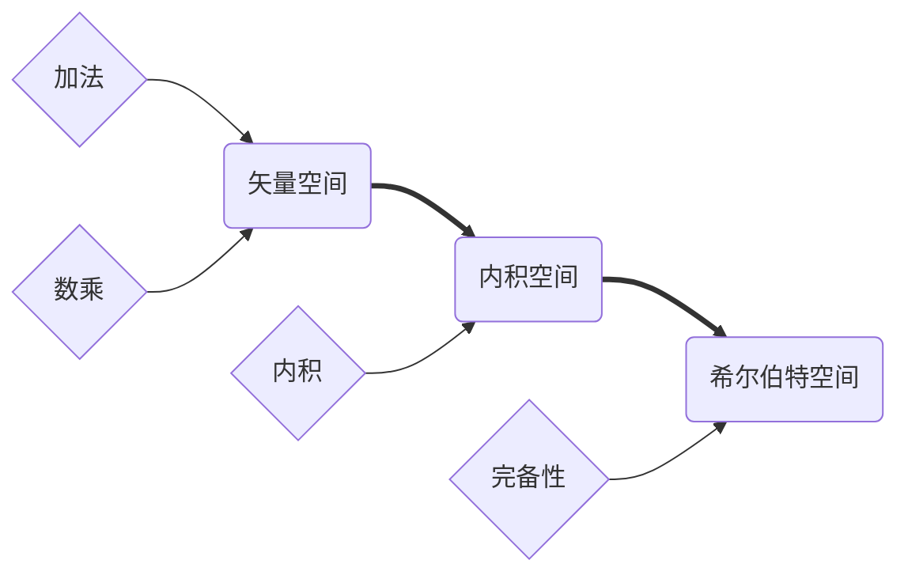

# 希尔伯特空间

## 概述

### 矢量空间

定义：无穷多个同类数学对象的集合，各元素满足一定运算规则

#### 加法运算

满足

| $\psi +\phi=\chi,\quad$ | $\psi,\phi,\chi\in\mathcal{H} $                              |
| :---------------------: | :----------------------------------------------------------- |
|         交换律          | $\psi +\phi = \psi +\psi$                                    |
|         结合律          | $\psi +(\phi+\chi) = (\psi +\phi)+\chi$                      |
|       单位元存在        | $\psi+O = \psi$                                              |
|        逆元存在         | $\psi+\phi =0$，则称$\psi,\phi$互为逆元，也写作$\psi = \phi^{-1}= -\phi$ |

其中，$O$为零矢量、单位元

#### 数乘运算

满足

| $\psi a = \phi$ | $\psi,\phi\in \mathcal{H}\quad a\in\mathcal F$    |
| :-------------: | ------------------------------------------------- |
|   单位元存在    | $\psi\cdot 1 = \psi$                              |
|     结合律      | $(\psi\cdot a)\cdot b = \psi(a\cdot b)$           |
|   第一分配律    | $\psi(a+b) = \psi a +\psi b$                      |
|   第二分配律    | $(\psi + \phi)\cdot a = \psi\cdot a +\phi\cdot a$ |

#### 内积运算

| $(\psi,\phi) = c$ | $\psi,\phi\in\mathcal{H}\quad c\in\mathcal{F}$               |
| :---------------: | ------------------------------------------------------------ |
|    复共轭存在     | $(\psi,\phi)^* = (\phi,\psi)$                                |
|      分配律       | $(\psi,\phi+\chi) = (\psi,\phi)+(\psi,\chi)$                 |
|    因子结合律     | $(\psi,\phi a) =(\psi,\phi)a \\ (\psi a,\phi) = a^*(\psi,\phi)$ |
|      自内积       | $(\psi,\psi)=(\psi,\psi)^*\ge 0$ 若$(\psi,\psi)=0$，则$\psi = O$ |

定义矢量长度，$|\psi| = \sqrt{(\psi,\psi)}$

有几个复数性质

- $(\psi+\phi)^* = \psi^* +\phi^*$
- $(\psi\cdot\phi)^* = \psi^*\cdot\phi^*$

#### 基矢

正交归一的完全集：完全集中每一个矢量都是归一化的，且各矢量两两互相正交。对于$n$维空间的一组基矢$\left\{v_{1}, v_{2}, \cdots, v_{n}\right\}$，即
$$
\left(v_{i}, v_{j}\right)=\delta_{i j}, \quad i, j=1,2, \cdots, n
$$
这一完全集称为一组基矢。

**Schmidt正交化方法**——用于确定基矢

⭐TODO P8

**完全性定理**

#### 完备性

如果对给定任意小的实数$\varepsilon>0$，由数$N$存在；

当$m,n>N$时，有$(\psi_m-\psi_n,\psi_m-\psi_n)<\varepsilon$

#### 总结

## 矢量空间的性质

- 零矢量唯一
- 每个矢量的逆元唯一
- $\psi\cdot 0 = O$
- $\psi\cdot(-1) = -\psi$
- $O\cdot a = O$
- 若$\psi\cdot a = O$，则$a=0$或$\psi = O$
- $(\psi a,\phi) = a^*\cdot(\psi,\phi)$
- $(\psi+\phi,\chi) = (\psi,\chi)+(\phi,\chi)$

运算性质

- Cauchy-Schwarz不等式，$|\langle x, y\rangle|^{2} \leq\langle x, x\rangle \cdot\langle y, y\rangle$

- 三角不等式，$|\psi+\phi|\le |\psi|+|\phi|$

## 矢量空间的举例

**复空间**
$$
\begin{array}{l} 
l = \begin{pmatrix} l_1\\l_2\\l_3\\l_4 \end{pmatrix}
\qquad
l+m = \begin{pmatrix} l_1+m\\l_2+m\\l_3+m\\l_4+m \end{pmatrix}
\qquad
l\cdot a \begin{pmatrix} l_1\cdot a\\l_2\cdot a\\l_3\cdot a\\l_4\cdot a \end{pmatrix}
\\\\
(l, m)=\left(l_{1}^{*} m_{1}+l_{2}^{*} m_{2}+l_{3}^{*} m_{3}+l_{4}^{*} m_{4}\right)
\end{array}
$$
**复函数**

对于平方可积复函数$f(x)$全体，

定义加法、数乘都代数运算

定义内积
$$
\left(f(x),g(x)\right) = \int\limits_a^b f^*(x)\cdot g(x)dx
$$

这样的函数全体构成一个内积空间---函数空间。 不同的函数都是此空间中的矢量。

## 子空间

⭐TODO P11

# 左右矢空间

TODO

# 算符

## 定义

$$
|\varphi\rangle=A|\psi\rangle
$$

定义域和值域者可以不同、部分或完全重合。通常定义域 和值域都是整个空间

## 线性算符和反线性算符

**线性算符**
$$
\begin{array}{l}A(|\psi>+| \varphi>)=A|\psi>+A| \varphi> \\ A(\mid \psi>a)=(A \mid \psi>) a\end{array}
$$
量子力学中的算符绝大多数是线性算符

**反线性算符**
$$
\begin{array}{l}A(|\psi>+| \varphi>)=A|\psi>+A| \varphi\rangle \\ A(\mid \psi>a)=(A \mid \psi>) a^{*} \quad \text { 其中 } a \text { 是任意复数 }\end{array}
$$
**线性算符的性质**

1. 线性算符的值域也是一个右矢空间； 
2. 若定义域是有限维的空间，则值域空间的维 数等于或小于定义域空间的维数；
3. 在定义域中，那些受 A的作用得到零矢量的 右矢全体，也构成一个右矢空间, 这是定义域的子 空间

## 特殊算符

**复数算符**
$$
a|\psi\rangle=| \psi\rangle a
$$
将复数对右矢的数乘看作算符

**零算符和单位算符**
$$
O|\psi\rangle=|0>, \quad 1| \psi\rangle=|\psi\rangle
$$

## 算符的运算

#### 算符之和$A+B$

$$
(A+B)|\psi\rangle=A| \psi\rangle+B \mid \psi\rangle
$$

#### 算符乘积$AB$

$$
B A \mid \psi\rangle=B(A \mid \psi\rangle)
$$

BA定义域满足

1. A的值域$\subseteq$ B的定义域，BA的定义域 = A的定义域; 
2. A的值域$\subset$B的定义域: BA的定义域$\subset$A的定义域。

#### 算符相等

$A,B$定义域相同，且域内任意
$$
\begin{array}{l}A|\psi\rangle=B \mid \psi> \\ A=B\end{array}
$$

#### 算符对易

$$
[\mathbf{A}, \mathbf{B}]=\mathbf{A B}-\mathbf{B A}=0
$$

#### 算符的函数

$$
\text { 若 }[A, B] \neq 0 \quad \text { 则 } \quad e^{A} e^{B} \neq e^{A+B}
$$

#### 逆算符

算符$A$把定义域中的右失$|\psi\rangle$变为值域中一个右失$|\varphi\rangle$
$$
\mathrm{A}|\psi\rangle=| \varphi\rangle
$$
若一一对应，则有$A$的逆算符，$\mathrm{A}^{-1}=\frac{1}{\mathrm{~A}}$，满足
$$
\begin{array}{l}\mathrm{A}^{-1}|\varphi>=| \psi> \\ \mathrm{A}^{-1} \mathrm{~A}=\mathrm{AA}^{-1}\end{array}
$$
相当于算符的除法

**算符有逆的条件**

1. 在$A|\psi\rangle = |\varphi\rangle$中，对于每一个$|\varphi\rangle$，总有$|\psi\rangle$存在
2. 若$A|\psi_1\rangle=A|\psi_2\rangle$，则必有$|\psi_1\rangle = |\psi_2\rangle$

对于有限维只考虑条件2

**算符有逆的定理**

设A是一个定义域和值域都在全空间的线性 算符，若另外两个线性算符B, C存在，满足
$$
A B=1, \quad C A=1
$$
则算符A有逆，且
$$
A^{-1}=B=C
$$

#### 算符的代数运算

满足一般的加、减、乘、幂次，不对易时不满足交换律
$$
\begin{aligned} A(B+C) &=A B+A C \\(A B) C &=A(B C) \\ A^{3} &=A A A \end{aligned}
$$
**多重对易式**

$A,B$为线性算符，互不对易，
$$
\begin{array}{l}{\left[A^{(0)}, B\right]=B} \\ {\left[A^{(1)}, B\right]=[A, B]} \\ {\left[A^{(2)}, B\right]=[A,[A, B]]}\end{array}
\begin{array}{l}{\left[B, A^{(0)}\right]=B} \\ {\left[B, A^{(1)}\right]=[B, A]} \\ {\left[B, A^{(2)}\right]=[[B, A], A]}\end{array}
$$
对于$[A^{(i)},B]$型的多重对易式，
$$
\left[A,\left[A^{(i)}, B\right]\right]=\left[A^{(i+1)}, B\right]
\\
A\left[A^{(i)}, B\right]=\left[A^{(i)}, B\right] A+\left[A^{(i+1)}, B\right]
$$
对于$[B.A{(i)}]$型的多重对易式，结果类似，
$$
e^{A} B e^{-A}=\sum_{i=0}^{\infty} \frac{1}{i !}\left[A^{(i)}, B\right]
$$

**几个已证明的关系**

- $A^{n} B=\sum_{i=0}^n\left(\begin{array}{l}n \\ i\end{array}\right)\left[A^{(i)}, B\right] A^{n-i}=\sum_{i=0}^{n} \frac{n !}{(n-i) ! i !}\left[A^{(i)}, B\right] A^{n-i}$

- Glauber公式：$\mathrm{e}^{A+B}=\mathrm{e}^{A} \mathrm{e}^{B} \mathrm{e}^{-C / 2}$

## 左矢算符

$$
\begin{array}{l} 
|\varphi\rangle =|A\psi\rangle =  A|\psi\rangle
\\
\langle\varphi| =\langle A\psi| =  \langle\psi|A^+
\end{array}
$$

$A^+$称为$A$的伴算符，伴算符是相互的

左右矢空间是对偶空间

#### 运算规则

1. $A+B, A B \Rightarrow A^{+}+B^{+}, B^{+} A^{+}$

2. $|\varphi>=a| \psi>\Rightarrow<\varphi|=<\psi| a^{*}$

3. $\langle\varphi|A^+|\psi\rangle$一般表示$(\langle\varphi|A^+)|\psi\rangle$，但可定义$\left\langle\varphi\left|\left(A^{+} \mid \psi>\right)=\left(<\varphi \mid A^{+}\right)\right| \psi>\right.$

- 在复矢量空间中，若算符$A$对其定义域中的任意$|\psi\rangle$满足$\langle\psi|A|\psi\rangle=0$，则必有$A=0$

## 厄米算符和幺正算符

#### 厄米算符

满足
$$
H^+ = H
$$
的算符称为厄密算符，也叫做自伴算符、自轭算符

厄密算符的充要条件：定义域上的所有$|\psi\rangle$满足
$$
\langle\psi|H|\psi\rangle = 实数
$$

#### 等距算符

满足
$$
U^+U = I
$$
则为等距算符，有等价命题

1. $U^+U=I$
2. 对任意$|\psi\rangle$和$|\varphi\rangle$，$U$满足$\langle U \psi \mid U \varphi\rangle=\langle\psi|\varphi\rangle$
3. $|U \psi|=|\psi|$对任意$\psi$都成立

#### 幺正算符

满足
$$
U^+U = UU^+ = I
$$
即$U^+ = U$，为幺正算符，在有限维空间中，满足第一项则必满足第二项，在无限维空间中不是，

有等价命题

1. 在矢量空间中，若$\{|v_i\rangle\}$是一组基矢，则$\{U|v_i\rangle\}$也是一组基矢
2. 若$\{|v_i\rangle\}$和$\{|\mu_i\rangle\}$是同一空间的两组基矢，则两者必能由一个幺正算符联系起来。即存在一个幺正算符$U$，使得$|\mu_i\rangle = U|v_i\rangle$

**算符的幺正变换**

存在算符$A$，满足$A|\psi\rangle = |\varphi \rangle$

对$|\psi\rangle,|\varphi\rangle$进行幺正变换，有
$$
|\psi'\rangle = U|\psi\rangle
\\
|\varphi'\rangle = U|\varphi\rangle
$$
此时有
$$
A' = UAU^{-1}
$$
仍然满足
$$
A'|\psi'\rangle = |\varphi'\rangle
$$
则$A'$为$A$的幺正变换。

一个包含矢量和算符的关系式，经过幺正变换后其形式不变

#### 投影算符

$$
P_i = |\nu_i\rangle\langle \nu_i|
\\
P_i|\psi\rangle = |\nu_i\rangle\langle \nu_i|\psi\rangle
$$

其中，$\nu_i$为空间基矢，算符作用为$|\nu_i\rangle$乘$|\psi\rangle$在$|\nu_i$上的分量，即投影运算
$$
P = \sum\limits^n_{i=1} |\nu_i\rangle\langle \nu_i|
$$
为$n$维投影算符，即投影到一空间，当取和全部基矢$\{\nu_i\}$，称为全投影算符
$$
P = \sum\limits_{i=1} |\nu_i\rangle\langle \nu_i|
\\
P|\psi\rangle = \sum\limits^n_{i=1} |\nu_i\rangle\langle \nu_i|\psi\rangle
$$
且有完备性定理，
$$
\sum\limits^n_{i=1} |\nu_i\rangle\langle \nu_i| = I
$$
投影算符有如下性质

1. 线性算符
2. 厄密算符
3. $P^2 = P$

# 本征矢量和本征值

## 定义

满足
$$
A|\psi\rangle = a|\psi\rangle
$$
其中，$a$为常数，$|\psi\rangle$称为算符$A$的本征矢量，$a$为本征值，方程称为本征方程。

量子力学中，$A$一般为厄米算符

对于厄米算符的本征值有如下性质

1. 在复空间中，厄米算符的本征值都是实数
2. 厄米算符属于不同本征值的本征矢量相互正交

#### 简并

算符$A$的全体本征值相同的本征矢量所张的空间，称为算符$A$的属于本征值$a$的本征子空间，该空间的维数$s$称为所属本征值的简并度，称为$s$重简并。

有如下定理

1. 若$A,B$两算符相似，即对于有逆算符$R$有$B = RAR^{-1}$，则$A,B$本征值谱相同，每一本征值简并度相同

## 完全性和封闭性

一组正交归一矢量集的封闭性的含义是，这个空间 中不存在其它与集内所有矢量都正交的矢量（否则此 矢量集应再加一矢量）。 二者的等价性是明显的。对于一般的Hilbert空间， 二者是等价的。 

对有限维空间予以证明： 

定理：在有限维空间中，厄米算符的全部本征矢量 构成正交完全集。

## 基矢的选择

空间的一组正交归一完全集$\{|\psi^{(i)}\rangle\}$，满足
$$
\sum_{i=1}^{n}\left|\psi^{(i)}><\psi^{(i)}\right|=1
$$
可以视为空间的一组基矢。当无简并时，有唯一$\{|\psi^{(i)}\rangle\}$；有简并时，有多种选法

对于无穷维H空间，物理上认为，厄米算符的全部线性无关的本征矢量构成此空间完全集，满足
$$
\begin{array}{c}<\psi_{i} \mid \psi_{j}>=\delta_{i j} \\ \sum_{i=1}^{\infty}\left|\psi_{i}><\psi_{i}\right|=1\end{array}
$$

> 为在无论是否简并情况下获得唯一的完全集，利用下述定理

#### 本征矢量完全性定理

当且仅当两个粒子的厄米算符互相对易时，它们有一组 共同的本征矢量完全集
$$
A\left|i>=a_{i}\right| i>\quad B\left|i>=b_{i}\right| i>
$$

#### 厄米算符完备组

对于一个Hilbert空间，一组相互对易的厄米算符 A,B,C, …，它们只有一组完全确定的共同本征矢量完全集， 而去掉其中的任意一个，都会使剩下的那些算符的共同本 征矢量完全集具有任意性，称它们为一组厄米算符完备组。

> 增加算符，而不通过一个算符的本征矢量来作为基矢，是为了消除任意性，获得完全确定的基矢

# 表象理论

在物理上总是取n个有物理意义的厄米算符构 成对易完备组K，用它们的共同本征矢量作为基矢
$$
K\left|i>=k_{i}\right| i>
$$
在量子力学中，取定这样一组基矢称为取一个表 象。这个表象就用算符完备组K命名，称为K表象。

该空间内矢量可以表示为
$$
\begin{array}{l}|\psi\rangle=\sum_{i}|i\rangle<i\left|\psi>=\sum_{i}\right| i>\psi_{i}, \quad \psi_{i}=<i \mid \psi> \\ \left.|\varphi\rangle=\sum_{j}|j><j| \varphi>=\sum_{j}\left|j>\varphi_{j}, \quad \varphi_{j}=<j\right| \varphi\right\rangle\end{array}
$$
其中，$\psi_i,\varphi_j$为矢量在基矢量$|i\rangle,|j\rangle$上的分量；$|i\rangle,\psi_i,|j\rangle\varphi_j$为投影

两矢量内积表示为
$$
<\varphi\left|\psi>=\sum_{i}<\varphi\right| i><i \mid \psi>=\sum_{i} \varphi_{i}^{*} \psi_{i}
$$

## 矢量、算符的矩阵表示

同样算符可以写作
$$
K|i\rangle = k_i |i\rangle
\\\langle j| A|i\rangle = A_{ji}
$$
$A_{ji}$为$A$在$K$表象中的矩阵元
$$
\begin{array}{c}|\psi>\rightarrow\left(\begin{array}{c}\psi_{1} \\ \psi_{2} \\ \vdots \\ \psi_{n}\end{array}\right) \quad | \varphi>\rightarrow\left(\begin{array}{c}\varphi_{1} \\ \varphi_{2} \\ \vdots \\ \varphi_{n}\end{array}\right) \\ <\psi \mid \rightarrow\left(\psi_{1}^{*} \psi_{2}^{*} \cdots \psi_{n}^{*}\right),\langle\varphi| \rightarrow\left(\varphi_{1}^{*} \varphi_{2}^{*} \cdots \varphi_{n}^{*}\right) \\ A \rightarrow\left(\begin{array}{cccc}A_{11} & A_{12} & \cdots & A_{1 n} \\ A_{21} & A_{22} & \cdots & A_{2 n} \\ \cdots & \cdots & \cdots & \ldots \\ A_{n 1} & A_{n 2} & \cdots & A_{n n}\end{array}\right)\end{array}
$$

$$
\begin{array}{c}<\varphi \mid \psi>\rightarrow\left(\varphi_{1}^{*} \varphi_{2}^{*} \cdots \varphi_{n}^{*}\right)\left(\psi_{1} \psi_{2} \cdots \psi_{n}\right)^{T} \\ |\varphi\rangle=A \mid \psi>\rightarrow\left(\begin{array}{c}\varphi_{1} \\ \varphi_{2} \\ \vdots \\ \varphi_{n}\end{array}\right)=\left(\begin{array}{cccc}A_{11} & A_{12} & \cdots & A_{1 n} \\ A_{21} & A_{22} & \cdots & A_{2 n} \\ \cdots & \cdots & \cdots & \cdots \\ A_{n 1} & A_{n 2} & \cdots & A_{n n}\end{array}\right)\left(\begin{array}{c}\psi_{1} \\ \psi_{2} \\ \vdots \\ \psi_{n}\end{array}\right) \\ <\varphi|=<\psi| A \rightarrow\left(\varphi_{1}^{*} \varphi_{2}^{*} \cdots \varphi_{n}^{*}\right)=\left(\psi_{1}^{*} \psi_{2}^{*} \cdots \psi_{n}^{*}\right)\left(\begin{array}{cccc}A_{11} & A_{12} & \cdots & A_{1 n} \\ A_{21} & A_{22} & \cdots & A_{2 n} \\ \cdots & \cdots & \cdots & \cdots \\ A_{n 1} & A_{n 2} & \cdots & A_{n n}\end{array}\right)\end{array}
$$

## 表象变换

有两表象
$$
\begin{array}{ll}\text { K表象: } & \left\{\mid \varepsilon_{i}>\right\} \\ \text { L表象: } & \left\{\mid v_{\alpha}>\right\}\end{array} \quad i, \alpha=1,2, \cdots, n
$$
完全性关系，
$$
\sum_{i}\left|\varepsilon_{i}><\varepsilon_{i}\right|=1, \quad \sum_{\alpha}\left|v_{\alpha}><v_{\alpha}\right|=1
$$
两组基矢量有关系
$$
\begin{array}{c}\left|v_{\alpha}>=\sum_{i}\right| \varepsilon_{i}>\left\langle\varepsilon_{i}\left|v_{\alpha}>=\sum_{i}\right| \varepsilon_{i}>U_{i \alpha}\right. \\ \left|\varepsilon_{i}>=\sum_{\alpha}\right| v_{\alpha}>\left\langle v_{\alpha}\left|\varepsilon_{i}>=\sum_{\alpha}\right| v_{\alpha}>U_{\alpha i}^{-1}\right. \\ \left\{\begin{array}{l}U_{i \alpha}=\left\langle\varepsilon_{i}\right| v_{\alpha}> \\ U_{\alpha i}^{-1}=\left\langle v_{\alpha}\right| \varepsilon_{i}>\end{array}\right.\end{array}
$$
其中，$U$表示表象变换，是一个幺正矩阵的矩阵元，矩阵行按照$|\varepsilon_i\rangle$编号，列按照$|\nu_\alpha\rangle$编号；$U_{ai}^{-1}$为前述矩阵的逆矩阵元，行列编号相反，

> $U$满足，$U^+ U = U^+ U = I$
>
> $U$是用两组不同表象的内积表示的，常规投影算符用两组同一表象的内积表示

有关系，
$$
\sum_{\alpha} U_{i \alpha} U_{\alpha j}^{-1}=\delta_{i j}, \quad \sum_{i} U_{\alpha i}^{-1} U_{i \beta}=\delta_{\alpha \beta}
$$
**矢量的表象变换表述为**
$$
\psi_{i}=\sum_{\alpha} U_{i \alpha} \psi_{\alpha}
$$
**算符的表象变换表述为**
$$
A_{\alpha \beta}=\sum_{i} \sum_{j} U_{\alpha i}^{-1} A_{i j} U_{j \beta}
$$
其中，$A_{ij}$为$K$表象下的算符，$A_{\alpha\beta}$为$L$表象下的算符

表象变换仅改变算符的矩阵表示，不改变其本征值

## 表象变换（相似变换）不变量

#### 矩阵的迹

方阵对角元之和
$$
\tr A = \sum_i A_{ii}
\\
\tr(AB) = \tr(BA)
$$

#### 行列式

矩阵看成行列式的值
$$
\begin{aligned} \operatorname{det} A &=\sum_{a b c \cdots n} \varepsilon_{a b c \cdots n} A_{a 1} A_{b 2} A_{c 3} \cdots A_{n N} \\ &=\sum_{a b c \cdots n} \varepsilon_{a b c \cdots n} A_{1 a} A_{2 b} A_{3 c} \cdots A_{N n} \end{aligned}
$$

$$
\varepsilon_{a b c \cdots n}=\left\{\begin{array}{ll}1 & \text { 若abc...n是123...N的偶置换 } \\ -1 & \text { 若abc...n是123...N的奇置换 } \\ 0 & \text { 其它情况 }\end{array}\right.
$$

有
$$
\operatorname{det}(A B)=\operatorname{det}(A) \cdot \operatorname{det}(B)
$$

  ## 矩阵的相似变换

$A \rightarrow U^{-1} A U$称为相似变换，$U$为幺正矩阵

满足，$B = U^{-1}AU$，则称$A,B$相似

**性质**

$A,B$相似，则
$$
\begin{array}{c}\operatorname{tr} A=\operatorname{tr} B \\ \operatorname{det}(A)=\operatorname{det}(B)\end{array}
$$
**定理**

任何厄米矩阵都可以通过相似变换（实际 上是幺正变换）成为对角矩阵

## 连续本征值情况

求和变积分
$$
K|k>=k| k>
\\
\int|k>d k<k|=I
\\
\begin{array}{l}\left|\psi>=\int\right| k>d k<k\langle\rangle=\int \mid k>\psi(k) d k \\ \left.|\varphi\rangle=\int|k>d k<k| \varphi\right\rangle=\int \mid k>\varphi(k) d k\end{array}
\\
\begin{aligned}\langle\varphi \mid \psi\rangle &\left.=\int<\varphi|k>d k<k| \psi\right\rangle \\ &=\int \varphi^{*}(k) \psi(k) d k \end{aligned}
$$
算符的表示
$$
\begin{array}{c}<k\left|\varphi>=\int<k\right| A\left|k^{\prime}>\mathrm{d} k^{\prime}<k^{\prime}\right| \psi> \\ \varphi(k)=\int A\left(k, k^{\prime}\right) \psi\left(k^{\prime}\right) \mathrm{d} k^{\prime}\end{array}
$$
其中，k',k都是K表象，

**矩阵标记**
$$
\begin{array}{c}\psi(k) \rightarrow \psi_{k} \rightarrow\left(\begin{array}{c}\vdots \\ \psi_{k} \\ \vdots\end{array}\right) \\ \varphi^{*}(k) \rightarrow \varphi_{k}^{*} \rightarrow\left(\begin{array}{lll}\cdots & \varphi_{k}^{*} & \cdots\end{array}\right) \\ A\left(k, k^{\prime}\right) \rightarrow A_{k k^{\prime}} \rightarrow\left(\begin{array}{ccc}\cdots & \cdots & \cdots \\ \cdots & A_{k k^{\prime}} & \cdots \\ \cdots & \cdots & \cdots\end{array}\right)\end{array}
$$

# 矢量空间的直和与直积

## 直和
$$
|\alpha\rangle \oplus |\psi\rangle
$$
其中，$\alpha,\psi$来自两个空间，这一类矢量可以构成一个新的适量空间
从两空间中各取一矢量构成的双矢量$|\alpha\rangle\oplus|\psi\rangle$与$|\alpha\rangle+|\psi\rangle$等价

**直和空间内的运算**
1. 加法
2. 数乘
3. 内积

**算符的直和**
直和空间内算符$A\oplus L$，满足
$$
(A \oplus L)(|\alpha>\oplus| \psi>)=A|\alpha>\oplus L| \psi\rangle
$$
其中，$A,L$分别来自直和前的两个空间
同样有算符的加法和乘法
$$
\begin{array}{c}(A \oplus L)+(B \oplus M)=(A+B) \oplus(L+M) \\ (A \oplus L)(B \oplus M)=A B \oplus L M\end{array}
$$

**直和空间的维数**
$n = n_1 + n_2$
其基矢为
$$
\begin{array}{l}\left\{\left|v_{i}>\oplus\right| 0^{(2)}>,\left|0^{(1)}>\oplus\right| \varepsilon_{m}>\right\} \\ i=1,2, \cdots, n_{1} \quad m=1,2, \cdots, n_{2}\end{array}
$$

**矩阵表示**
设分别在空间$R_1,R_2$中分别处于$K,P$表象的$|\alpha\rangle,|\psi|rangle$矩阵分别为，
$$
\left|\alpha>=\left(\begin{array}{c}\alpha_{1} \\ \alpha_{2}\end{array}\right), \quad\right| \psi>=\left(\begin{array}{l}\psi_{1} \\ \psi_{2} \\ \psi_{3}\end{array}\right)
$$
其中，$\alpha_{i}=<v_{i}\left|\alpha>, \psi_{m}=<\varepsilon_{m}\right| \psi>$
则其直和看空间中，$|\alpha\rangle\oplus|\psi\rangle$的$KP$表象矩阵为
$$
|\alpha>\oplus| \psi>=\left(\begin{array}{c}\alpha \\ \ldots . \\ \psi\end{array}\right)=\left(\begin{array}{l}\alpha_{1} \\ \alpha_{2} \\ \psi_{1} \\ \psi_{2} \\ \psi_{3}\end{array}\right)
$$
对于分别在$R_1,R_2$空间中的算符，
$$
A=\left(\begin{array}{ll}A_{11} & A_{12} \\ A_{21} & A_{22}\end{array}\right), \quad L=\left(\begin{array}{lll}L_{11} & L_{12} & L_{13} \\ L_{21} & L_{22} & L_{23} \\ L_{31} & L_{32} & L_{33}\end{array}\right)
$$
则，直和空间中的算符
$$
A \oplus L=\left(\begin{array}{ccc}A & \mid & O \\ -- & \mid & -- \\ O & \mid & L\end{array}\right)=\left(\begin{array}{ccccc}A_{11} & A_{12} & 0 & 0 & 0 \\ A_{21} & A_{22} & 0 & 0 & 0 \\ 0 & 0 & L_{11} & L_{12} & L_{13} \\ 0 & 0 & L_{21} & L_{22} & L_{23} \\ 0 & 0 & L_{31} & L_{32} & L_{33}\end{array}\right)
$$
其中，$A_{i j}=<v_{i}|A| v_{j}>, \quad L_{m n}=\left\langle\varepsilon_{m}|L| \varepsilon_{n}>\right.$
直和空间中的算符$A$，指$A\oplus O^{(2)}$

## 直积

$$
|\alpha\rangle\otimes|\psi\rangle = 
|\alpha\rangle|\psi\rangle
=|\alpha\psi\rangle
$$

#### 直积运算
**加法**
$|\alpha\rangle|\psi\rangle  + |\beta\rangle|\varphi\rangle$的结果是一不能表示为双矢量的新矢量
**数乘**
$$
|\alpha>| \psi>a=(\mid \alpha>a)|\psi>=| \alpha>(\mid \psi>a)
$$
**内积**
$$
(<\alpha|<\psi|)(|\beta>| \varphi>)=<\alpha \mid \beta>\langle\psi \mid \varphi\rangle
\\
(|\alpha>+| \beta>)|\psi>=| \alpha>|\psi>+| \beta>|\psi\rangle
$$

**算符的直积**
TODO

**直积的矩阵表示**
有矢量
$$
|\alpha>\otimes| \psi>=\left(\begin{array}{l}\alpha_{1} \\ \alpha_{2}\end{array}\right) \otimes\left(\begin{array}{l}\psi_{1} \\ \psi_{2} \\ \psi_{3}\end{array}\right)=\left(\begin{array}{l}\alpha_{1} \psi_{1} \\ \alpha_{1} \psi_{2} \\ \alpha_{1} \psi_{3} \\ \alpha_{2} \psi_{1} \\ \alpha_{2} \psi_{2} \\ \alpha_{2} \psi_{3}\end{array}\right)
\\
|\alpha>\otimes| \psi>=\left(\begin{array}{l}\alpha_{1} \psi \\ \alpha_{2} \psi\end{array}\right)
$$

有算符
$$
\begin{aligned} A \otimes L &=\left(\begin{array}{ll}A_{11} & A_{12} \\ A_{21} & A_{22}\end{array}\right) \otimes\left(\begin{array}{lll}L_{11} & L_{12} & L_{13} \\ L_{21} & L_{22} & L_{23} \\ L_{31} & L_{32} & L_{33}\end{array}\right) \\ &=\left(\begin{array}{lll|lll}A_{11} L_{11} & A_{11} L_{12} & A_{11} L_{13} & A_{12} L_{11} & A_{12} L_{12} & A_{12} L_{13} \\ A_{11} L_{21} & A_{11} L_{22} & A_{11} L_{23} & A_{12} L_{21} & A_{12} L_{22} & A_{12} L_{23} \\ A_{11} L_{31} & A_{11} L_{32} & A_{11} L_{33} & A_{12} L_{31} & A_{12} L_{32} & A_{12} L_{33} \\ \hline A_{21} L_{11} & A_{21} L_{12} & A_{21} L_{13} & A_{22} L_{11} & A_{22} L_{12} & A_{22} L_{13} \\ A_{21} L_{21} & A_{21} L_{22} & A_{21} L_{23} & A_{22} L_{21} & A_{22} L_{22} & A_{22} L_{23} \\ A_{21} L_{31} & A_{21} L_{32} & A_{21} L_{33} & A_{22} L_{31} & A_{22} L_{32} & A_{22} L_{33}\end{array}\right) \end{aligned}
\\
A \otimes L=\left(\begin{array}{cc}A_{11} L & A_{12} L \\ A_{21} L & A_{22} L\end{array}\right)
$$
