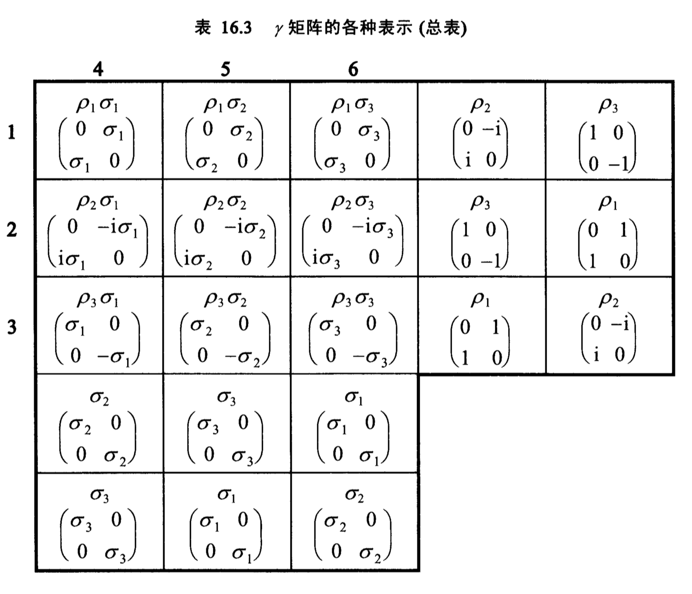
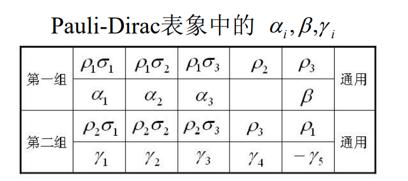

# 电子的相对论运动

## 克莱因-高登方程

量子力学基本原理中，演化公设中的薛定谔方程的哈密顿量$H$由非相对论分析力学得出，不满足狭义相对论要求

按照相对论的时空对等性要求和方程在洛伦兹变换下的不变性要求

在坐标表象中，自由单粒子薛定谔方程为
$$
i\hbar\frac{\partial }{\partial t}\psi(x,y,z,t) 
= \left[
\frac{1}{2m}\left(-i\hbar\nabla \right)^2 
\right]
\psi(x,y,z,t)
\tag{1.1}
$$
对比于经典情况，能量与动量的关系：$E= \frac{\vec p^2}{2m}$

比较发现

$i\hbar\frac{\partial}{\partial t} $对应于能量$E$；$-i\hbar\frac{\partial}{\partial x_i}$对应于动量$p_i$

在相对论情况下，有能量与机械动量关系：$E^{2}=c^{2} p^{2}+m^{2} c^{4}$

> TODO由四维不变动量导出

对相对论能量与动量关系两侧作用波函数，有
$$
\left(i\hbar\frac{\partial}{\partial t}\right)^2 \psi(x,y,z,t) = \left[c^2(-i\hbar\nabla)^2 + m_0^2c^4\right]\psi(x,y,z,t)
$$
即为克莱因-高登方程，但它存在如下问题

1. $\psi\psi^*$不正定，不能解释为粒子概率
2. 能量有负的本征值
3. 对时间的二阶微分方程，除初始条件$\psi(t_0)$，还需要$\left.\frac{\partial\psi}{\partial t}\right|_{t_0}$
4. 对时间和位置的二阶微分，不符合现有的量子力学框架

有协变形式
$$
\begin{array}{c}\left(\partial_{\mu} \partial^{\mu}+\kappa\right) \Psi(x)=0, \quad \mu=1,2,3,4 \\ x_{4}=i c t, \quad \kappa=\frac{m c}{\hbar}\end{array}
$$
❓咋来的

## 狄拉克方程

为获得时间的一阶导形式，考虑
$$
E^{2}=c^{2} p^{2}+m^{2} c^{4}
\\\downarrow\\
E = \pm c\sqrt{m^2 c^2 + p^2}
$$
因此可以设哈密顿量满足
$$
\hat H = c(\alpha_x \hat p_x + \alpha_y \hat p_y + \alpha_z \hat p_z + \beta mc)
$$
其中，$\alpha_{x,y,z},\quad \beta$为待定系数

即，狄拉克假设自由电子的相对论运动方程如下
$$
\left[\mathrm{i} \hbar \frac{\partial}{\partial t}-c \boldsymbol{\alpha} \cdot(-\mathrm{i} \hbar \nabla)-\beta m c^{2}\right] \psi(x, y, z, t)=0
\tag{1.2}
$$
其中，$\alpha$的分量$\alpha_x,\alpha_y,\alpha_z$和$\beta$是四个与实践无关的待定常数（无量纲常数），$c$为光速

用$\left[\mathrm{i} \hbar \frac{\partial}{\partial t}-c \boldsymbol{\alpha} \cdot(-\mathrm{i} \hbar \nabla)-\beta m c^{2}\right]$再作用到（1.2）一次，得到与克莱因高登方程的二阶时间导数形式，比较二者得到待定常数应满足
$$
\left.\begin{array}{l}\alpha_{x}^{2}=\alpha_{y}^{2}=\alpha_{z}^{2}=\beta^{2}=1 \\ \alpha_{i} \alpha_{j}+\alpha_{j} \alpha_{i}=0 \\ \alpha_{i} \beta+\beta \alpha_{i}=0\end{array}\right\}(i \neq j) \quad
$$
在上述常数取值情况下，狄拉克方程既是时间和位置的一阶方程，又同时满足克莱因高登方程

> 对于$1\times 1$复数域上，找不到四个满足上述条件的$\alpha_i,\beta$
>
> 因此考虑扩充到高维情况，如$2\times 2$矩阵，此时可以发现三个泡利矩阵满足上述情况
>
> 最后扩充到$4\times 4$维，可以找到四个满足上述情况的矩阵，
>
> 因此$\alpha,\beta$实际是算符

可以写成类薛定谔方程形式
$$
\begin{array}{c}\mathrm{i} \hbar \frac{\partial}{\partial t} \psi=\hat{H} \psi \end{array}
$$
有哈密顿量

|                | 哈密顿量                                                     |
| -------------- | ------------------------------------------------------------ |
| 自由电子       | $\\ \hat{H}=c \boldsymbol{\alpha} \cdot \hat{\boldsymbol{P}}+\beta m c^{2}$ |
| 电磁场中的电子 | $\hat{H}=c \boldsymbol{\alpha} \cdot(\hat{\boldsymbol{P}}-q \boldsymbol{A})+q V+\beta m c^{2}$ |

为保证电磁场中的电子哈密顿量厄密，还要求$\alpha,\beta$是厄密算符❓

算符$\alpha,\beta$的作用空间显然不同于自由电子的函数空间

### 协变形式

电磁场中的狄拉克方程，
$$
\left[\mathrm{i} \hbar \frac{\partial}{\partial t}-q V-c \boldsymbol{\alpha} \cdot(\hat{\boldsymbol{P}}-q \boldsymbol{A})-\beta m c^{2}\right] \psi=0
\tag{1.3}
$$
令
$$
x_{\mu}=(\vec{x}, \mathrm{i} c t), p_{\mu}=\left(\vec{p}, \mathrm{i} \frac{E}{c}\right), A_{\mu}=\left(\vec{A}, \mathrm{i} \frac{V}{c}\right), \quad(\mu=1,2,3,4)
$$
定义四维动量算符和四个新算符
$$
\hat{P}_{\mu}=-\mathrm{i} \hbar \frac{\partial}{\partial x_{\mu}},
\quad
\gamma_{i}=-i \beta \alpha_{i}, \quad \gamma_{4}=\beta
$$
利用$-\beta$左乘(1.3)并利用
$$
-\beta\left(i \hbar \frac{\partial}{\partial t}-q V\right) \rightarrow-\gamma_{4}(E-q V)=-\gamma_{4}\left(\frac{c}{i} \hat{P}_{4}-q \frac{c}{i} A_{4}\right)=i c \gamma_{4}\left(\hat{P}_{4}-q A_{4}\right)
$$
有协变形式狄拉克方程
$$
\left[i c \sum_{\mu} \gamma_{\mu}\left(\hat{P}_{\mu}-q A_{\mu}\right)+m c^{2}\right] \psi=0
$$
引入的新算符满足
$$
\left.\begin{array}{l}\gamma_{1}^{2}=\gamma_{2}^{2}=\gamma_{3}^{2}=\gamma_{4}^{2}=1 \\ \gamma_{\mu} \gamma_{v}+\gamma_{v} \gamma_{\mu}=0,(\mu \neq v)\end{array}\right\}
\\
\left.\begin{array}{l}\gamma_{i}=-i \beta \alpha_{i}, \quad(i=1,2,3) \\ \gamma_{4}=\beta\end{array}\right\}
$$
再定义$\gamma_5 = \gamma_1\gamma_2\gamma_3\gamma_4 = i\alpha_1\alpha_2\alpha_3\beta^4 = i\alpha_1\alpha_2\alpha_3$

有，$\gamma_\mu \gamma_5 + \gamma_5 \gamma_\mu = 0\qquad \mu = 1,2,3,4$

称$\gamma_\mu$算符称为$\gamma$算符，其矩阵形式称为$\gamma$矩阵

由于$\vec \alpha,\beta$为厄密算符，$\gamma$算符也是厄密的，且$\vec \alpha,\beta$是幺正的

### 自旋算符

设电子自旋算符为$\vec S$，它满足角动量对易和自旋算符的反对易，令$\vec S = \frac{1}{2}\hbar \vec\Sigma$

> 类似于初量的泡利算符和自旋算符

有
$$
\begin{align}
&\Sigma_{i}^{2}=1,  i=1,2,3 \tag{1.4}
\\ 
&\Sigma_{i} \Sigma_{j}+\Sigma_{j} \Sigma_{i}=0, i \neq j \tag{1.5}
\\
&{\left[\Sigma_{i}, \Sigma_{j}\right]=2 i \sum_{k} \varepsilon_{i j k} \Sigma_{k}}\tag{1.6} 
\end{align} 
$$
接下来利用$\vec\alpha,\beta$构建$\Sigma$算符

$\alpha_i$满足（1.4，1.5），不满足（1.6）

取两个分量乘积有
$$
\Sigma_{1}=c \alpha_{2} \alpha_{3}, \Sigma_{2}=c \alpha_{3} \alpha_{1}, \Sigma_{3}=c \alpha_{1} \alpha_{2}
$$
为满足（1.5）有
$$
\Sigma_i^2 = c^2 \alpha_j^2\alpha_k^2 = 1
$$
则，$c = \pm1,\pm i$

并根据角动量对易关系为
$$
\begin{array}{c}
{\left[\Sigma_{i}, \Sigma_{j}\right]=2 \mathrm{i} \sum_{k} \varepsilon_{i j k} \Sigma_{k}} 
\\
{\left[\Sigma_{1}, \Sigma_{2}\right]=2 \Sigma_{1} \Sigma_{2}=2 c^{2} \alpha_{2} \alpha_{3} \alpha_{3} \alpha_{1}=-2 c \Sigma_{3}}
\end{array}
$$
则，可以取$c =  -i$，

即得到自旋算符
$$
\vec{S}=\frac{1}{2} \hbar \vec{\Sigma}, \quad \Sigma_{i}=-\frac{i}{2} \sum_{j k} \varepsilon_{i j k} \alpha_{j} \alpha_{k}
\qquad
\vec{\Sigma}=-\frac{i}{2} \vec{\alpha} \times \vec{\alpha}
$$
且，
$$
\begin{array}{l}\Sigma_{1}=-i \alpha_{2} \alpha_{3}=-i \gamma_{2} \gamma_{3}=-i \Sigma_{2} \Sigma_{3} \\ \Sigma_{2}=-i \alpha_{3} \alpha_{1}=-i \gamma_{3} \gamma_{1}=-i \Sigma_{3} \Sigma_{1} \\ \Sigma_{3}=-i \alpha_{1} \alpha_{2}=-i \gamma_{1} \gamma_{2}=-i \Sigma_{1} \Sigma_{2}
\\
\gamma_{i} \gamma_{j}=\alpha_{i} \alpha_{j}=\Sigma_{i} \Sigma_{j}=i \sum_{k} \varepsilon_{i j k} \Sigma_{k}
\\
\vec{\Sigma} \cdot \vec{\Sigma}=3, \quad S^{2}=\frac{3}{4} \hbar^{2}
\end{array}
$$
另有关系
$$
\begin{array}{l}{\left[\alpha_{i}, \Sigma_{j}\right]=\left[\Sigma_{i}, \alpha_{j}\right]=2 i \sum_{k} \varepsilon_{i j k} \alpha_{k}} \\ {\left[\beta, \Sigma_{i}\right]=0}
\\
(\vec{\alpha} \cdot \vec{A})(\vec{\alpha} \cdot \vec{B})=\vec{A} \cdot \vec{B}+i \vec{\Sigma} \cdot \vec{A} \times \vec{B} \\ (\vec{\alpha} \cdot \vec{A})(\vec{\Sigma} \cdot \vec{B})=(\vec{\Sigma} \cdot \vec{A})(\vec{\alpha} \cdot \vec{B})=-\gamma_{5} \vec{A} \cdot \vec{B}+i \vec{\alpha} \cdot \vec{A} \times \vec{B}
\end{array}
$$

## 自由电子的守恒量

自由电子哈密顿量为
$$
\hat{H}=c \vec{\alpha} \cdot \hat{P}+\beta m c^{2}
$$

### 自旋角动量

$$
\begin{aligned}
[\hat{H}, \vec{S}] 
&=\frac{\hbar}{2}[\hat{H}, \vec{\Sigma}] 
\\ &\xlongequal{[\beta,\Sigma_i] = 0}\frac{\hbar}{2}\left\{c \hat{P} \cdot[\vec{\alpha}, \vec{\Sigma}]+m c^{2}[\beta, \vec{\Sigma}]\right\} 
\\ &=\frac{\hbar}{2} c \hat{P} \cdot[\vec{\alpha}, \vec{\Sigma}] 
\\ &\xlongequal{\left[\alpha_{i}, \Sigma_{j}\right]=\left[\Sigma_{i}, \alpha_{j}\right]=2 i \sum_{k} \varepsilon_{i j k} \alpha_{k}}\frac{\hbar}{2} c \sum_{i j} \hat{P}_{i}\left[\alpha_{i}, \Sigma_{j}\right] \vec{j} 
\\ &=i \hbar c \vec{\alpha} \times \hat{P} 
\end{aligned}
$$

可见自旋不守恒

### 轨道角动量

$$
\begin{aligned}[\hat{H}, \vec{L}] &=\left[c \vec{\alpha} \cdot \hat{P}+\beta m c^{2}, \vec{R} \times \hat{P}\right] \\ &=c[\vec{\alpha} \cdot \hat{P}, \vec{R} \times \hat{P}] \\ &=\sum_{i j} c \alpha_{i}\left[\hat{P}_{i}, R_{j}\right] \vec{j} \times \hat{P} \\ &=-i \hbar c \vec{\alpha} \times \hat{P} \end{aligned}
$$

可见轨道角动量不守恒

### 总角动量

$$
[H,J] = [H,L]+[H,S] = 0
$$

可见总角动量守恒

### 动量

$$
\hat{H}=c \vec{\alpha} \cdot \hat{P}+\beta m c^{2}
\\\downarrow\\
[\hat{H}, \hat{P}]=0
$$

动量守恒

### 螺旋度

定义螺旋度为自旋在动量方向上的投影，$\hat{h}=\vec{S} \cdot \frac{\hat{P}}{P}$
$$
\begin{aligned}[\hat{H}, \hat{h}] 
&=\frac{c \hbar}{2 P}[\vec{\alpha} \cdot \hat{P}, \vec{\Sigma} \cdot \hat{P}] 
\\ &\xlongequal{\left[\alpha_{i}, \Sigma_{j}\right]=2 \mathrm{i} \sum_{k} \varepsilon_{i j k} \alpha_{k}}\frac{c \hbar}{2 P} \sum_{i j} \hat{P}_{i}\left[\alpha_{i}, \Sigma_{j}\right] \hat{P}_{j} \\ &=\frac{c \hbar}{2 P} \sum_{i j k} 2 i \varepsilon_{i j k} \hat{P}_{i} \hat{P}_{j} \alpha_{k} \\ &=\frac{c \hbar}{2 P} 2 i \hat{P} \times \hat{P} \cdot \vec{\alpha}=0 \end{aligned}
$$
自由电子螺旋度守恒

## $\gamma$矩阵

### $\gamma$的维度

$\gamma$矩阵是4维的

### $\gamma$矩阵的表示

事实上，只要找出一组4个平方为1而互相反对易的4×4矩阵即可认为是$\gamma$矩阵。当然，它们的形式应尽可能简单一点

对于二阶矩阵情况，恰好是泡利矩阵
$$
\sigma_{1}=\left(\begin{array}{cc}0 & 1 \\ 1 & 0\end{array}\right), \quad \sigma_{2}=\left(\begin{array}{cc}0 & -i \\ i & 0\end{array}\right), \quad \sigma_{3}=\left(\begin{array}{cc}1 & 0 \\ 0 & -1\end{array}\right)
$$
满足
$$
\begin{array}{ll}\sigma_{i}^{2}=1, & i=1,2,3 \\ \sigma_{i} \sigma_{j}+\sigma_{j} \sigma_{i}=0, & i \neq j\end{array}
$$
利用泡利矩阵直积，构造$4\times4$矩阵
$$
\begin{array}{c}\sigma_{i}=1 \otimes \sigma_{i}: \sigma_{1}=\left(\begin{array}{cc}\sigma_{1} & 0 \\ 0 & \sigma_{1}\end{array}\right), \sigma_{2}=\left(\begin{array}{cc}\sigma_{2} & 0 \\ 0 & \sigma_{2}\end{array}\right), \sigma_{3}=\left(\begin{array}{cc}\sigma_{3} & 0 \\ 0 & \sigma_{3}\end{array}\right) \\ \rho_{i}=\sigma_{i} \otimes 1: \rho_{1}=\left(\begin{array}{ll}0 & 1 \\ 1 & 0\end{array}\right), \rho_{2}=\left(\begin{array}{cc}0 & -\mathrm{i} \\ \mathrm{i} & 0\end{array}\right), \rho_{3}=\left(\begin{array}{cc}1 & 0 \\ 0 & -1\end{array}\right)\end{array}
$$
其中，$\sigma_i,\rho_i$是4阶的，矩阵元中的$\sigma_i$是二阶的，$1$为二阶单位阵，$i$为$i*1$

直积后生成的$\sigma_i,\rho_i$仍是各自平方为1且反对易的

这样就找到了三个要求的矩阵，接下来寻找第四个矩阵

对$\sigma_i,\rho_i$做乘积有
$$
\begin{array}{lll}\rho_{1} \sigma_{1}, & \rho_{1} \sigma_{2}, & \rho_{1} \sigma_{3} \\ \rho_{2} \sigma_{1}, & \rho_{2} \sigma_{2}, & \rho_{2} \sigma_{3} \\ \rho_{3} \sigma_{1}, & \rho_{3} \sigma_{2}, & \rho_{3} \sigma_{3}\end{array}
$$
每行的三个，每列三个都是满足条件的，

现在在第一横行中再加一个矩阵ρ2则p2与原有的三个又是互相反对易的，这样，就找到了四个反对易的4x4矩阵。然而，还有一个p3,与原有的三个以及p2都有反对易关系，我们一共可以找到五个平方为1的4×4矩阵，彼此都有反对易的关系，

因此很容易找到5个满足条件的矩阵，取其中四个为$\gamma_{1-4}$，另一个为$\gamma_5$

成为五个一组的互相反对易的矩阵，如下所示

### $\gamma$矩阵的确定

对应于不同的矩阵选取有不同的表象

#### Pauli-Dirac表象

该表象的特点为$\gamma_4$是对角的
$$
\gamma_{4}=\rho_{3}=\left(\begin{array}{cc}1 & 0 \\ 0 & -1\end{array}\right)
$$
$\alpha$有形式
$$
\vec{\alpha}=\left(\begin{array}{ll}0 & \vec{\sigma} \\ \vec{\sigma} & 0\end{array}\right)
$$
利用，$\vec{S}=\frac{1}{2} \hbar \vec{\Sigma}, \quad \Sigma_{i}=-\frac{i}{2} \sum_{j k} \varepsilon_{i j k} \alpha_{j} \alpha_{k}$，有$\vec \Sigma$，
$$
\vec{\Sigma}=\left(\begin{array}{ll}\vec{\sigma} & 0 \\ 0 & \vec{\sigma}\end{array}\right)
$$

## 自由电子Dirac方程的严格解

狄拉克方程有两个严格解，即自由电子解和氢原子解

采用狄拉克-泡利表象的$\alpha,\beta$形式，即如下的狄拉克方程
$$
i n \frac { \partial } { \partial t } \Psi ( t ) = [ c \vec\alpha \cdot ( P + e A ) - e V + \beta m c ^ { 2 } ] \Psi( t )
$$
其中，$e>0$为元电荷绝对值，算符有
$$
\alpha = \left( \begin{array}  { l l  }  { 0 } & { 0 } \\ { 0 } & { 0 } \end{array} \right) , \quad \beta = \left( \begin{array}  { l l  }  { 1 } & { 0 } \\ { 0 } & { - 1 } \end{array} \right),\quad \vec\Sigma =  \left( \begin{array}  { l l  }  { 0 } & { 0 } \\ { 0 } & { 0 } \end{array} \right)
$$
波函数$\Psi$是位置空间与四维自旋空间二者的直积空间中的矢量
$$
\Psi = \begin{pmatrix}\Psi_1(x,y,z) \\\Psi_2(x,y,z) \\\Psi_3(x,y,z)\\\Psi_4(x,y,z) \end{pmatrix} 
= \begin{pmatrix} \varphi_1\\ \varphi_2 \end{pmatrix}
$$

> 矩阵元为什么不是时间的函数❓因为自由？

称为旋量形式

### 自由电子解

自由电子$\vec A = 0, V = 0$，狄拉克方程为
$$
i\hbar \frac{\partial}{\partial t}\Psi(t) = (c\vec a \cdot \hat P + \beta mc^2)\Psi(t)
$$
带入，$\Psi(t) = \Psi e^{-\frac{i}{\hbar}Et}$，有定态狄拉克方程
$$
(c\vec \alpha \cdot \hat P + \beta mc^2)\Psi = E\Psi
$$
可以看出自由电子哈密顿量为
$$
\hat H = c\vec \alpha \cdot \hat P + \beta mc^2
$$
**选取厄密算符完备组**

哈密顿算符包含的自由度不足以描述整个$\mathcal{H}$空间，其本征函数将是高度简并的，因此考虑

选取厄密算符完备组为$\hat H,\hat P$和螺旋度$\hat h = \frac{\hbar}{2}\vec \Sigma\cdot \frac{\hat P}{P}$，

这样就能够包括位置空间和自旋空间的自由度，其共同本征矢将不再简并

**首先根据$\hat P$的本征函数**

有，波函数的位置部分满足
$$
\Psi_p = \begin{pmatrix} \chi_1\\ \chi_2 \end{pmatrix} \frac{1}{(2\pi\hbar)^{\frac{3}{2}}} \cdot e^{\frac{i}{\hbar} \vec p \cdot \vec r}
$$
其中，$\begin{pmatrix} \chi_1\\ \chi_2 \end{pmatrix}$是不含$(x,y,z)$的函数部分

**同时，令$\Psi_p$是$\hat h$的本征函数**

利用，$\hat h = \frac{\hbar}{2}\vec \Sigma\cdot \frac{\hat P}{P}$，有本征方程$\hat h \Psi = c\Psi$，即
$$
\frac{1}{p}
\begin{pmatrix} \vec\sigma\cdot\vec p&0\\ 0&\vec \sigma\cdot\vec p \end{pmatrix}
\begin{pmatrix} \chi_1\\ \chi_2 \end{pmatrix}
=
\pm
\begin{pmatrix} \chi_1\\ \chi_2 \end{pmatrix}
$$
由久期方程得到右侧本征值$\pm 1$，这也类比于自旋再任何空间的投影都是$\pm\frac{\hbar}{2}$

有矩阵方程，其解即为旋量波函数
$$
\frac{1}{p}\vec \sigma \cdot \vec p\chi_i = \pm\chi_i,\qquad i = 1,2
\tag{1.7}
$$
令，$\chi_1 = \begin{pmatrix} u_1\\ u_2 \end{pmatrix}$,有方程
$$
\frac{1}{p}(\sigma_x p_x + \sigma_y p_y+\sigma_z p_z) \begin{pmatrix}u_1\\ u_2 \end{pmatrix} = \pm\begin{pmatrix}u_1\\ u_2 \end{pmatrix}
$$
带入泡利矩阵，得到
$$
\frac{1}{p}
\begin{pmatrix} p_z&p_x - ip_y\\ p_x+ip_y&-p_z \end{pmatrix}
\begin{pmatrix}u_1\\ u_2 \end{pmatrix} 
= 
\pm\begin{pmatrix}u_1\\ u_2 \end{pmatrix}
$$
取$p$方向为$(\theta,\varphi)$（$r$被约成单位长度了），有球坐标形式
$$
\begin{pmatrix} \cos\theta& \sin\theta e^{-i\varphi}\\ \sin\theta e^{i\varphi}&-\cos\theta \end{pmatrix}
\begin{pmatrix}u_1\\ u_2 \end{pmatrix} 
= 
\pm\begin{pmatrix}u_1\\ u_2 \end{pmatrix}
$$
解得
$$
\begin{array}{l} 
正本征值:\quad u_2 = \tan \frac{\theta}{2}e^{i\varphi}u_1
\\
负本征值:\quad u_2 = -\cot \frac{\theta}{2}e ^{i\varphi}u_1
\end{array}
$$
代回$\chi_1 = \begin{pmatrix} u_1\\ u_2 \end{pmatrix}$有

| 正本征值对应                                                 | 负本征值对应                                                 |
| ------------------------------------------------------------ | ------------------------------------------------------------ |
| $\chi_1 = \chi_+ = \begin{pmatrix} \cos\theta e^{-i\frac{\varphi}{2}}\\\sin\theta e^{i\frac{\varphi}{2}}  \end{pmatrix}$ | $\chi_1 = \chi_- = \begin{pmatrix} -sin\theta e^{-i\frac{\varphi}{2}}\\\cos\theta e^{i\frac{\varphi}{2}}  \end{pmatrix}$ |

代回动量本征函数，有
$$
\Psi_{\vec p_\pm} = \begin{pmatrix} \chi_\pm\\ a'_{\pm}\chi_\pm \end{pmatrix} \frac{1}{(2\pi\hbar)^{\frac{3}{2}}} \cdot e^{\frac{i}{\hbar} \vec p \cdot \vec r}
\tag{1.8}
$$
其中，由于$\chi_1,\chi_2$只相差一常数，因此记作$a'_{\pm}\chi_1 = \chi_2$

**令$\psi_{\vec p_{\pm}}$为$\hat H$的本征矢量**

根据$\hat H$，有本征方程
$$
(c\vec \alpha \cdot \hat P + \beta mc^2)
\begin{pmatrix} \chi_\pm\\ a'_{\pm}\chi_\pm \end{pmatrix}
 = 
 E'
 \begin{pmatrix} \chi_\pm\\ a'_{\pm}\chi_\pm \end{pmatrix}
$$
由（1.7），有$\vec\sigma\cdot\vec p \chi_i = \pm p \chi_i$，并利用
$$
\alpha = \left( \begin{array}  { l l  }  { 0 } & { 0 } \\ { 0 } & { 0 } \end{array} \right) , \quad \beta = \left( \begin{array}  { l l  }  { 1 } & { 0 } \\ { 0 } & { - 1 } \end{array} \right)
$$
本征方程有形式
$$
\begin{pmatrix} mc^2-E'&\pm cp\\ \pm cp& -mc^2-E'\end{pmatrix}
\begin{pmatrix} \chi_\pm\\ a'_\pm \chi_\pm \end{pmatrix}
=0
$$
由久期方程，
$$
\begin{vmatrix} mc^2-E'&\pm cp\\ \pm cp& -mc^2-E'\end{vmatrix} =0
$$
得电子能量本征值
$$
E' = \pm\sqrt{c^2p^2 +m^2 c^4} = \pm E
$$
代回本征方程，从而有$\chi_1,\chi_2$差值$a'_\pm$的值
$$
a'_{\pm} = \pm \frac{E'-mc^2}{cp} = \pm\frac{cp}{E'+mc^2}
$$
取，$a =  \frac{E'-mc^2}{cp} =  \frac{cp}{E'+mc^2}$有
$$
\begin{array}{l} 
a'_\pm = \pm a \qquad(e' = E)
\\
a'_\pm = \mp \frac{1}{a}\qquad (E' = -E)
\end{array}
$$
代入（1.8）有

**$\hat H,\hat P,\hat h$的共同本征态及本征值**

| 本征值 $\hat H\quad \hat P\quad \hat h$ | 本征矢量 $\Psi(t) = \chi \cdot \Psi(x,y,z)\cdot e^{-\frac{i}{\hbar}Et}$ |
| ------------------------------------------ | ------------------------------------------------------------ |
| $E\quad\vec p\quad +\frac{\hbar}{2}$       | $\Psi_{+\vec p_+}(t) = N\begin{pmatrix} \chi_+\\ a \chi_+ \end{pmatrix}\cdot e^{\frac{i}{\hbar}(\vec p\cdot\vec r -Et)}$ |
| $E\quad \vec p -\frac{\hbar}{2}$           | $\Psi_{+\vec p_-}(t) = N\begin{pmatrix} \chi_-\\ -a \chi_- \end{pmatrix}\cdot e^{\frac{i}{\hbar}(\vec p\cdot\vec r -Et)}$ |
| $-E\quad \vec p\quad +\frac{\hbar}{2}$     | $\Psi_{-\vec p_+}(t) = N\begin{pmatrix} a\chi_+\\ -\chi_+ \end{pmatrix}\cdot e^{\frac{i}{\hbar}(\vec p\cdot\vec r +Et)}$ |
| $-E\quad \vec p \quad-\frac{\hbar}{2}$     | $\Psi_{-\vec p_-}(t) = N\begin{pmatrix} a\chi_-\\ \chi_- \end{pmatrix}\cdot e^{\frac{i}{\hbar}(\vec p\cdot\vec r +Et)}$ |

其中，$N = \frac{1}{(2\pi\hbar)^{\frac{3}{2}}}\sqrt{\frac{E+mc^2}{2E}}$为归一化常数

下标分别对应，$\vec p_{\pm}$对应旋量$\chi_{\pm}$取值

可以看出：相对论情况下，自由电子的空间波函数与非相对论情况相同，仍是平面波

> 狄拉克方程的函数空间>哈密顿算符函数空间？
>
> 求解过程的理解
>
> 先求动量和旋量的共同本征态，这个共同本征态是可以完全描述狄拉克方程的函数空间的，
>
> 因此，只要用哈密顿算符求出他们俩共同本征态的能量，就求出来没有简并？
>
> 

我们称新的四维空间为自旋空间，

令动量本征值取$z$轴方向，$\vec p = p\hat k$，有自旋波函数

$$
\chi_{++}=\begin{pmatrix} 1\\0\\a\\0 \end{pmatrix}
\quad
\chi_{+-}=\begin{pmatrix} 0\\1\\0\\-a \end{pmatrix}
\quad
\chi_{-+}=\begin{pmatrix} -a\\0\\1\\0 \end{pmatrix}
\quad
\chi_{--}=\begin{pmatrix} 0\\a\\0\\1 \end{pmatrix}
$$
其下标表示能量$E$的正负及自旋$S_z$的方向

其中，$a =  \frac{E'-mc^2}{cp} =  \frac{cp}{E'+mc^2}$

#### 负能级问题

完备解释见量子电动力学

